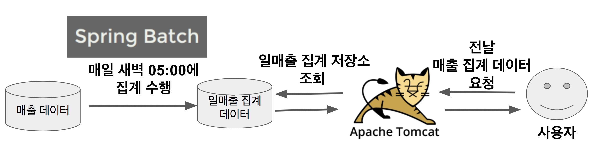
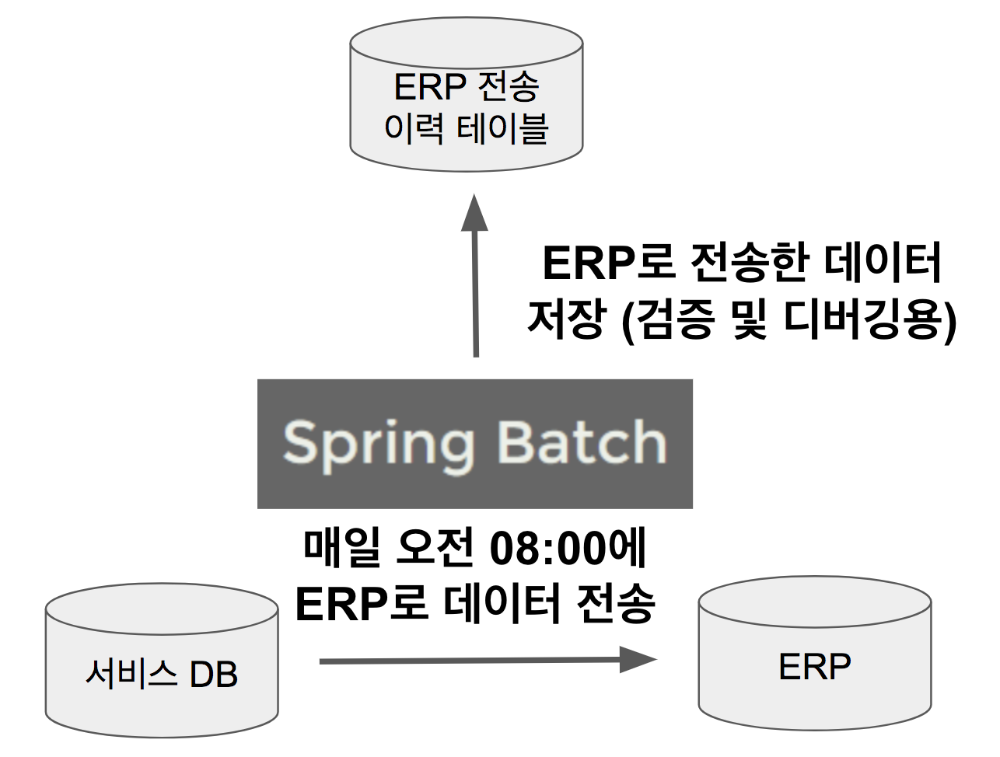

# 0. 시리즈에 앞서

Spring Batch In Action이 2011년 이후 개정판이 나오지도 않고, 한글 번역판도 없고, 국내 Spring Batch 글 대부분이 튜토리얼이거나 공식 문서 중 일부분을 짧게 번역한 내용들이라 대용량 시스템에서 사용할때 정말 많은 삽질을 했습니다.  

> 예전에 정상혁님께서 정리해주신 Spring Batch 시리즈가 있었는데, 찾기가 쉽지 않네요 ㅠ

커머스 사이트에선 특히나 웹 어플리케이션만큼 배치 어플리케이션 작성하는 경우가 많습니다.  
저 뿐만 아니라, 주변에서, 팀에서 Spring Batch 를 시작할때 마땅히 가이드라고 전달해드릴만한 자료 찾기가 어려웠습니다.  
주먹구구식으로 Batch 작성하는것도 하루 이틀이지 란 생각에 정리하게 되었습니다.

> 개인적인 바램이지만, 진짜 국내의 많은 자료가 Spring MVC 외에 다른 모듈들도 나왔으면 좋겠습니다.  

그럼 이제 시작하겠습니다!

# 1. 배치 애플리케이션이란?

> 배치(Batch)는 **일괄처리** 란 뜻을 갖고 있습니다. 

만약 매일 전 날의 데이터를 집계 해야한다고 가정해보겠습니다.  
이 집계 과정을 어디서 수행하면 될까요?  
웹 어플리케이션 밖에 모른다면 Tomcat + Spring MVC를 떠올리실것 같습니다.  
하지만 이렇게 큰 데이터를 읽고, 가공하고, 저장한다면 해당 서버는 순식간에 CPU, I/O 등의 자원을 다 써버려서 다른 Request 처리를 못하게 됩니다.  
  
그리고 이 집계 기능은 **하루에 1번 수행**됩니다.  
이를 위해 API를 구성하는 것은 너무 낭비가 아닐까요?  
여기서 추가로 데이터가 너무 많아서 처리중에 실패가 나면 어떻게 될까요?  
**5만번째에서 실패했다면, 5만 1번째부터 다시 실행**할 수 있다면 얼마나 좋을까요?  
  
또 이런 경우도 있을수 있습니다.  
오늘 아침 누군가가 집계 함수를 실행시켰는데, 다른 누군가가 또 실행시켜 집계 데이터가 2배로 뻥튀기 될 수도 있습니다.  
**같은 파라미터로 같은 함수를 실행할 경우** 이미 실행한 적이 있어 실패하는 기능을 지원한다면 얼마나 좋을까요?  
  
바로 이런 단발성으로 대용량의 데이터를 처리하는 어플리케이션을 **배치 어플리케이션**이라고 합니다.  
위의 고민들을 다시 생각해보면 배치 어플리케이션을 구성하기 위해선 **비지니스 로직 외에 부가적으로 신경써야할 부분들이 많다**는 것을 알 수 있습니다.  
  
여기서 한가지 생각해볼것이, 웹 어플리케이션을 개발할때 저희는 비지니스 로직에 최대한 집중할 수 있습니다.  
그건 왜일까요?  
바로 Spring MVC를 사용하기 때문입니다.  
**Spring MVC를 사용함으로 비지니스 로직에 최대한 집중**할 수 있었습니다.  
그럼 Spring에서 이런 배치 어플리케이션을 지원하는 모듈이 없을까요?  
  
Spring 진영에선 **Spring Batch**가 있습니다.  
  
Spring Batch를 소개하기전에 배치 어플리케이션이란 어떤 것인지 그 조건을 잠깐 이야기해보겠습니다.  
배치 어플리케이션은 다음의 조건을 만족해야만 합니다.

* 대용량 데이터 - 배치 어플리케이션은 대량의 데이터를 가져오거나, 전달하거나, 계산하는 등의 처리를 할 수 ​​있어야 합니다.
* 자동화 - 배치 어플리케이션은 심각한 문제 해결을 제외하고는 **사용자 개입 없이 실행**되어야 합니다.
* 견고성 - 배치 어플리케이션은 잘못된 데이터를 충돌/중단 없이 처리할 수 있어야 합니다.
* 신뢰성 - 배치 어플리케이션은 무엇이 잘못되었는지를 추적할 수 있어야 합니다. (로깅, 알림)
* 성능 - 배치 어플리케이션은 **지정한 시간 안에 처리를 완료**하거나 동시에 실행되는 **다른 어플리케이션을 방해하지 않도록 수행**되어야합니다.

자 그럼 이제 이 조건들을 만족하는 Spring Batch를 만나보겠습니다.

## 1-1. Spring Batch?

Spring Batch 프로젝트는 Accenture와 Spring Source의 공동 작업으로 2007년에 탄생했습니다.  
Accenture는 수년간의 노력으로 그들만의 배치 프레임워크를 만들었고, 그를 통해 얻은 경험을 가지고 있었습니다.  
즉, Accenture의 배치 노하우 & 기술력과 Spring 프레임워크가 합쳐져 만들어진 것이 **Spring Batch** 입니다.  
  
Spring Batch는 Spring의 특성을 그대로 가져왔습니다.  
그래서 **DI, AOP, 서비스 추상화** 등 Spring 프레임워크의 3대 요소를 모두 사용할 수 있으면서, Accenture의 Batch 노하우가 담긴 아키텍처를 사용할 수 있습니다.  
  
현재 Spring Batch 4.0 (Spring Boot 2.0) 에서 지원하는 Reader & Writer는 아래와 같습니다.  
(Reader는 데이터를 읽어오는 모듈이며, Writer는 데이터를 쓰는 모듈이라고 생각하시면 됩니다.)

| DataSource | 기술      | 설명                                       |
|------------|-----------|--------------------------------------------|
| Database   | JDBC      | 페이징, 커서, 일괄 업데이트 등 사용 가능   |
| Database   | Hibernate | 페이징, 커서 사용 가능                     |
| Database   | JPA       | 페이징 사용 가능 (현재 버전에선 커서 없음) |
| File       | Flat file | 지정한 구분자로 파싱 지원                  |
| File       | XML       | XML 파싱 지원                                           |

> **iBatis 모듈은 현재 삭제**되었습니다.  
iBatis를 reader로 사용하셨던 분들은 JDBC ItemReader로 교체하시길 추천드립니다.

앞으로 위에 나열된 기술들을 소개하고, 어떤 문제점들을 해결할 수 있는지 하나씩 소개드리겠습니다.  

## 1-2. Batch vs Quartz?

간혹 Spring Batch와 Spring Quartz를 비교하는 글을 보게 되는데요.  
둘은 역할이 완전히 다릅니다.  
**Quartz는 스케줄러의 역할**이지, Batch 와 같이 **대용량 데이터 배치 처리에 대한 기능을 지원하지 않습니다**.  
반대로 Batch 역시 Quartz의 다양한 스케줄 기능을 지원하지 않아서 보통은 Quartz + Batch를 조합해서 사용합니다.  
정해진 스케줄마다 Quartz가 Spring Batch를 실행하는 구조라고 보시면 됩니다.

## 1-3. Batch 사례

실제 기업에선 다음과 같은 상황에서 배치 어플리케이션을 사용합니다.

### 일매출 집계

많은 거래가 이루어지는 커머스 사이트의 경우 하루 거래건이 50만 ~ 100만까지 나옵니다.  
이럴 경우 이와 관련된 데이터는 최소 100만 ~ 200만 row 이상입니다.  
한달이면 5000만 ~ 1억까지 될수도 있습니다.  
  
이를 실시간 집계 쿼리로 해결하기엔 조회 시간이나 서버 부하가 심합니다.  
그래서 매일 새벽에 전날의 매출 집계 데이터를 만들어서 외부 요청이 올 경우 **미리 만들어준 집계 데이터를 바로 전달**하면 성능과 부하를 모두 잡을 수 있습니다.

### ERP 연동

대부분의 서비스에선 ERP를 사용하고 있습니다.  

> ERP는 자원 관리 시스템이라고 생각하시면 됩니다.  
사내 구성원을 비롯해서 매출, 지출 등을 모두 관리하는 소프트웨어 시스템을 얘기합니다.  
ERP 솔루션으로 유명한 것은 SAP가 있습니다.  
[나무위키](https://namu.wiki/w/ERP) 를 참고하시면 더 이해하시기 쉽습니다.

재무팀의 요구사항으로 매일 매출 현황을 ERP로 전달해야하는 상황에서 Spring Batch가 많이 사용됩니다.  
매일 아침 8시에 ERP에 전달해야할 매출 데이터를 전송해야한다면 아래와 같은 구조로 쉽게 구현할수 있습니다.

## 1-4. 마무리

위 사례외에도 **정해진 시간마다 데이터 가공이 필요**한 경우에 어디서든 Spring Batch가 사용될 수 있습니다.  
이번 시간에는 간단하게 배치 어플리케이션이 무엇인지, Spring Batch가 무엇인지 알아봤습니다.  
다음 시간부터 본격적으로 간단한 예제 프로그램을 작성하면서 하나씩 소개드리겠습니다.

