# 2. Batch Job 실행해보기

이번 시간에는 간단한 Spring Batch Job을 생성 & 실행하면서 전반적인 내용을 공부해보겠습니다.

> 작업한 모든 코드는 [Github](https://github.com/jojoldu/spring-batch-in-action)에 있으니 참고하시면 됩니다.  

## 2-1. Spring Batch 프로젝트 생성하기

기본적인 프로젝트 개발 환경은 다음과 같습니다.

* IntelliJ IDEA 2018.2
* Spring Boot 2.0.4
* Java 8
* Gradle

> lombok 기능을 많이 사용합니다.  
lombok 플러그인을 본인의 IDE에 맞게 설치하시면 좋습니다 :)  
[Intellij IDEA](http://blog.woniper.net/229), [Eclipse](http://countryxide.tistory.com/16)


이를 기반으로 프로젝트 생성을 시작하겠습니다.  

> 저는 IntelliJ Ultimate (유료) 버전에서 실행하지만, Eclipse도 화면 구성이 크게 다르진 않을것 같습니다.

먼저 Spring Boot 프로젝트를 나타내는 Spring Initializr (Spring Boot)를 선택합니다.

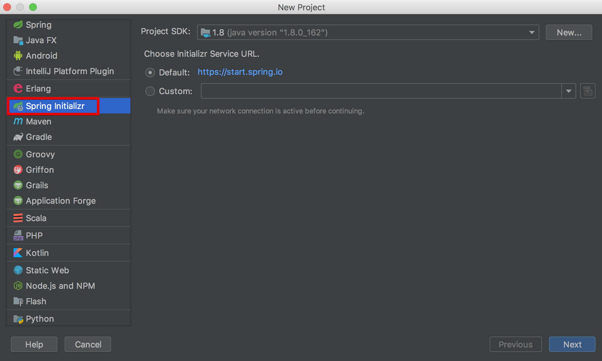

본인만의 Group, Artifact 를 선택하시고 Gradle 프로젝트를 선택합니다.  
이후 Spring 의존성을 선택하는 화면에선 아래와 같이 선택합니다.

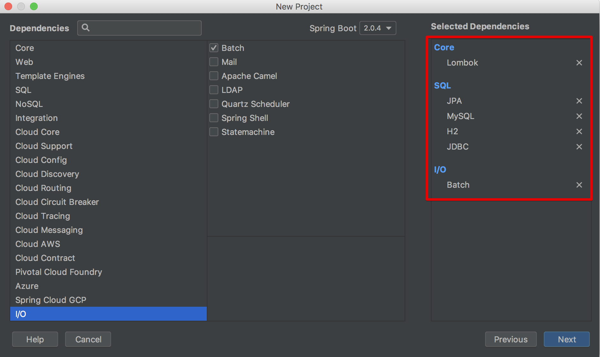

> 만약 본인의 프로젝트가 **JPA만 쓰고 있다면 JDBC를 선택하지 않으셔도** 됩니다.  
혹은 **JPA를 쓰지 않는다면 JPA를 선택하지 않으셔도** 됩니다.

build.gradle은 아래와 같은 형태가 됩니다.

```groovy
buildscript {
    ext {
        springBootVersion = '2.0.4.RELEASE'
    }
    repositories {
        mavenCentral()
    }
    dependencies {
        classpath("org.springframework.boot:spring-boot-gradle-plugin:${springBootVersion}")
    }
}

apply plugin: 'java'
apply plugin: 'eclipse'
apply plugin: 'org.springframework.boot'
apply plugin: 'io.spring.dependency-management'

group = 'com.jojoldu.spring'
version = '0.0.1-SNAPSHOT'
sourceCompatibility = 1.8

repositories {
    mavenCentral()
}


dependencies {
    compile('org.springframework.boot:spring-boot-starter-batch')
    compile('org.springframework.boot:spring-boot-starter-data-jpa')
    compile('org.springframework.boot:spring-boot-starter-jdbc')
    runtime('com.h2database:h2')
    runtime('mysql:mysql-connector-java')
    compileOnly('org.projectlombok:lombok')
    testCompile('org.springframework.boot:spring-boot-starter-test')
    testCompile('org.springframework.batch:spring-batch-test')
}

```

그리고 패키지 안에 있는 ```BatchApplication.java```를 열어보시면 아래처럼 ```main``` 메소드가 보입니다.

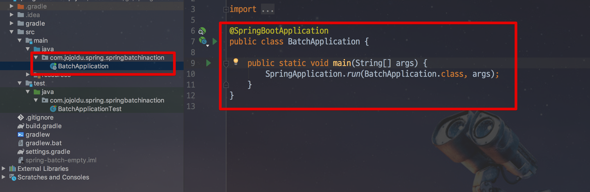

전형적인 Spring Boot 코드이죠?  
그럼 이제 간단한 Spring Batch Job을 생성해보겠습니다.

## 2-2. Simple Job 생성하기

Batch Job을 만들기 전에, ```BatchApplication.java```에 다음과 같이 **Spring Batch 기능 활성화** 어노테이션 (```@EnableBatchProcessing```)을 추가합니다.

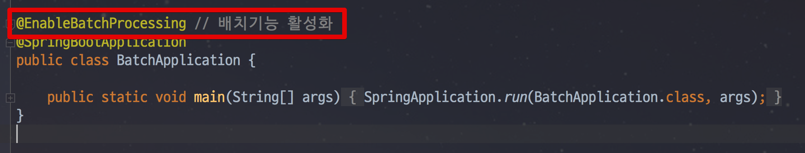

이 어노테이션을 선언하면, Spring Batch의 여러 기능들을 사용할 수 있게 됩니다.  
선언하지 않으시면 Spring Batch 기능을 사용할 수 없기 때문에 **필수로 선언**하셔야만 합니다.  
  
설정이 끝나셨으면 패키지 아래에 ```job``` 패키지를 생성하고, ```SimpleJobConfiguration.java``` 파일을 생성합니다.

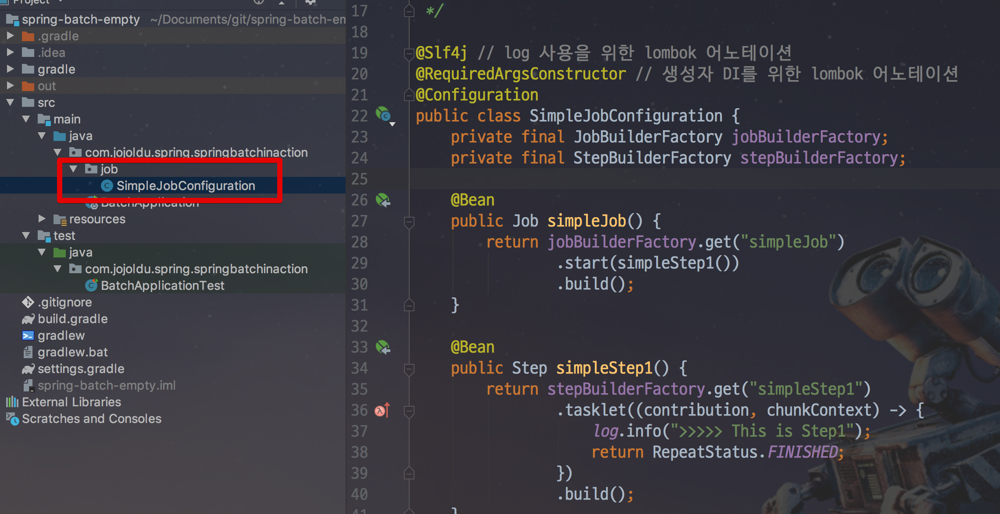

생성한 Java 파일 안에 ```simpleJob``` 이란 이름의 간단한 Spring Batch 코드를 작성해봅니다.

```java

@Slf4j // log 사용을 위한 lombok 어노테이션
@RequiredArgsConstructor // 생성자 DI를 위한 lombok 어노테이션
@Configuration
public class SimpleJobConfiguration {
    private final JobBuilderFactory jobBuilderFactory; // 생성자 DI 받음
    private final StepBuilderFactory stepBuilderFactory; // 생성자 DI 받음

    @Bean
    public Job simpleJob() {
        return jobBuilderFactory.get("simpleJob")
                .start(simpleStep1())
                .build();
    }

    @Bean
    public Step simpleStep1() {
        return stepBuilderFactory.get("simpleStep1")
                .tasklet((contribution, chunkContext) -> {
                    log.info(">>>>> This is Step1");
                    return RepeatStatus.FINISHED;
                })
                .build();
    }
}
```

* ```@Configuration```
    * Spring Batch의 모든 Job은 ```@Configuration```으로 등록해서 사용합니다.
* ```jobBuilderFactory.get("simpleJob")```
    * ```simpleJob``` 이란 이름의 Batch Job을 생성합니다.
    * job의 이름은 별도로 지정하지 않고, 이렇게 Builder를 통해 지정합니다.
* ```stepBuilderFactory.get("simpleStep1")```
    * ```simpleStep1``` 이란 이름의 Batch Step을 생성합니다.
    * ```jobBuilderFactory.get("simpleJob")```와 마찬가지로 Builder를 통해 이름을 지정합니다.
* ```.tasklet((contribution, chunkContext))```
    * Step 안에서 수행될 기능들을 명시합니다.
    * Tasklet은 **Step안에서 단일로 수행될 커스텀한 기능**들을 선언할때 사용합니다.
    * 여기서는 Batch가 수행되면 ```log.info(">>>>> This is Step1")``` 가 출력되도록 합니다.
 
Batch Job을 생성하는 **simpleJob 코드를 보시면 simpleStep1을 품고 있음**을 알 수 있습니다.  
Spring Batch에서 **Job은 하나의 배치 작업 단위**를 얘기하는데요.  
Job 안에는 아래처럼 여러 Step이 존재하고, Step 안에 Tasklet 혹은 Reader & Processor & Writer 묶음이 존재합니다.

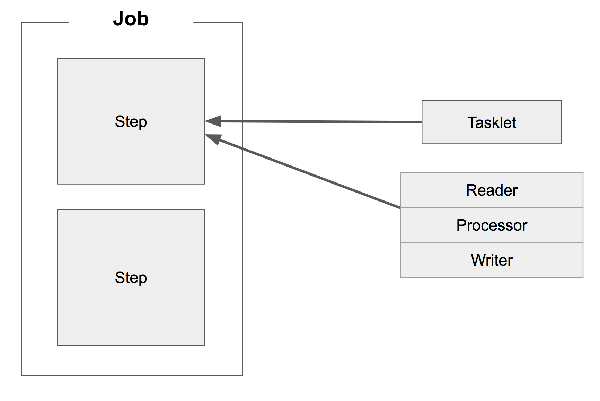

Job안에 여러 Step이 있다는건 쉽게 이해되지만, Step이 품고 있는 단위가 애매하게 보이실 수 있습니다.  
  
**Tasklet 하나와 Reader & Processor & Writer 한 묶음이 같은 레벨**입니다.  
그래서 **Reader & Processor가 끝나고 Tasklet으로 마무리 짓는 등으로 만들순 없다**는걸 꼭 명심해주셔야 합니다.  

> Tasklet은 어찌보면 Spring MVC의 ```@Component```, ```@Bean```과 비슷한 역할이라고 보셔도 될 것 같습니다.  
명확한 역할은 없지만, 개발자가 지정한 커스텀한 기능을 위한 단위로 보시면 됩니다.

자 그럼 한번 이 간단한 Spring Batch 어플리케이션을 실행해보겠습니다.  
처음 만들어졌던 ```BatchApplication.java```의 ```main``` 메소드를 실행하면 Batch가 실행됩니다.

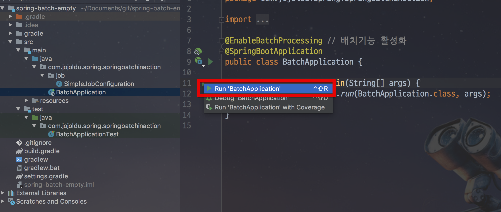

실행해보시면 아래처럼 ```log.info(">>>>> This is Step1")```가 잘 수행되어 로그가 찍힌것을 알 수 있습니다.

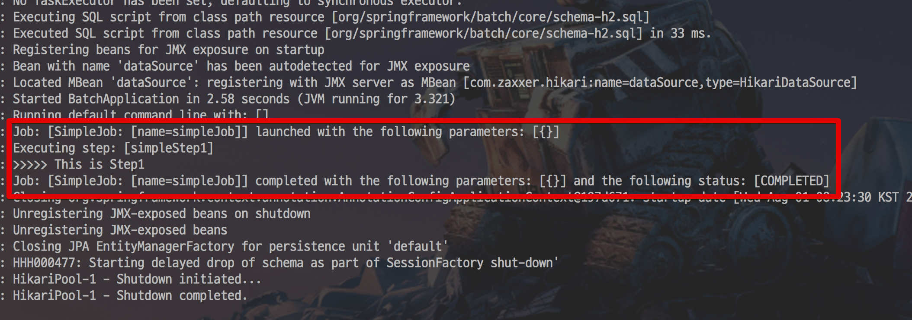

처음으로 Spring Batch 프로그램을 작성해보았습니다!  
아주 간단한 실습을 진행해봤는데요.  
이 내용은 너무나 간단합니다.  
조금 더 어려운 내용으로 한번 가보겠습니다.

## 2-3. MySQL 환경에서 Spring Batch 실행해보기

이전 과정에서 굉장히 간단하게 Spring Batch가 수행되었습니다.  
**Spring Batch는 어플리케이션 코드만 작성하면 되는구나**! 라고 생각하실수 있으실텐데요.  
실제로는 그렇지 않습니다.  
Spring Batch에선 메타 데이터 테이블들이 필요합니다.

> 메타 데이터란, **데이터를 설명하는 데이터**라고 보시면 됩니다.  
위키피디아보다 나무위키가 더 설명이 잘되어있어 [나무위키 링크](https://namu.wiki/w/%EB%A9%94%ED%83%80%EB%8D%B0%EC%9D%B4%ED%84%B0)를 첨부합니다.

Spring Batch의 메타 데이터는 다음과 같은 내용들을 담고 있습니다.

* 이전에 실행한 Job이 어떤 것들이 있는지 
* 최근 실패한 Batch Parameter가 어떤것들이 있고, 성공한 Job은 어떤것들이 있는지
* 다시 실행한다면 어디서 부터 시작하면 될지 
* 어떤 Job에 어떤 Step들이 있었고, Step들 중 성공한 Step과 실패한 Step들은 어떤것들이 있는지

등등 Batch 어플리케이션을 운영하기 위한 메타데이터가 여러 테이블에 나눠져 있습니다.  
메타 테이블 구조는 아래와 같은데요.


( 출처: [metaDataSchema](https://docs.spring.io/spring-batch/3.0.x/reference/html/metaDataSchema.html) )  
  
이 테이블들이 있어야만 Spring Batch가 정상 작동합니다.  
기본적으로 H2 DB를 사용할 경우엔 해당 테이블을 Boot가 실행될때 자동으로 생성해주지만, **MySQL이나 Oracle과 같은 DB를 사용할때는 개발자가 직접 생성**해야만 합니다.  
  
그럼 이 테이블들의 스키마가 궁금하실텐데요.  
이미 Spring Batch에 해당 스키마가 존재하고 있고, 이를 그대로 복사해서 ```create table``` 하면 됩니다.  
  
본인의 IDE에서 파일 검색으로 ```schema-```를 해보시면 메타 테이블들의 스키마가 DBMS에 맞춰 각각 존재하는것을 볼 수 있습니다.

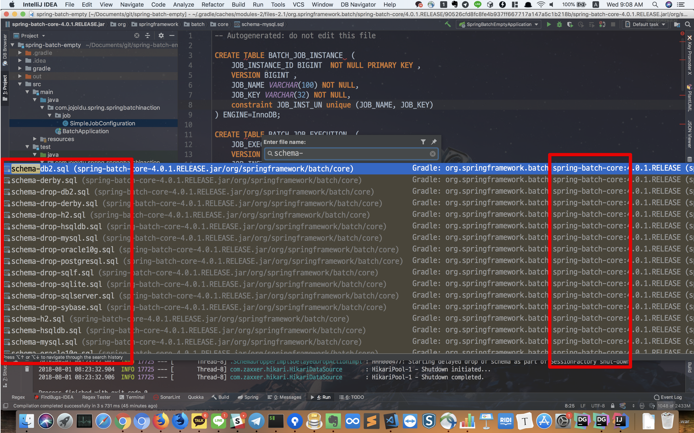

그럼 MySQL을 이용하여 Spring Batch를 실행해보겠습니다.  
  
### 2-3-1. MySQL에 연결하기

본인의 PC에 MySQL을 설치하시고, Spring Batch가 MySQL을 사용하도록 설정을 추가해보겠습니다.  
  
프로젝트의 ```src/main/resources/application.yml``` 에 아래처럼 Datasource 설정을 추가하겠습니다.  

```yaml
spring:
  profiles:
    active: local

---
spring:
  profiles: local
  datasource:
    hikari:
      jdbc-url: jdbc:h2:mem:testdb;DB_CLOSE_DELAY=-1;DB_CLOSE_ON_EXIT=FALSE
      username: sa
      password:
      driver-class-name: org.h2.Driver
---
spring:
  profiles: mysql
  datasource:
    hikari:
      jdbc-url: jdbc:mysql://localhost:3306/spring_batch
      username: jojoldu
      password: jojoldu1
      driver-class-name: com.mysql.cj.jdbc.Driver
```

* ```spring.datasource.hikari```
    * Spring Boot의 기본 DataSource는 Hikari (히카리CP) 입니다.
* ```jdbc-url```
    * 연결할 MySQL 주소를 지정합니다.
    * 저는 Localhost의 3306 포트로 붙어서 ```spring_batch``` 라는 database에 접근합니다.
* ```username```, ```password```
    * 설치한 MySQL의 계정을 ```jojoldu```로, 비밀번호를 ```jojoldu1```로 두었습니다.
* ```driver-class-name```
    * MySQL용 JDBC 드라이버입니다.
    * 각각의 DBMS에 맞춰 JDBC 드라이버를 지정하셔야만 합니다.

위 설정에서 각각의 ```spring.profiles```는 **profile이 local이면 H2를, mysql로 두면 MySQL을 사용**한다는 것을 의미합니다.  
  
설정이 다 되셨으면 한번 실행해보겠습니다.  

### 2-3-2. MySQL 환경으로 실행하기

아직까지 MySQL에 메타 테이블을 생성해두진 않았습니다.  
그럼 앞에서 설명한대로 Batch가 실패해야겠죠?  
  
IntelliJ에서 Spring Batch의 profile을 mysql로 설정하여 실행해봅니다.  
  
기존 실행 환경은 H2를 돌릴때 사용하기 위해 그대로 두고, 새로운 실행 환경을 생성해보겠습니다.  
상단의 실행환경 버튼을 클릭합니다.

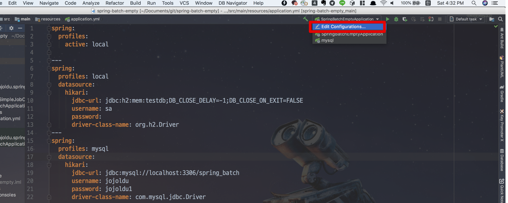

아래 이미지처럼 기본 생성된 실행 환경을 복사합니다.

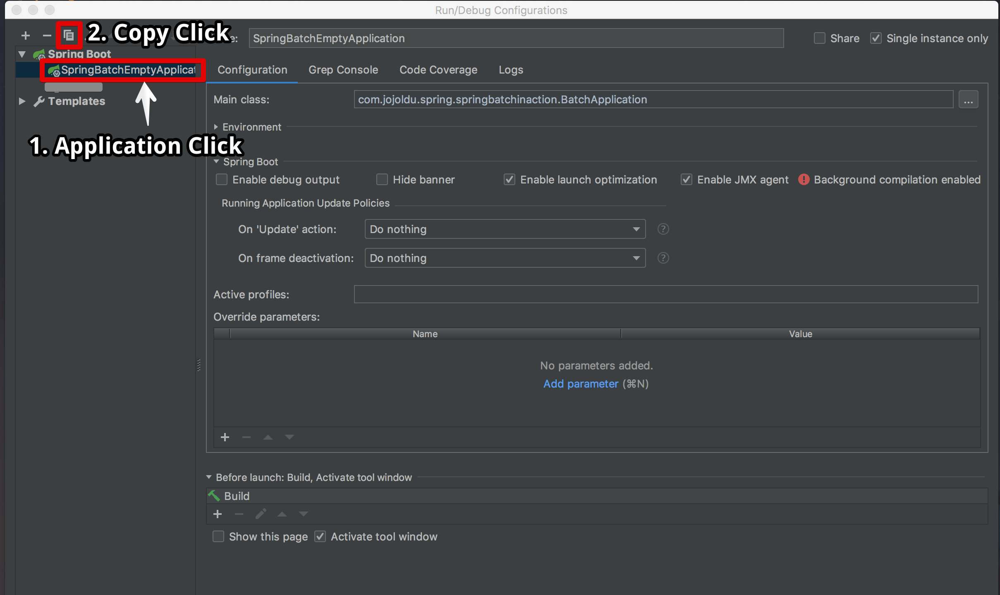

복사된 실행 환경의 이름과 Active profiles를 mysql로 변경합니다.

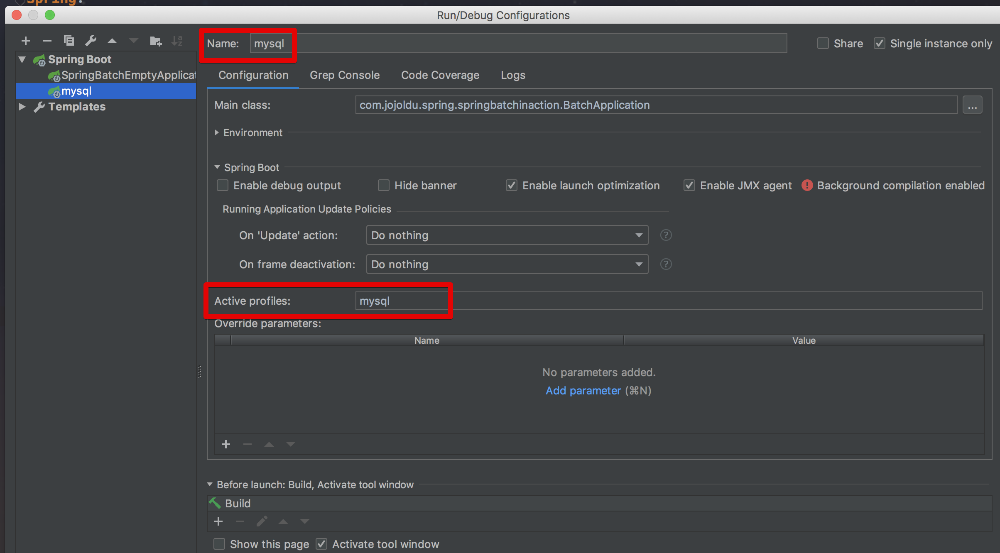

새롭게 생성된 mysql 환경으로 실행합니다.

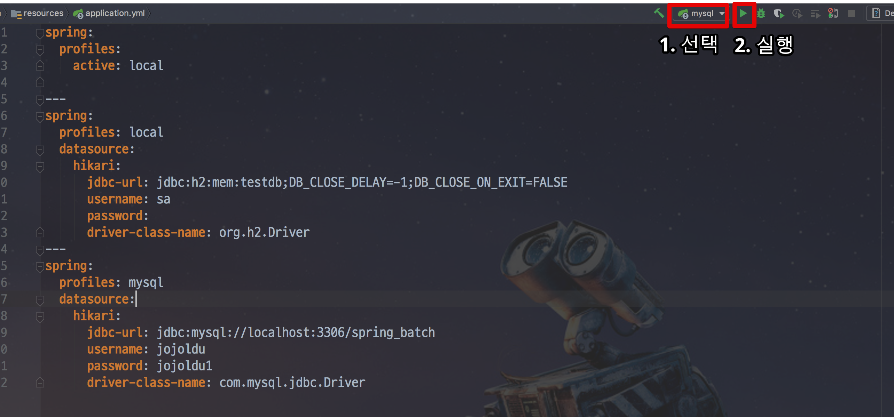

프로젝트의 profile이 mysql로 잘 실행습니다.

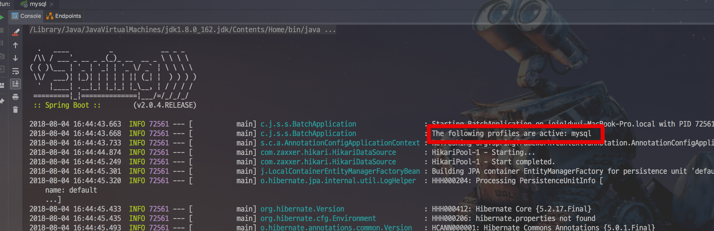

콘솔을 좀 더 아래로 내려보시면!

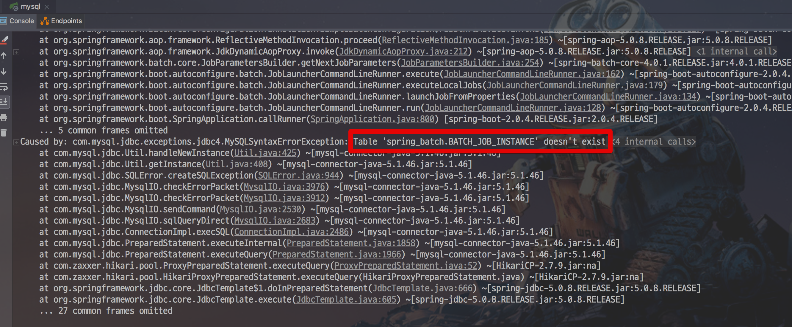

메타 테이블 데이터인 ```BATCH_JOB_INSTANCE```가 존재하지 않는다는 에러와 함께 배치가 실패했음을 알 수 있습니다.  
  
자 그럼 에러가 나지 않게, 한번 메타 데이터 테이블을 생성해보겠습니다.  
위에서 말씀드린것처럼 ```schema-mysql.sql``` 파일을 검색해봅니다.

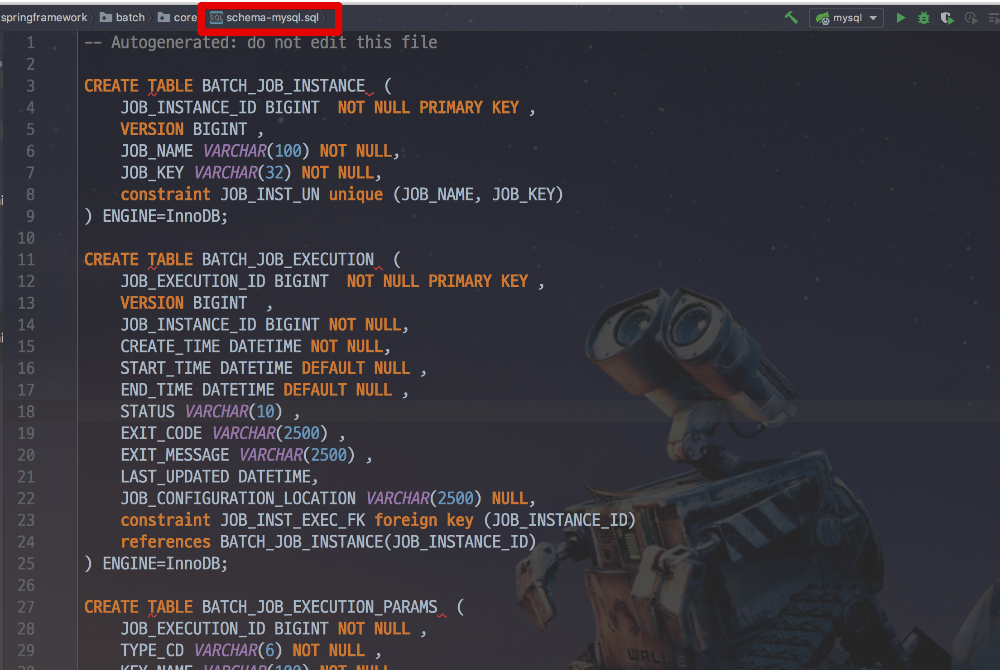

이 파일에 있는 스키마를 모두 복사하여 자신의 로컬 MySQL에서 실행합니다.  
그리고 잘 생성되었는지 확인해봅니다.

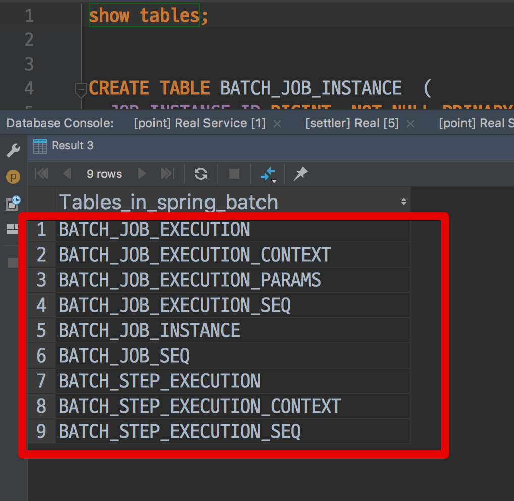

> 저는 DB Client로 JetBrains의 [DataGrip](https://www.jetbrains.com/datagrip/) 을 사용중입니다.  
IntelliJ와 동일한 UX, 단축키를 지원해서 별도로 사용법을 익히지 않고 편하게 사용중입니다.  
한달은 무료라서 한번 사용해보시는것도 추천드려요 :)

자 그럼 다시 한번 Spring Batch를 mysql profile로 실행해보겠습니다.

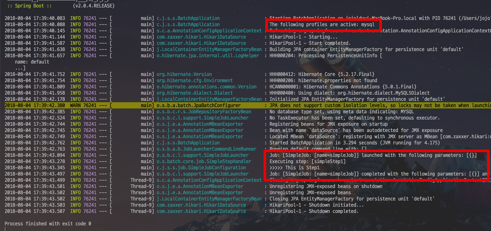

와우!  
MySQL에서도 정상적으로 배치가 실행되었습니다!  
자 그러면 도대체 이 메타 테이블에 어떤 정보들이 담겨있는지 하나씩 보겠습니다.