# 3. Spring Batch 메타 테이블 엿보기

이번 시간에는 Spring Batch의 메타 테이블에 대해 좀 더 자세히 살펴보겠습니다.

> 작업한 모든 코드는 [Github](https://github.com/jojoldu/spring-batch-in-action)에 있으니 참고하시면 됩니다.  

지난 시간에 Spring Batch의 메타 테이블을 살짝 보여드렸는데요.


이 메타 테이블들의 역할이 무엇인지, 어떤 것들을 담고 있는지 실습을 통해 하나씩 소개드리겠습니다.  

## 3-1. BATCH_JOB_INSTANCE

먼저 볼 것은 ```BATCH_JOB_INSTANCE``` 입니다.  
로컬 MySQL에서 조회를 해보면 아래와 같이 1개의 ROW가 검색이 됩니다.


* ```JOB_INSTANCE_ID```
    * ```BATCH_JOB_INSTANCE``` 테이블의 PK
* ```JOB_NAME```
    * 수행한 Batch Job Name

방금 실행했던 simpleJob이 있는 것을 볼 수 있습니다.  
BATCH_JOB_INSTANCE 테이블은 **Job Parameter에 따라 생성되는 테이블**입니다.  
이 Job Parameter가 생소할텐데요.  
간단하게 말씀드리면, **Spring Batch가 실행될때 외부에서 받을 수 있는 파라미터**입니다.  
  
예를 들어, 특정 날짜를 Job Parameter로 넘기면 **Spring Batch에서는 해당 날짜 데이터로 조회/가공/입력 등의 작업**을 할 수 있습니다.  
  
같은 Batch Job 이라도 Job Parameter가 다르면 ```Batch_JOB_INSTANCE```에는 기록되며, **Job Parameter가 같다면 기록되지 않습니다**.  
  
한번 확인해볼까요?  
simpleJob 코드를 아래와 같이 수정합니다.

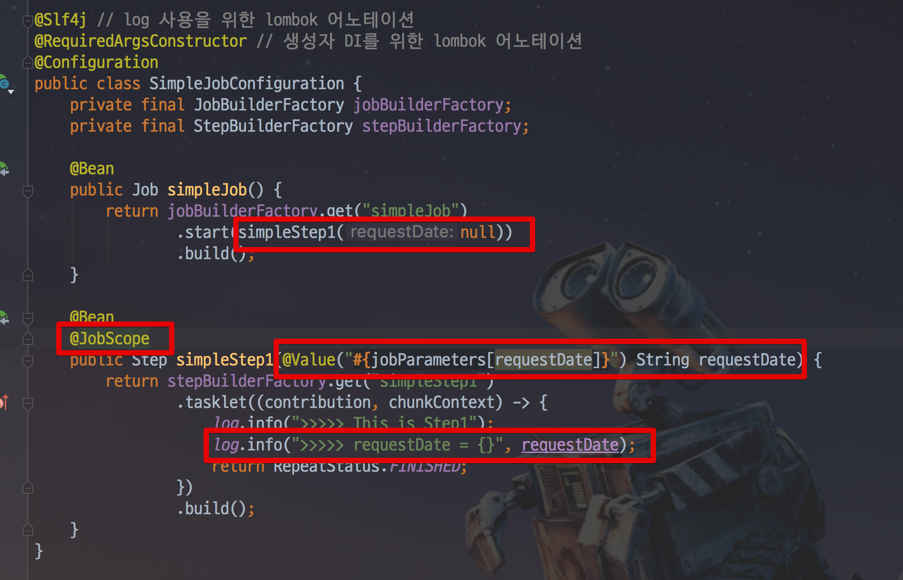

* ```@JobScope```를 잊으시면 안됩니다.

```java
@Slf4j // log 사용을 위한 lombok 어노테이션
@RequiredArgsConstructor // 생성자 DI를 위한 lombok 어노테이션
@Configuration
public class SimpleJobConfiguration {
    private final JobBuilderFactory jobBuilderFactory;
    private final StepBuilderFactory stepBuilderFactory;

    @Bean
    public Job simpleJob() {
        return jobBuilderFactory.get("simpleJob")
                .start(simpleStep1(null))
                .build();
    }

    @Bean
    @JobScope
    public Step simpleStep1(@Value("#{jobParameters[requestDate]}") String requestDate) {
        return stepBuilderFactory.get("simpleStep1")
                .tasklet((contribution, chunkContext) -> {
                    log.info(">>>>> This is Step1");
                    log.info(">>>>> requestDate = {}", requestDate);
                    return RepeatStatus.FINISHED;
                })
                .build();
    }
}
```

빨간색 표기된 코드만 추가되었으니 그대로 변경하시면 됩니다.

> Batch Job Parameter는 이후 챕터에서 좀 더 자세히 소개드리겠습니다.  
지금은 메타 테이블에 대한 이해를 위한 샘플 코드이니 **이렇게 하면 Job Parameter를 사용할 수 있다 정도로만** 이해하시면 됩니다. :)

변경된 코드는 Job Parameter로 받은 값을 로그에 추가로 출력시키는 기능입니다.  
  
자 그럼 이제 Job Parameter를 넣어서 Batch 를 실행해보겠습니다.  
좀 전과 마찬가지로 본인의 IDE 실행환경 탭을 클릭해서 설정창으로 갑니다.


아래와 같이 **Program arguments**에 ```requestDate=20180805``` 를 입력합니다.

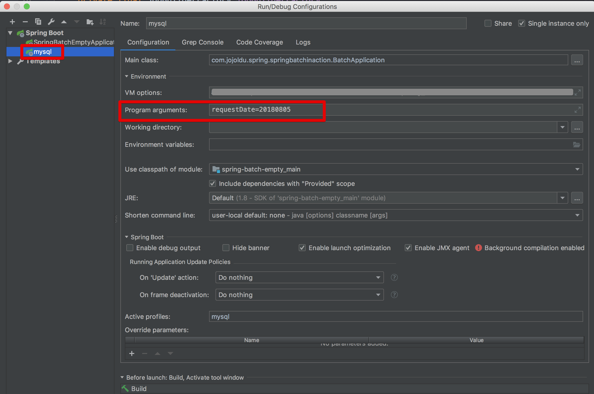

저장 하시고, 다시 실행을 해봅니다.  
그러면!  
Job Parameter가 아주 잘 전달되어 로그가 찍힌것을 볼 수 있습니다.


BATCH_JOB_INSTANCE을 다시 볼까요?

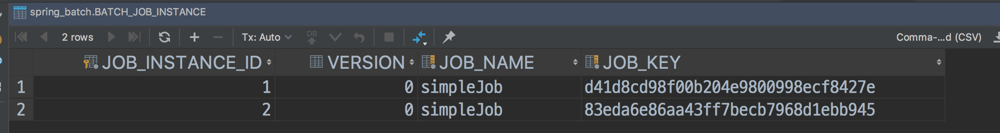

새로운 Job Instance가 추가되었습니다!  
자 그럼 진짜 Job Parameter 가 같으면 새로 생성되지 않는지 볼까요?  
같은 파라미터로 다시 한번 IDE에서 Batch 를 실행해봅니다.


**JobInstanceAlreadyCompleteException** 라는 Exception과 함께 에러 메세지가 있습니다.  

```
A job instance already exists and is complete for parameters={requestDate=20180805}.  If you want to run this job again, change the parameters.
```

같은 파라미터로는 Job을 실행시킬수 없다고 하죠?  
파라미터를 변경해서 실행해보겠습니다.  
이번에는 ```requestDate=20180806``` 으로 합니다.


정상적으로 수행되었고, ```BATCH_JOB_INSTANCE``` 테이블에도 정상적으로 추가 생성되었습니다!


즉, 동일한 Job이 Job Parameter가 달라지면 그때마다 ```BATCH_JOB_INSTANCE```에 생성되며, **동일한 Job Parameter는 여러개 존재할 수 없습니다**    .  
  
> 테이블 이름이 job instance 라고 되어있는제 정말 적절한 이름이 아닐까 싶습니다.  
어떻게 보면 Java의 Class를 통해 여러 Instacne가 생성되는것과 비슷한 느낌이죠?  

## 3-2. BATCH_JOB_EXECUTION

다음으로 알아볼것은 ```BATCH_JOB_EXECUTION``` 테이블입니다.

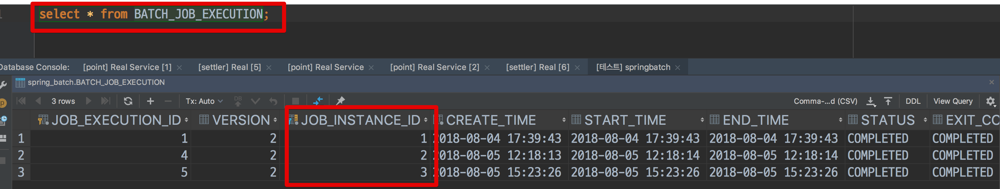

JOB_EXECUTION 테이블을 보시면 3개의 ROW가 있는데요.  
저희가 실행했던 파라미터가 없는 simpleJob, ```requestDate=20180805``` 파라미터로 실행했던 simpleJob, ```requestDate=20180806``` 파라미터로 실행했던 simpleJob 까지 이렇게 3개의 실행 데이터입니다.  
  
자 이렇게 보면 JOB_INSTANCE와 별 다를게 없어보이죠?  
**JOB_EXECUTION와 JOB_INSTANCE는 부모-자식 관계**입니다.  
JOB_EXECUTION은 자신의 부모 **JOB_INSTACNE가 성공/실패했던 모든 내역을 갖고 있습니다**.  
한번 실습해보겠습니다.  
  
simpleJob 코드를 아래와 같이 변경해보겠습니다.

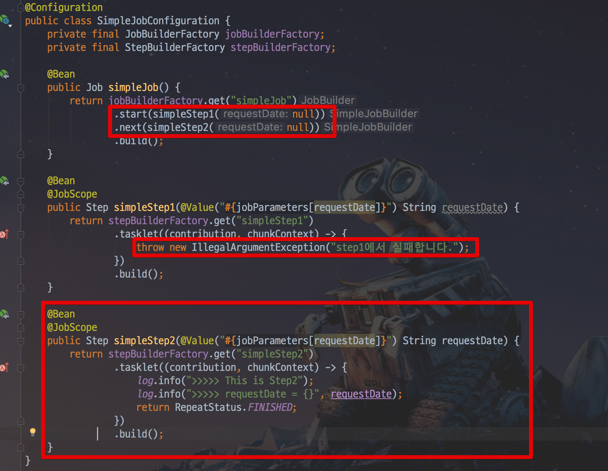

```java
@Slf4j // log 사용을 위한 lombok 어노테이션
@RequiredArgsConstructor // 생성자 DI를 위한 lombok 어노테이션
@Configuration
public class SimpleJobConfiguration {
    private final JobBuilderFactory jobBuilderFactory;
    private final StepBuilderFactory stepBuilderFactory;

    @Bean
    public Job simpleJob() {
        return jobBuilderFactory.get("simpleJob")
                .start(simpleStep1(null))
                .next(simpleStep2(null))
                .build();
    }

    @Bean
    @JobScope
    public Step simpleStep1(@Value("#{jobParameters[requestDate]}") String requestDate) {
        return stepBuilderFactory.get("simpleStep1")
                .tasklet((contribution, chunkContext) -> {
                    throw new IllegalArgumentException("step1에서 실패합니다.");
                })
                .build();
    }

    @Bean
    @JobScope
    public Step simpleStep2(@Value("#{jobParameters[requestDate]}") String requestDate) {
        return stepBuilderFactory.get("simpleStep2")
                .tasklet((contribution, chunkContext) -> {
                    log.info(">>>>> This is Step2");
                    log.info(">>>>> requestDate = {}", requestDate);
                    return RepeatStatus.FINISHED;
                })
                .build();
    }
}
```

이번에는 Job Parameter를 ```requestDate=20180807``` 로 변경합니다.

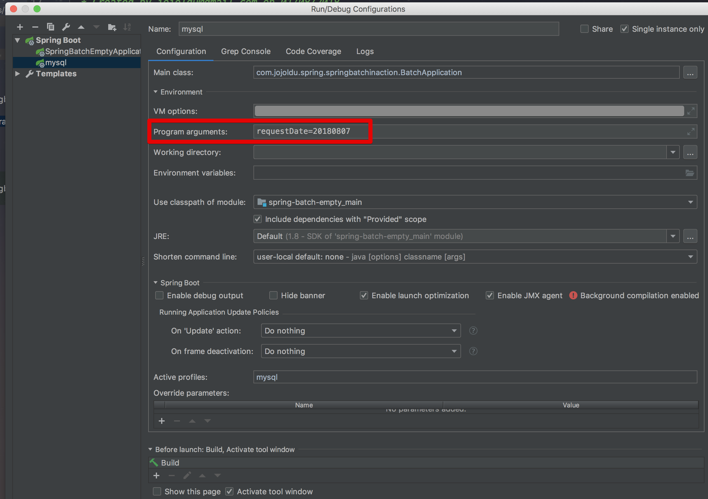

이제 실행해보시면!

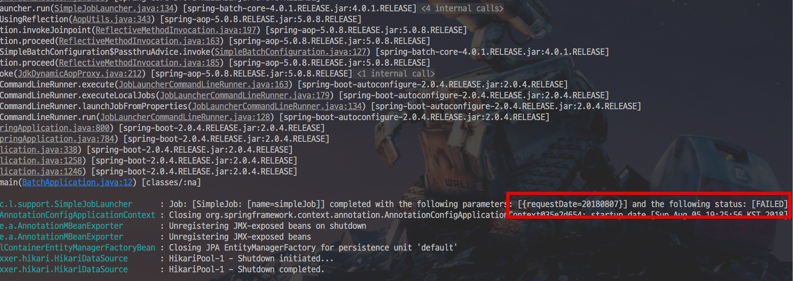

저희가 발생시킨 Exception과 함께 Batch Job이 실패했음을 볼 수 있습니다.  
자 그럼 BATCH_JOB_EXECUTION 테이블은 어떻게 변화되었는지 볼까요?

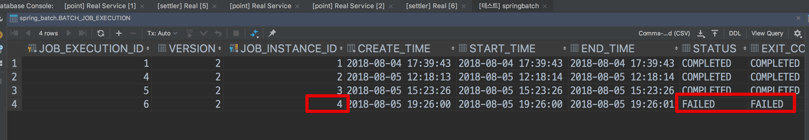

4번째 JOB_INSTACNE를 FK로 물고 있는 EXECUTION이 FAILED 라는 것을 확인할 수 있습니다.  
자 그럼 코드를 수정해서 JOB을 성공시켜보겠습니다.

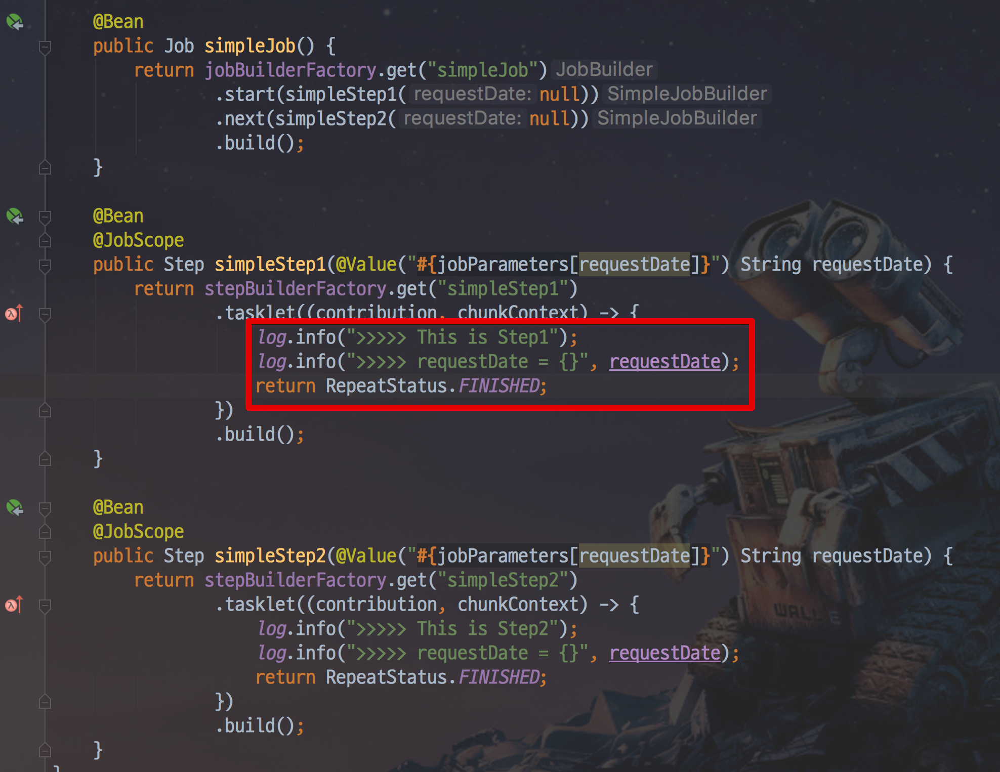

변경된 코드로 다시 Batch를 실행해보면!

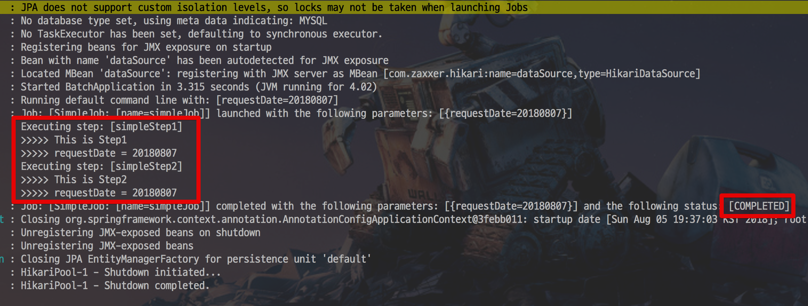

JOB은 성공적으로 수행되었습니다.  
테이블을 볼까요?

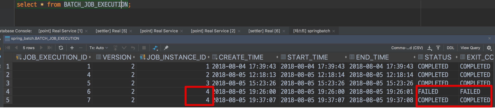

여기가 바로 JOB_INSTANCE와 결정적인 차이인데요.  
BATCH_JOB_EXECUTION의 JOB_INSTANCE_ID 컬럼을 보시면 같은 ID (```4```) 를 가진 2개의 ROW가 보입니다.  
그 중 첫번째 ROW는 STATUS 가 FAILED 이지만, 2번째 ROW는 COMPLETED 입니다.  
  
Job Parameter ```requestDate=20180807```로 생성된 BATCH_JOB_INSTACNE (id=```4```) 가 2번 실행되었고, 첫번째는 실패, 두번째는 성공했다는 것을 알 수 있습니다.  
  
여기서 재밌는 것은 **동일한 Job Parameter로 2번 실행했는데 같은 파라미터로 실행되었다는 에러가 발생하지 않았다**는 점입니다.  
Spring Batch는 **동일한 Job Parameter로 성공한 기록이 있을때만 재수행이 안된다**는 것을 알 수 있습니다.  
  
자 그럼 한번 정리해볼까요?

## 3-3. JOB, JOB_INSTANCE, JOB_EXECUTION

위에서 나온 두 테이블과 저희가 만든 Spring Batch Job의 관계를 정리하면 아래와 같습니다.

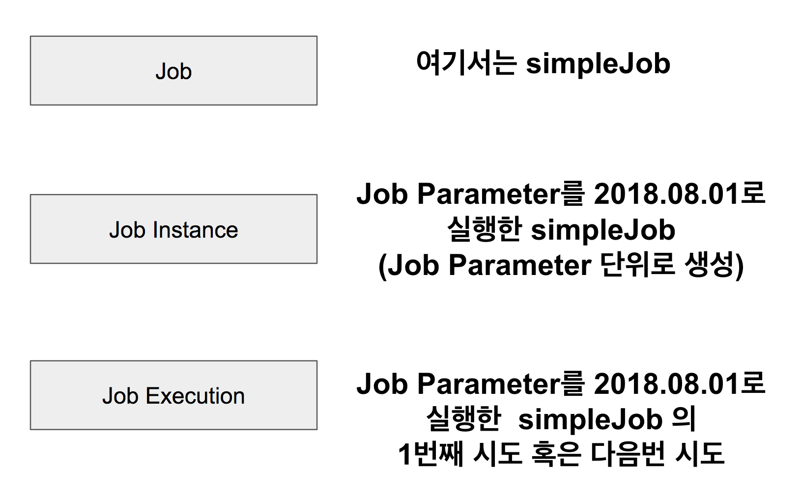

여기서 말하는 Job이란 저희가 작성한 Spring Batch Job을 얘기합니다.  
  
위 2개의 테이블 외에도 Job 관련된 테이블은 더 있습니다.  
예를 들면 ```BATCH_JOB_EXECUTION_PARAM``` 테이블은 BATCH_JOB_EXECUTION 테이블이 생성될 당시에 입력 받은 Job Parameter를 담고 있습니다.

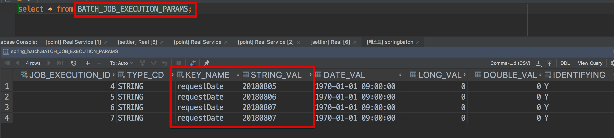

이외에도 다양한 메타 테이블들이 존재합니다.  
각각의 테이블은 앞으로 과정에서 필요할때마다 추가적으로 소개드리겠습니다.

> JOB_EXECUTION 외에도 **STEP_EXECUTION 관련 테이블**들이 여러개 존재합니다.  
이 부분은 지금 다루기에는 내용이 너무 커지기 때문에 이후에 진행될 **Spring Batch 재시도/SKIP 전략**편에서 자세하게 소개 드리겠습니다.

Spring Batch의 전반적인 이야기들을 3편에 나눠서 진행해봤습니다.  
자 이제부터 본격적으로 실용적인 Spring Batch 에제와 코드를 소개드리겠습니다.  

## 3-4. Spring Batch Test 코드는?

저의 이전 [Spring Batch 글](http://jojoldu.tistory.com/search/batch)을 보시면 아시겠지만, 저는 Spring Batch 예제를 항상 테스트 코드로 작성했습니다.  
그러나 이 방식에 단점이 존재했는데요.  
**develop/production 환경에서 Spring Batch를 사용하시는 분들이 Batch Job Intstance Context 문제로 어려움을 겪는걸 많이 봤습니다**.  
Spring Batch에 적응하시기 전까지는 H2를 이용한 테스트 코드는 자제하시길 추천합니다.  
H2를 이용한 테스트 코드는 최대한 나중에 보여드리겠습니다.  
초반부에는 MySQL을 이용하면서 **메타 테이블 정보가 남아 있는 상태에서의 Spring Batch에 최대한 적응하시도록 진행**하겠습니다.
