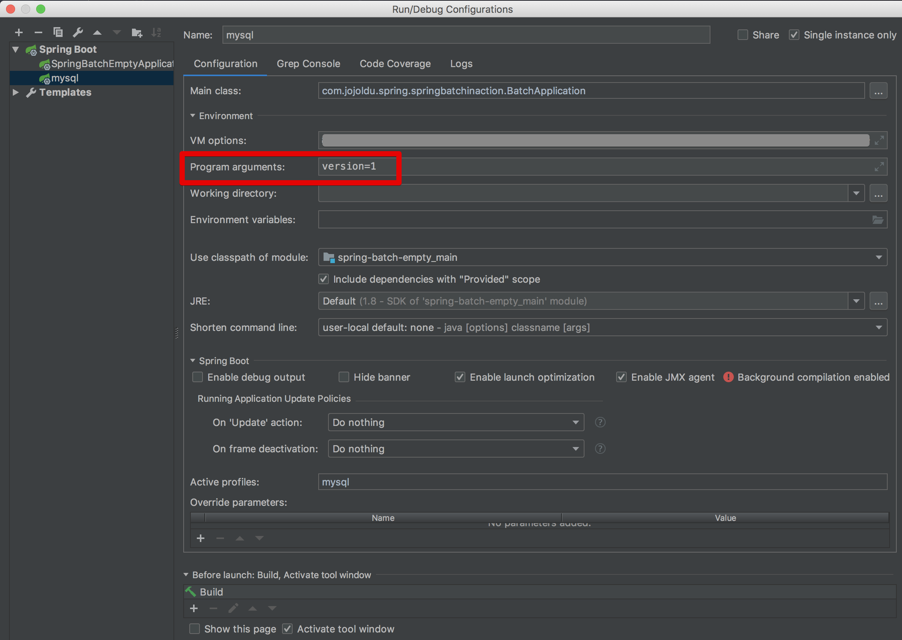
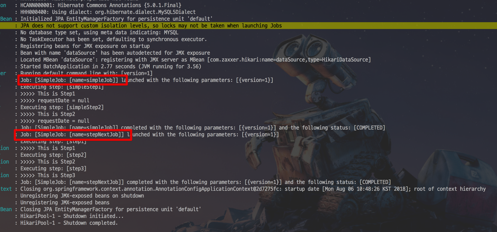
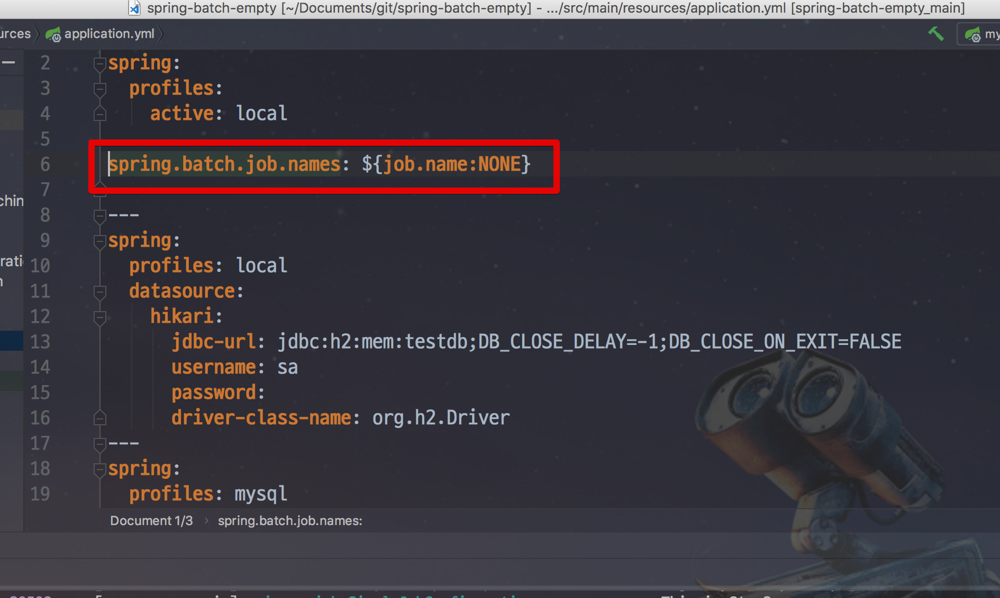
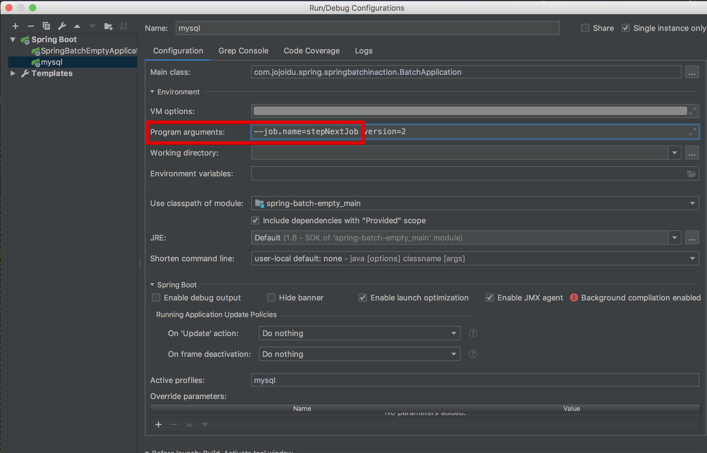
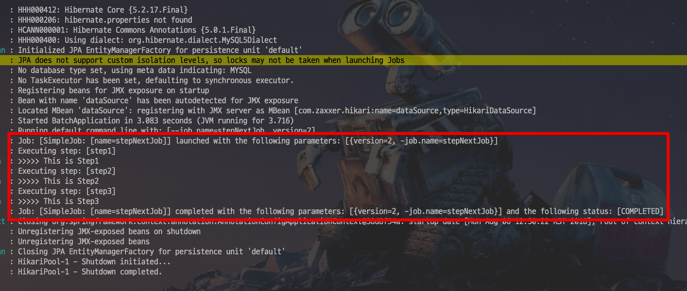
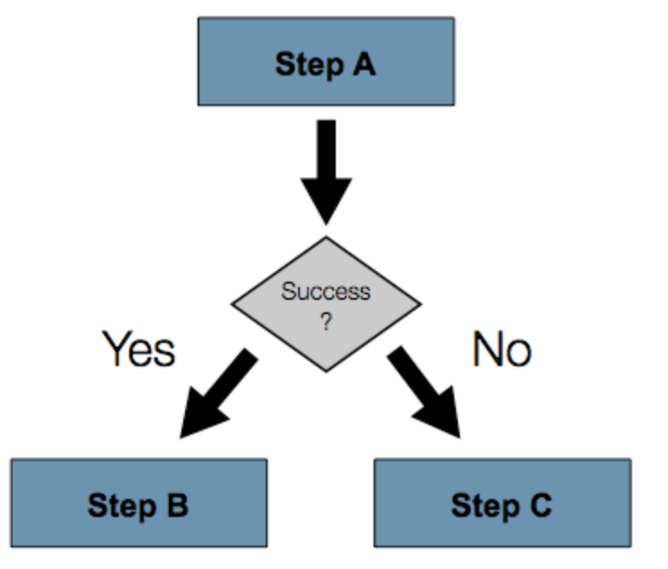
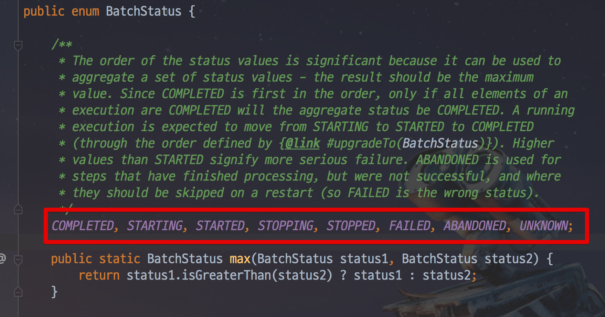
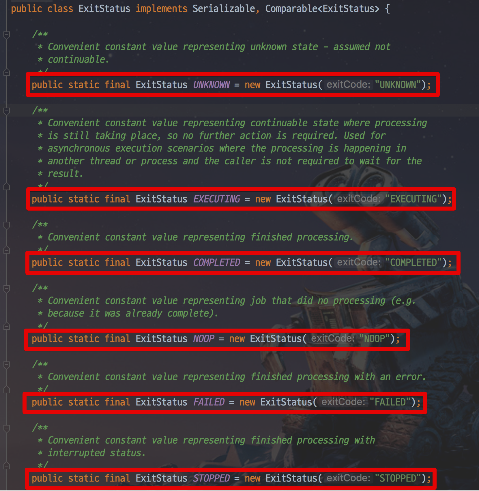

# 4. Spring Batch Job Flow

자 이번 시간부터 본격적으로 실전에서 사용할 수 있는 Spring Batch 내용들을 배워보겠습니다.

> 작업한 모든 코드는 [Github](https://github.com/jojoldu/spring-batch-in-action)에 있으니 참고하시면 됩니다.  

앞서 Spring Batch의 Job을 구성하는데는 Step이 있다고 말씀드렸습니다.  
Step은 **실제 Batch 작업을 수행하는 역할**을 합니다.  
이전에 작성한 코드를 보시면 Job은 코드가 거의 없죠?  
  
실제로 Batch 비지니스 로직을 처리하는 (```ex: log.info()```) 기능은 Step에 구현되어 있습니다.  
이처럼 Step에서는 **Batch로 실제 처리하고자 하는 기능과 설정을 모두 포함**하는 장소라고 생각하시면 됩니다.  
  
Batch 처리 내용을 담다보니, Job 내부의 **Step들간에 순서 혹은 처리 흐름을 제어**할 필요가 있는데요.  
이번엔 여러 Step들을 어떻게 관리할지에 대해서 알아보겠습니다.  
그 중 가장 먼저 알아볼 것은 ```next()``` 입니다.

## 4-1. Next

첫번째로 배워볼 것은 **Next** 입니다.  

### 4-1-1. 순차적 흐름 제어

Next는 앞서 ```simpleJob```을 진행하면서 조금 다뤄봤었죠?  
샘플코드를 한번 작성해보겠습니다.    
이번에 만들 배치는 ```StepNextJobConfiguration.java``` 로 만들겠습니다.

```java
@Slf4j
@Configuration
@RequiredArgsConstructor
public class StepNextJobConfiguration {

    private final JobBuilderFactory jobBuilderFactory;
    private final StepBuilderFactory stepBuilderFactory;

    @Bean
    public Job stepNextJob() {
        return jobBuilderFactory.get("stepNextJob")
                .start(step1())
                .next(step2())
                .next(step3())
                .build();
    }

    @Bean
    public Step step1() {
        return stepBuilderFactory.get("step1")
                .tasklet((contribution, chunkContext) -> {
                    log.info(">>>>> This is Step1");
                    return RepeatStatus.FINISHED;
                })
                .build();
    }

    @Bean
    public Step step2() {
        return stepBuilderFactory.get("step2")
                .tasklet((contribution, chunkContext) -> {
                    log.info(">>>>> This is Step2");
                    return RepeatStatus.FINISHED;
                })
                .build();
    }

    @Bean
    public Step step3() {
        return stepBuilderFactory.get("step3")
                .tasklet((contribution, chunkContext) -> {
                    log.info(">>>>> This is Step3");
                    return RepeatStatus.FINISHED;
                })
                .build();
    }
}
```

보시는 것처럼 ```next()```는 **순차적으로 Step들 연결시킬때 사용**됩니다.  
step1 -> step2 -> stpe3 순으로 하나씩 실행시킬때 ```next()``` 는 좋은 방법입니다.  
  
자 그럼 순차적으로 호출되는지 한번 실행해볼까요?  
이번에는 Job Parameter를 ```version=1```로 변경하신뒤



실행해보시면!



stepNextJob 배치가 실행되긴 했지만, **기존에 있던 simpleJob도 실행**되었습니다.  

저희는 방금 만든 stepNextJob 배치만 실행하고 싶은데, 작성된 모든 배치가 실행되면 사용할 수 없겠죠?  
그래서 **지정한 배치만 수행되도록** 살짝? 설정을 변경해보겠습니다.

### 번외. 지정한 Batch Job만 실행되도록

프로젝트의 ```src/main/resources/application.yml``` 에 아래의 코드를 추가합니다.

```yaml
spring.batch.job.names: ${job.name:NONE}
```



추가된 옵션이 하는 일은 간단합니다.  
Spring Batch가 실행될때, **Program arguments로 ```job.name``` 값이 넘어오면 해당 값과 일치하는 Job만 실행**하겠다는 것입니다.  
여기서 ```${job.name:NONE}```을 보면 ```:```를 사이에 두고 좌측에 ```job.name```이, 우측에 ```NONE```이 있는데요.  
이 코드의 의미는 ```job.name```**이 있으면** ```job.name```**값을 할당하고, 없으면** ```NONE```**을 할당**하겠다는 의미입니다.  
중요한 것은! ```spring.batch.job.names```에 ```NONE```이 할당되면 **어떤 배치도 실행하지 않겠다는 의미**입니다.  
즉, 혹시라도 **값이 없을때 모든 배치가 실행되지 않도록 막는 역할**입니다.  
  
자 그럼 위에서 언급한 ```job.name```을 배치 실행시에 Program arguments로 넘기도록 IDE의 실행환경을 다시 수정하겠습니다.  
  
IDE의 실행 환경에서 저희가 Job Parameter를 수정했던 Program arguments 항목에 아래와 같이 코드를 입력합니다.

```java
--job.name=stepNextJob
```


 
이것만 추가하시면 됩니다.  
(옆에 있는 **version은 1번이 이미 실행됐으니 2로 변경하셔야 합니다**.)  

자 그럼 저장하시고, 한번 실행해보겠습니다.  
version=2로 변경했으니 Job Instance 중복 문제는 발생하지 않을테니 정상적으로 ```stepNextJob```만 실행되야하겠죠?  
  
한번 실행해보시면!



지정한 ```stepNextJob```만 수행되었습니다!  
이제는 필요한 Job만 값만 바꿔가며 실행하면 되겠죠?  

> 실제 운영 환경에서는 ```java -jar batch-application.jar --job.name=simpleJob ``` 과 같이 배치를 실행합니다.  
이런 운영 환경부분은 시리즈 후반부에 소개드리겠습니다.

### 4-1-2. 조건별 흐름 제어

자 Next가 순차적으로 Step의 순서를 제어한다는 것을 알게 됐습니다.  
여기서 중요한 것은, **앞의 step에서 오류가 나면 나머지 뒤에 있는 step 들은 실행되지 못한다**는 것입니다.  
  
하지만 상황에 따라 **정상일때는 Step B로, 오류가 났을때는 Step C로 수행해야할때**가 있습니다.  



이럴 경우를 대비해 ```next()```를 조건별로 사용할 수 있습니다.  
새로운 클래스 ```StepNextConditionalJobConfiguration``` 를 생성해서 살펴보겠습니다.  


> Step의 이름은 **Batch 프로젝트 전체에서 유니크**해야 합니다.  
같은 이름의 Step이 있으면 먼저 수행된 Step을 따라가 다른 Step이 실행안됩니다.  
이 내용의 상세한 부분은 다음 챕터에서 소개드리겠습니다.  

### 4-1-3. Batch Status vs. Exit Status

위에서 나온 ```next```를 이용한 조건별 흐름 제어나 앞으로 설명 드릴 ```Flow```, ```Decide``` 등의 흐름 제어를 사용하는 Job을 설정할 때에는 **BatchStatus와 ExitStatus**의 차이를 아는 것이 중요합니다.  
  
BatchStatus는 Job 또는 Step 의 실행 결과를 스프링 프레임워크에서 기록할 때 사용하는 Enum입니다.  
BatchStatus로 사용 되는 값은 COMPLETED, STARTING, STARTED, STOPPING, STOPPED, FAILED, ABANDONED, UNKNOWN 있는데요.  
대부분의 값들은 단어와 같은 뜻으로 해석하여 이해하시면 됩니다.



다음의 'next' 엘리먼트를 사용하는 예제를 보자.

```xml
<next on="FAILED" to="stepB" />
```

위 예제에서 'on' 어트리뷰트가 BatchStatus를 참조하는 것으로 생각되기 쉽지만 실제 참조되는 값은 Step의 ExitStatus이다.   
ExitStatus의 이름에서 알 수 있듯이 ExitStatus는 Step의 실행 후 상태를 알려주는 값이다.  



(```ExitStatus```는 Enum이 아닙니다.)

위 예제를 좀더 쉽게 풀이 하자면 'exit 코드가 FAILED로 끝나게 되면 StepB로 가라'는 뜻이 된다. 스프링 배치 프레임워크는 디폴트 설정으로 ExitStatus의 exit 코드는 Step의 BatchStatus와 같도록 설정이 되어 있다. 하지만 만약에 exit 코드가 BatchStatus와 달라야 한다면 어떻게 할까?  
다음의 샘플프로젝트 예제를 살펴 보자.

```xml
<step id="step1" parent="s1">
    <end on="FAILED" />
    <next on="COMPLETED WITH SKIPS" to="errorPrint1" />
    <next on="*" to="step2" />
</step>

```

위 Step의 실행 결과는 다음 3가지가 될 수 있다.

Step이 실패하며, Job 또한 실패하게 된다.
Step이 성공적으로 완료된다.
Step이 성공적으로 완료되며, 'COMPLETED WITH SKIPS'의 exit 코드로 종료 된다. 이 경우 별도의 Step이 에러를 처리하기 위해 실행 되어져야만 한다.
위 예제의 사용에는 에러가 없지만, 사용자의 의도대로 처리되기 위해서는'COMPLETED WITH SKIPS' exit 코드를 반환하는 별도의 로직이 필요하다.

```java
public class SkipCheckingListener extends StepExecutionListenerSupport {
 
    public ExitStatus afterStep(StepExecution stepExecution) {
        String exitCode = stepExecution.getExitStatus().getExitCode();
        if (!exitCode.equals(ExitStatus.FAILED.getExitCode()) && 
              stepExecution.getSkipCount() > 0) {
            return new ExitStatus("COMPLETED WITH SKIPS");
        }
        else {
            return null;
        }
    }
}
```

위 코드를 설명하면 StepExecutionListener 에서는 먼저 Step이 성공적으로 수행되었는지 체크한다. 그 후 StepExecution의 skip 횟수가 0보다 클경우 'COMPLETED WITH SKIPS'의 exit 코드를 갖는 ExitStatus를 반환한다.


## 4-2. Flow

## 4-3. Split

## 4-4. Decide

## 참고

* [VM Arguments, Program arguments](https://stackoverflow.com/a/37439625)