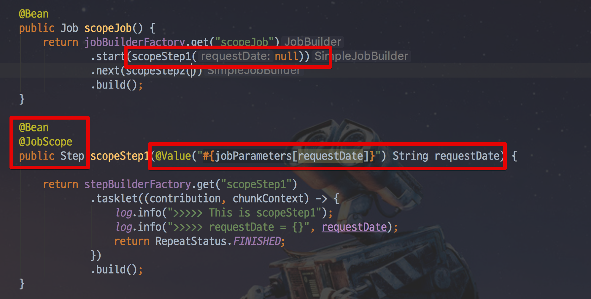
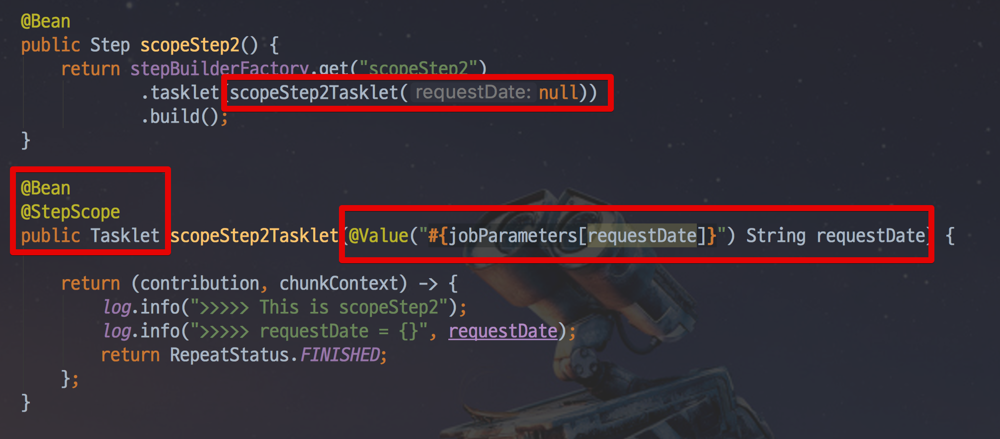
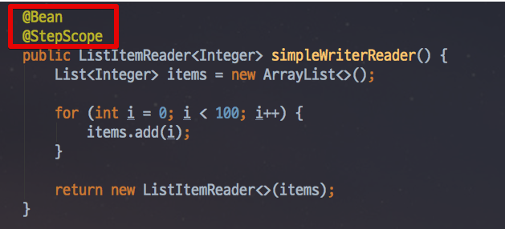
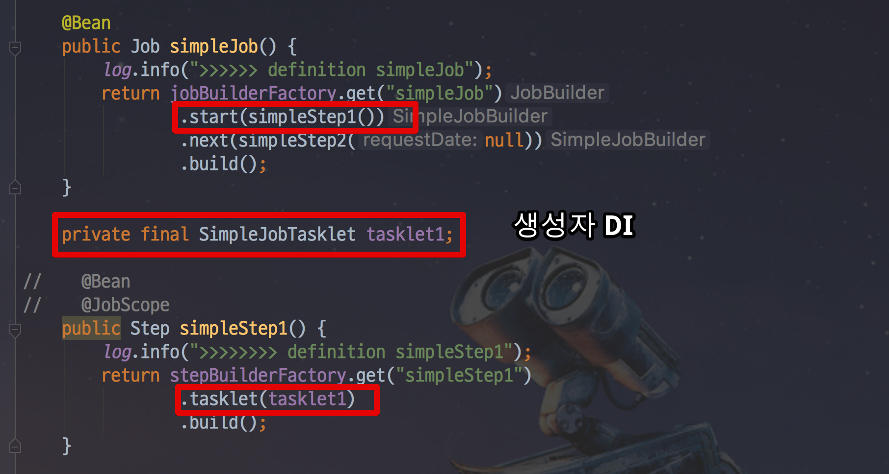
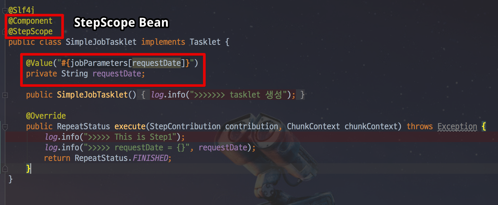
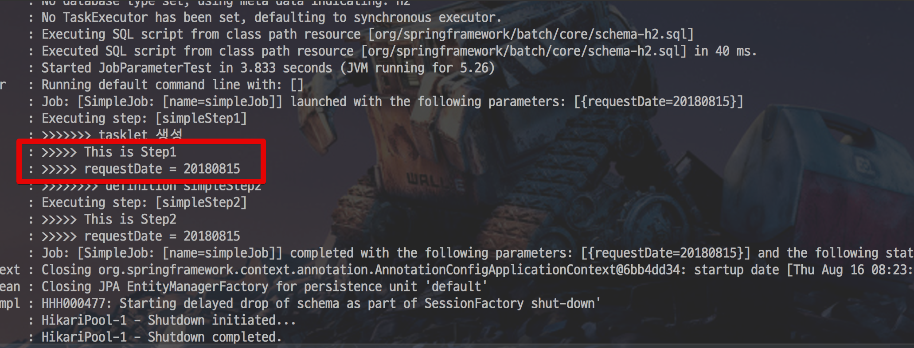

# 5. Spring Batch Scope & Job Parameter

이번 시간에는 Spring Batch의 Scope에 대해서 배워보겠습니다.  
여기서 말하는 Scope란 ```@StepScope```, ```@JobScope```를 얘기합니다.  
무의식적으로 사용하는 이 어노테이션들이 실제로 어떤 일들을 하는지 알아보겠습니다.  
그리고 이 둘과 떨어질 수 없는 **Job Parameter**도 함께 배워보겠습니다.

## 5-1. JobParameter와 Scope

Spring Batch의 경우 외부 혹은 내부에서 파라미터를 받아 여러 Batch 컴포넌트에서 사용할 수 있게 지원하고 있습니다.  
이 파라미터를 **Job Parameter**라고 합니다.  
Job Parameter를 사용하기 위해선 항상 Spring Batch 전용 Scope를 선언해야만 하는데요.  
크게 ```@StepScope```와 ```@JobScope``` 2가지가 있습니다.  
사용법은 간단한데, 아래와 같이 SpEL로 선언해서 사용하시면 됩니다.

```java
@Value("#{jobParameters[파라미터명]}")
```

> ```jobParameters``` 외에도 ```jobExecutionContext```, ```stepExecutionContext``` 등도 SpEL로 사용할 수 있습니다.  
@JobScope에선 ```stepExecutionContext```는 사용할 수 없고, ```jobParameters```와 ```jobExecutionContext```만 사용할 수 있습니다.  

각각의 Scope에서 사용하는 샘플 코드는 아래와 같습니다.  
  
**JobScope**



**StepScope**



**@JobScope는 Step 선언문에서** 사용 가능하고, **@StepScope는 Tasklet이나 ItemReader, ItemWriter, ItemProcessor**에서 사용할 수 있습니다.  
  
현재 Job Parameter의 타입으로 사용할 수 있는 것은 ```Double```, ```Long```, ```Date```, ```String``` 이 있습니다.  
아쉽지만 ```LocalDate```와 ```LocalDateTime```이 없어 ```String``` 으로 받아 타입변환을 해서 사용해야만 합니다.  
  
예제 코드를 보시면 호출하는 쪽에서 ```null``` 를 할당하고 있는데요.  
이는 **Job Parameter의 할당이 어플리케이션 실행시에 하지 않기 때문에** 가능합니다.  
자 이게 무슨 이야기인지 좀 더 자세히 들어가보겠습니다.

## 5-2. @StepScope & @JobScope 소개

Spring Batch는 ```@StepScope```와 ```@JobScope``` 라는 아주 특별한 Bean Scope를 지원합니다. 
아시다시피, **Spring Bean의 기본 Scope는 singleton**인데요.  
그러나 아래처럼 Spring Batch 컴포넌트 (Tasklet, ItemReader, ItemWriter, ItemProcessor 등)에 ```@StepScope```를 사용하게 되면 



Spring Batch가 Spring 컨테이너를 통해 지정된 **Step의 실행시점에 해당 컴포넌트를 Spring Bean으로 생성**합니다.  
마찬가지로 ```@JobScope```는 **Job 실행시점**에 Bean이 생성 됩니다.  
즉, **Bean의 생성 시점을 지정된 Scope가 실행되는 시점으로 지연**시킵니다.  

> 어떻게 보면 MVC의 request scope와 비슷할 수 있겠습니다.  
request scope가 request가 왔을때 생성되고, response를 반환하면 삭제되는것처럼, JobScope, StepScope 역시 Job이 실행되고 끝날때, Step이 실행되고 끝날때 생성/삭제가 이루어진다고 보시면 됩니다.  
  
이렇게 Bean의 생성시점을 어플리케이션 실행 시점이 아닌, Step 혹은 Job의 실행시점으로 지연시키면서 얻는 장점은 크게 2가지가 있습니다.  
  
첫째로, **JobParameter의 Late Binding**이 가능합니다.  
Job Parameter가 StepContext 또는 JobExecutionContext 레벨에서 할당시킬 수 있습니다.  
꼭 Application이 실행되는 시점이 아니더라도 Controller나 Service와 같은 **비지니스 로직 처리 단계에서 Job Parameter를 할당**시킬 수 있습니다.  
이 부분은 아래에서 좀 더 자세하게 예제와 함께 설명드리겠습니다.  
  
두번째로, 동일한 컴포넌트를 병렬 혹은 동시에 사용할때 유용합니다.  
Step 안에 Tasklet이 있고, 이 Tasklet은 멤버 변수와 이 멤버 변수를 변경하는 로직이 있다고 가정해봅시다.  
이 경우 ```@StepScope``` 없이 Step을 병렬로 실행시키게 되면 **서로 다른 Step에서 하나의 Tasklet을 두고 마구잡이로 상태를 변경**하려고 할것입니다.  
하지만 ```@StepScope```가 있다면 **각각의 Step에서 별도의 Tasklet을 생성하고 관리하기 때문에 서로의 상태를 침범할 일이 없습니다**.  
  

## 5-3. Job Parameter 오해 

Job Parameters는 ```@Value```를 통해서 가능합니다.  
그러다보니 여러가지 오해가 있을 수 있는데요.  
Job Parameters는 Step이나, Tasklet, Reader 등 Batch 컴포넌트 Bean의 생성 시점에 호출할 수 있습니다만, 정확히는 **Scope Bean을 생성할때만 가능**합니다.  
즉, **```@StepScope```, ```@JobScope``` Bean을 생성할때만 Job Parameters가 생성**되기 때문에 사용할 수 있습니다.  
  
예를 들어 아래와 같이 메소드를 통해 Bean을 생성하지 않고, 클래스에서 직접 Bean 생성을 해보겠습니다.  
Job과 Step의 코드에서 ```@Bean```과 ```@Value("#{jobParameters[파라미터명]}")```를 **제거**하고 ```SimpleJobTasklet```을 생성자 DI로 받도록 합니다.

> ```@Autowired```를 쓰셔도 됩니다.



그리고 ```SimpleJobTasklet```은 아래와 같이 ```@Component```와 ```@StepScope```로 **Scope가 Step인 Bean**으로 생성합니다.  
이 상태에서 ```@Value("#{jobParameters[파라미터명]}```를 Tasklet의 멤버변수로 할당합니다.



이렇게 **메소드의 파라미터로 JobParameter를 할당받지 않고, 클래스의 멤버 변수로 JobParameter를 할당** 받도록 해도 실행해보시면!



정상적으로 JobParameter를 받아 사용할 수 있습니다.  
이는 **SimpleJobTasklet Bean이 ```@StepScope```로 생성**되었기 때문입니다.  
  
반면에, 이 SimpleJobTasklet Bean을 일반 singleton Bean으로 생성할 경우 아래와 같이 ```'jobParameters' cannot be found``` 에러가 발생합니다.


즉, Bean을 메소드나 클래스 어느 것을 통해서 생성해도 무방하나 Bean의 Scope는 Step이나 Job이어야 한다는 것을 알 수 있습니다.  
  
JobParameters를 사용하기 위해선 꼭 **```@StepScope```, ```@JobScope```로 Bean을 생성**해야한다는 것을 잊지마세요.

## 5-4. JobParameter vs 시스템 변수

앞의 이야기를 보면서 아마 이런 의문이 있을 수 있습니다.  

* 왜 꼭 Job Parameter를 써야하지?  
* 기존에 Spring Boot에서 사용하던 여러 환경변수 혹은 시스템 변수를 사용하면 되지 않나?
* CommandLineRunner를 사용한다면 ```java jar application.jar -D파라미터```로 시스템 변수를 지정하면 되지 않나?

자 그래서 왜 Job Parameter를 써야하는지 설명드리겠습니다.  
아래 2가지 코드를 한번 보겠습니다.

### JobParameter

```java
@Bean
@StepScope
public FlatFileItemReader<Partner> reader(
        @Value("#{jobParameters[pathToFile]}") String pathToFile){
    FlatFileItemReader<Partner> itemReader = new FlatFileItemReader<Partner>();
    itemReader.setLineMapper(lineMapper());
    itemReader.setResource(new ClassPathResource(pathToFile));
    return itemReader;
}
```

### 시스템 변수

> 여기에서 얘기하는 시스템 변수는 application.properties와 ```-D``` 옵션으로 실행하는 변수까지 포함합니다.

```java
@Bean
@ConfigurationProperties(prefix = "my.prefix")
protected class JobProperties {

    String pathToFile;

    ...getters/setters
}

@Autowired
private JobProperties jobProperties;

@Bean
public FlatFileItemReader<Partner> reader() {
    FlatFileItemReader<Partner> itemReader = new FlatFileItemReader<Partner>();
    itemReader.setLineMapper(lineMapper());
    String pathToFile = jobProperties.getPathToFile();
    itemReader.setResource(new ClassPathResource(pathToFile));
    return itemReader;
}
```

위 2가지 방식에는 몇 가지 차이점이 있습니다.  
  
일단 첫번째로, 시스템 변수를 사용할 경우 **Spring Batch의 Job Parameter 관련 기능을 못쓰게** 됩니다.  
예를 들어, Spring Batch는 **같은 JobParameter로 같은 Job을 두 번 실행하지 않습니다**.  
하지만 시스템 변수를 사용하게 될 경우 이 기능이 전혀 작동하지 않습니다.  
또한 Spring Batch에서 자동으로 관리해주는 Parameter 관련 메타 테이블이 전혀 관리되지 않습니다.  
  
둘째, Command line이 아닌 다른 방법으로 Job을 실행하기가 어렵습니다.  
만약 실행해야한다면 **전역 상태 (시스템 변수 혹은 환경 변수)를 동적으로 계속해서 변경시킬 수 있도록** Spring Batch를 구성해야합니다.  
동시에 여러 Job을 실행하려는 경우 또는 테스트 코드로 Job을 실행해야할때 문제가 발생할 수 있습니다.  
  
특히 Job Parameter를 못쓰는 점은 큰 단점인데요.  
Job Parameter를 못쓴다는 것은 위에서도 언급한 **Late Binding을 못하게 된다**는 의미입니다.  
  
예를 들어 웹 서버가 있고, 이 웹서버에서 Batch를 수행한다고 가정해봅시다.  
외부에서 넘겨주는 파라미터에 따라 Batch가 다르게 작동해야한다면, 이를 시스템 변수로 풀어내는 것은 너무나 어렵습니다.  
하지만 아래와 같이 Job Parameter를 이용한다면 아주 쉽게 해결할 수 있습니다.

```java
@Slf4j
@RequiredArgsConstructor
@RestController
public class JobLauncherController {
  
    private final JobLauncher jobLauncher;
    private final Job job;
     
    @GetMapping("/launchjob")
    public String handle(@RequestParam("fileName") String fileName) throws Exception {
  
        try {
            JobParameters jobParameters = new JobParametersBuilder()
                                    .addString("input.file.name", fileName)
                                    .addLong("time", System.currentTimeMillis())
                                    .toJobParameters();
            jobLauncher.run(job, jobParameters);
        } catch (Exception e) {
            log.info(e.getMessage());
        }
  
        return "Done";
    }
}
```

예제를 보시면 Controller에서 Request Parameter로 받은 값을 Job Parameter로 생성합니다.

```java
JobParameters jobParameters = new JobParametersBuilder()
                        .addString("input.file.name", fileName)
                        .addLong("time", System.currentTimeMillis())
                        .toJobParameters();
```

그리고 생성한 Job Parameter로 Job을 수행합니다.

```java
jobLauncher.run(job, jobParameters);
```

즉, 개발자가 원하는 어느 타이밍이든 Job Parameter를 생성하고 Job을 수행할 수 있음을 알 수 있습니다.  
Job Parameter를 각각의 Batch 컴포넌트들이 사용하면 되니 **변경이 심한 경우에도 쉽게 대응**할 수 있습니다.  

> 웹서버에서 Batch를 관리하는 것은 **권장하지 않습니다**  
위 코드는 예제를 위한 코드입니다.  
실제 운영 환경에서 Spring Batch를 어떻게 관리해야하는지는 시리즈 후반부에 소개드리겠습니다.

## 5-5. 주의 사항

코드를 보시면 아시겠지만, ```@Bean```과 ```@StepScope```를 함께 쓰는 것은 ```@Scope (value = "step", proxyMode = TARGET_CLASS)```로 표시하는 것과 같습니다.


이 proxyMode로 인해서 문제가 발생할 수 있습니다.  
어떤 문제가 있고, 어떻게 해결하면 될지는 이전에 작성된 [@StepScope 사용시 주의 사항](http://jojoldu.tistory.com/132)을 꼭! 참고해보세요.

> ```@JobScope```도 마찬가지입니다.

자 이번시간을 통해서 Spring Batch의 Scope에 대해서 어느정도 이해가 되셨나요?  
Spring Batch에 있어서 Chunk 만큼 중요한 개념이니 꼭 숙지하고 넘어가셔야만 합니다.  
그럼 다음 편에서 뵙겠습니다.