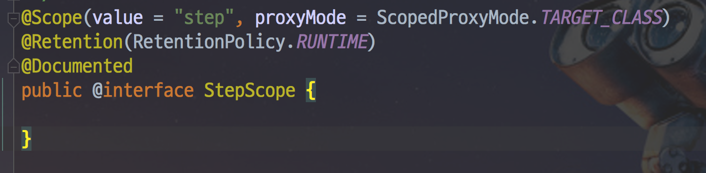

# 5. Spring Batch Scope & Job Parameter

이번 시간에는 Spring Batch의 Scope에 대해서 배워보겠습니다.  
여기서 말하는 Scope란 ```@StepScope```, ```@JobScope```를 얘기하는데요.  
무의식적으로 사용하는 이 어노테이션들이 실제로 어떤 일들을 하는지 알아보겠습니다.  
그리고 이 둘과 떨어질 수 없는 **Job Parameter**도 함께 배워보겠습니다.

## @StepScope & @JobScope 소개

Spring Batch는 ```@StepScope```와 ```@JobScope``` 라는 아주 특별한 Bean Scope를 지원합니다.  

> Bean Scope란 **Bean의 생명주기**를 얘기합니다.  
예를 들어 Bean Scope의 기본값인 singleton의 경우 해당 웹 어플리케이션에서 **유일하게 존재**합니다.  
이외에도 Request 요청당 생성되는 request를 비롯해 session, prototype 등 다양한 Scope가 있습니다.

SpringBatch에서 ```@StepScope```와 ```@JobScope```는 싱글톤이 아닌 **특정 단계에만 고유 한 객체**입니다.  
아시다시피, **Spring의 기본 Bean의 범위는 싱글톤**입니다.  
그러나 ```@StepScope```를 Spring Batch 컴포넌트 (Tasklet, ItemReader, ItemWriter, ItemProcessor 등)에 사용하게 되면 Spring Batch가 Spring 컨테이너를 사용하여 지정된 **Step의 실행시점에 해당 컴포넌트를 새로운 인스턴스로 생성**합니다.  

> ```@JobScpoe```는 Step에서 사용할 수 있습니다.

즉, **Bean의 생성 시점을 지정된 Scope가 실행되는 시점으로 지연**시킵니다.  
  
이렇게 Bean의 Scope를 어플리케이션 실행 시점이 아닌, **Step 혹은 Job의 실행시점으로 지연시키면서 얻는 장점은 크게 2가지**가 있습니다.  
  
첫째로, **JobParameter의 Late Binding**이 가능합니다.  
Job Parameter가 StepContext 또는 JobExecutionContext 레벨에서 지정 될 수 있고 매개 변수 요구 사항을 사용한 예제와 마찬가지로 자리 표시자를 대체해야하는 매개 변수 런타임 바인딩에 종종 유용합니다.

두번째로, 동일한 컴포넌트를 병렬 단계에서 재사용할 경우입니다.  
컴포넌트가 내부 상태를 관리하는 경우 StepScope 기반이므로 하나의 스레드가 다른 스레드가 관리하는 상태를 손상시키지 않아야합니다.

예를 들어 


코드를 보시면 아시겠지만, ```@Bean```과 ```@StepScope```를 함께 쓰는 것은 ```@Scope (value = "step", proxyMode = TARGET_CLASS)```로 표시하는 것과 같습니다.



> 이 proxyMode로 인해서 문제가 발생할 수 가 있는데요.  
어떤 문제가 있고, 어떻게 해결하면 될지는 [이전에 작성된 포스트](http://jojoldu.tistory.com/132)를 꼭! 참고해보시길 추천합니다.


## Late Binding (늦은 할당)

Spring Batch의 

```java

@Slf4j
@RequiredArgsConstructor
@RestController
public class JobLauncherController {
  
    private final JobLauncher jobLauncher;
    private final Job job;
     
    @GetMapping("/launchjob")
    public String handle(@RequestParam("fileName") String fileName) throws Exception {
  
        try {
            JobParameters jobParameters = new JobParametersBuilder()
                                    .addString("input.file.name", fileName)
                                    .addLong("time", System.currentTimeMillis())
                                    .toJobParameters();
            jobLauncher.run(job, jobParameters);
        } catch (Exception e) {
            log.info(e.getMessage());
        }
  
        return "Done";
    }
}
```

## JobParameter vs 시스템 변수

앞의 이야기를 보면서 아마 이런 의문이 있을 수 있습니다.  

* 근데 왜 꼭 Job Parameter를 써야하지?  
* 기존에 Spring Boot에서 사용하던 여러 환경변수 혹은 시스템 변수를 사용하면 되지 않나? * 어차피 CommandLineRunner를 사용한다면 ```-D```로 시스템 변수를 지정하면 되지 않나? 

자 그래서 왜 Job Parameter를 써야하는지 설명드리겠습니다.  
아래 2가지 코드를 한번 보겠습니다.

### JobParameter

```java
@Bean
@StepScope
public FlatFileItemReader<Partner> reader(
        @Value("#{jobParameters[pathToFile]}") String pathToFile){
    FlatFileItemReader<Partner> itemReader = new FlatFileItemReader<Partner>();
    itemReader.setLineMapper(lineMapper());
    itemReader.setResource(new ClassPathResource(pathToFile));
    return itemReader;
}
```

### 시스템 변수

> 여기에서 얘기하는 시스템 변수는 application.properties와 ```-D``` 옵션으로 실행하는 변수까지 포함합니다.

```java
@Bean
@ConfigurationProperties(prefix = "my.prefix")
protected class JobProperties {

    String pathToFile;

    ...getters/setters
}

@Autowired
private JobProperties jobProperties;

@Bean
public FlatFileItemReader<Partner> reader() {
    FlatFileItemReader<Partner> itemReader = new FlatFileItemReader<Partner>();
    itemReader.setLineMapper(lineMapper());
    String pathToFile = jobProperties.getPathToFile();
    itemReader.setResource(new ClassPathResource(pathToFile));
    return itemReader;
}
```

두 가지 방식에는 몇 가지 차이점이 있습니다.  
  
일단 첫번째로, 시스템 변수를 사용할 경우 **Spring Batch의 Job Parameter 관련 기능을 못쓰게** 됩니다.  
예를 들어, Spring Batch는 같은 JobParameter로 같은 Job을 두 번 실행하지 않습니다.  
하지만 환경 변수를 사용하게 될 경우 이 기능이 전혀 작동하지 않습니다.  
  
둘째, Command line이 아닌 다른 방법으로 작업을 시작하기가 어렵습니다.  
(또는 적어도 동일한 글로벌 상태를 제공하는 다른 방법을 구현해야합니다).  
동시에 여러 작업을 실행하려는 경우 또는 기능 테스트를 통해 작업을 테스트하려는 경우 문제가 발생할 수 있습니다.  
  
셋째, ```reader``` Bean의 범위가 서로 다릅니다.  
첫번째 예제는 Bean의 범위가 ```@StepScope``` 입니다.  
두번째 예제는 Bean의 범위가 ```singleton``` 입니다.
 
두번째의 경우 Bean의 인스턴스는 **서버에서 하나만 존재**합니다.  
첫번째의 경우 Bean을 요청하는 **모든 Step에서 새 인스턴스가 생성** 될 것입니다.  
(다르게 범위가 지정된 bean에 bean을 주입 할 수 있도록 단일 범위의 프록시가 있습니다.)

마지막으로, ```@StepScope``` 단계를 ExecutionContext거치지 않고도 단계에서 객체를 삽입 할 수 ChunkContext있으므로 코드와 테스트 작성이이 단순해집니다.

추가로. 첫 번째 코드에서, ```reader```는 ```@JobScope``` 만 있어도 JobParameter를 받을 수 있습니다.