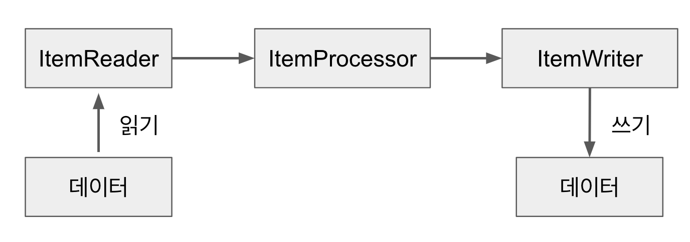
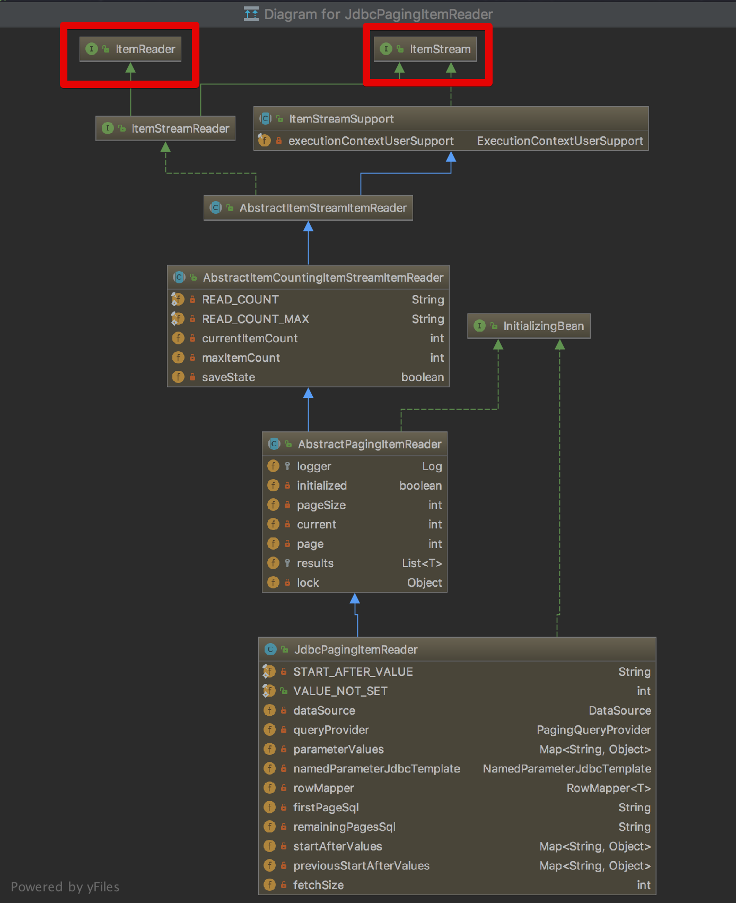
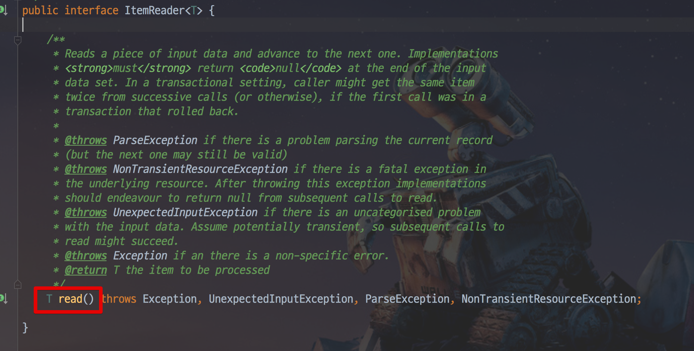
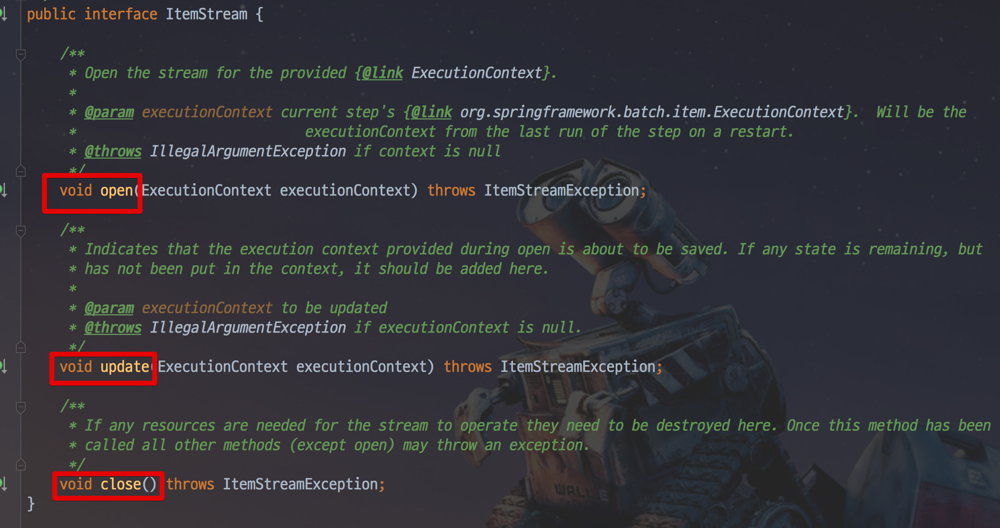
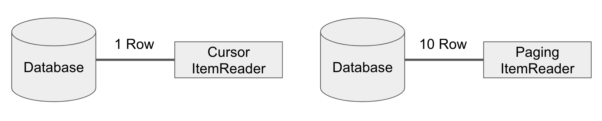

# 7. ItemReader

앞의 과정들을 통해 Spring Batch가 Chunk 지향 처리를 하고 있으며 이를 Job과 Step으로 구성되어 있음을 배웠습니다.  
Step은 Tasklet 단위로 처리되고, Tasklet 중에서 **ChunkOrientedTasklet**을 통해 Chunk를 처리하며 이를 구성하는 3 요소로 ItemReader, ItemWriter, ItemProcessor가 있음을 배웠습니다.  

> 즉, ItemReader & ItemWriter & ItemProcessor의 묶음 역시 Tasklet이란 이야기입니다.  
이들의 묶음을 ChunkOrientedTasklet에서 관리하기 때문이죠.

이번 시간부터 이 3 요소를 차근차근 배워보겠습니다.

## 7-1. ItemReader 소개

Spring Batch의 Chunk Tasklet은 아래와 같은 과정을 통해 진행됩니다.



이번엔 이 과정의 가장 첫번째인 Reader에 대해 알아보겠습니다.  
그림에서 보시는 것처럼 Spring Batch의 ItemReader는 **데이터를 읽어들입니다**.  
그게 꼭 DB의 데이터만을 얘기하진 않습니다.  
  
File, XML, JSON 등 다른 데이터 소스를 배치 처리의 입력으로 사용할 수 있습니다.  
또한 JMS (Java Message Service)와 같은 다른 유형의 데이터 소스도 지원합니다.  
  
이외에도 **Spring Batch에서 지원하지 않는 Reader가 필요할 경우 직접 해당 Reader를 만들수도 있습니다**.  
Spring Batch는 이를 위해 Custom Reader 구현체를 만들기 쉽게 제공하고 있습니다.  
  
정리하면 Spring Batch의 Reader에서 읽어올 수 있는 데이터 유형은 다음과 같습니다.

* 입력 데이터에서 읽어오기
* 파일에서 읽어오기
* Database에서 읽어오기
* Java Message Service등 다른 소스에서 읽어오기
* 본인만의 커스텀한 Reader로 읽어오기

이 ItemReader의 구현체들이 어떻게 되어있는지 살펴보겠습니다.  
가장 대표적인 구현체인 JdbcPagingItemReader가 있습니다.  
해당 클래스의 계층 구조를 살펴보면 아래와 같습니다.



ItemReader외에 **ItemStream 인터페이스도 같이 구현**하고 있습니다.  
  
먼저 ItemReader를 살펴보면 ```read()``` 만 가지고 있습니다.



* ```read()```의 경우 데이터를 읽어오는 메소드입니다.

Reader가 하는 본연의 임무를 담당하는 인터페이스임을 알 수 있습니다.  
  
그럼 ItemStream 인터페이스는 무슨 역할을 할까요?  
ItemStream 인터페이스는 **주기적으로 상태를 저장하고 오류가 발생하면 해당 상태에서 복원**하기 위한 마커 인터페이스입니다.
즉, 배치 프로세스의 실행 컨텍스트와 연계해서 **ItemReader의 상태를 저장하고 실패한 곳에서 다시 실행할 수 있게 해주는 역할**을 합니다.  



ItemStream의 3개 메소드는 다음과 같은 역할을 합니다.

* ```open()```, ```close()```는 스트림을 열고 닫습니다.  
* ```update()```를 사용하면 Batch 처리의 상태를 업데이트 할 수 있습니다.  

개발자는 **ItemReader와 ItemStream 인터페이스를 직접 구현해서 원하는 형태의 ItemReader**를 만들 수 있습니다.  
다만 Spring Batch에서 대부분의 데이터 형태는 ItemReader로 이미 제공하고 있기 때문에 커스텀한 ItemReader를 구현할 일은 많이 없을 것입니다.  

> 단, 본인의 조회 프레임워크가 Querydsl, Jooq라면 직접 구현해야할 수도 있습니다.  
웬만하면 JdbcItemReader로 해결되지만, **JPA의 영속성 컨텍스트가 지원이 안되서** HibernateItemReader를 이용하여 Reader 구현체를 직접 구현하셔야 합니다.

자 이제 ItemReader의 구현체를 알아볼텐데요.  
여기에서는 **Database의 구현체들만 다뤄보겠습니다**.  
이외에 다른 Reader들 (File, XML, Json) 등은 실제 업무에서 많이 사용되지 않기 때문에 필요하시다면 [공식 문서](https://docs.spring.io/spring-batch/4.0.x/reference/html/readersAndWriters.html#flatFiles)를 통해서 사용하시는걸 권장드립니다.

## 7-2. Database Reader

Spring 프레임워크의 강점 중 하나는 **개발자가 비즈니스 로직에만 집중할 수 있도록 JDBC와 같은 문제점을 추상화**한 것입니다.  

> 이를 보고 서비스 추상화라고 합니다.

그래서 Spring Batch 개발자들은 Spring 프레임워크의 JDBC 기능을 확장했습니다.  
  
일반적으로 배치 작업은 많은 양의 데이터를 처리해야 합니다.  

> 보통 실시간 처리가 어려운 대용량 데이터나 대규모 데이터일 경우에 배치 어플리케이션을 작업합니다.

수백만개의 데이터를 조회하는 쿼리가 있는 경우에 해당 데이터를 모두 한 번에 메모리에 불러오길 원하는 개발자는 없을 것입니다.  
그러나 Spring의 JdbcTemplate은 분할 처리를 지원하지 않기 때문에 (쿼리 결과를 그대로 반환하니) 개발자가 직접 ```limit```, ```offset```을 사용하는 등의 작업이 필요합니다.  
Spring Batch는 이런 문제점을 해결하기 위해 2개의 Reader 타입을 지원합니다.  
Cursor는 실제로 JDBC ResultSet의 기본 기능입니다.  
ResultSet이 open 될 때마다 ```next()``` 메소드가 호출 되어 데이터베이스의 데이터가 반환 됩니다.  
이를 통해 필요에 따라 **데이터베이스에서 데이터를 Streaming** 할 수 있습니다.  
  
반면 페이징은 좀 더 많은 작업을 필요로 합니다.  
페이징 개념은 페이지라는 Chunk로 데이터베이스에서 데이터를 검색한다는 것입니다.  
즉, **페이지 단위로 한번에 데이터를 조회**해오는 방식입니다.

Cursor와 Paging을 그림으로 비교하면 다음과 같습니다.



> Paging에서 10Row는 PageSize를 얘기합니다.  
10 외에 다른 값도 가능하며 여기선 예시로 10개로 두었습니다.

Cursor 방식은 데이터베이스와 커넥션을 맺은 후, Cursor를 한칸씩 옮기면서 지속적으로 데이터를 빨아옵니다.  
반면 페이징 방식에서는 한번에 10개 (혹은 개발자가 지정한 PageSize)만큼 데이터를 가져옵니다.  
  
2개 방식의 구현체는 다음과 같습니다.

* Cursor 기반 ItemReader 구현체
    * JdbcCursorItemReader
    * HibernateCursorItemReader
    * StoredProcedureItemReader
* Paging 기반 ItemReader 구현체
    * JdbcPagingItemReader
    * HibernatePagingItemReader
    * JpaPagingItemReader
  
> IbatisReader는 Spring Batch 공식 지원에서 삭제되었습니다.  
현재 [MyBatis 프로젝트](http://www.mybatis.org/spring/ko/batch.html)에서 MyBatisReader를 만들어서 진행하고 있으니 참고해보세요.  

모든 ItemReader의 예제를 다루기에는 양이 많으니 여기서는 각 Reader의 대표격인 JdbcCursorItemReader와 JdbcPagingItemReader, JpaPagingItemReader를 예제와 함께 소개드리겠습니다.

> 여기서 다루지 않은 예제는 [공식 문서](https://docs.spring.io/spring-batch/4.0.x/reference/html/readersAndWriters.html#database)에서 아주 상세하게 예제 코드가 나와있으니 참고해보세요.  

## 7-3. CursorItemReader

Database로 대규모의 데이터를 순차적으로 처리할때 가장 보편적으로 사용되는게 Cursor입니다.  

당연히 Database를 사용하는 Batch에서도 이를 사용하고 있습니다.  

쉽게 생각하시면 Database와 어플리케이션 사이에 통로를 하나 연결하고 하나씩 빨아들인다고 생각하시면 됩니다.
JSP나 Servlet으로 게시판을 작성해보신 분들은 ```ResultSet```을 사용해서 ```next()```로 하나씩 데이터를 가져왔던 것을 기억하시면 됩니다.  
  
이런 Cursor 방식의 대표격인 JdbcCursorItemReader를 소개합니다.

### 7-3-1. JdbcCursorItemReader

JdbcCursorItemReader는 Cursor 기반의 JDBC Reader 구현체입니다.  


```java
@Slf4j
@RequiredArgsConstructor
@Configuration
public class JdbcCursorItemReaderJobConfiguration {

    private final JobBuilderFactory jobBuilderFactory;
    private final StepBuilderFactory stepBuilderFactory;
    private final DataSource dataSource; // DataSource DI

    private static final int chunkSize = 10;

    @Bean
    public Job jdbcCursorItemReaderJob() {
        return jobBuilderFactory.get("jdbcCursorItemReaderJob")
                .start(jdbcCursorItemReaderStep())
                .build();
    }

    @Bean
    public Step jdbcCursorItemReaderStep() {
        return stepBuilderFactory.get("jdbcCursorItemReaderStep")
                .<Pay, Pay>chunk(chunkSize)
                .reader(jdbcCursorItemReader())
                .writer(jdbcCursorItemWriter())
                .build();
    }

    @Bean
    public JdbcCursorItemReader<Pay> jdbcCursorItemReader() {
        return new JdbcCursorItemReaderBuilder<Pay>()
                .fetchSize(chunkSize)
                .dataSource(dataSource)
                .rowMapper(new BeanPropertyRowMapper<>(Pay.class))
                .sql("SELECT id, amount, txName, txDateTime FROM pay")
                .name("jdbcCursorItemReader")
                .build();
    }

    private ItemWriter<Pay> jdbcCursorItemWriter() {
        return list -> {
            for (Pay pay: list) {
                log.info("Current Pay={}", pay);
            }
        };
    }
}
```

reader는 Tasklet이 아니기 때문에 reader만으로는 수행될수 없고, 간단한 출력 Writer를 하나 추가했습니다.

> **processor는 필수가 아닙니다.**  
위 예제처럼 reader에서 읽은 데이터에 대해 크게 변경 로직이 없다면 processor를 제외하고 writer만 구현하시면 됩니다.

Job설정이나 Step설정은 이미 앞선 포스팅에서 많이 소개드렸으니 Reader부만 설명 드리겠습니다.

특히 ```JdbcTemplate``` 과 인터페이스가 동일하기 때문에 사용법이 크게 다르지 않습니다.  
위의 예제를 ```jdbcTemplate```으로 구현하면 아래처럼 됩니다.

```java
JdbcTemplate jdbcTemplate = new JdbcTemplate(dataSource);
List customerCredits = jdbcTemplate.query("SELECT id, amount, txName, txDateTime FROM pay", new BeanPropertyRowMapper<>(Pay.class));
```


|  key  |  설명  |
|  ---  |  ---  |
| dataSource                 | 데이터베이스에 접속하는데 사용되는 Datasource |
| ignoreWarnings                 | SQL Warnging 메세지를 무시할지 선택하는 값  (기본 값은 ```true```) |
| fetchSize                      |       |
| maxRows                        |       |
| queryTimeout                   |                   |
| verifyCursorPosition           |       |
| saveState                      |               |
| driverSupportsAbsolute         |       |
| setUseSharedExtendedConnection |       |


위 설정은 ```JdbcCursorItemReader```에서 ```setter```로 할당할 수 있으며 위 예제처럼 ```JdbcCursorItemReaderBuilder```를 통해서 처리할수도 있습니다.  

위 코드를 실행 한 후 customerCredits 목록에는 1,000 개의 CustomerCredit 객체가 포함됩니다.  
쿼리 메서드에서 DataSource로부터 연결을 가져오고, 제공된 SQL을 실행하고, ResultSet의 각 행에 대해 mapRow 메서드를 호출합니다. 다음 예제와 같이 JdbcCursorItemReader의 접근 방식과 대조하십시오.

이전를 실행 한 후 카운터는 1,000입니다. 위 코드가 반환 된 customerCredit을 목록에 넣은 경우 결과는 JdbcTemplate 예제와 완전히 동일합니다. 그러나 ItemReader의 가장 큰 장점은 항목을 '스트리밍'할 수 있다는 것입니다.  
read 메소드는 한 번 호출 할 수 있고 ItemWriter로 항목을 쓸 수 있으며 다음 항목을 read로 가져올 수 있습니다.  
이를 통해 항목 읽기 및 쓰기가 '덩어리 (chunks)'로 수행되고 주기적으로 커밋되며 이는 고성능 일괄 처리의 핵심입니다. 또한, 스프링 배치 단계에 주입하기 위해 매우 쉽게 구성됩니다.

```sql
create table pay (
  id         bigint not null auto_increment,
  amount     bigint,
  txName     varchar(255),
  txDateTime datetime,
  primary key (id)
) engine = InnoDB;

insert into pay (amount, txName, txDateTime) VALUES (1000, 'trade1', '2018-09-10 00:00:00');
insert into pay (amount, txName, txDateTime) VALUES (2000, 'trade2', '2018-09-10 00:00:00');
insert into pay (amount, txName, txDateTime) VALUES (3000, 'trade3', '2018-09-10 00:00:00');
insert into pay (amount, txName, txDateTime) VALUES (4000, 'trade4', '2018-09-10 00:00:00');
```

> Jpa에는 CursorItemReader가 없습니다.

### CursorItemReader의 주의 사항

CursorItemReader를 사용하실때는 Database와 SocketTimeout을 충분히 큰 값으로 설정해야만 합니다.  
Cursor는 하나의 Connection으로 Batch가 끝날때까지 사용되기 때문에 Batch가 끝나기전에 Database와 어플리케이션의 Connection이 먼저 끊어질수 있습니다.  
  
그래서 **Batch 수행 시간이 오래 걸리는 경우에는 PagingItemReader를 사용하시는게 낫습니다**.  
Paging의 경우 한 페이지를 읽을때마다 Connection을 맺고 끊기 때문에 아무리 많은 데이터라도 타임아웃과 부하 없이 수행될 수 있습니다.


## 7-4. PagingItemReader

데이터베이스 Cursor를 사용하는 대신 여러 쿼리를 실행하여 각 쿼리가 결과의 일부를 가져 오는 방법도 있습니다.  
이 부분을 페이지라고합니다.  
각 쿼리는 시작 행 번호와 페이지에서 반환 할 행 수를 지정해야합니다.

### 7-4-1. JdbcPagingItemReader

페이징 ItemReader의 한 구현은 JdbcPagingItemReader입니다.  
JdbcPagingItemReader에는 페이지를 구성하는 행을 검색하는 데 사용되는 SQL 쿼리를 제공하는 PagingQueryProvider가 필요합니다.  

각 데이터베이스에는 페이징 지원을 제공하는 자체 전략이 있으므로 지원되는 각 데이터베이스 유형마다 다른 PagingQueryProvider를 사용해야합니다.  
또한 사용중인 데이터베이스를 자동 검색하고 적절한 PagingQueryProvider 구현을 결정하는 SqlPagingQueryProviderFactoryBean이 있습니다.  
이렇게하면 구성이 간단해지므로 권장되는 최상의 방법입니다.  
  
SqlPagingQueryProviderFactoryBean은 select 절과 from 절을 지정해야합니다.  
선택적인 where 절을 제공 할 수도 있습니다.  
이 절과 필수 sortKey는 SQL 문을 작성하는 데 사용됩니다.  
  
Reader가 open되면 호출 당 하나의 항목을 다른 ItemReader와 동일한 기본 방식으로 다시 읽습니다. 페이징은 추가 행이 필요할 때 뒤에서 발생합니다.

다음 예제 구성은 이전에 표시된 Cursor 기반 ItemReaders와 유사한 '고객 신용'예제를 사용합니다.


이 구성된 ItemReader는 반드시 지정해야하는 RowMapper를 사용하여 CustomerCredit 객체를 반환합니다.  
'pageSize'속성은 쿼리가 실행될 때마다 데이터베이스에서 읽은 엔티티의 수를 결정합니다.

'parameterValues'속성은 쿼리에 대한 매개 변수 값의 Map을 지정하는 데 사용할 수 있습니다.  
where 절에서 명명 된 매개 변수를 사용하는 경우 각 항목의 키는 명명 된 매개 변수의 이름과 일치해야합니다.  

> 예전이였다면 ```?``` 로 파라미터 위치를 지정하고 1부터 시작하여 각 파라미터 값을 할당시키는 방식으로 진행했습니다.

### 7-4-2. JpaPagingItemReader

PagingItemReader의 또 다른 구현체는 JpaPagingItemReader입니다.  
JPA에는 Hibernate StatelessSession과 유사한 개념이 없기 때문에 JPA 스펙이 제공하는 다른 기능을 사용해야합니다.  
각 페이지를 읽은 후에는 엔티티가 분리되고 지속성 컨텍스트가 지워지므로 페이지가 처리되면 엔티티가 GC 됩니다.  

JpaPagingItemReader를 사용하면 JPQL 문을 선언하고 EntityManagerFactory를 전달할 수 있습니다.  
그런 다음 호출 당 한 항목을 다른 ItemReader와 동일한 기본 방식으로 다시 읽습니다.  
페이징은 추가 엔티티가 필요할 때 뒤에서 발생합니다.  
다음 예제 구성은 앞에서 설명한 jdbcReader와 동일한 예제를 사용합니다.

이 ItemReader는 ```CustomerCredit``` 객체가 올바른 JPA 어노테이션 또는 ORM 매핑 파일을 가지고 있다고 가정하고 위의 JdbcPagingItemReader에 대해 설명한 것과 동일한 방식으로 CustomerCredit 객체를 반환합니다.  
'pageSize'속성은 각 쿼리 실행에 대해 데이터베이스에서 읽은 엔티티 수를 결정합니다.

### PagingItemReader 주의 사항

* 정렬 (```Order```) 가 무조건 포함되어 있어야 합니다.
    * [paging시 주의사항](https://jojoldu.tistory.com/166)


* 같은 테이블을 조회 & 수정해야 한다면? ([참고](https://stackoverflow.com/questions/26509971/spring-batch-jpapagingitemreader-why-some-rows-are-not-read))


## 7-4. Custom Item Reader

* 마지막에 null을 반환해야 종료가 됨


## 7-5. ItemReader 주의 사항

* 절대 절대 JpaRepository로 ItemReader 커스텀하게 쓰지말것
    * 
* 