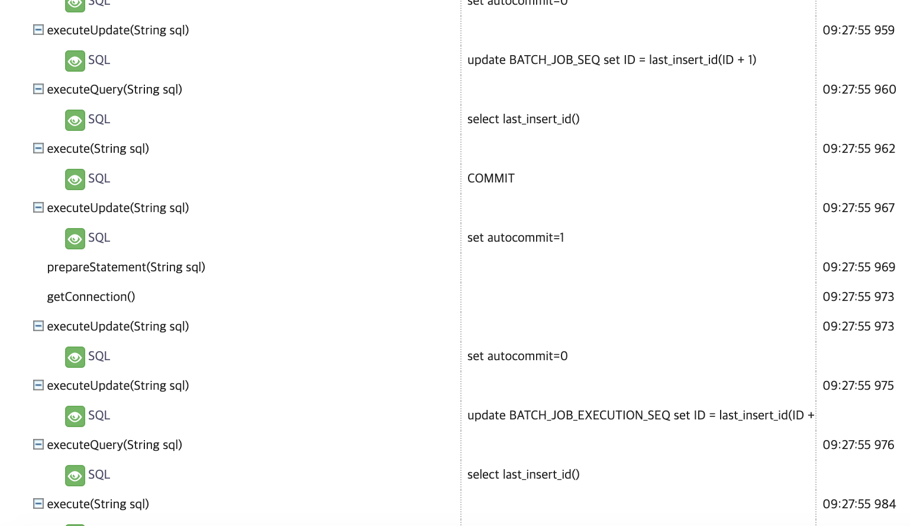

# Spring Batch 핀포인트로 모니터링하기

최신 버전 (1.8.4 - 2019.08.31기준) 의 agent로 진행합니다.
하위버전에서는 하이버네이트 등의 ORM 실행시 SQL이 정상적으로 로그가 출력되지 않을 수 있습니다.

```bash
 PINPOINT_OPTS="-javaagent:pinpoint-bootstrap.jar위치 -Dpinpoint.agentId=에이전트ID -Dpinpoint.applicationName=표기될AppName"
```

## 1. 단일 Job 메소드 지정

```bash
profiler.entrypoint=foo.bar.MyBatchClass.jobMethod
```


## 2. SimpleJobLauncher.run() 지정


```bash
profiler.entrypoint=org.springframework.batch.core.launch.support.SimpleJobLauncher.run
```




너무 많은 추적이 발생하여 **Corrupted(waiting for packet)** 문제가 발생
(트레이스가 노출되지 않는다.)


