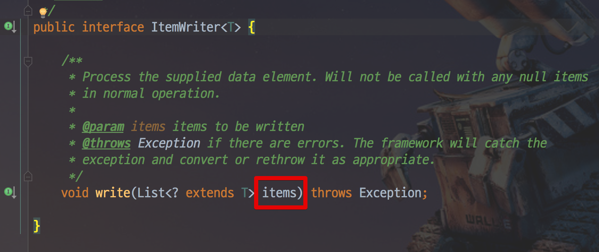
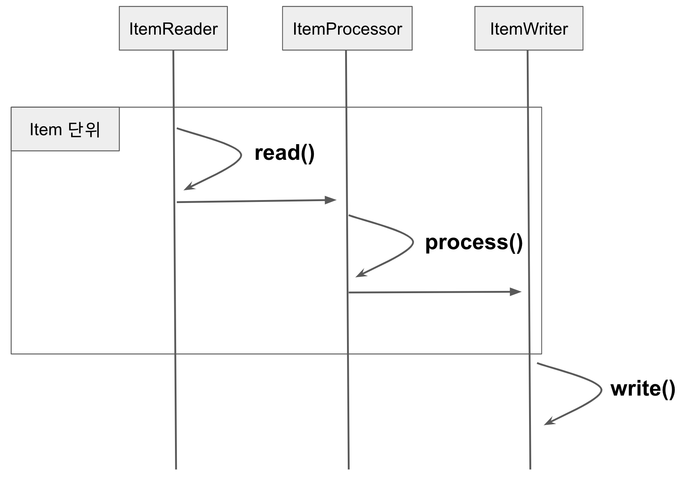
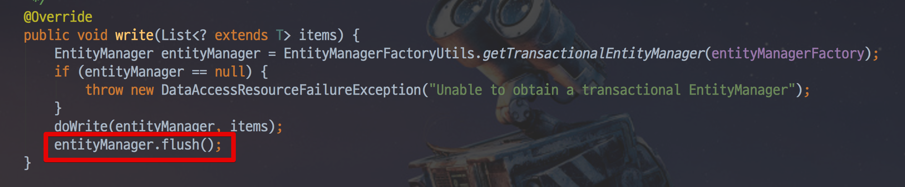
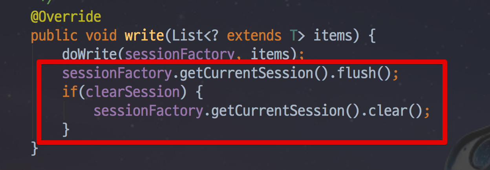
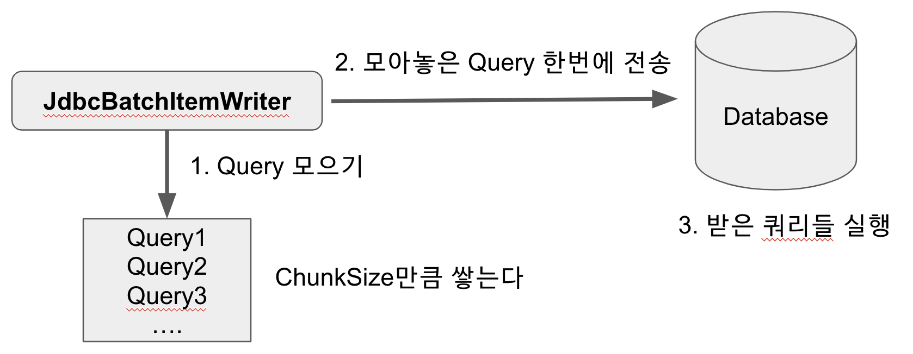
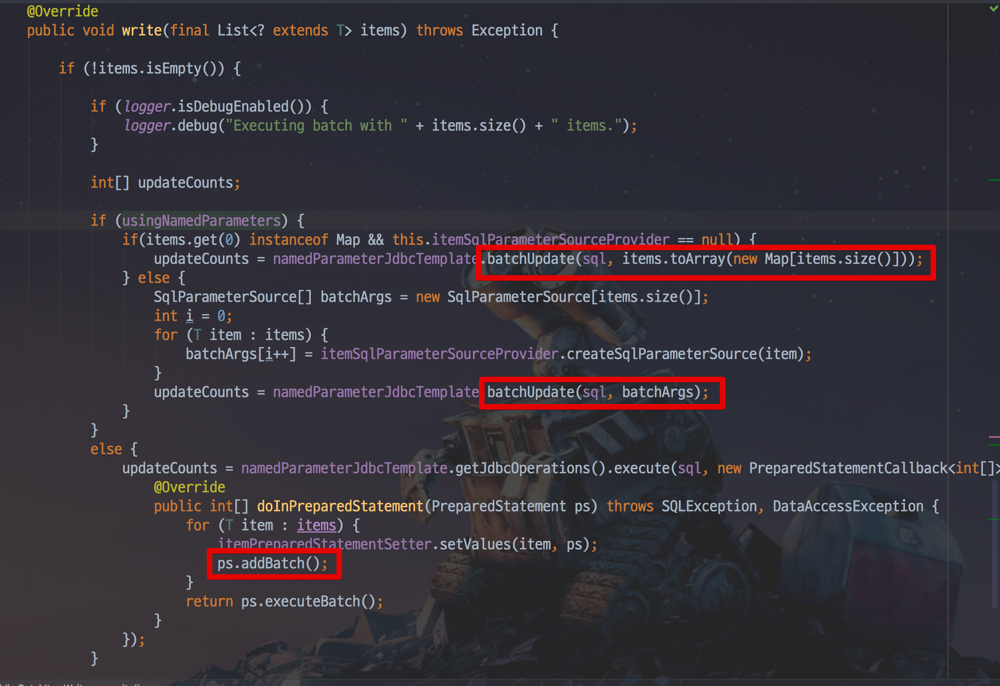

# 8. Writer

앞서 Reader에 대해서 배웠습니다.  
Writer는 Reader, Prcessor와 함께 ChunkOrientedTasklet을 구성하는 3 요소입니다.  
여기서 Processor가 아닌 Writer를 우선 선택한 이유가 궁금 하실수 있습니다.  
  
이유는 **Processor는 선택**이기 때문입니다.  
Reader와 Writer는 ChunkOrientedTasklet에서 필수 요소입니다.  
  
하지만 Processor는 없어도 ChunkOrientedTasklet는 구성할 수 있습니다.  
그래서 Writer를 먼저 다뤄보겠습니다.  
  
## 8-1. ItemWriter 소개

ItemWriter는 Spring Batch에서 사용하는 **출력** 기능입니다.  
Spring Batch가 처음 나왔을 때, ItemWriter는 ItemReader와 마찬가지로 item을 하나씩 다루었습니다.  
그러나 Spring Batch2와 청크 (Chunk) 기반 처리의 도입으로 인해 ItemWriter에도 큰 변화가 있었습니다.  
  
이 업데이트 이후 부터 ItemWriter는 item 하나를 작성하지 않고 **Chunk 단위로 묶인 item List**를 다룹니다.  
이 때문에 ItemWriter 인터페이스는 ItemReader 인터페이스와 약간 다릅니다.  



[쳅터 7](https://jojoldu.tistory.com/336)을 보신 분들은 아시겠지만, Reader의 ```read()```는 Item 하나를 반환하는 반면, Writer의 ```write()```는 인자로 Item List를 받습니다.  

이를 그림으로 표현하면 아래와 같습니다.



* ItemReader를 통해 각 항목을 개별적으로 읽고 이를 처리하기 위해 ItemProcessor에 전달합니다.  
* 이 프로세스는 청크의 Item 개수 만큼 처리 될 때까지 계속됩니다.  
* 청크 단위만큼 처리가 완료되면 Writer에 전달되어 Writer에 명시되어있는대로 일괄처리합니다.

즉, Reader와 Processor를 거쳐 처리된 Item을 Chunk 단위 만큼 쌓은 뒤 이를 Writer에 전달하는 것입니다.  

> 위 내용은 이미 쳅터6 Chunk 지향 처리에서 상세하게 언급되었습니다.

Spring Batch는 다양한 Output 타입을 처리 할 수 있도록 많은 Writer를 제공합니다.  
Reader와 마찬가지로, 모든 내용을 다루기는 어렵기 때문에 Database와 관련된 내용들만 다루겠습니다.

## 8-2. Database Writer

Java 세계에서는 JDBC 또는 ORM을 사용하여 RDBMS에 접근합니다.  
Spring Batch는 JDBC와 ORM 모두 Writer를 제공합니다.  
Writer는 Chunk단위의 마지막 단계입니다.  
그래서 Database의 영속성과 관련해서는 **항상 마지막에 Flush를 해줘야만** 합니다.  
  
예를 들어 아래와 같이 영속성을 사용하는 JPA, Hibernate의 경우 ItemWriter 구현체에서는 ```flush()```와 ```session.clear()```가 따라옵니다. 



(JpaItemWriter)



(HibernateItemWriter)  
  
Writer가 받은 모든 Item이 처리 된 후, Spring Batch는 현재 트랜잭션을 커밋합니다.  

데이터베이스와 관련된 Writer는 아래와 같이 3가지가 있습니다.

* JdbcBatchItemWriter
* HibernateItemWriter
* JpaItemWriter

이 중에서 많은 분들이 사용하고 계신 JdbcBatchItemWriter와 JpaItemWriter를 소개드리겠습니다.

## 8-3. JdbcBatchItemWriter

ORM을 사용하지 않는 경우 Writer는 대부분 JdbcBatchItemWriter를 사용합니다.  
이 JdbcBatchItemWriter는 아래 그림과 같이 JDBC의 일괄 처리 기능을 사용하여 한번에 Database로 전달하여 Database 내부에서 쿼리들이 실행되도록 합니다.



이렇게 처리하는 이유는 어플리케이션과 데이터베이스 간에 데이터를 주고 받는 회수를 최소화 하여 성능 향상을 꾀하기 위함입니다.  

> [JdbcTemplate.batchUpdate](https://docs.spring.io/spring/docs/3.0.0.M4/reference/html/ch12s04.html)의 공식 문서 내용을 참고하시면 같은 내용을 알 수 있습니다.

* 업데이트를 일괄 처리로 그룹화하면 

실제로 JdbcBatchItemWriter의 ```write()```를 확인해보시면 일괄처리 하는 것을 확인할 수 있습니다.



JdbcBatchItemWriter의 샘플 코드

```java

```


|  Property     |  Type     |  설명   |
|  ---                          |  ---                              |  ---  |
| assertUpdates                 | boolean |  적어도 하나의 항목이 행을 업데이트하거나 삭제하지 않을 경우 예외를 throw할지 여부. 기본값은 true입니다. Exception:EmptyResultDataAccessException     | 
| itemPreparedStatementSetter   | ItemPreparedStatementSetter<T> | SQL 문 매개 변수 값은? 위치 매개 변수 표시 자      |
| ItemSqlParameterSource        | ItemSqlParameterSourceProvider<T>   | 명명 된 매개 변수의 SQL 문 매개 변수 값      |


## 8-4. JpaItemWriter

## Custom ItemWriter

Reader와 달리 Writer의 경우 Custom하게 구현해야할 일이 많습니다.

> 물론 Reader 역시 조회용 프레임워크를 어떤걸 쓰는지에 따라 Reader를 Custom 하게 구현해야할 수도 있습니다.  
예를 들면 Querydsl용 ItemReader를 만든다거나, JOOQ용 ItemReader를 만드는 등이 있을 수 있습니다.

## 주의 사항

* [Writer에 List형 Item을 전달하고 싶을때](https://jojoldu.tistory.com/140)