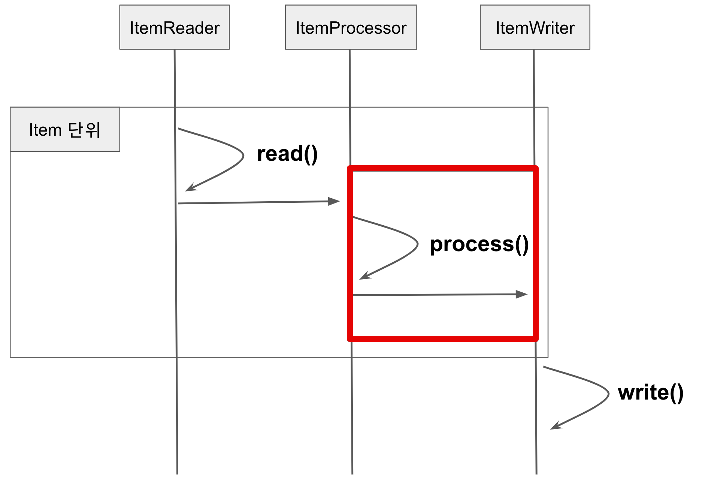
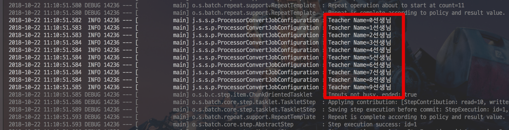
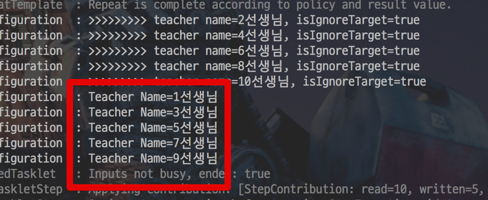
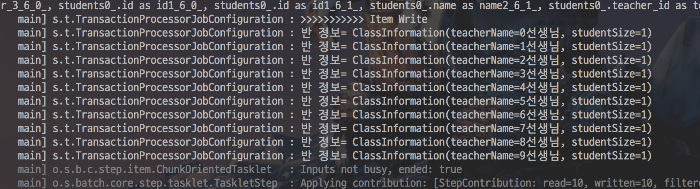
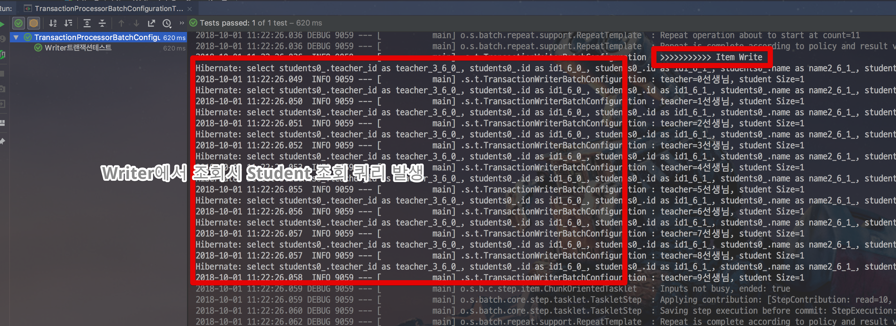

# 9. ItemProcessor

7,8 장에서는 Chunk 지향 처리에서의 데이터 읽기와 쓰기 부분을 소개 드렸습니다.  
이번 챕터에서는 읽기와 쓰기가 아닌, **가공 (혹은 처리) 단계**를 소개드리겠습니다.  
바로 **ItemProcessor**입니다.  

여기서 한가지 드리고 싶은 말씀은 **ItemProcessor는 필수가 아니라는 점**입니다.  
ItemProcessor는 데이터를 가공하거나 필터링하는 역할을 합니다.  
이는 **Writer 부분에서도 충분히 구현 가능**합니다.  

그럼에도 ItemProcessor를 쓰는 것은 Reader, Writer 와는 별도의 단계로 분리되었기 때문에 **비지니스 코드가 섞이는 것을 방지**해주기 때문입니다.  
  
그래서 일반적으로 배치 어플리케이션에서 비즈니스 로직을 추가할때는 가장 먼저 Processor를 고려해보시는 것을 추천드립니다.  
**각 계층 (읽기/처리/쓰기)를 분리할 수 있는 좋은 방법**입니다.  
  
이번 챕터에서 배울 내용은 다음과 같습니다.

* process 단계에서 처리 할 수 있는 비즈니스 로직의 종류
* 청크 지향 처리에서 ItemProcessor 를 구성하는 방법
* Spring Batch와 함께 제공되는 ItemProcessor 구현

자 그럼 이제 시작해보겠습니다!

## 9-1. ItemProcessor 소개

ItemProcessor는 **Reader에서 넘겨준 데이터 개별건을 가공/처리**해줍니다.  
ChunkSize 단위로 묶은 데이터를 한번에 처리하는 ItemWriter와는 대조됩니다.  





일반적으로 ItemProcessor를 사용하는 방법은 2가지 입니다.

* 변환
    * Reader에서 읽은 데이터를 원하는 타입으로 변환해서 Writer에 넘겨 줄 수 있습니다.
* 필터
    * Reader에서 넘겨준 데이터를 Writer로 넘겨줄 것인지를 결정할 수 있습니다.
    * ```null```을 반환하면 **Writer에 전달되지 않습니다**

위 2가지 사례를 차례로 배워보겠습니다.

## 9-2. 기본 사용법


ItemProcessor 인터페이스는 두 개의 제네릭 타입이 필요합니다.  

```java
package org.springframework.batch.item;

public interface ItemProcessor<I, O> {

  O process(I item) throws Exception;

}
```

* I
    * ItemReader에서 받을 데이터 타입
* O
    * ItemWriter에 보낼 데이터 타입

Reader에서 읽은 데이터가 ItemProcessor의 ```process```를 통과해서 Writer에 전달됩니다.  
  
구현해야할 메소드는 ```process``` 하나입니다.  
자바8 부터는 인터페이스의 추상 메소드가 1개일 경우 **람다식을 사용**할 수 있습니다.  
ItemProcessor 역시 ```process``` 만 있기 때문에 람다식을 사용할 수 있습니다.  
  
그래서 많은 배치들이 ItemProcessor를 다음과 같이 **익명 클래스 혹은 람다식을 자주 사용**합니다.  

```java
@Bean(BEAN_PREFIX + "processor")
@StepScope
public ItemProcessor<ReadType, WriteType> processor() {
    return item -> {
        item.convert();
        return item;
    };
}
```

익명 클래스 혹은 람다식을 사용하는 이유는 다음과 같습니다.

* 행사 코드 (불필요한 코드) 가 없어 구현 코드 양이 적습니다
    * 빠르게 구현 가능합니다.
* 고정된 형태가 없어 원하는 형태의 어떤 처리도 가능합니다

다만 단점도 있습니다.

* Batch Config 클래스 안에 포함되어 있어야만 해서 Batch Config의 코드 양이 많아질 수 있습니다.

위 단점으로 인해 보통 코드 양이 많아지면 별도 클래스 (ItemProcess의 구현체)로 Processor를 분리해서 쓰기도 합니다.  


## 9-3. 변환

첫번째로 알아볼 예제는 **변환**입니다.  
즉, Reader에서 읽은 타입을 변환하여 Writer에 전달해주는 것을 얘기합니다.  

아래 코드는 Teacher라는 도메인 클래스를 읽어와 Name 필드 (String 타입)을 Wrtier에 넘겨주도록 구성한 코드입니다.

```java
@Slf4j
@RequiredArgsConstructor
@Configuration
public class ProcessorConvertJobConfiguration {

    public static final String JOB_NAME = "ProcessorConvertBatch";
    public static final String BEAN_PREFIX = JOB_NAME + "_";

    private final JobBuilderFactory jobBuilderFactory;
    private final StepBuilderFactory stepBuilderFactory;
    private final EntityManagerFactory emf;

    @Value("${chunkSize:1000}")
    private int chunkSize;

    @Bean(JOB_NAME)
    public Job job() {
        return jobBuilderFactory.get(JOB_NAME)
                .preventRestart()
                .start(step())
                .build();
    }

    @Bean(BEAN_PREFIX + "step")
    @JobScope
    public Step step() {
        return stepBuilderFactory.get(BEAN_PREFIX + "step")
                .<Teacher, String>chunk(chunkSize)
                .reader(reader())
                .processor(processor())
                .writer(writer())
                .build();
    }

    @Bean
    public JpaPagingItemReader<Teacher> reader() {
        return new JpaPagingItemReaderBuilder<Teacher>()
                .name(BEAN_PREFIX+"reader")
                .entityManagerFactory(emf)
                .pageSize(chunkSize)
                .queryString("SELECT t FROM Teacher t")
                .build();
    }

    @Bean
    public ItemProcessor<Teacher, String> processor() {
        return teacher -> {
            return teacher.getName();
        };
    }

    private ItemWriter<String> writer() {
        return items -> {
            for (String item : items) {
                log.info("Teacher Name={}", item);
            }
        };
    }
}
```

ItemProcessor에서는 Reader에서 읽어올 타입이 ```Teacher```이며, Writer에서 넘겨줄 타입이 ```String```이기 때문에 제네릭 타입은 ```<Teacher, String>```이 됩니다.

```java
@Bean
public ItemProcessor<Teacher, String> processor() {
    return teacher -> {
        return teacher.getName();
    };
}
```

여기서 ChunkSize 앞에 선언될 타입 역시 Reader와 Writer 타입을 따라가야하기 때문에 다음과 같이 선언됩니다.

```java
.<Teacher, String>chunk(chunkSize)
```

위 코드를 실행해보면!
아래와 같이 Wrtier에서 실행하는 ```log.info("Teacher Name={}", item)```가 아주 잘 수행되었음을 확인할 수 있습니다.



즉, Teacher 클래스가 Processor을 거치면서 String으로 잘 전환되었다는 것을 알수있겠죠?

## 9-4. 필터

다음으로 알아볼 예제는 **필터**입니다.  
즉, **Writer에 값을 넘길지 말지를 Processor에서 판단하는 것**을 얘기합니다.  
아래의 코드는 ```Teacher``` 의 id가 짝수일 경우 필터링 하는 예제입니다.

```java
@Slf4j
@RequiredArgsConstructor
@Configuration
public class ProcessorNullJobConfiguration {

    public static final String JOB_NAME = "processorNullBatch";
    public static final String BEAN_PREFIX = JOB_NAME + "_";

    private final JobBuilderFactory jobBuilderFactory;
    private final StepBuilderFactory stepBuilderFactory;
    private final EntityManagerFactory emf;

    @Value("${chunkSize:1000}")
    private int chunkSize;

    @Bean(JOB_NAME)
    public Job job() {
        return jobBuilderFactory.get(JOB_NAME)
                .preventRestart()
                .start(step())
                .build();
    }

    @Bean(BEAN_PREFIX + "step")
    @JobScope
    public Step step() {
        return stepBuilderFactory.get(BEAN_PREFIX + "step")
                .<Teacher, Teacher>chunk(chunkSize)
                .reader(reader())
                .processor(processor())
                .writer(writer())
                .build();
    }

    @Bean
    public JpaPagingItemReader<Teacher> reader() {
        return new JpaPagingItemReaderBuilder<Teacher>()
                .name(BEAN_PREFIX+"reader")
                .entityManagerFactory(emf)
                .pageSize(chunkSize)
                .queryString("SELECT t FROM Teacher t")
                .build();
    }

    @Bean
    public ItemProcessor<Teacher, Teacher> processor() {
        return teacher -> {

            boolean isIgnoreTarget = teacher.getId() % 2 == 0L;
            if(isIgnoreTarget){
                log.info(">>>>>>>>> Teacher name={}, isIgnoreTarget={}", teacher.getName(), isIgnoreTarget);
                return null;
            }

            return teacher;
        };
    }

    private ItemWriter<Teacher> writer() {
        return items -> {
            for (Teacher item : items) {
                log.info("Teacher Name={}", item.getName());
            }
        };
    }
}
```

ItemProcessor에서는 id가 짝수일 경우 ```return null;```을 함으로써 Writer에 넘기지 않도록 합니다.  

```java
@Bean
public ItemProcessor<Teacher, Teacher> processor() {
    return teacher -> {

        boolean isIgnoreTarget = teacher.getId() % 2 == 0L;
        if(isIgnoreTarget){
            log.info(">>>>>>>>> Teacher name={}, isIgnoreTarget={}", teacher.getName(), isIgnoreTarget);
            return null;
        }

        return teacher;
    };
}
```

실제로 코드를 돌려보면 **홀수인 Teacher만 출력**되는 것을 확인할 수 있습니다.



이와 같은 방식으로 Writer에 넘길 데이터들을 제어할 수 있겠죠?

## 9-5. 트랜잭션 범위

Spring Batch에서 **트랜잭션 범위는 Chunk단위** 입니다.  
그래서 Reader에서 Entity를 반환해주었다면 **Entity간의 Lazy Loading이 가능**합니다.
이는 Processor뿐만 아니라 Writer에서도 가능 합니다.  
  
실제로 가능한지 한번 테스트 해보겠습니다.

### 9-5-1. Processor

첫번째 예제는 **Processor에서의 Lazy Loading** 입니다.  
  
아래 코드는 Reader에서 ```Teacher``` Entity를 반환해, Processor에서 Entity의 하위 자식들인 ```Student```를 Lazy Loading합니다.

```java
@Slf4j
@RequiredArgsConstructor
@Configuration
public class TransactionProcessorJobConfiguration {

    public static final String JOB_NAME = "transactionProcessorBatch";
    public static final String BEAN_PREFIX = JOB_NAME + "_";

    private final JobBuilderFactory jobBuilderFactory;
    private final StepBuilderFactory stepBuilderFactory;
    private final EntityManagerFactory emf;

    @Value("${chunkSize:1000}")
    private int chunkSize;

    @Bean(JOB_NAME)
    public Job job() {
        return jobBuilderFactory.get(JOB_NAME)
                .preventRestart()
                .start(step())
                .build();
    }

    @Bean(BEAN_PREFIX + "step")
    @JobScope
    public Step step() {
        return stepBuilderFactory.get(BEAN_PREFIX + "step")
                .<Teacher, ClassInformation>chunk(chunkSize)
                .reader(reader())
                .processor(processor())
                .writer(writer())
                .build();
    }


    @Bean
    public JpaPagingItemReader<Teacher> reader() {
        return new JpaPagingItemReaderBuilder<Teacher>()
                .name(BEAN_PREFIX+"reader")
                .entityManagerFactory(emf)
                .pageSize(chunkSize)
                .queryString("SELECT t FROM Teacher t")
                .build();
    }

    public ItemProcessor<Teacher, ClassInformation> processor() {
        return teacher -> new ClassInformation(teacher.getName(), teacher.getStudents().size());
    }

    private ItemWriter<ClassInformation> writer() {
        return items -> {
            log.info(">>>>>>>>>>> Item Write");
            for (ClassInformation item : items) {
                log.info("반 정보= {}", item);
            }    
        };
    }
}

```

보시는것처럼 Processor 부분에서는 ```teacher.getStudents()```로 가져옵니다.

```java
    public ItemProcessor<Teacher, ClassInformation> processor() {
        return teacher -> new ClassInformation(teacher.getName(), teacher.getStudents().size());
    }
```

여기서 Processor가 트랜잭션 범위 밖이라면 오류가 나겠죠?  
하지만 실제로 실행해보면!



성공적으로 배치가 실행되었음을 확인할 수 있습니다.  
즉, **Processor는 트랜잭션 범위 안이며, Entity의 Lazy Loading이 가능**하다는 것을 확인하였습니다.

### 9-5-2. Writer

두번째 예제는 **Writer에서의 Lazy Loading** 입니다.  
  
아래 코드는 Reader에서 ```Teacher``` Entity를 반환해, Processor를 거치지 않고 Writer로 바로 넘겨 Writer에서 Entity의 하위 자식들인 ```Student```를 Lazy Loading합니다.

```java
@Slf4j
@RequiredArgsConstructor
@Configuration
public class TransactionWriterJobConfiguration {

    public static final String JOB_NAME = "transactionWriterBatch";
    public static final String BEAN_PREFIX = JOB_NAME + "_";

    private final JobBuilderFactory jobBuilderFactory;
    private final StepBuilderFactory stepBuilderFactory;
    private final EntityManagerFactory emf;

    @Value("${chunkSize:1000}")
    private int chunkSize;

    @Bean(JOB_NAME)
    public Job job() {
        return jobBuilderFactory.get(JOB_NAME)
                .preventRestart()
                .start(step())
                .build();
    }

    @Bean(BEAN_PREFIX + "step")
    @JobScope
    public Step step() {
        return stepBuilderFactory.get(BEAN_PREFIX + "step")
                .<Teacher, Teacher>chunk(chunkSize)
                .reader(reader())
                .writer(writer())
                .build();
    }


    @Bean
    public JpaPagingItemReader<Teacher> reader() {
        return new JpaPagingItemReaderBuilder<Teacher>()
                .name(BEAN_PREFIX+"reader")
                .entityManagerFactory(emf)
                .pageSize(chunkSize)
                .queryString("SELECT t FROM Teacher t")
                .build();
    }

    private ItemWriter<Teacher> writer() {
        return items -> {
            log.info(">>>>>>>>>>> Item Write");
            for (Teacher item : items) {
                log.info("teacher={}, student Size={}", item.getName(), item.getStudents().size());
            }    
        };
    }
}
```

이 코드 역시 실행해보면!



Lazy Loading이 발생하는 것을 확인할 수 있습니다.  
  
위 2개의 테스트로 Processor와 Writer는 트랜잭션 범위 안이며, Lazy Loading이 가능하다는 것을 확인하였습니다.  
이제는 JPA를 쓸 때 좀 더 편하게 사용할 수 있겠죠?

## 9-6. ItemProcessor 구현체

Spring Batch에서는 자주 사용하는 용도의 Processor를 미리 클래스로 만들어서 제공해주고 있습니다.  
총 3개의 클래스가 있습니다.

* ItemProcessorAdapter
* ValidatingItemProcessor
* CompositeItemProcessor

하지민 최근에는 대부분 Processor 구현을 직접 구현할때가 많고, 여차하면 람다식으로 빠르게 구현할때도 많습니다.  
그래서 ItemProcessorAdapter, ValidatingItemProcessor는 거의 사용하지 않습니다.  
이들의 역할은 커스텀하게 직접 구현해도 되기 때문입니다.  
다만, CompositeItemProcessor는 간혹 필요할때가 있기 때문에 소개드립니다.  
  
CompositeItemProcessor는 **ItemProcessor간의 체이닝을 지원**하는 Processor라고 보시면 됩니다.  
  
Processor의 역할은 변환 혹은 필터라고 위에서 말씀드렸습니다.  
하지만 이 변환이 2번 필요하면 어떻게 할까요?  
하나의 Processor에서 모두 변환하면 될까요?  
그럼 그 하나의 Processor의 역할이 너무나 커지지 않을까요?  
CompositeItemProcessor는 그런 의문에서 시작되었습니다.  
  
아래의 예제는 ```Teacher```의 이름을 가져와 (```getName()```) 이름 앞/뒤에 문장 (```"안녕하세요. "+ name + "입니다."```)을 붙여 Writer에 전달하는 예제입니다.


```java
@Slf4j
@RequiredArgsConstructor
@Configuration
public class ProcessorCompositeJobConfiguration {

    public static final String JOB_NAME = "processorCompositeBatch";
    public static final String BEAN_PREFIX = JOB_NAME + "_";

    private final JobBuilderFactory jobBuilderFactory;
    private final StepBuilderFactory stepBuilderFactory;
    private final EntityManagerFactory emf;

    @Value("${chunkSize:1000}")
    private int chunkSize;

    @Bean(JOB_NAME)
    public Job job() {
        return jobBuilderFactory.get(JOB_NAME)
                .preventRestart()
                .start(step())
                .build();
    }

    @Bean(BEAN_PREFIX + "step")
    @JobScope
    public Step step() {
        return stepBuilderFactory.get(BEAN_PREFIX + "step")
                .<Teacher, String>chunk(chunkSize)
                .reader(reader())
                .processor(compositeProcessor())
                .writer(writer())
                .build();
    }

    @Bean
    public JpaPagingItemReader<Teacher> reader() {
        return new JpaPagingItemReaderBuilder<Teacher>()
                .name(BEAN_PREFIX+"reader")
                .entityManagerFactory(emf)
                .pageSize(chunkSize)
                .queryString("SELECT t FROM Teacher t")
                .build();
    }

    @Bean
    public CompositeItemProcessor compositeProcessor() {
        List<ItemProcessor> delegates = new ArrayList<>(2);
        delegates.add(processor1());
        delegates.add(processor2());

        CompositeItemProcessor processor = new CompositeItemProcessor<>();

        processor.setDelegates(delegates);

        return processor;
    }

    public ItemProcessor<Teacher, String> processor1() {
        return Teacher::getName;
    }

    public ItemProcessor<String, String> processor2() {
        return name -> "안녕하세요. "+ name + "입니다.";
    }

    private ItemWriter<String> writer() {
        return items -> {
            for (String item : items) {
                log.info("Teacher Name={}", item);
            }
        };
    }
}
```

> 이와 유사하게 서로 다른 클래스 타입으로 변환해도 가능합니다.

CompositeItemProcessor에 ItemProcessor List인 ```delegates```을 할당만 하면 모든 구현은 끝납니다.

```java
@Bean
public CompositeItemProcessor compositeProcessor() {
    List<ItemProcessor> delegates = new ArrayList<>(2);
    delegates.add(processor1());
    delegates.add(processor2());

    CompositeItemProcessor processor = new CompositeItemProcessor<>();

    processor.setDelegates(delegates);

    return processor;
}
```

다만 여기서 제네릭 타입을 쓰지 못하는데요.  
그 이유는 제네릭 타입을 쓰게 되면 ```delegates```에 포함된 **모든 ItemProcessor는 같은 제네릭 타입을 가져야**합니다.  
  
지금 같은 경우 processor1은 ```<Teacher, String>```을, processor2는 ```<String, String>```입니다.  
같은 제네릭 타입을 쓰지 못하기 때문에 현재 예제는 제네릭을 사용하지 않았습니다.  
  
만약 같은 제네릭 타입을 쓸 수 있는 ItemProcessor간의 체이닝이라면 제네릭을 선언하는게 좀 더 안전한 코드가 될 수 있겠죠?  
  
자 그럼 이 코드를 한번 실행해보면!


아주 잘 수행되었음을 확인할 수 있습니다.

## 마무리

Reader, Writer에 이어 Processor까지 모두 완료 되었습니다!  
Processor는 크게 어려운 내용이 없으니 가볍게 훑어 보시면 될것 같습니다.  
  
긴 글 끝까지 봐주셔서 감사합니다!  
그럼 다음 시간에 뵙겠습니다. :)


