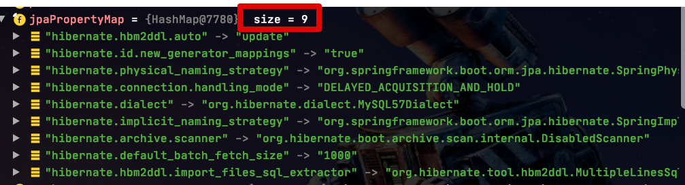
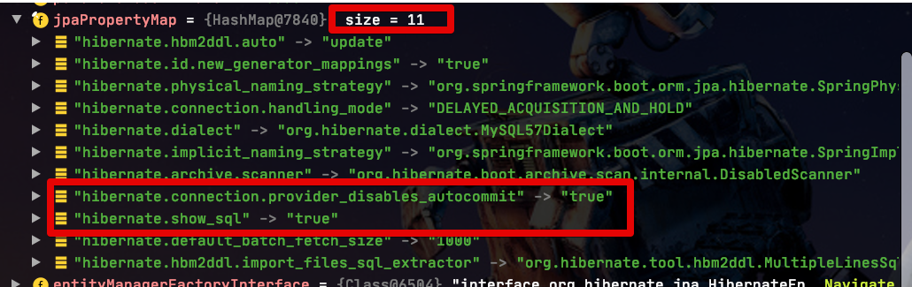

# Spring Batch Reader에서 Read DB 사용하기 (feat. AWS Aurora)


## 1. AWS Aurora에서의 Read Only


```java
spring:
  datasource:
    hikari:
      jdbc-url: jdbc:mysql:aurora://~~~ (1)
      username: ~~
      password: ~~
      driver-class-name: org.mariadb.jdbc.Driver (2)
```

(1) ```jdbc:mysql:aurora```

(2) ```org.mariadb.jdbc.Driver```


> [AWS ReInvent 영상](https://www.youtube.com/watch?time_continue=1667&v=duf5uUsW3TM&feature=emb_logo)을 보시면 Aurora 페일오버에 관해선 MariaDB Driver를 사용하기를 권장하고 있습니다.  
> 27분 40초부터 보시면 됩니다.  
> [mariadb 공식문서](https://mariadb.com/kb/en/failover-and-high-availability-with-mariadb-connector-j/#aurora-failover-implementation)도 함께 참고하시면 좋습니다.

```java
public interface ProductRepository extends JpaRepository <Product, Long> {

    @Transactional(readOnly = true)
    List<Product> findAllByCreateDateEquals(LocalDate createDate);
}

```

좀 더 자세한 설명이 필요하신 분들은 [권남님의 블로그](http://egloos.zum.com/kwon37xi/v/5364167) 를 참고해보세요.

## 2. 





```java
    public LocalContainerEntityManagerFactoryBean entityManagerFactory(DataSource dataSource) {

        return new EntityManagerFactoryBuilder(new HibernateJpaVendorAdapter(), jpaProperties.getProperties(), null)
                .dataSource(dataSource)
                .properties(hibernateProperties.determineHibernateProperties(jpaProperties.getProperties(), new HibernateSettings()))
                .persistenceUnit("master")
                .packages(PACKAGE)
                .build();
    }
```


## 3. 

```java
@Slf4j
@Configuration
public class ProductBackupConfiguration {
    public static final String JOB_NAME = "productBackupJob";

    private final JobBuilderFactory jobBuilderFactory;
    private final StepBuilderFactory stepBuilderFactory;
    private final EntityManagerFactory emf;
    private final EntityManagerFactory readerEmf;
    private final ProductBackupJobParameter jobParameter;

    public ProductBackupConfiguration(
            JobBuilderFactory jobBuilderFactory,
            StepBuilderFactory stepBuilderFactory,
            EntityManagerFactory emf,
            @Qualifier(READER_ENTITY_MANAGER_FACTORY) EntityManagerFactory readerEmf,
            ProductBackupJobParameter jobParameter) {

        this.jobBuilderFactory = jobBuilderFactory;
        this.stepBuilderFactory = stepBuilderFactory;
        this.emf = emf;
        this.readerEmf = readerEmf;
        this.jobParameter = jobParameter;
    }

    private int chunkSize;

    @Value("${chunkSize:1000}")
    public void setChunkSize(int chunkSize) {
        this.chunkSize = chunkSize;
    }

    @Bean
    @JobScope
    public ProductBackupJobParameter jobParameter() {
        return new ProductBackupJobParameter();
    }

    @Bean
    public Job job() {
        return jobBuilderFactory.get(JOB_NAME)
                .start(step())
                .build();
    }

    @Bean
    @JobScope
    public Step step() {
        return stepBuilderFactory.get("step")
                .<Product, ProductBackup>chunk(chunkSize)
                .reader(reader())
                .processor(processor())
                .writer(writer())
                .build();
    }

    @Bean
    @StepScope
    public JpaPagingItemReader<Product> reader() {
        String query = String.format("SELECT p FROM Product p WHERE p.createDate ='%s'", jobParameter.getTxDate());

        return new JpaPagingItemReaderBuilder<Product>()
                .entityManagerFactory(readerEmf)
                .queryString(query)
                .pageSize(chunkSize)
                .name("reader")
                .build();
    }

    private ItemProcessor<Product, ProductBackup> processor() {
        return ProductBackup::new;
    }

    @Bean
    public JpaItemWriter<ProductBackup> writer() {
        return new JpaItemWriterBuilder<ProductBackup>()
                .entityManagerFactory(emf)
                .build();
    }
}
```

```java
@Getter
@Slf4j
@NoArgsConstructor
public class ProductBackupJobParameter {
    private LocalDate txDate;

    @Value("#{jobParameters[txDate]}")
    public void setTxDate(String txDate) {
        this.txDate = parse(txDate, ofPattern("yyyy-MM-dd"));
    }
}
```

