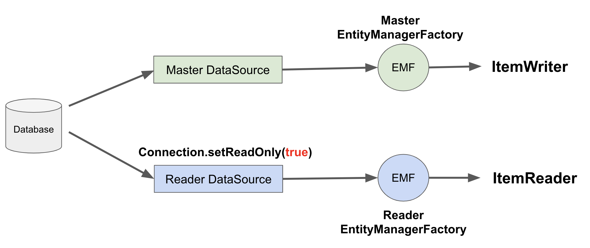
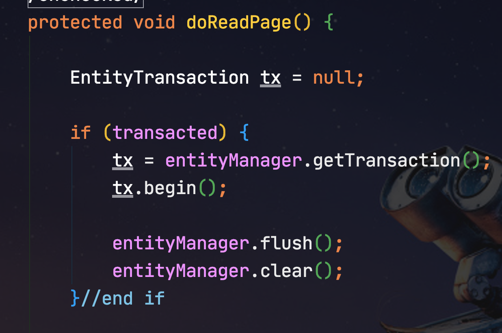
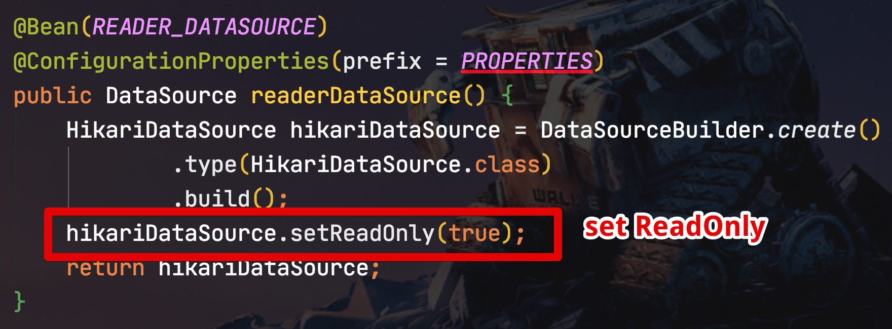
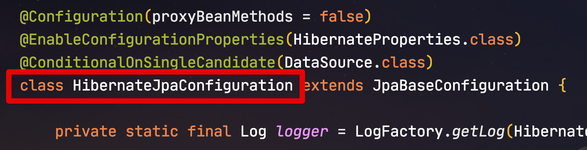

# Spring Batch Reader에서 Read DB 사용하기 (feat. AWS Aurora)

일반적으로 서비스가 커지게 되면 DB를 여러대로 늘리게 됩니다.  
이때 가장 첫 번째로 고려하는 방법이 Replication 입니다.  
즉, 1대의 마스터 DB와 여러대의 Slave DB를 두는 것이죠.  
  
데이터의 변경은 모두 마스터 DB에서만 이루어지고, SlaveDB들은 이 변경사항을 실시간으로 수신 받고, 성능 이슈가 심한 조회 요청에 대해서 처리합니다.  
(일반적인 웹 서비스에서는 조회와 등록/수정 비율이 80%:20% 정도입니다)  
  
위와 같은 전략에 대해서는 이미 많은 자료가 인터넷에 있으니 참고해보시면 됩니다.

> 신입 개발자분들은 [강대명님의 슬라이드](https://www.slideshare.net/charsyam2/webservice-scaling-for-newbie)를 꼭 참고하셔서 보편적인 웹 서비스 확장 전략에 대해서 꼭 인지하고 계셔야 합니다.

이번 글에서는 이렇게 Replication 상태에서 Spring Batch ItemReader 사용시 마스터 DB가 아닌 Reader DB (Replica 된 Slave DB) 를 조회하도록 하는 설정 방법입니다.  

## 1. AWS Aurora에서의 Read Only

AWS의 AuroraDB (MySQL)는 클러스터 모드로 사용할 수 있는데요.


Aurora를 클러스터 모드로 사용하게 되면 아래와 같이 Cluster Endpoint와 Reader용 EndPoint를 모두 제공합니다.

> EndPoint란 DB접근을 위한 URL이라고 보시면 됩니다


> Aurora의 Cluster Endpoint는 FailOver 를 제공합니다.  
> 즉, 마스터 DB에 문제가 발생하면 Replica 인스턴스 중 하나를 마스터 DB로 선택합니다.

일반적으로 Spring Boot 환경에서 Aurora를 **클러스터 모드**로 사용하면서 **트랜잭션이 ReadOnly인 경우** (```@Transactional(readOnly=true)```) Reader EndPoint로 요청이 가게 됩니다.  

즉, 아래와 같이 Service 혹은 Repoisotry에 ```readOnly``` 옵션을 주고 호출하면 Reader EndPoint로 요청이 간다는 것입니다.

```java
public interface ProductRepository extends JpaRepository <Product, Long> {

    @Transactional(readOnly = true)
    List<Product> findAllByCreateDateEquals(LocalDate createDate);
}
```

실제로 이를 테스트 코드로 구현해서 실행해보면?

```java
@ExtendWith(SpringExtension.class)
@SpringBootTest
@ActiveProfiles(profiles = "real")
public class RealRepositoryTest {

    @Autowired
    private ProductRepository productRepository;

    @AfterEach
    public void after() throws Exception {
        productRepository.deleteAllInBatch();
    }

    @Test
    void 트랜잭션_readOnly_테스트() throws Exception {
        //given
        LocalDate txDate = LocalDate.of(2020,10,12);
        String name = "a";
        int expected1 = 1000;
        int expected2 = 2000;
        productRepository.save(new Product(name, expected1, txDate));
        productRepository.save(new Product(name, expected2, txDate));

        //when
        productRepository.findAllByCreateDate(txDate);
        //then
    }
}
```

아래와 같이 Reader DB에서 쿼리가 실행된 것을 알 수 있습니다.


> 테스트를 위해서 Aurora의 general Log 옵션을 활성화 시켰습니다.  
> 일반적으로는 **general Log 옵션을 비활성화**시켜야 합니다.  
> 활성화 될 경우 모든 쿼리 실행 로그를 남기게 되어 치명적인 성능 이슈가 발생합니다.

자 그럼 Spring Batch 환경에서 Aurora ReaderDb를 조회하는 구조로 변경하는 방법을 배워보겠습니다.

## 2. Batch 설정

> Spring Boot 2.2.x에서 진행됩니다.

AWS Aurora (MySQL) 을 사용할 경우 일반적으로 application.yml의 HikariCP 설정은 아래와 같이 합니다.

```java
spring:
  datasource:
    hikari:
      jdbc-url: jdbc:mysql:aurora://~~~ (1)
      username: ~~
      password: ~~
      driver-class-name: org.mariadb.jdbc.Driver (2)
```

여기서 MySQL을 사용하지만 JDBC드라이버는 MaraiDB를 사용하는 것을 볼 수 있는데요.  
테스트 결과로 현재까지는 위와 같이 설정할때만 Aurora가 **정상적으로 FailOver** 되는 것을 확인된 상태입니다.

> [AWS ReInvent 영상](https://www.youtube.com/watch?time_continue=1667&v=duf5uUsW3TM&feature=emb_logo)을 보시면 Aurora 페일오버에 관해선 MariaDB Driver를 사용하기를 권장하고 있습니다.  
> 27분 40초부터 보시면 됩니다.  
> [mariadb 공식문서](https://mariadb.com/kb/en/failover-and-high-availability-with-mariadb-connector-j/#aurora-failover-implementation)도 함께 참고하시면 좋습니다.

위와 같이 HikariCP 설정을 하신 뒤, 챕터 1에서와 같이 ```@Transactional(readOnly=true)``` 옵션이 잘 적용되는지 먼저 확인 합니다.  
  
확인이 되셨다면 본격적으로 설정을 해볼텐데요.  
전반적인 구조는 아래와 같이 진행 됩니다.


  
* Reader EndPoint로 요청을 가게 하는 방법이 꼭 트랜잭션을 ReadOnly로 하는 것만 있는 것은 아닙니다.
* 실제로 ```@Transactional(readOnly=true)```로 하여 Reader EndPoint 로 요청이 가는 것은 다음의 과정 때문인데요. 
* ```@Transactional(readOnly=true)``` 로 설정되면 **JDBC 드라이버**에 ReadOnly 힌트를 전달합니다.
  * 데이터베이스에게 힌트를 주는 게 아닙니다.
* 스프링은 트랜잭션이 readOnly로 설정이 되면 ```Connection.setReadOnly(true)``` 를 호출합니다.
* 이를 통해 Reader EndPoint로 호출이 됩니다.

즉, ```Connection.setReadOnly(true)``` 가 설정될 경우 Reader EndPoint 호출이 된다는 것이죠.  
그래서 트랜잭션을 readOnly로 하기 보다는 DataSource에서 readOnly 설정을 하고, 이를 가진 EntityManagerFactory를 만들어 사용하는 방법으로 가고자 합니다.  
  
굳이 이렇게 하는 이유는 주로 사용되는 JpaPagingItemReader의 경우 아래와 같이 이미 **자체적으로 트랜잭션을 만들어** 사용하고 있어서 "이를 감싼 트랜잭션을 또 하나 생성할 필요가 있을까" 란 생각이기 때문입니다.  

**JpaPagingItemReader.doReadPage()**



> JpaPagingItemReader 에서는 transacted의 기본값이 true입니다.

다만, 앞으로 진행할 설정이 과하다 생각되신다면 ItemReader에서 트랜잭션을 readOnly로 변경하는 방법을 고려해보셔도 될 것 같습니다.  
  
### 2-1. DataSourceConfiguration

가장 먼저 진행할 설정은 DataSource 입니다.  
기존에 하던 HikariCP (```spring.datasource.hikari```) 설정을 최대한 사용합니다.

```java
@RequiredArgsConstructor
@Configuration
public class DataSourceConfiguration {
    private static final String PROPERTIES = "spring.datasource.hikari";

    public static final String MASTER_DATASOURCE = "dataSource";
    public static final String READER_DATASOURCE = "readerDataSource";

    @Bean(MASTER_DATASOURCE)
    @Primary
    @ConfigurationProperties(prefix = PROPERTIES)
    public DataSource dataSource() {
        return DataSourceBuilder.create()
                .type(HikariDataSource.class)
                .build();
    }

    @Bean(READER_DATASOURCE)
    @ConfigurationProperties(prefix = PROPERTIES)
    public DataSource readerDataSource() {
        HikariDataSource hikariDataSource = DataSourceBuilder.create()
                .type(HikariDataSource.class)
                .build();
        hikariDataSource.setReadOnly(true);
        return hikariDataSource;
    }
}
```

Master Datasource의 설정은 기존과 다를바 없으며, Reader Datasource의 경우 Master Datasource와 다른 점은 ```.setReadOnly(true)``` 만 추가되었다는 점입니다. 



어떤 자료에서는 Master와 Reader의 **모든 설정이 동일함**에도 application.yml 에서 Reader용 yml설정을 별도로 하는데요.  
connectionTimeout 등과 같이 설정을 다르게 해야하는게 아니라면, 하나의 설정을 같이 쓰는게 관리하기에 편합니다.  
  
자 이제 1개의 HikariCP 설정으로 2개의 DataSource (Master / Reader) 가 생성이 되었습니다.  
그리고 이 2개의 DataSource를 통해 각각의 EntityManagerFactory 를 설정해보겠습니다.
  
### 2-2. EntityManagerFactory

```java
@RequiredArgsConstructor
@Configuration
@EnableConfigurationProperties({JpaProperties.class, HibernateProperties.class})
@EnableJpaRepositories(
        basePackages = PACKAGE,
        entityManagerFactoryRef = MASTER_ENTITY_MANAGER_FACTORY, // default와 같아서 생략도 가능
        transactionManagerRef = MASTER_TX_MANAGER
)
public class BatchJpaConfiguration {
    public static final String PACKAGE = "com.jojoldu.batch.entity";
    public static final String MASTER_ENTITY_MANAGER_FACTORY = "entityManagerFactory";
    public static final String READER_ENTITY_MANAGER_FACTORY = "readerEntityManagerFactory";

    public static final String MASTER_TX_MANAGER = "batchTransactionManager";

    private final JpaProperties jpaProperties;
    private final HibernateProperties hibernateProperties;
    private final ObjectProvider<Collection<DataSourcePoolMetadataProvider>> metadataProviders;
    private final EntityManagerFactoryBuilder entityManagerFactoryBuilder;

    @Primary
    @Bean(name = MASTER_ENTITY_MANAGER_FACTORY)
    public LocalContainerEntityManagerFactoryBean entityManagerFactory(
            DataSource dataSource) {

        return EntityManagerFactoryCreator.builder()
                .properties(jpaProperties)
                .hibernateProperties(hibernateProperties)
                .metadataProviders(metadataProviders)
                .entityManagerFactoryBuilder(entityManagerFactoryBuilder)
                .dataSource(dataSource)
                .packages(PACKAGE)
                .persistenceUnit("master")
                .build()
                .create();
    }

    @Bean(name = READER_ENTITY_MANAGER_FACTORY)
    public LocalContainerEntityManagerFactoryBean readerEntityManagerFactory(
            @Qualifier(READER_DATASOURCE) DataSource dataSource) {

        return EntityManagerFactoryCreator.builder()
                .properties(jpaProperties)
                .hibernateProperties(hibernateProperties)
                .metadataProviders(metadataProviders)
                .entityManagerFactoryBuilder(entityManagerFactoryBuilder)
                .dataSource(dataSource)
                .packages(PACKAGE)
                .persistenceUnit("reader")
                .build()
                .create();
    }

    @Primary
    @Bean(name = MASTER_TX_MANAGER)
    public PlatformTransactionManager batchTransactionManager(LocalContainerEntityManagerFactoryBean entityManagerFactory) {
        return new JpaTransactionManager(Objects.requireNonNull(entityManagerFactory.getObject()));
    }
}
```


```java
    public LocalContainerEntityManagerFactoryBean entityManagerFactory(DataSource dataSource) {

        return new EntityManagerFactoryBuilder(new HibernateJpaVendorAdapter(), jpaProperties.getProperties(), null)
                .dataSource(dataSource)
                .properties(hibernateProperties.determineHibernateProperties(jpaProperties.getProperties(), new HibernateSettings()))
                .persistenceUnit("master")
                .packages(PACKAGE)
                .build();
    }
```

```java
@Slf4j
public class EntityManagerFactoryCreator {
    private static final String PROVIDER_DISABLES_AUTOCOMMIT = "hibernate.connection.provider_disables_autocommit";

    private final JpaProperties properties;
    private final HibernateProperties hibernateProperties;
    private final ObjectProvider<Collection<DataSourcePoolMetadataProvider>> metadataProviders;
    private final EntityManagerFactoryBuilder entityManagerFactoryBuilder;
    private final DataSource dataSource;
    private final String packages;
    private final String persistenceUnit;

    @Builder
    public EntityManagerFactoryCreator(JpaProperties properties, HibernateProperties hibernateProperties, ObjectProvider<Collection<DataSourcePoolMetadataProvider>> metadataProviders, EntityManagerFactoryBuilder entityManagerFactoryBuilder, DataSource dataSource, String packages, String persistenceUnit) {
        this.properties = properties;
        this.hibernateProperties = hibernateProperties;
        this.metadataProviders = metadataProviders;
        this.entityManagerFactoryBuilder = entityManagerFactoryBuilder;
        this.dataSource = dataSource;
        this.packages = packages;
        this.persistenceUnit = persistenceUnit;
    }

    public LocalContainerEntityManagerFactoryBean create () {
        Map<String, Object> vendorProperties = getVendorProperties();
        customizeVendorProperties(vendorProperties);
        return entityManagerFactoryBuilder
                .dataSource(this.dataSource)
                .packages(packages)
                .properties(vendorProperties)
                .persistenceUnit(persistenceUnit)
                .mappingResources(getMappingResources())
                .build();
    }

    private String[] getMappingResources() {
        List<String> mappingResources = this.properties.getMappingResources();
        return (!ObjectUtils.isEmpty(mappingResources) ? StringUtils.toStringArray(mappingResources) : null);
    }

    private Map<String, Object> getVendorProperties() {
        return new LinkedHashMap<>(this.hibernateProperties.determineHibernateProperties(
                this.properties.getProperties(),
                new HibernateSettings()));
    }

    private void customizeVendorProperties(Map<String, Object> vendorProperties) {
        if (!vendorProperties.containsKey(PROVIDER_DISABLES_AUTOCOMMIT)) {
            configureProviderDisablesAutocommit(vendorProperties);
        }
    }

    private void configureProviderDisablesAutocommit(Map<String, Object> vendorProperties) {
        if (isDataSourceAutoCommitDisabled()) {
            log.info("Hikari auto-commit: false");
            vendorProperties.put(PROVIDER_DISABLES_AUTOCOMMIT, "true");
        }
    }

    private boolean isDataSourceAutoCommitDisabled() {
        DataSourcePoolMetadataProvider poolMetadataProvider = new CompositeDataSourcePoolMetadataProvider(metadataProviders.getIfAvailable());
        DataSourcePoolMetadata poolMetadata = poolMetadataProvider.getDataSourcePoolMetadata(this.dataSource);
        return poolMetadata != null && Boolean.FALSE.equals(poolMetadata.getDefaultAutoCommit());
    }
}
```


* [Hibernate setAutoCommit 최적화를 통한 성능 튜닝](https://pkgonan.github.io/2019/01/hibrnate-autocommit-tuning)


HibernateJpaConfiguration 클래스의 scope가 **package private** 이라서 상속받아 사용할 수가 없습니다.  




## 3. 검증

```java
@Slf4j
@Configuration
public class ProductBackupConfiguration {
    public static final String JOB_NAME = "productBackupJob";

    private final JobBuilderFactory jobBuilderFactory;
    private final StepBuilderFactory stepBuilderFactory;
    private final EntityManagerFactory emf;
    private final EntityManagerFactory readerEmf;
    private final ProductBackupJobParameter jobParameter;

    public ProductBackupConfiguration(
            JobBuilderFactory jobBuilderFactory,
            StepBuilderFactory stepBuilderFactory,
            EntityManagerFactory emf,
            @Qualifier(READER_ENTITY_MANAGER_FACTORY) EntityManagerFactory readerEmf,
            ProductBackupJobParameter jobParameter) {

        this.jobBuilderFactory = jobBuilderFactory;
        this.stepBuilderFactory = stepBuilderFactory;
        this.emf = emf;
        this.readerEmf = readerEmf;
        this.jobParameter = jobParameter;
    }

    private int chunkSize;

    @Value("${chunkSize:1000}")
    public void setChunkSize(int chunkSize) {
        this.chunkSize = chunkSize;
    }

    @Bean
    @JobScope
    public ProductBackupJobParameter jobParameter() {
        return new ProductBackupJobParameter();
    }

    @Bean
    public Job job() {
        return jobBuilderFactory.get(JOB_NAME)
                .start(step())
                .build();
    }

    @Bean
    @JobScope
    public Step step() {
        return stepBuilderFactory.get("step")
                .<Product, ProductBackup>chunk(chunkSize)
                .reader(reader())
                .processor(processor())
                .writer(writer())
                .build();
    }

    @Bean
    @StepScope
    public JpaPagingItemReader<Product> reader() {
        String query = String.format("SELECT p FROM Product p WHERE p.createDate ='%s'", jobParameter.getTxDate());

        return new JpaPagingItemReaderBuilder<Product>()
                .entityManagerFactory(readerEmf)
                .queryString(query)
                .pageSize(chunkSize)
                .name("reader")
                .build();
    }

    private ItemProcessor<Product, ProductBackup> processor() {
        return ProductBackup::new;
    }

    @Bean
    public JpaItemWriter<ProductBackup> writer() {
        return new JpaItemWriterBuilder<ProductBackup>()
                .entityManagerFactory(emf)
                .build();
    }
}
```

```java
@Getter
@Slf4j
@NoArgsConstructor
public class ProductBackupJobParameter {
    private LocalDate txDate;

    @Value("#{jobParameters[txDate]}")
    public void setTxDate(String txDate) {
        this.txDate = parse(txDate, ofPattern("yyyy-MM-dd"));
    }
}
```

