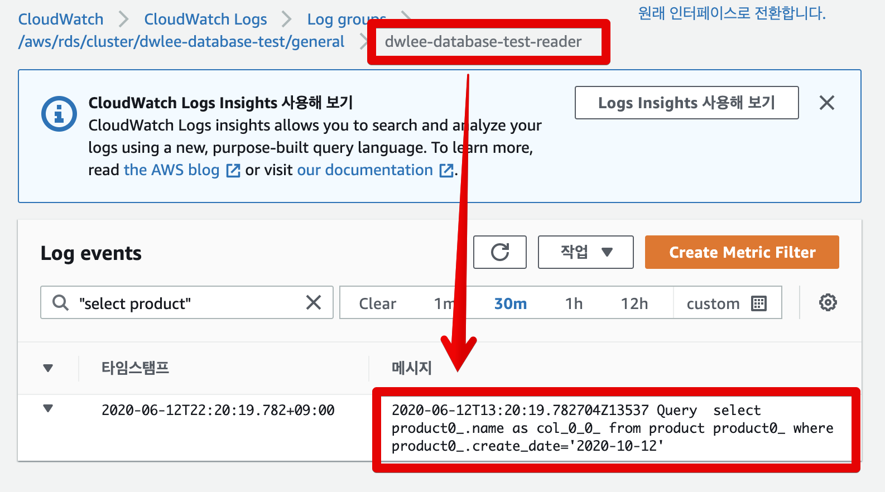

# Spring Batch Reader에서 Read DB 사용하기 (feat. AWS Aurora)

일반적으로 서비스가 커지게 되면 DB를 여러대로 늘리게 됩니다.  
이때 가장 첫 번째로 고려하는 방법이 Replication 입니다.  
즉, 1대의 마스터 DB와 여러대의 Slave DB를 두는 것이죠.  
  
데이터의 변경은 모두 마스터 DB에서만 이루어지고, SlaveDB들은 이 변경사항을 실시간으로 수신 받고, 성능 이슈가 심한 조회 요청에 대해서 처리합니다.  
(일반적인 웹 서비스에서는 조회와 등록/수정 비율이 80%:20% 정도입니다)  
  
위와 같은 전략에 대해서는 이미 많은 자료가 인터넷에 있으니 참고해보시면 됩니다.

> 신입 개발자분들은 [강대명님의 슬라이드](https://www.slideshare.net/charsyam2/webservice-scaling-for-newbie)를 꼭 참고하셔서 보편적인 웹 서비스 확장 전략에 대해서 꼭 인지하고 계셔야 합니다.

이번 글에서는 이렇게 Replication 상태에서 Spring Batch ItemReader 사용시 마스터 DB가 아닌 Reader DB (Replica 된 Slave DB) 를 조회하도록 하는 설정 방법입니다.  

## 1. AWS Aurora에서의 Read Only

AWS의 AuroraDB (MySQL)는 클러스터 모드로 사용할 수 있는데요.


Aurora를 클러스터 모드로 사용하게 되면 아래와 같이 Cluster Endpoint(DB접근을 위한 URL이라고 보시면 됩니다)와 Reader용 EndPoint를 모두 제공합니다.


> Cluster Endpoint는 FailOver 를 제공합니다.  
> 즉, 마스터 DB에 문제가 발생하면 Replica 인스턴스 중 하나를 마스터 DB로 선택합니다. 

일반적으로 Spring Boot 환경에서 Aurora를 사용할 경우 **트랜잭션이 ReadOnly인 경우** (```@Transactional(readOnly=true)```) Reader EndPoint로 요청이 가게 됩니다.  
  
즉, 아래와 같이 Service 혹은 Repoisotry에 ```readOnly``` 옵션을 주고 호출하면 Reader EndPoint로 요청이 간다는 것입니다.

```java
public interface ProductRepository extends JpaRepository <Product, Long> {

    @Transactional(readOnly = true)
    List<Product> findAllByCreateDateEquals(LocalDate createDate);
}
```

실제로 이를 테스트 코드로 구현해서 실행해보면?

```java
@ExtendWith(SpringExtension.class)
@SpringBootTest
@ActiveProfiles(profiles = "real")
public class RealRepositoryTest {

    @Autowired
    private ProductRepository productRepository;

    @AfterEach
    public void after() throws Exception {
        productRepository.deleteAllInBatch();
    }

    @Test
    void 트랜잭션_readOnly_테스트() throws Exception {
        //given
        LocalDate txDate = LocalDate.of(2020,10,12);
        String name = "a";
        int expected1 = 1000;
        int expected2 = 2000;
        productRepository.save(new Product(name, expected1, txDate));
        productRepository.save(new Product(name, expected2, txDate));

        //when
        productRepository.findAllByCreateDate(txDate);
        //then
    }
}
```

아래와 같이 Reader DB에서 쿼리가 실행된 것을 알 수 있습니다.



> 테스트를 위해서 Aurora의 general Log 옵션을 활성화 시켰습니다.  
> 일반적으로는 **general Log 옵션을 비활성화**시켜야 합니다.  
> 치명적인 성능 이슈가 발생합니다.

자 그럼 본격적으로 Spring Batch 환경에서 Aurora ReaderDb를 조회하는 구조로 변경하는 방법을 배워보겠습니다.

## 2. 


```java
spring:
  datasource:
    hikari:
      jdbc-url: jdbc:mysql:aurora://~~~ (1)
      username: ~~
      password: ~~
      driver-class-name: org.mariadb.jdbc.Driver (2)
```

현재까지는 아래와 같이 **mariadb 드라이버와 mysql url**을 사용할때만 Aurora가 정상적으로 페일오버 되는 것을 확인한 상태입니다.

(1) ```jdbc:mysql:aurora```

(2) ```org.mariadb.jdbc.Driver```


> [AWS ReInvent 영상](https://www.youtube.com/watch?time_continue=1667&v=duf5uUsW3TM&feature=emb_logo)을 보시면 Aurora 페일오버에 관해선 MariaDB Driver를 사용하기를 권장하고 있습니다.  
> 27분 40초부터 보시면 됩니다.  
> [mariadb 공식문서](https://mariadb.com/kb/en/failover-and-high-availability-with-mariadb-connector-j/#aurora-failover-implementation)도 함께 참고하시면 좋습니다.


```java
    public LocalContainerEntityManagerFactoryBean entityManagerFactory(DataSource dataSource) {

        return new EntityManagerFactoryBuilder(new HibernateJpaVendorAdapter(), jpaProperties.getProperties(), null)
                .dataSource(dataSource)
                .properties(hibernateProperties.determineHibernateProperties(jpaProperties.getProperties(), new HibernateSettings()))
                .persistenceUnit("master")
                .packages(PACKAGE)
                .build();
    }
```


## 3. 

```java
@Slf4j
@Configuration
public class ProductBackupConfiguration {
    public static final String JOB_NAME = "productBackupJob";

    private final JobBuilderFactory jobBuilderFactory;
    private final StepBuilderFactory stepBuilderFactory;
    private final EntityManagerFactory emf;
    private final EntityManagerFactory readerEmf;
    private final ProductBackupJobParameter jobParameter;

    public ProductBackupConfiguration(
            JobBuilderFactory jobBuilderFactory,
            StepBuilderFactory stepBuilderFactory,
            EntityManagerFactory emf,
            @Qualifier(READER_ENTITY_MANAGER_FACTORY) EntityManagerFactory readerEmf,
            ProductBackupJobParameter jobParameter) {

        this.jobBuilderFactory = jobBuilderFactory;
        this.stepBuilderFactory = stepBuilderFactory;
        this.emf = emf;
        this.readerEmf = readerEmf;
        this.jobParameter = jobParameter;
    }

    private int chunkSize;

    @Value("${chunkSize:1000}")
    public void setChunkSize(int chunkSize) {
        this.chunkSize = chunkSize;
    }

    @Bean
    @JobScope
    public ProductBackupJobParameter jobParameter() {
        return new ProductBackupJobParameter();
    }

    @Bean
    public Job job() {
        return jobBuilderFactory.get(JOB_NAME)
                .start(step())
                .build();
    }

    @Bean
    @JobScope
    public Step step() {
        return stepBuilderFactory.get("step")
                .<Product, ProductBackup>chunk(chunkSize)
                .reader(reader())
                .processor(processor())
                .writer(writer())
                .build();
    }

    @Bean
    @StepScope
    public JpaPagingItemReader<Product> reader() {
        String query = String.format("SELECT p FROM Product p WHERE p.createDate ='%s'", jobParameter.getTxDate());

        return new JpaPagingItemReaderBuilder<Product>()
                .entityManagerFactory(readerEmf)
                .queryString(query)
                .pageSize(chunkSize)
                .name("reader")
                .build();
    }

    private ItemProcessor<Product, ProductBackup> processor() {
        return ProductBackup::new;
    }

    @Bean
    public JpaItemWriter<ProductBackup> writer() {
        return new JpaItemWriterBuilder<ProductBackup>()
                .entityManagerFactory(emf)
                .build();
    }
}
```

```java
@Getter
@Slf4j
@NoArgsConstructor
public class ProductBackupJobParameter {
    private LocalDate txDate;

    @Value("#{jobParameters[txDate]}")
    public void setTxDate(String txDate) {
        this.txDate = parse(txDate, ofPattern("yyyy-MM-dd"));
    }
}
```

