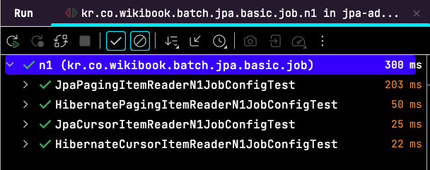
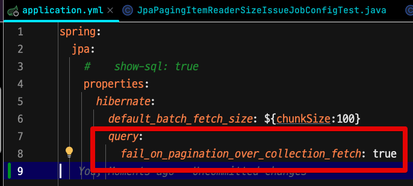
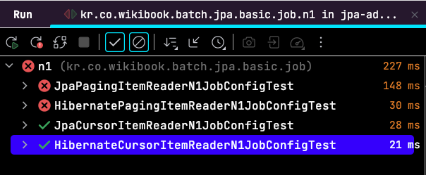

# PagingItemReader에서 FetchJoin 방지하기

Hibernate (Spring Data JPA) 를 사용하다보면 종종 `HHH000104: firstResult/maxResults specified with collection fetch; applying in memory!` 의 `WARN` (경고) 로그 메세지를 만난다.  
해당 로그는 **페이징 처리할때 여러 엔티티를 Fetch Join 을 하면 발생한다**.  

Fetch Join은 N+1 문제를 해결하는 가장 자주 사용되던 방식이다.  
하지만, 경고 메시지에서 언급했듯이 **페이징 처리시에 사용할 경우 페이징이 전혀 적용되지 않고, 조건에 해당하는 모든 데이터를 가져와 메모리에 올려두고 사용**한다.  
  
조건에 해당 하는 데이터 전체를 가져오기 때문에 당연히 성능 상 이슈가 되며, 이를 메모리에 올려두고 페이징을 처리하니 이중으로 성능에 큰 영향을 준다.  
  
이런 문제가 있지만, 개발자가 인지하기는 어렵다. 
Hibernate 특성상 일관성을 지향하기 때문에 정상적으로 페이징 처리된 것과 동일한 결과를 반환한다.  
그러다보니 **경고 메세지를 놓치고 테스트 코드가 통과하는 것만 확인하고 서비스를 배포** 하고 나서야 성능 이슈를 발견하게 된다.  
  
특히 **대량의 데이터를 처리하는 것을 전제하는 스프링 배치 환경에서**는 이런 문제점이 더 중요하다.  
  
그래서 Hibernate 5.2.13 버전부터 `fail_on_pagination_over_collection_fetch` 옵션을 지원하기 시작했다.

- [FAIL_ON_PAGINATION_OVER_COLLECTION_FETCH](https://docs.jboss.org/hibernate/orm/5.6/javadocs/org/hibernate/cfg/AvailableSettings.html#FAIL_ON_PAGINATION_OVER_COLLECTION_FETCH)

이번 글에서는 해당 옵션으로 어떻게 페이징 쿼리시 전체 데이터를 가져와 메모리에 적재하는 문제를 사전에 발견하고 해결할 수 있는지 확인해본다.

## 테스트 

위에서 언급한것 처럼 `fail_on_pagination_over_collection_fetch` 은 **컬렉션 데이터를 메모리 상에서 페이징으로 가져오려고 할때 에러를 발생**시킨다.  
기본값은 `false` 라서 application.properties 혹은 application.yml 에 `true` 을 설정하면 활성화 시킬 수 있다.

```yaml
spring.jpa.properties.hibernate.query.fail_on_pagination_over_collection_fetch=true
```

해당 옵션을 활성화시키면 어떻게 되는지, 총 4개의 Spring Batch ItemReader 를 위 옵션을 가지고 테스트를 진행해본다.

- JpaPagingItemReader
- JpaCursorItemReader
- HibernatePagingItemReader
- HibernateCursorItemReader

> API 로 테스트를 해봐도 무방하다.
> 여기서는 위 옵션이 더 확실하게 필요한 환경인 스프링 배치 를 기준으로 한다.

```java
@Bean(name = JOB_NAME + "_reader")
@StepScope
public JpaPagingItemReader<Teacher> reader() {
        return new JpaPagingItemReaderBuilder<Teacher>()
        .name(JOB_NAME + "_reader")
        .entityManagerFactory(entityManagerFactory)
        .queryString("SELECT distinct(t) FROM Teacher t JOIN FETCH t.students")
        .pageSize(chunkSize)
        .build();
}

@Bean(name = JOB_NAME +"_reader")
@StepScope
public JpaCursorItemReader<Teacher> reader() {
return new JpaCursorItemReaderBuilder<Teacher>()
        .name(JOB_NAME +"_reader")
        .entityManagerFactory(entityManagerFactory)
        .queryString("SELECT distinct(t) FROM Teacher t JOIN FETCH t.students")
        .build();
}

@Bean(name = JOB_NAME + "_reader")
@StepScope
public HibernatePagingItemReader<Teacher> reader() {
return new HibernatePagingItemReaderBuilder<Teacher>()
        .name(JOB_NAME + "_reader")
        .sessionFactory(entityManagerFactory.unwrap(SessionFactory.class))
        .queryString("SELECT distinct(t) FROM Teacher t JOIN FETCH t.students")
        .fetchSize(chunkSize)
        .pageSize(chunkSize)
        .useStatelessSession(false)
        .build();
}

@Bean(name = JOB_NAME +"_reader")
@StepScope
public HibernateCursorItemReader<Teacher> reader() {
return new HibernateCursorItemReaderBuilder<Teacher>()
        .sessionFactory(sessionFactory)
        .queryString("SELECT distinct(t) FROM Teacher t JOIN FETCH t.students")
        .name(JOB_NAME +"_reader")
        .fetchSize(chunkSize)
        .useStatelessSession(false)
        .build();
}
```

위 4개의 ItemReader에 대한 테스트 코드를 작성해서 각각 수행해본다.

```java
@ExtendWith(SpringExtension.class)
@SpringBatchTest
@SpringBootTest(classes = {JpaPagingItemReaderN1JobConfig.class, TestBatchConfig.class})
class JpaPagingItemReaderN1JobConfigTest {

    @Autowired
    private JobLauncherTestUtils jobLauncherTestUtils;

    @Autowired
    private TeacherRepository teacherRepository;

    @Autowired
    private StudentRepository studentRepository;

    @BeforeEach
    void setup() {
        studentRepository.deleteAllInBatch();
        teacherRepository.deleteAllInBatch();
    }

    @Test
    void test_jpa_paging() throws Exception {
        //given
        for (long i = 1; i <= 10; i++) {
            String teacherName = i + "선생님";
            Teacher teacher = new Teacher(teacherName, "수학");
            teacher.addStudent(new Student(teacherName + "의 학생1"));
            teacher.addStudent(new Student(teacherName + "의 학생2"));
            teacherRepository.save(teacher);
        }

        JobParameters jobParameters = jobLauncherTestUtils.getUniqueJobParametersBuilder() // (2)
                .toJobParameters();
        //when
        JobExecution jobExecution = jobLauncherTestUtils.launchJob(jobParameters);

        //then
        assertThat(jobExecution.getStatus()).isEqualTo(BatchStatus.COMPLETED);
    }
}
```

(위에서 사용한 Job만 다르게해서 4개를 만든다.)  

기본값으로 전체 테스트를 수행해보면 다음과 같이 **모든 ItemReader가 오류 없이 정상적으로 실행**되는 결과가 나온다.



이제 `fail_on_pagination_over_collection_fetch` 설정을 추가해본뒤



다시 테스트를 수행해보면, **Hibernate의 Paging ItemReader들은 모두 실패**하는 것을 확인할 수 있다.



- JpaPagingItemReader
- HibernatePagingItemReader

이들의 로그를 보면 다음과 같다.

```java
javax.persistence.PersistenceException: org.hibernate.HibernateException: firstResult/maxResults specified with collection fetch. In memory pagination was about to be applied. Failing because 'Fail on pagination over collection fetch' is enabled.
```

즉, 페이징 쿼리가 발생하는 2개의 ItemReader (JpaPagingItemReader, HibernatePagingItemReader) 들은 `Fail on pagination over collection fetch` 옵션의 활성화로 쿼리가 실패하여 In memory pagination 이 사전에 실행되지 않도록 검증할 수 있게 되었다.
## 마무리

Hibernate를 활용한 API 구현에서는 소량의 데이터만 활용할 여지가 있기 때문에 위 옵션을 강제화할 수는 없다.  

다만, 대량의 데이터를 처리하는 것을 목적으로하는 스프링 배치 환경에서는 메모리에서 모든 데이터를 처리하는 방식은 무조건 지양해야한다.  

> 개인적으로는 API, Batch 관계 없이 항상 활성화 시켜서 테스트 단계에서 사전 검출하는 방식을 선호한다.

  
그 전까지는 경고 로그를 눈으로 확인해야만 알 수 있던 개발자의 실수를 `fail_on_pagination_over_collection_fetch` 옵션을 통해 테스트 단계에서 바로 확인할 수 있게 되었다.  
  
위 옵션을 통해 성능 이슈가 될 만한 부분을 사전에 확인할 수 있도록 하자.

