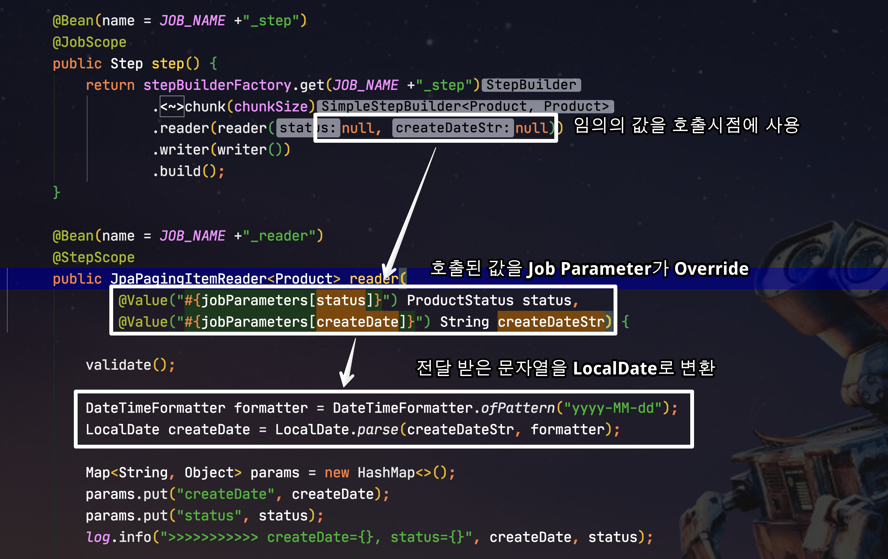
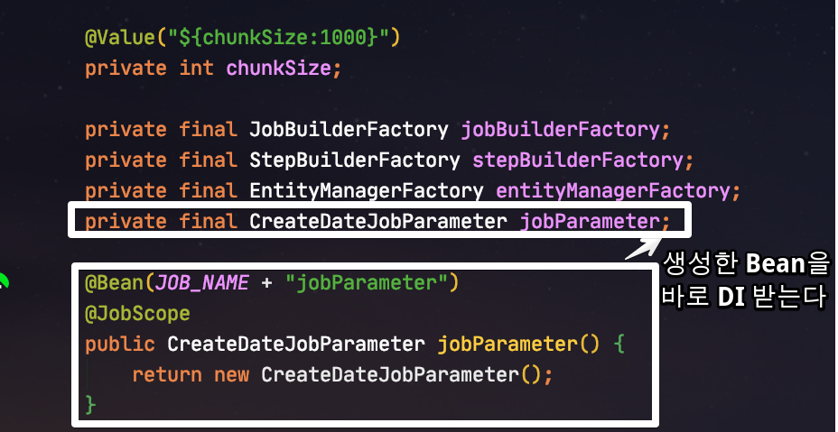
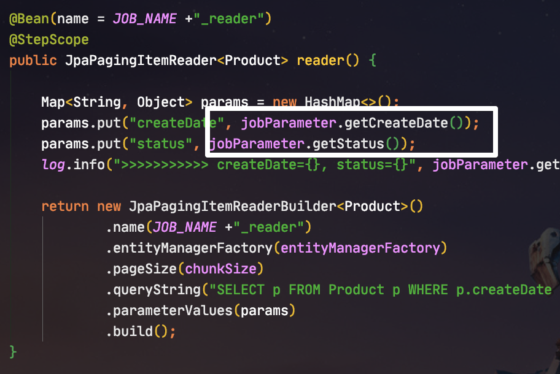
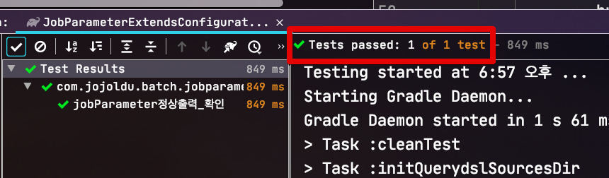
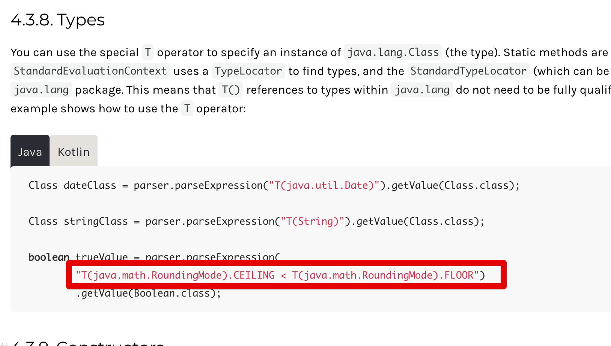

# Spring Batch의 JobParameter 활용 방법

Spring Batch에서는 Spring Environment Variables (환경 변수) 외에 Batch에서만 사용할 수 있는 JobParameter를 지원합니다.  

> [Spring Batch Scope와 Job Parameter](https://jojoldu.tistory.com/330)

기존에 사용하던 방식으로는 불편한 점이나 단점이 많아 이를 어떻게 해결하면 좋을지에 대해 정리하게 되었습니다.  
  
기존에 사용하던 방식은 무엇인지,  
해당 방식에 어떤 단점이 있는지,  
개선할 수 있는 방법은 무엇인지 등등을 정리해보았으니 Job Parameter를 사용하면서 불편하셨던 분들은 참고하시면 좋을것 같습니다.
  

> 기본적인 내용은 아래 호돌맨님의 블로그 글을 참고하시면 더욱 좋습니다.  
> [호돌맨 - SpringBoot Batch에서 JobParameter로 받을 수 있는 Type](https://hodolman.tistory.com/17)


> 모든 코드는 [Github](https://github.com/jojoldu/spring-batch-in-action/tree/master/src/main/java/com/jojoldu/spring/springbatchinaction/jobparameter)에 있습니다.

## 1. 기존 방식

Spring Batch에서 Job Parameter를 사용하기 위해서는 일반적으로 다음과 같이 코드를 작성합니다.



```java
@Bean(name = JOB_NAME +"_step")
@JobScope
public Step step() {
    return stepBuilderFactory.get(JOB_NAME +"_step")
            .<Product, Product>chunk(chunkSize)
            .reader(reader(null, null)) // (1)
            .writer(writer())
            .build();
}

@Bean(name = JOB_NAME +"_reader")
@StepScope
public JpaPagingItemReader<Product> reader(
        @Value("#{jobParameters[status]}") ProductStatus status,
        @Value("#{jobParameters[createDate]}") String createDateStr) { // (2)
        
    DateTimeFormatter formatter = DateTimeFormatter.ofPattern("yyyy-MM-dd"); 
    LocalDate createDate = LocalDate.parse(createDateStr, formatter); // (3)

    Map<String, Object> params = new HashMap<>();
    params.put("createDate", createDate);
    params.put("status", status);
    log.info(">>>>>>>>>>> createDate={}, status={}", createDate, status);

    return new JpaPagingItemReaderBuilder<Product>()
            .name(JOB_NAME +"_reader")
            .entityManagerFactory(entityManagerFactory)
            .pageSize(chunkSize)
            .queryString("SELECT p FROM Product p WHERE p.createDate =:createDate AND p.status =:status")
            .parameterValues(params)
            .build();
}
```

(1) ```reader(null, null)```

* Reader에서 Job Parameter를 사용하기 위해 Reader를 호출하는 Step에서는 ```null``` 이라는 임시값을 강제로 등록

(2) ```@Value("#{jobParameters[createDate]}") String createDateStr```

* 실제 Reader에서는 ```null``` 이 넘어와도 ```@Value("#{jobParameters[createDate]}")``` 로 인해 JobParameter 값으로 교체되어 사용
* Spring Batch JobParameter는 LocalDate를 지원하지 않으니, 일단 문자열로 받아서 ```LocalDate```로 변환한다

(3) ```LocalDate.parse(createDateStr, formatter);```

* 문자열로 받은 값을 ```LocalDate```로 변환한다

이 과정의 문제점은 뭐가 있을까요?  

* 형변환 (```LocalDate```) 된 Parameter 값을 재사용할 수가 없습니다.
    * 결국은 Reader/Processor/Writer 생성 메소드 혹은 별도 클래스 에서 각자 형변환을 해야만 합니다.
* Job Parameter 확장성이 떨어집니다.
    * 위 문제와 이어지는 것인데, 예를 들어 ```2020.03```으로 파라미터가 넘어오면 Reader에서 ```2020.03.01``` 과 ```2020.03.31```로 2개의 값으로 분리되서 필요하다면 어떻게 해야할까요?
    * 결국 Reader에서 파라미터를 받아 본인이 원하는 형태로 분리하는 로직도 함께 갖고 있어야만 합니다.
    * Reader 가 해야할 일은 **기간별 조회** 기능 + **월로 넘어온 값을 시작일/종료일로 분리하기**라는 2가지 기능을 같이 해야만 하는 경우가 생기는 것이죠.
     
위 문제들의 해결책은 무엇일까요?  
**JobParameter에 관한 모든 기능을 담당할** Job Parameter 클래스가 있으면 됩니다.  
그리고 해당 Class는 DI를 받을 수 있게 Spring Bean (```@JobScope```를 가진) 이면 별도의 Reader/Processor/Writer에서도 쉽게 DI 받을 수 있겠죠?  
  
자 그래서 Job Parameter를 담고 있는 별도의 클래스를 다루는 방법들을 소개하겠습니다.

## 2. JobParameter 클래스

JobParameter를 담을 클래스에서 실제 JobParameter값을 주입 받는 방법에는 **Setter / Constructor / Field** 3가지가 있습니다.  

### 2-1. Setter 로 주입 받기

JobParameter라고 해서 기존의 다른 Spring Bean처럼 사용 못하는 것은 아닙니다.  
  
위 배치 코드에서 사용하는 JobParameter를 클래스로 뽑아내면 다음과 같이 사용할 수 있습니다.  
  

```java
@Slf4j
@Getter
@NoArgsConstructor
public class CreateDateJobParameter {

    @Value("#{jobParameters[status]}") // (1)
    private ProductStatus status;
    
    private LocalDate createDate;

    @Value("#{jobParameters[createDate]}") // (2)
    public void setCreateDate(String createDate) {
       this.createDate = LocalDate.parse(createDate, DateTimeFormatter.ofPattern("yyyy-MM-dd"));
   }
}
```

(1) ```@Value("#{jobParameters[status]}")```

* Enum, Long, String의 타입은 직접 필드로 받아도 형변환이 가능합니다.
* 그래서 개별 setter를 사용하지 않고 직접 주입받는것이 가능하다는 것을 보여드리기 위해 필드로 받도록 하였습니다.
* 일관성을 유지하거나, **Spring 없는 테스트를 위하신다면** ```status```도 Setter로 받으시면 됩니다.

(2) ```@Value("#{jobParameters[createDate]}")```

* ```LocalDate```와 같이 자동 형변환이 안되는 경우엔 **Setter**에 ```@Value```를 사용하여 **문자열**로 받은 후, ```LocalDate```로 형변환 합니다.

이렇게 만들어진 클래스는 Job 클래스에서 아래와 같이 ```@JobScope```를 가진 Bean으로 등록하여 사용합니다.





```java
@Slf4j
@RequiredArgsConstructor
@Configuration
public class JobParameterExtendsConfiguration {
    
    ...
    private final CreateDateJobParameter jobParameter; // (1)
    ...
    
    @Bean(JOB_NAME + "jobParameter")
    @JobScope // (2)
    public CreateDateJobParameter jobParameter() {
        return new CreateDateJobParameter();
    }
    
    @Bean(name = JOB_NAME +"_step")
    @JobScope
    public Step step() {
        return stepBuilderFactory.get(JOB_NAME +"_step")
                .<Product, Product>chunk(chunkSize)
                .reader(reader()) // (3)
                .writer(writer())
                .build();
    }
    
    @Bean(name = JOB_NAME +"_reader")
    @StepScope
    public JpaPagingItemReader<Product> reader() {
    
        Map<String, Object> params = new HashMap<>();
        params.put("createDate", jobParameter.getCreateDate()); // (4)
        params.put("status", jobParameter.getStatus());
        log.info(">>>>>>>>>>> createDate={}, status={}", jobParameter.getCreateDate(), jobParameter.getStatus());
    
        return new JpaPagingItemReaderBuilder<Product>()
                .name(JOB_NAME +"_reader")
                .entityManagerFactory(entityManagerFactory)
                .pageSize(chunkSize)
                .queryString("SELECT p FROM Product p WHERE p.createDate =:createDate AND p.status =:status")
                .parameterValues(params)
                .build();
    }
}

```

(1) ```private final CreateDateJobParameter jobParameter```

* JobParameter클래스를 Bean 주입 받도록 구성합니다.
* 롬복의 ```@RequiredArgsConstructor``` 는 ```private final```이 있을 경우 생성자 필드로 선언해줍니다.
* 이렇게 Job 클래스 내부 필드로 선언된 ```jobParameter``` 변수는 Job 클래스 코드 여러곳에서 편하게 사용할 수 있게 됩니다.

(2) ```@JobScope public CreateDateJobParameter jobParameter```

* JobParameter의 ```@Value```로 값을 받기 위해서는 ```@JobScope, @StepScope``` 가 꼭 필요합니다.
* 그래서 Bean이 생성되는 메소드 위에 해당 scope 어노테이션을 선언해줍니다.
* ```@Component```에도 scope 어노테이션을 사용할 수도 있습니다.
* 대신 이렇게 ```@Bean```으로 선언할 경우 Bean 생성에 대한 여러가지 옵션을 사용할 수 있다는 장점이 있어 저는 위 방식을 선호합니다.
  * ex) 해당 JobParameter 클래스가 다른 Job에서도 사용할 수 있기 때문에 **서로 다른 Bean name**을 구성할 수 있게 됩니다. 

(3) ```.reader(reader())```

* JobParameter 클래스를 내부 필드로 선언되어있으니 더이상 ```null```을 임시값으로 받을 필요가 없습니다.

(4) ```jobParameter.getCreateDate()```

* Job 클래스 내부에 있는 ```jobParameter``` 변수를 Reader 메소드에서도 바로 사용합니다.
* 형변환은 이미 JobParameter 생성 시점에 되어있으니 별도로 형변환을 사용할 필요가 없습니다.

자 그럼 위처럼 변경해도 배치 사용엔 문제가 없는지 테스트 코드로 검증해보겠습니다.

#### 테스트 코드


```java
@RunWith(SpringRunner.class)
@SpringBatchTest
@SpringBootTest(classes={JobParameterExtendsConfiguration.class, TestBatchConfig.class})
public class JobParameterExtendsConfigurationTest {

    @Autowired
    private ProductRepository productRepository;

    @Autowired
    private JobLauncherTestUtils jobLauncherTestUtils;

    @After
    public void tearDown() throws Exception {
        productRepository.deleteAll();
    }

    @Test
    public void jobParameter정상출력_확인() throws Exception{
        //given
        LocalDate createDate = LocalDate.of(2019,9,26);
        long price = 1000L;
        ProductStatus status = ProductStatus.APPROVE;
        productRepository.save(Product.builder()
                .price(price)
                .createDate(createDate)
                .status(status)
                .build());

        JobParameters jobParameters = new JobParametersBuilder()
                .addString("createDate", createDate.toString())
                .addString("status", status.name())
                .toJobParameters();
        //when
        JobExecution jobExecution = jobLauncherTestUtils.launchJob(jobParameters);

        //then
        assertThat(jobExecution.getStatus()).isEqualTo(BatchStatus.COMPLETED);
    }
}
```

위 테스트 코드를 실행해보면?



테스트가 성공하는 것을 확인할 수 있습니다.

Setter로 Spring Batch의 JobParameter를 주입 받아 원하는 형태로 형변환을 하고 잘 작동되는 것까지 확인해보았습니다.  
그럼 다른 방법들도 한번 확인해보겠습니다.

### 2-2. Constructor 로 주입 받기

두번째로 알아볼 방법은 Constructor (생성자) 로 주입받기 입니다.  
JobParameter 클래스는 아래와 같이 **Setter를 제거**하고, 생성자로 값을 주입 받으시면 됩니다.  

```java
@Slf4j
@Getter
public class CreateDateJobParameter {

    private LocalDate createDate;
    private ProductStatus status;
    
    public CreateDateJobParameter(String createDateStr, ProductStatus status) {
        this.createDate = LocalDate.parse(createDateStr, DateTimeFormatter.ofPattern("yyyy-MM-dd"));
        this.status = status;
    }
}
```

여기서 ```@Value```는 **JobParameter 클래스의 생성자를 호출하는 쪽**에서 사용합니다.  


```java
@Slf4j
@RequiredArgsConstructor
@Configuration
public class JobParameterExtendsConfiguration {
    ...
    private final CreateDateJobParameter jobParameter;
    
    @Bean(JOB_NAME + "jobParameter")
    @JobScope
    public CreateDateJobParameter jobParameter(@Value("#{jobParameters[createDate]}") String createDateStr, 
                                               @Value("#{jobParameters[status]}") ProductStatus status) {
        return new CreateDateJobParameter(createDateStr, status); // (1)
    }
    ...

    @Bean(name = JOB_NAME +"_reader")
    @StepScope
    public JpaPagingItemReader<Product> reader() {

        Map<String, Object> params = new HashMap<>();
        params.put("createDate", jobParameter.getCreateDate());
        params.put("status", jobParameter.getStatus());
        log.info(">>>>>>>>>>> createDate={}, status={}", jobParameter.getCreateDate(), jobParameter.getStatus());

        return new JpaPagingItemReaderBuilder<Product>()
                .name(JOB_NAME +"_reader")
                .entityManagerFactory(entityManagerFactory)
                .pageSize(chunkSize)
                .queryString("SELECT p FROM Product p WHERE p.createDate =:createDate AND p.status =:status")
                .parameterValues(params)
                .build();
    }
}
```

(1) ```new CreateDateJobParameter(createDateStr, status);```

* JobParameter 클래스를 생성하는 메소드에서 ```@Value``` 로 받고 이를 생성자 인자로 넘겨 줍니다.
* 이때는 받은 형태 그대로 (문자열) 넘겨주고, 이를 어떻게 변환할지는 **JobParameter 클래스가 결정**하도록 합니다.

나머지 코드는 Setter를 사용하는 방법과 다를게 없습니다.

* Job 클래스 필드로 생성된 JobParameter Bean을 받아
* Reader/Processor/Writer 등에선 편하게 해당 변수를 이용해 실행하면 됩니다. 

마찬가지로 이 형태 역시 테스트 코드를 실행해보면?


위 코드 역시 테스트가 잘 통과되는 것을 확인할 수 있습니다.

### 2-3. Field로 주입 받기

마지막 3번째 방법인 **Field** (필드)로 JobParameter 값을 주입 받는 방식을 알아보겠습니다.  
  
Spring의 ```@Value``` 어노테이션은 SpEL (Spring Expression Language) 을 지원합니다.  
SpEL에서는 여러가지 문법을 지원하는데요.  
그 중 ```T``` 코드를 이용하여 **지정된 클래스의 static Method**를 SpEL 내부에서 호출할 수가 있습니다.



[expressions-types](https://docs.spring.io/spring/docs/current/spring-framework-reference/core.html#expressions-types)

이를 이용하면 **필드에서 즉시 LocalDate.parse()를 호출**하도록 구성할 수 있습니다.

```java
@Slf4j
@Getter
@NoArgsConstructor
public class CreateDateJobParameter {

    @Value("#{ T(java.time.LocalDate).parse(jobParameters[createDate])}") // (1)
    private LocalDate createDate;

    @Value("#{jobParameters[status]}")
    private ProductStatus status;
}
```

(1) ```T(java.time.LocalDate).parse(jobParameters[createDate])```

* ```T(java.time.LocalDate)``` 의 static method인 ```parse```를 호출합니다.
* 이때 사용되는 클래스는 **패키지를 포함한 전체 경로**를 적어야만 합니다.
* 해당 호출의 인자값은 ```jobParameters[createDate]```이 됩니다.

이렇게 될 경우 실제 Java 메소드에서 ```LocalDate.parse()``` 를 호출한 것과 동일하게 작동합니다.  
  
다만 이 방식의 단점은 기본 포맷 외에 **별도의 포맷을 써야할 경우 코드양이 너무 비대**해지는 것이 있습니다.  
예를 들어 ```yyyyMMdd``` 로 JobParameter를 받아야 한다면 다음과 같이 SpEL을 작성해야 합니다.

```java
"#{ T(java.time.LocalDate).parse(jobParameters[createDate], T(java.time.format.DateTimeFormatter).ofPattern('yyyyMMdd'))}";
```

이런 경우라면 아래와 같이 별도의 Converter 클래스를 사용하기를 추천드립니다.

```java
@NoArgsConstructor(access = AccessLevel.PRIVATE) // (1)
public abstract class LocalDateConverter {
    private static final String LOCAL_DATE_PATTERN = "yyyyMMdd";

    public static LocalDate convert(String source) { // (2)
        return LocalDate.parse(source, DateTimeFormatter.ofPattern(LOCAL_DATE_PATTERN));
    }
}
```

(1) ```AccessLevel.PRIVATE```

* static method 만 모인 유틸 클래스이므로, 인스턴스 생성을 막기 위해 기본 생성자는 private scope를 가지도록 합니다.

(2) ```static LocalDate convert```

* SpEl의 ```T``` 문법을 사용하기 위해선 static method 가 되어야만 합니다.

이렇게 별도로 만든 Converter 클래스는 다음과 같이 호출해서 사용할 수 있습니다.

```java
@Slf4j
@Getter
@NoArgsConstructor
public class CreateDateJobParameter {

    @Value("#{ T(com.jojoldu.batch.example.jobparameter.LocalDateConverter).convert(jobParameters[createDate])}") // (1)
    private LocalDate createDate;

    @Value("#{jobParameters[status]}")
    private ProductStatus status;
}
```

(1) ```T(com.jojoldu.batch.example.jobparameter.LocalDateConverter).convert```

* 위에서 만든 유틸 클래스인 ```LocalDateConverter``` 의 전체 경로를 넣어 ```converte``` 메소드를 호출합니다.
* 이렇게 될 경우 이제 포맷이 변경되거나, 추가 연산이 필요할 경우 해당 Converter 클래스에서 모드 작업을 진행하면 됩니다.

## 3. 마무리

LocalDate와 같이 기본적으로 Spring Batch가 지원하지 않는 타입에 대해 좀 더 잘 관리할 수 있는 방법을 배워보았습니다.  
이 3가지 중에 팀 혹은 개인에 맞는 방법을 선택하시면 될 것 같습니다.  

> ps. 저 같은 경우엔 Setter 혹은 Constructor를 선호합니다.  
> 필드 인잭션의 경우 Spring Context가 없는 테스트 코드 작성시 JobParameter 값 변조가 어렵기도 하고 (물론 별도의 테스트용 생성자가 있으면 가능합니다.) SpEL 문법에 어색한 분들이 계실수 있기 때문입니다.
