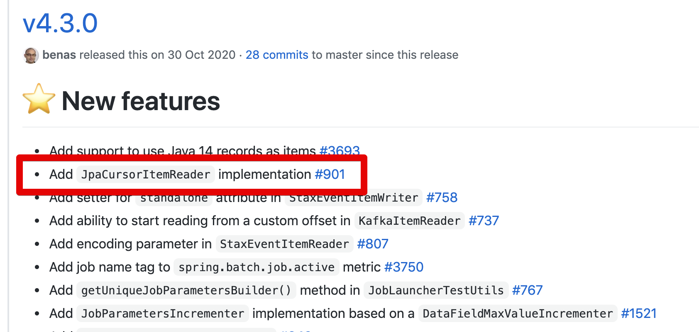

# Spring Batch JpaCursorItemReader 도입

Spring Batch 4.3이 릴리즈 되면서 JpaCursorItemReader 가 도입되었습니다.  



([Spring Batch 4.3 release notes](https://github.com/spring-projects/spring-batch/releases/tag/4.3.0))

그 전 버전까지 (~4.2.x)는 JpaCursorItemReader가 없었음을 의미하는데요.  
**HibernateCursorItemReader는 존재하는데**, 왜 JpaCursorItemReader는 여태 없었던 것이지? 라고 의문이 들 수 있습니다.  
  
이는 JPA 스펙 때문인데, JPA 2.1 전까지는 데이터 스트리밍이 가능한 스펙이 별도로 없었습니다.  

그래서 Hibernate의 상태 비저장 세션 (`StatelessSession`)과 유사한 개념이 JPA에는 없어서 Cursor 기능을 구현할 수 없었습니다. 

> 상태 비저장 세션 (`StatelessSession`) 은 **Hibernate에서만 지원하는 모드**로서 1차/2차 캐시가 없고 상태가 없는 세션 (Session) 모드를 이야기합니다.  
> 가장 Jdbc와 유사한 형태의 데이터 조회가 가능하여 일반적으로 데이터베이스에서 데이터를 스트리밍할때 주로 사용됩니다.

그러다 JPA 2.2부터 드디어 ```Query#getResultStream()``` 가 도입되어 이런 데이터 스트리밍이 가능하게 되었는데요.  
([Add ability to stream the result of a query execution](https://github.com/eclipse-ee4j/jpa-api/issues/99))  
  
JPA 2.2 스펙 도입이 예전에 되었지만, 스프링 배치에서는 이제서야 이 부분을 적용하게 되어 드디어 스프링 배치 4.3부터 Jpa에도 CursorItemReader가 도입되게 되었습니다.

## 예제

```java
@Slf4j // log 사용을 위한 lombok 어노테이션
@RequiredArgsConstructor // 생성자 DI를 위한 lombok 어노테이션
@Configuration
public class JpaCursorItemReaderJobConfig {
    private final JobBuilderFactory jobBuilderFactory;
    private final StepBuilderFactory stepBuilderFactory;
    private final EntityManagerFactory entityManagerFactory;

    private int chunkSize;
    @Value("${chunkSize:100}")
    public void setChunkSize(int chunkSize) {
        this.chunkSize = chunkSize;
    }

    @Bean
    public Job jpaCursorItemReaderJob() {
        return jobBuilderFactory.get("jpaCursorItemReaderJob")
                .start(jpaCursorItemReaderStep())
                .build();
    }

    @Bean
    public Step jpaCursorItemReaderStep() {
        return stepBuilderFactory.get("jpaCursorItemReaderStep")
                .<Pay, Pay>chunk(chunkSize)
                .reader(jpaCursorItemReader())
                .writer(jpaCursorItemWriter())
                .build();
    }

    @Bean
    public JpaCursorItemReader<Pay> jpaCursorItemReader() {
        return new JpaCursorItemReaderBuilder<Pay>()
                .name("jpaCursorItemReader")
                .entityManagerFactory(entityManagerFactory)
                .queryString("SELECT p FROM Pay p")
                .maxItemCount(5)
                .currentItemCount(2)
                .saveState(true)
                .build();
    }

    private ItemWriter<Pay> jpaCursorItemWriter() {
        return list -> {
            for (Pay pay: list) {
                log.info("Current Pay={}", pay);
            }
        };
    }
}
```

|속성                   |소개           |기본값             |
|----------------------|-------------|-------------------|
| name                 | 실행 컨텍스트 (ExecutionContext) 내에서 구분하기 위한 Key. <br/>`saveState` 가 `true` 로 설정된 경우 필수|                   
| entityManagerFactory | JPA를 사용하기 위한 EntityManagerFactory |        |           
| queryString          | 사용할 JPQL 쿼리문            |                   |
| maxItemCount         | 조회할 최대 item 수             | Integer.MAX_VALUE |
| currentItemCount     | 조회 Item의 시작지점            | 0                 |
| saveState            | 동일 Job 재실행시 실행 컨텍스트 내에서 ItemStream Support의 상태를 유지할지 여부  | true |

```bash
Current Pay=Pay(id=1, amount=0, txName=0, txDateTime=2021-01-24T19:36:33.690)
Current Pay=Pay(id=2, amount=1000, txName=1, txDateTime=2021-01-24T19:36:33.735)
Current Pay=Pay(id=3, amount=2000, txName=2, txDateTime=2021-01-24T19:36:33.736)
Current Pay=Pay(id=4, amount=3000, txName=3, txDateTime=2021-01-24T19:36:33.737)
Current Pay=Pay(id=5, amount=4000, txName=4, txDateTime=2021-01-24T19:36:33.738)
Current Pay=Pay(id=6, amount=5000, txName=5, txDateTime=2021-01-24T19:36:33.739)
Current Pay=Pay(id=7, amount=6000, txName=6, txDateTime=2021-01-24T19:36:33.740)
Current Pay=Pay(id=8, amount=7000, txName=7, txDateTime=2021-01-24T19:36:33.740)
Current Pay=Pay(id=9, amount=8000, txName=8, txDateTime=2021-01-24T19:36:33.741)
Current Pay=Pay(id=10, amount=9000, txName=9, txDateTime=2021-01-24T19:36:33.742)
```

* `.maxItemCount(5)`

```bash
Current Pay=Pay(id=1, amount=0, txName=0, txDateTime=2021-01-24T19:38:39.569)
Current Pay=Pay(id=2, amount=1000, txName=1, txDateTime=2021-01-24T19:38:39.616)
Current Pay=Pay(id=3, amount=2000, txName=2, txDateTime=2021-01-24T19:38:39.617)
Current Pay=Pay(id=4, amount=3000, txName=3, txDateTime=2021-01-24T19:38:39.618)
Current Pay=Pay(id=5, amount=4000, txName=4, txDateTime=2021-01-24T19:38:39.619)
```

* `.maxItemCount(5)`
* `.currentItemCount(2)`

```bash
Current Pay=Pay(id=3, amount=2000, txName=2, txDateTime=2021-01-24T19:35:28.344)
Current Pay=Pay(id=4, amount=3000, txName=3, txDateTime=2021-01-24T19:35:28.345)
Current Pay=Pay(id=5, amount=4000, txName=4, txDateTime=2021-01-24T19:35:28.346)
```

## 테스트 코드

