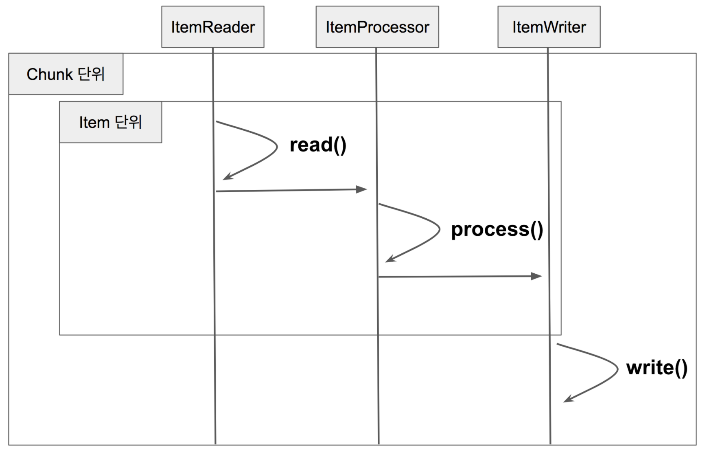

# Spring Batch와 QuerydslItemReader

현재 팀에서 공식적으로 JPA를 사용하고 있다보니 **복잡한 조회 쿼리**는 [Querydsl](http://www.querydsl.com/) 로 계속 처리해오고 있었습니다.  
하지만 Spring Batch 프레임워크에서 공식적으로 **QuerydslItemReader를 지원하지 않습니다**  
  
아래는 Spring Batch에서 공식적으로 지원하는 ItemReader들의 목록입니다.

| Reader                    |
|---------------------------|
| JdbcCursorItemReader      |
| JdbcPagingItemReader      |
| HibernateCursorItemReader |
| HibernatePagingItemReader |
| JpaPagingItemReader       |
| RepositoryItemReader      |

이외에도 [다양한 ItemReader](https://docs.spring.io/spring-batch/docs/current/reference/html/appendix.html#itemReadersAppendix)들을 지원하지만 **QuerydslItemReader는 지원하지 않습니다**.

> IbatisItemReader는 더이상 Spring Batch 에서 공식 지원하지 않습니다.  
> MyBatis 진영에서 직접 [MyBatisPagingItemReader](http://mybatis.org/spring/batch.html) 를 만들어서 지원하고는 있습니다.  
> 다만, 이 역시 Spring Batch의 공식지원은 아닙니다.

이러다보니 Spring Batch를 사용하기 위해서는 아래 방법들을 사용할 수 밖에 없었습니다.

* JpaPagingItemReader를 이용해 직접 JPQL를 작성
  * 결국 **JPQL은 문자열**이기 때문에 **자동완성, TypeSafe**를 지원받을 수가 없습니다.  
* RepositoryItemReader를 이용
  * 매번 배치 Job을 만들때마다 ```doPageRead()``` 등을 직접 구현해야 합니다.
  * 기존의 JpaPagingItemReader처럼 사용하기엔 사용성이 떨어졌습니다.

QuerydslItemReader가 필요하다는 생각이 강하게 들어 개발하게 되었습니다.  
  
이 글에서는 크게 2가지 주제로 다루게 됩니다.

* Querydsl**Paging**ItemReader
* Querydsl**NoOffset**PagingItemReader

> 주의: 이 글에서 나오는 코드는 직접 사내에서 사용중이지만, **고려하지 못한 케이스가 있을 수 있습니다**.  
> 직접 코드를 보시고, **충분히 테스트를 거친 후에** 사용하시는걸 추천드립니다.

## 1. QuerydslPagingItemReader

기본적으로 스프링배치의 Chunk 지향 구조는 아래와 같습니다.



(출처: https://jojoldu.tistory.com/331)


```java
public class QuerydslPagingItemReader<T> extends AbstractPagingItemReader<T> {

    protected final Map<String, Object> jpaPropertyMap = new HashMap<>();
    protected EntityManagerFactory entityManagerFactory;
    protected EntityManager entityManager;
    protected Function<JPAQueryFactory, JPAQuery<T>> queryFunction;
    protected boolean transacted = true;//default value

    protected QuerydslPagingItemReader() {
        setName(ClassUtils.getShortName(QuerydslPagingItemReader.class));
    }

    public QuerydslPagingItemReader(EntityManagerFactory entityManagerFactory, int pageSize, Function<JPAQueryFactory, JPAQuery<T>> queryFunction) {
        this();
        this.entityManagerFactory = entityManagerFactory;
        this.queryFunction = queryFunction;
        setPageSize(pageSize);
    }

    public void setTransacted(boolean transacted) {
        this.transacted = transacted;
    }

    @Override
    protected void doOpen() throws Exception {
        super.doOpen();

        entityManager = entityManagerFactory.createEntityManager(jpaPropertyMap);
        if (entityManager == null) {
            throw new DataAccessResourceFailureException("Unable to obtain an EntityManager");
        }
    }

    @Override
    @SuppressWarnings("unchecked")
    protected void doReadPage() {

        clearIfTransacted();

        JPAQuery<T> query = createQuery().offset(getPage() * getPageSize()).limit(getPageSize());

        initResults();

        fetchQuery(query);
    }

    protected void clearIfTransacted() {
        if (transacted) {
            entityManager.clear();
        }//end if
    }

    protected void initResults() {
        if (CollectionUtils.isEmpty(results)) {
            results = new CopyOnWriteArrayList<T>();
        } else {
            results.clear();
        }
    }

    private JPAQuery<T> createQuery() {
        JPAQueryFactory queryFactory = new JPAQueryFactory(entityManager);
        return queryFunction.apply(queryFactory);
    }

    protected void fetchQuery(JPAQuery<T> query) {
        if (!transacted) {
            List<T> queryResult = query.fetch();
            for (T entity : queryResult) {
                entityManager.detach(entity);
                results.add(entity);
            }//end if
        } else {
            results.addAll(query.fetch());
        }//end if
    }

    @Override
    protected void doJumpToPage(int itemIndex) {
    }

    @Override
    protected void doClose() throws Exception {
        entityManager.close();
        super.doClose();
    }
}
```
## 2. QuerydslNoOffsetPagingItemReader

이 글을 읽고 계신 많은 분들이 이미 아시겠지만, MySQL (팀 내에서 공식적으로 사용중) 은 특성상 페이징이 뒤로 갈수록 느려집니다.  
즉, 아래와 같은 형태의 쿼리는 offset 값이 커질수록 느리다는 의미입니다.

```sql
SELECT  *
FROM  items
WHERE  조건문
ORDER BY id DESC
OFFSET 페이지번호 LIMIT 페이지사이즈
```

위 쿼리는 일반적으로 **Batch에서 Reader 가 수행하는 쿼리와 유사한 형태**입니다.  

이 문제를 해결하기 위해서는 2가지 해결책이 있다.


### 1) 서브쿼리 + Join 으로 해결하기

참고: https://elky84.github.io/2018/10/05/mysql/

```sql
SELECT  *
FROM  items as i
JOIN (SELECT id
        FROM items
        WHERE messy_filtering
        ORDER BY id DESC
        OFFSET  $M  LIMIT $N) as temp on temp.id = i.id
```

### 2) offset을 제거한 페이징쿼리 사용하기

참고: http://mysql.rjweb.org/doc.php/pagination

```sql
SELECT  *
FROM  items
WHERE  messy_filtering AND id < 마지막조회ID
ORDER BY id DESC
LIMIT $N
```

여기서 1번을 사용할 순 없다.

**JPQL 에서는 from절의 서브쿼리를 지원하지 않기 때문**이다.

그래서 2번의 방식으로 해결한다.

2번은 RepositoryItemReader를 사용하기 보다는 (이러면 매번 사용하는 사람이 BatchItemReader를 직접 구현해야한다)

QuerydslPagingItemReader와 마찬가지로 NoOffsetReader를 만들어 이를 사용하게 할 계획이다.

```java
public class QuerydslNoOffsetPagingItemReader<T extends BaseEntityId> extends AbstractPagingItemReader <T>  {

    private final Map<String, Object> jpaPropertyMap = new HashMap<>();
    private EntityManagerFactory entityManagerFactory;
    private EntityManager entityManager;
    private Function<JPAQueryFactory, JPAQuery<T>> queryFunction;
    private boolean transacted = true;//default value
    private Object lock = new Object();
    private volatile int current = 0;
    private volatile int page = 0;
    private long currentId = 0;
    private QuerydslNoOffsetOptions options;

    private QuerydslNoOffsetPagingItemReader() {
        setName(ClassUtils.getShortName(QuerydslNoOffsetPagingItemReader.class));
    }

    public QuerydslNoOffsetPagingItemReader(EntityManagerFactory entityManagerFactory, int pageSize, QuerydslNoOffsetOptions options, Function<JPAQueryFactory, JPAQuery<T>> queryFunction) {
        this();
        this.entityManagerFactory = entityManagerFactory;
        this.queryFunction = queryFunction;
        this.options = options;
        setPageSize(pageSize);
    }

    public void setTransacted(boolean transacted) {
        this.transacted = transacted;
    }

    @Override
    protected void doOpen() throws Exception {
        super.doOpen();

        entityManager = entityManagerFactory.createEntityManager(jpaPropertyMap);
        if (entityManager == null) {
            throw new DataAccessResourceFailureException("Unable to obtain an EntityManager");
        }
    }

    @Override
    protected T doRead() throws Exception {

        synchronized (lock) {

            if (results == null || current >= getPageSize()) {
                if (logger.isDebugEnabled()) {
                    logger.debug("Reading page=" + page + ", currentId=" + currentId);
                }

                doReadPage();
                page++;
                if (current >= getPageSize()) {
                    current = 0;
                }
            }

            return readItem();
        }
    }

    @Override
    @SuppressWarnings("unchecked")
    protected void doReadPage() {

        if (transacted) {
            entityManager.clear();
        }//end if

        JPAQuery<T> query = createQuery().limit(getPageSize());

        if (CollectionUtils.isEmpty(results)) {
            results = new CopyOnWriteArrayList<T>();
        } else {
            results.clear();
        }

        if (!transacted) {
            List<T> queryResult = query.fetch();
            for (T entity : queryResult) {
                entityManager.detach(entity);
                results.add(entity);
            }
        } else {
            results.addAll(query.fetch());
        }

        resetCurrentId();
    }

    private JPAQuery<T> createQuery() {
        JPAQueryFactory queryFactory = new JPAQueryFactory(entityManager);

        return queryFunction.apply(queryFactory)
                .where(options.whereExpression(currentId, page))
                .orderBy(options.orderExpression());
    }

    private T readItem() {
        int next = current++;
        if (next < results.size()) {
            return results.get(next);
        }
        else {
            return null;
        }
    }

    private void resetCurrentId() {
        if(results.size() > 0) {
            currentId = results.get(results.size()-1).getId();
        }
    }

    @Override
    protected void doJumpToPage(int itemIndex) {
    }

    @Override
    protected void doClose() throws Exception {
        entityManager.close();
        super.doClose();
    }
}
```

## 참고

* [http://mysql.rjweb.org/doc.php/pagination](http://mysql.rjweb.org/doc.php/pagination)