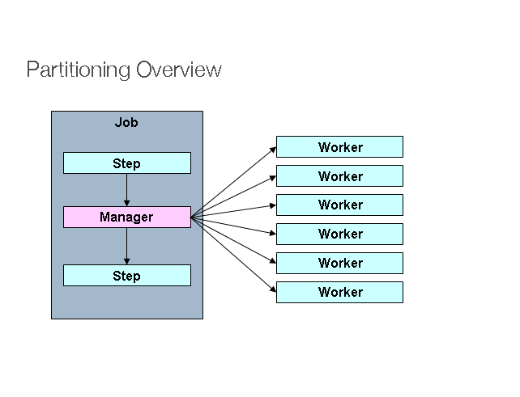
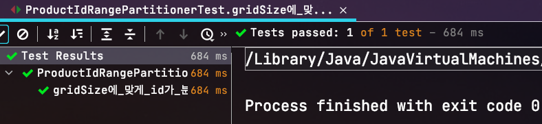

# Spring Batch 파티셔닝 (Partitioning) 활용하기

지난 시간에 소개 드린 [멀티쓰레드 Step](https://jojoldu.tistory.com/493)과 더불어 파티셔닝 (Partitioning)은 Spring Batch의 대표적인 Scalling 기능입니다.  
  
서비스에 적재된 데이터가 적을 경우에는 Spring Batch의 기본 기능들만 사용해도 큰 문제가 없으나, 일정 규모 이상이 되면 (ex: 매일 수백만 row가 추가되는 상황에서의 일일 집계) 서버를 Scalling (Up or Out) 하듯이 배치 애플리케이션 역시 확장이 필요합니다.  
  
이런 문제를 고려해서 Spring Batch 에서는 여러 Scalling 기능들을 지원하는데요.  
대표적으로 다음과 같습니다.

* [Multi-threaded Step](https://jojoldu.tistory.com/493) (Single process / Local)
  * **단일 Step**을 수행할 때, 해당 Step 내의 **각 Chunk를 별도의 여러 쓰레드에서 실행** 하는 방법
* Parallel Steps (Single Process / Local)
  * **여러개의 Step**을 **병렬**로 실행하는 방법
  * **단일 Step의 성능 향상은 없음**
* Remote Chunking (Multi process / Remote)
  * 일종의 분산환경처럼 Step 처리가 여러 프로세스로 분할되어 외부의 다른 서버로 전송되어 처리하는 방식
    * ex) A서버에서 ItemReader 구현체를 사용하여 데이터를 읽고, B 서버에서 ItemWriter 구현체를 갖고 있어 A 서버에서 보낸 데이터를 저장하는 등
  * 다만, **어느 서버에서 어느 데이터를 처리하고 있는지 메타 데이터 관리를 하지 않기 때문에** 메세지 유실이 안되는 것이 100% 보장되어야 한다 (ex: AWS SQS, 카프카 등의 메세지큐 사용을 권장)
* 파티셔닝 (Partitioning) (Single or Multi process / Local or Remote)
  * 매니저 (마스터)를 이용해 데이터를 더 작은 Chunk (파티션이라고 함)로 나눈 다음 파티션에서 슬레이브가 독립적으로 작동하는 방식 (이번 시간에 해볼 것)
  * 슬레이브가 로컬과 원격을 모두 지원하여 확장된 JVM 환경에서의 실행을 해볼 수 있음
    * 원격 슬레이브와 통신하기 위해 다양한 통신 메커니즘을 지원
* ```AsyncItemProcessor```/```AsyncItemWriter```
  * 별개의 쓰레드를 통해 ItemProcessor와 ItemWriter를 처리하는 방식
  * ```spring-batch-integration``` 의존성에서 지원
  * 주의) AsyncItemProcessor 및 AsyncItemWriter 는 함께 사용해야 함 
    * 그렇지 않으면 AsyncItemProcessor에서 전달한 ```Future``` 객체를 본인이 직접 다뤄야 함

이번 시간에는 이 중 하나인 파티셔닝 (Partitioning)에 대해서 다뤄볼 예정입니다.  
  
아마 여기까지 이 글을 보신 분들은 다음과 같은 생각을 할 수도 있습니다.  

"```completablefuture``` 나 ```@Async```를 이용하여 성능을 올릴수 있지 않나?"  
  
저희가 [멀티쓰레드 Step](https://jojoldu.tistory.com/493) 나 파티셔닝 (Partitioning)와 같은 Spring Batch의 Scalling 기능을 사용하는 이유는, **기존의 코드 변경 없이** 성능을 향상 시키기 위함입니다.  
  
위에서 언급한대로 ```completablefuture``` 나 ```@Async``` 를 기존 Spring Batch에 사용하기 위해서는 일정 부분 혹은 아주 많은 부분의 코드 변경이 필수인 반면, Spring Batch의 Scalling 기능들은 기존 코드 변경이 거의 없습니다.  
  
다양한 Scalling 기능을 **기존의 스프링 배치 코드 변경 없이**, 그리고 많은 레퍼런스로 인해 안정적으로 구현이 가능한 기능들이기 때문에 대량의 데이터 처리가 필요한 상황을 대비하여 숙지하고 있어야 한다고 봅니다.  
  
[[ad]]

## 1. 소개

파티셔닝은 매니저 (마스터) Step이 대량의 데이터 처리를 위해 지정된 수의 작업자 (Worker) Step으로 **일감을 분할 처리**하는 방식을 이야기 합니다.



(이미지 출처: [Spring Batch 공식문서](https://docs.spring.io/spring-batch/docs/current/reference/html/scalability.html#partitioning))

컨셉만 들었을 때는 이게 멀티쓰레드 Step과 무엇이 다른건지 궁금하실텐데요.  
  
* 멀티쓰레드 Step은 **단일 Step을 Chunk 단위**로 쓰레드를 생성해 분할 처리 하게 됩니다.
  * 어떤 쓰레드에서 어떤 데이터들을 처리하게 할지 세밀한 조정이 불가능합니다.
  * 또한, 해당 Step의 ItemReader/ItemWriter 등이 **멀티쓰레드 환경을 지원하는지** 유무가 굉장히 중요합니다.
* 반면 파티셔닝 (Partitioning)의 독립적인 Step (Worker Step)을 구성하고, 그에 따른 각각 별도의 StepExecution 파라미터 환경을 가지게 하여 처리 합니다.
  * (Local로 실행할 경우) 멀티쓰레드으로 작동하나, 멀티쓰레드 Step과는 별개로 ItemReader/ItemWriter의 **멀티쓰레드 환경 지원 여부가 중요하지 않습니다**

예를 들어 파티셔닝 (Partitioning) Step에서 백만 개의 데이터를 더 작은 파티션으로 나누어 각 파티션을 Worker Step들이 병렬로 처리합니다.  
  
각각의 Worker Step은 ItemReader / ItemProcessor / ItemWriter 등을 가지고 동작하는 완전한 Spring Batch Step이기 때문에 기존의 Spring Batch 코드 변경이 거의 없는 채로 병렬 실행 환경을 구성할 수 있습니다.  

[[ad]]

## 2. 주요 인터페이스 소개

### Partitioner

Partitioner 인터페이스는 파티셔닝된 Step (Worker Step)을 위한 Step Executions을 생성하는 인터페이스 입니다.  
  
기본 구현은 SimplePartitioner로, 빈 Step Executions를 생성합니다.  
  
인터페이스가 갖고 있는 메소드는 1개로 ```partition (int gridSize)``` 가 있는데요.  
  
해당 파라미터로 넘기는 ```gridSize```는 **몇 개의 StepExecution을 생성할지** 결정하는 설정값입니다.  

일반적으로는 StepExecution 당 1개의 Worker Step를 매핑하기 때문에 Worker Step의 수와 마찬가지로 보기도 합니다.  
  
Spring Batch에서 기본적으로 **1**로 두며, 이를 변경하기 위해서는 PartitionHandler 등을 통해서 변경 가능합니다.  
  
다만, 이렇게 ```gridSize```만 지정했다고 하여, Worker Step이 자동으로 구성되진 않습니다.  
  
해당 ```gridSize```를 이용하여 각 Worker Step마다 어떤 Step Executions 환경을 갖게 할지는 오로지 개발자들의 몫 입니다.  


### PartitionHandler

PartitionHandler 인터페이스는 매니저 (마스터) Step이 Worker Step를 어떻게 다룰지를 정의합니다.  
이를테면, 어느 Step을 Worker step의 코드로 두고 병렬로 실행하게할지, 병렬로 실행한다면 쓰레드풀 관리는 어떻게 할지, ```gridSize```는 몇으로 둘지 등등을 비롯하여 모든 작업이 완료되었는지를 식별하는지를 다룹니다.  
  
일반적으로는 Partitioner의 구현체는 개발자가 요구사항에 따라 별도 생성해서 사용하곤 하지만, 자신만의 PartitionHandler를 작성하지는 않을 것입니다.  
  
구현체로는 크게 2가지가 있습니다.

* TaskExecutorPartitionHandler
  * 단일 JVM 내에서 분할 개념을 사용할 수 있도록 같은 JVM 내에서 스레드로 분할 실행
* MessageChannelPartitionHandler
  * 원격의 JVM에 메타 데이터를 전송
  
## 3. 예제

보통의 예제는 **여러 파일을 파티션 단위로** 나눠서 읽어서 처리하는 방식를 소개하는데요.  

* [baeldung - Spring Batch using Partitioner](https://www.baeldung.com/spring-batch-partitioner)

이미 기존에 많이 나온 예제라서 이번 시간에는 **특정 기간의 DB 데이터를 파티션으로 나눠서 집계**하는 배치를 진행해보겠습니다.  

> 모든 코드는 [Github](https://github.com/jojoldu/spring-batch-in-action)에 있습니다.


### 3-1. 코드별 소개

전체 코드를 보기 전, 주요 인터페이스별 코드를 확인해보겠습니다.

#### partitionHandler

"2. 주요 인터페이스 소개" 에서 소개드린대로, PartitionHandler는 매니저 (마스터) Step이 Worker Step를 어떻게 다룰지를 정의합니다.

```java
@Bean(name = JOB_NAME+"_partitionHandler")
public TaskExecutorPartitionHandler partitionHandler() {
    TaskExecutorPartitionHandler partitionHandler = new TaskExecutorPartitionHandler(); // (1)
    partitionHandler.setStep(step1()); // (2)
    partitionHandler.setTaskExecutor(executor()); // (3)
    partitionHandler.setGridSize(poolSize); // (4)
    return partitionHandler;
}
```

(1) ```TaskExecutorPartitionHandler```

* 로컬 환경에서 멀티쓰레드로 수행할 수 있도록 TaskExecutorPartitionHandler 구현체를 사용합니다.

(2) ```setStep(step1())```

* **Worker로 실행할 Step**을 지정합니다.  
* Partitioner가 만들어준 StepExecutions 환경에서 개별적으로 실행됩니다.

(3) ```setTaskExecutor(executor())```

* 멀티쓰레드로 실행하기 위해 ```TaskExecutor``` 를 지정합니다.
* 해당 ```TaskExecutor``` 는 아래 상세 코드로 되어있습니다.

(4) ```setGridSize(poolSize)```

* 쓰레드 개수와 gridSize를 맞추기 위해서 poolSize를 gridSize로 등록합니다.
  * 이번 예제에서는 poolSize에 5를 등록할 예정입니다.

(3) 에서 사용할 ```TaskExecutor``` 는 다음과 같이 생성합니다.

```java
@Bean(name = JOB_NAME+"_taskPool")
public TaskExecutor executor() {
    ThreadPoolTaskExecutor executor = new ThreadPoolTaskExecutor();
    executor.setCorePoolSize(poolSize);
    executor.setMaxPoolSize(poolSize);
    executor.setThreadNamePrefix("partition-thread");
    executor.setWaitForTasksToCompleteOnShutdown(Boolean.TRUE);
    executor.initialize();
    return executor;
}
```

기본 예제로 ```SimpleAsyncTaskExecutor```를 사용할 수도 있겠지만, ```SimpleAsyncTaskExecutor```를 사용할 경우 **쓰레드를 계속해서 생성할 수 있기 때문에** 실제 운영 환경에서는 대형 장애를 발생시킬 수 있습니다.  
  
그래서 쓰레드풀 내에서 지정된 갯수만큼의 쓰레드만 생성할 수 있도록 ```ThreadPoolTaskExecutor```를 사용합니다.  

#### 매니저 (마스터) Step

마스터 Step은 **어떤 Step을 Worker로 지정하여 파티셔닝을 할 것인지**를 결정하고, 이때 사용할 ```PartitionHandler``` 를 등록합니다.  

```java
@Bean(name = JOB_NAME +"_step1Manager")
public Step step1Manager() {
    return stepBuilderFactory.get("step1.manager") // (1)
            .partitioner("step1", partitioner(null, null)) // (2)
            .step(step1()) // (3)
            .partitionHandler(partitionHandler()) // (4)
            .build();
}

...

@Bean(name = JOB_NAME +"_step")
public Step step1() {
    return stepBuilderFactory.get(JOB_NAME +"_step")
            .<Product, ProductBackup>chunk(chunkSize)
            .reader(reader(null, null))
            .processor(processor())
            .writer(writer(null, null))
            .build();
}
```

(1) ```stepBuilderFactory.get("step1.manager")```

* 1개의 Job에 여러 Step이 있을 수 있고, 여러 Step들이 각각의 파티셔닝이 될 수도 있으니 마스터 Step의 이름은 파티셔닝 대상 Step과 연관지어 짓습니다.
* 여기서는 ```step1``` Step의 매니저 Step이기 때문에 ```step1.manager```로 합니다.

(2) ```.partitioner("step1", partitioner(null, null))```

* step1에 사용될 ```Partitioner``` 구현체를 등록합니다.
* 예제에서는 같은 클래스내 ```partitioner``` 메소드를 통해서 생성되기 때문에 해당 메소드를 호출합니다.

(3) ```.step(step1())```

* 파티셔닝될 Step을 등록합니다.
* step1이 ```Partitioner``` 로직에 따라 **서로 다른 StepExecutions**를 가진 여러개로 생성됩니다. 

(4) ```.partitionHandler(partitionHandler())```

* 사용할 ```PartitionHandler``` 를 등록합니다.

[[ad]]

#### partitioner

Partitioner는 각 Worker Step들에게 어떤 Step Executions 변수를 가지게 할지를 결정하고, 그에 따라 생성할 Worker Step 수를 결정합니다.  
  
이번 예제의 경우 "특정 기간의 DB 데이터를 파티션으로 나눠서 집계" 가 주제인데, 여기서 Partitioner는 **특정 기간의 DB 데이터의 시작 PK값과 끝 PK값을 조회해 파티션별로 분할해서 할당**하는 일을 할 예정입니다.

> 일반적으로 [클러스터 Key인 PK값을 활용하면 조회 성능이 개선](https://jojoldu.tistory.com/476)됩니다.


```java
import com.jojoldu.batch.entity.product.ProductRepository;
import lombok.RequiredArgsConstructor;
import lombok.extern.slf4j.Slf4j;
import org.springframework.batch.core.partition.support.Partitioner;
import org.springframework.batch.item.ExecutionContext;

import java.time.LocalDate;
import java.util.HashMap;
import java.util.Map;

@Slf4j
@RequiredArgsConstructor
public class ProductIdRangePartitioner implements Partitioner {

    private final ProductRepository productRepository;
    private final LocalDate startDate;
    private final LocalDate endDate;

    @Override
    public Map<String, ExecutionContext> partition(int gridSize) {
        long min = productRepository.findMinId(startDate, endDate);
        long max = productRepository.findMaxId(startDate, endDate);
        long targetSize = (max - min) / gridSize + 1;

        Map<String, ExecutionContext> result = new HashMap<>();
        long number = 0;
        long start = min;
        long end = start + targetSize - 1;

        while (start <= max) {
            ExecutionContext value = new ExecutionContext();
            result.put("partition" + number, value);

            if (end >= max) {
                end = max;
            }

            value.putLong("minId", start); // 각 파티션마다 사용될 minId
            value.putLong("maxId", end); // 각 파티션마다 사용될 maxId
            start += targetSize;
            end += targetSize;
            number++;
        }

        return result;
    }
}
```

> 위 예제 코드는 **Spring Batch 공식 샘플 코드**인 [ColumnRangePartitioner.java](https://github.com/spring-projects/spring-batch/blob/d8fc58338d3b059b67b5f777adc132d2564d7402/spring-batch-samples/src/main/java/org/springframework/batch/sample/common/ColumnRangePartitioner.java)를 참고하여 만들었습니다.

로직 자체는 심플합니다.  
조회 대상인 Product의 Repository (```productRepository```)를 통해 **Job Parameter로 받은 시작일과 종료일**로 전체 조회 대상의 맨 첫 PK값과 맨 끝 PK값을 가져옵니다.  
  
그리고 이를 gridSize에 맞게 각 파티션 ExecutionContext으로 할당합니다.  
  
예를 들어 ```2021.1.12 ~ 2021.1.13``` 기간에 해당하는 Product의 PK가 1부터 10까지 있다면 ```partition(5)``` (gridSize=5)를 수행시 다음과 같은 결과가 리턴됩니다.

```java
partition0 (minId:1, maxId:2)
partition1 (minId:3, maxId:4)
partition2 (minId:5, maxId:6)
partition3 (minId:7, maxId:8)
partition4 (minId:9, maxId:10)
```

실제로 로직이 잘 작동하는지 테스트 코드로 검증해보겠습니다.  
  
**ProductIdRangePartitionerTest**

```java
import com.jojoldu.batch.entity.product.ProductRepository;
import org.junit.jupiter.api.Test;
import org.junit.jupiter.api.extension.ExtendWith;
import org.mockito.Mock;
import org.mockito.Mockito;
import org.mockito.junit.jupiter.MockitoExtension;
import org.springframework.batch.item.ExecutionContext;

import java.time.LocalDate;
import java.util.Map;

import static org.assertj.core.api.Assertions.assertThat;
import static org.mockito.ArgumentMatchers.any;


@ExtendWith(MockitoExtension.class)
public class ProductIdRangePartitionerTest {
    private static ProductIdRangePartitioner partitioner;

    @Mock
    private ProductRepository productRepository;

    @Test
    void gridSize에_맞게_id가_분할된다() throws Exception {
        //given
        Mockito.lenient()
                .when(productRepository.findMinId(any(LocalDate.class), any(LocalDate.class)))
                .thenReturn(1L); // (1)

        Mockito.lenient()
                .when(productRepository.findMaxId(any(LocalDate.class), any(LocalDate.class)))
                .thenReturn(10L); 

        partitioner = new ProductIdRangePartitioner(productRepository, LocalDate.of(2021,1,20), LocalDate.of(2021,1,21)); // (2)

        //when
        Map<String, ExecutionContext> executionContextMap = partitioner.partition(5); // (3)

        //then
        // (4)
        ExecutionContext partition1 = executionContextMap.get("partition0");
        assertThat(partition1.getLong("minId")).isEqualTo(1L); 
        assertThat(partition1.getLong("maxId")).isEqualTo(2L); 

        // (5)
        ExecutionContext partition5 = executionContextMap.get("partition4");
        assertThat(partition5.getLong("minId")).isEqualTo(9L);
        assertThat(partition5.getLong("maxId")).isEqualTo(10L);
    }
}
```

(1) ```Mockito ~ findMinId (findMaxId) ~ thenReturn```

* Mockito 라이브러리를 이용하여 ```ProductRepository```의 특정 메소드 (```findMinId```, ```findMaxId```) 호출시에 지정된 값들 (```1```, ```10```)이 반환되도록 설정합니다.
* 즉, 테스트가 실행되는 동안에는 ```ProductRepository```의 해당 메소드를 호출하면 항상 지정된 값들이 반환됩니다.

(2) ```new ProductIdRangePartitioner(productRepository, ...)```

* 테스트 대상인 ```ProductIdRangePartitioner``` 인스턴스를 생성합니다.
* (1)에서 Mockito로 생성한 ```ProductRepository``` 인스턴스도 주입시켜, 의도한 대로 테스트가 실행되도록 합니다.

(3) ```partitioner.partition(5)```

* ```ProductIdRangePartitioner```의 인스턴스인 ```partitioner```의 메소드를 gridSize(```5```)를 넣고 실행합니다.
* 반환된 ```executionContextMap``` 에는 ```"partition"+num``` 을 key로 하여 ```minId, maxId```가 Value로 들어가 있습니다.

(4) ```executionContextMap.get("partition0"); assertThat...```

* 첫번째 파티션에 등록된 ```minId, maxId```를 검증합니다.
* 예상한대로 결과가 나온다면 ```minId=1```, ```maxId=2```가 됩니다.

(5) ```executionContextMap.get("partition4"); assertThat...```

* 마지막 파티션에 등록된 ```minId, maxId```를 검증합니다.
* 예상한대로 결과가 나온다면 ```minId=9```, ```maxId=10```가 됩니다.

위 테스트 코드를 돌려보시면 아래와 같이 의도한대로 gridSize에 맞게 ```ExecutionContext```가 생성된 것을 확인할 수 있습니다.



이렇게 ```ProductIdRangePartitioner```를 통해 생성된 ```ExecutionContext```에 맞춰 Worker Step들이 생성되어 그들의 Step Executions이 됩니다.  
  
실제 스프링 배치 코드에서는 ```ProductIdRangePartitioner```를 다음과 같이 빈 (bean) 등록을 합니다.

```java
@Bean(name = JOB_NAME +"_partitioner")
@StepScope
public ProductIdRangePartitioner partitioner(
        @Value("#{jobParameters['startDate']}") String startDate,
        @Value("#{jobParameters['endDate']}") String endDate) {
    LocalDate startLocalDate = LocalDate.parse(startDate, DateTimeFormatter.ofPattern("yyyy-MM-dd"));
    LocalDate endLocalDate = LocalDate.parse(endDate, DateTimeFormatter.ofPattern("yyyy-MM-dd"));

    return new ProductIdRangePartitioner(productRepository, startLocalDate, endLocalDate);
}
```

[[ad]]

#### ItemReader

기존의 경우 ```@Value("#{jobParameters['minId']}") Long minId```와 같이 **JobParameter**를 통해 동적인 값을 받았는데요.  
  
바로 위에서 사용된 ```ProductIdRangePartitioner```를 통해  ```stepExecutionContext``` 에 ```minId```와 ```maxId```가 등록 되어있으니, 이 값을 사용합니다.

> 파티셔닝을 사용하면 무조건 ```stepExecutionContext```만 사용해야 하는 것은 아닙니다.  
> ```jobParameters```와 ```stepExecutionContext``` 등 모두를 사용할 수 있습니다.  
> 단지 추가로 ```Partitioner``` 인터페이스를 통해 등록된 값들을 더 사용할 수 있을 뿐입니다.

```java
@Bean(name = JOB_NAME +"_reader")
@StepScope
public JpaPagingItemReader<Product> reader(
        @Value("#{stepExecutionContext[minId]}") Long minId,
        @Value("#{stepExecutionContext[maxId]}") Long maxId) {

    Map<String, Object> params = new HashMap<>();
    params.put("minId", minId);
    params.put("maxId", maxId);

    log.info("reader minId={}, maxId={}", minId, maxId);

    return new JpaPagingItemReaderBuilder<Product>()
            .name(JOB_NAME +"_reader")
            .entityManagerFactory(entityManagerFactory)
            .pageSize(chunkSize)
            .queryString(
                    "SELECT p " +
                    "FROM Product p " +
                    "WHERE p.id BETWEEN :minId AND :maxId")
            .parameterValues(params)
            .build();
}
```

### 3-2. 전체 코드

이렇게 해서 모든 코드들을 조합하게 되면 다음과 같은 스프링 배치 코드가 됩니다.

```java
import com.jojoldu.batch.entity.product.Product;
import com.jojoldu.batch.entity.product.ProductRepository;
import com.jojoldu.batch.entity.product.backup.ProductBackup;
import com.jojoldu.batch.entity.product.backup.ProductBackupRepository;
import lombok.RequiredArgsConstructor;
import lombok.extern.slf4j.Slf4j;
import org.springframework.batch.core.Job;
import org.springframework.batch.core.Step;
import org.springframework.batch.core.configuration.annotation.JobBuilderFactory;
import org.springframework.batch.core.configuration.annotation.StepBuilderFactory;
import org.springframework.batch.core.configuration.annotation.StepScope;
import org.springframework.batch.core.partition.support.TaskExecutorPartitionHandler;
import org.springframework.batch.item.ItemProcessor;
import org.springframework.batch.item.ItemWriter;
import org.springframework.batch.item.database.JpaPagingItemReader;
import org.springframework.batch.item.database.builder.JpaPagingItemReaderBuilder;
import org.springframework.beans.factory.annotation.Value;
import org.springframework.context.annotation.Bean;
import org.springframework.context.annotation.Configuration;
import org.springframework.core.task.TaskExecutor;
import org.springframework.scheduling.concurrent.ThreadPoolTaskExecutor;

import javax.persistence.EntityManagerFactory;
import java.time.LocalDate;
import java.time.format.DateTimeFormatter;
import java.util.HashMap;
import java.util.Map;

@Slf4j
@RequiredArgsConstructor
@Configuration
public class PartitionLocalConfiguration {
    public static final String JOB_NAME = "partitionLocalBatch";

    private final JobBuilderFactory jobBuilderFactory;
    private final StepBuilderFactory stepBuilderFactory;
    private final EntityManagerFactory entityManagerFactory;
    private final ProductRepository productRepository;
    private final ProductBackupRepository productBackupRepository;

    private int chunkSize;

    @Value("${chunkSize:100}")
    public void setChunkSize(int chunkSize) {
        this.chunkSize = chunkSize;
    }

    private int poolSize;

    @Value("${poolSize:5}")
    public void setPoolSize(int poolSize) {
        this.poolSize = poolSize;
    }

    @Bean(name = JOB_NAME+"_taskPool")
    public TaskExecutor executor() {
        ThreadPoolTaskExecutor executor = new ThreadPoolTaskExecutor();
        executor.setCorePoolSize(poolSize);
        executor.setMaxPoolSize(poolSize);
        executor.setThreadNamePrefix("partition-thread");
        executor.setWaitForTasksToCompleteOnShutdown(Boolean.TRUE);
        executor.initialize();
        return executor;
    }

    @Bean(name = JOB_NAME+"_partitionHandler")
    public TaskExecutorPartitionHandler partitionHandler() {
        TaskExecutorPartitionHandler partitionHandler = new TaskExecutorPartitionHandler();
        partitionHandler.setStep(step1());
        partitionHandler.setTaskExecutor(executor());
        partitionHandler.setGridSize(poolSize);
        return partitionHandler;
    }

    @Bean(name = JOB_NAME)
    public Job job() {
        return jobBuilderFactory.get(JOB_NAME)
                .start(step1Manager())
                .preventRestart()
                .build();
    }

    @Bean(name = JOB_NAME +"_step1Manager")
    public Step step1Manager() {
        return stepBuilderFactory.get("step1.manager")
                .partitioner("step1", partitioner(null, null))
                .step(step1())
                .partitionHandler(partitionHandler())
                .build();
    }

    @Bean(name = JOB_NAME +"_partitioner")
    @StepScope
    public ProductIdRangePartitioner partitioner(
            @Value("#{jobParameters['startDate']}") String startDate,
            @Value("#{jobParameters['endDate']}") String endDate) {
        LocalDate startLocalDate = LocalDate.parse(startDate, DateTimeFormatter.ofPattern("yyyy-MM-dd"));
        LocalDate endLocalDate = LocalDate.parse(endDate, DateTimeFormatter.ofPattern("yyyy-MM-dd"));

        return new ProductIdRangePartitioner(productRepository, startLocalDate, endLocalDate);
    }

    @Bean(name = JOB_NAME +"_step")
    public Step step1() {
        return stepBuilderFactory.get(JOB_NAME +"_step")
                .<Product, ProductBackup>chunk(chunkSize)
                .reader(reader(null, null))
                .processor(processor())
                .writer(writer(null, null))
                .build();
    }

    @Bean(name = JOB_NAME +"_reader")
    @StepScope
    public JpaPagingItemReader<Product> reader(
            @Value("#{stepExecutionContext[minId]}") Long minId,
            @Value("#{stepExecutionContext[maxId]}") Long maxId) {

        Map<String, Object> params = new HashMap<>();
        params.put("minId", minId);
        params.put("maxId", maxId);

        log.info("reader minId={}, maxId={}", minId, maxId);

        return new JpaPagingItemReaderBuilder<Product>()
                .name(JOB_NAME +"_reader")
                .entityManagerFactory(entityManagerFactory)
                .pageSize(chunkSize)
                .queryString(
                        "SELECT p " +
                        "FROM Product p " +
                        "WHERE p.id BETWEEN :minId AND :maxId")
                .parameterValues(params)
                .build();
    }

    private ItemProcessor<Product, ProductBackup> processor() {
        return ProductBackup::new;
    }

    @Bean(name = JOB_NAME +"_writer")
    @StepScope
    public ItemWriter<ProductBackup> writer(
            @Value("#{stepExecutionContext[minId]}") Long minId,
            @Value("#{stepExecutionContext[maxId]}") Long maxId) {

        return items -> {
            productBackupRepository.saveAll(items);
        };
    }
}
```

위 코드가 실제로 잘 작동할 수 있는지 테스트 코드로 검증해봅시다.

[[ad]]

### 3-3. 테스트 코드

스프링 배치 4.1에서 새롭게 추가된 ```@SpringBatchTest``` 을 사용하여 좀 더 심플하게 테스트 코드를 구현합니다.  
해당 어노테이션을 추가하게되면 자동으로 ApplicationContext 에 테스트에 필요한 여러 유틸 Bean을 등록해줍니다.

> 좀 더 상세한 설명은 [10. Spring Batch 가이드 - Spring Batch 테스트 코드](https://jojoldu.tistory.com/455)을 참고합니다.

```java
import com.jojoldu.batch.TestBatchConfig;
import com.jojoldu.batch.entity.product.Product;
import com.jojoldu.batch.entity.product.ProductRepository;
import com.jojoldu.batch.entity.product.backup.ProductBackup;
import com.jojoldu.batch.entity.product.backup.ProductBackupRepository;
import org.junit.jupiter.api.AfterEach;
import org.junit.jupiter.api.Test;
import org.junit.jupiter.api.extension.ExtendWith;
import org.springframework.batch.core.BatchStatus;
import org.springframework.batch.core.JobExecution;
import org.springframework.batch.core.JobParameters;
import org.springframework.batch.test.JobLauncherTestUtils;
import org.springframework.batch.test.context.SpringBatchTest;
import org.springframework.beans.factory.annotation.Autowired;
import org.springframework.boot.test.context.SpringBootTest;
import org.springframework.test.context.junit.jupiter.SpringExtension;

import java.time.LocalDate;
import java.time.format.DateTimeFormatter;
import java.util.ArrayList;
import java.util.List;

import static java.time.format.DateTimeFormatter.ofPattern;
import static org.assertj.core.api.Assertions.assertThat;

@Slf4j
@ExtendWith(SpringExtension.class)
@SpringBootTest(classes = {TestBatchConfig.class, PartitionLocalConfiguration.class})
@SpringBatchTest
public class PartitionLocalConfigurationTest {
    public static final DateTimeFormatter FORMATTER = ofPattern("yyyy-MM-dd");

    @Autowired
    private ProductRepository productRepository;

    @Autowired
    private ProductBackupRepository productBackupRepository;

    @Autowired
    private JobLauncherTestUtils jobLauncherTestUtils;

    @Autowired
    private JdbcTemplate jdbcTemplate;

    @AfterEach
    public void after() throws Exception {
        productRepository.deleteAllInBatch();
        productBackupRepository.deleteAllInBatch();
    }

    @Test
    void H2_Product가_ProductBackup으로_이관된다() throws Exception {
        //given
        LocalDate txDate = LocalDate.of(2021,1,12);

        List<Product> products = new ArrayList<>();
        int expectedCount = 50;
        for (int i = 1; i <= expectedCount; i++) {
            products.add(new Product(i, txDate));
        }
        productRepository.saveAll(products);

        JobParameters jobParameters = jobLauncherTestUtils.getUniqueJobParametersBuilder()
                .addString("startDate", txDate.format(FORMATTER))
                .addString("endDate", txDate.plusDays(1).format(FORMATTER))
                .toJobParameters();

        //when
        JobExecution jobExecution = jobLauncherTestUtils.launchJob(jobParameters);

        //then
        assertThat(jobExecution.getStatus()).isEqualTo(BatchStatus.COMPLETED);
        List<ProductBackup> backups = productBackupRepository.findAll();
        assertThat(backups.size()).isEqualTo(expectedCount);

        List<Map<String, Object>> metaTable = jdbcTemplate.queryForList("select step_name, status, commit_count, read_count, write_count from BATCH_STEP_EXECUTION");
        
        for (Map<String, Object> step : metaTable) {
            log.info("meta table row={}", step);
        }
    }
}
```

> Spring Batch **4.3** 부터 ```jobLauncherTestUtils```의 [getUniqueJobParametersBuilder](https://github.com/spring-projects/spring-batch/pull/734) 을 지원합니다.  
> 즉, 매번 테스트용 유니크 파라미터를 만들기 위해 ```new JobParametersBuilder(jobLauncherTestUtils.getUniqueJobParameters())``` 과 같이 할 필요가 없어졌습니다.

테스트 코드의 흐름은 간단합니다.  
50개의 대상 데이터를 넣은 뒤, 해당 배치를 돌렸을때 정상적으로 파티셔닝 되어 50개가 다른 테이블로 이관이 잘 되었는지를 보는 것인데요.  
  
위 테스트 코드를 수행해보면 다음과 같이 **ItemReader가 파티셔닝**되어 실행되고 있음을 확인할 수 있습니다.

```sql
Hibernate: select ... from product product0_ where product0_.id between ? and ? limit ?
Hibernate: select ... from product product0_ where product0_.id between ? and ? limit ?
Hibernate: select ... from product product0_ where product0_.id between ? and ? limit ?
Hibernate: select ... from product product0_ where product0_.id between ? and ? limit ?
Hibernate: select ... from product product0_ where product0_.id between ? and ? limit ?
```

Step 로그 역시 마찬가지로 gridSize(```5```)에 맞게 호출되고 있음을 확인할 수 있습니다.

```java
Step: [partitionLocalBatch_step:partition4] executed in 75ms
Step: [partitionLocalBatch_step:partition2] executed in 75ms
Step: [partitionLocalBatch_step:partition3] executed in 76ms
Step: [partitionLocalBatch_step:partition0] executed in 75ms
Step: [partitionLocalBatch_step:partition1] executed in 79ms
Step: [step1.manager] executed in 181ms
```

마지막으로 스프링 배치 메타 테이블인 ```BATCH_STEP_EXECUTION``` 에 step 처리 내역을 확인하는 로그 역시 파티셔닝에 대한 Step과 각 실행된 파티션에 대한 row가 적재되어 있는 것을 확인할 수 있습니다.

```js
meta table row={STEP_NAME=step1.manager, STATUS=COMPLETED, COMMIT_COUNT=5, READ_COUNT=50, WRITE_COUNT=50}
meta table row={STEP_NAME=partitionLocalBatch_step:partition4, STATUS=COMPLETED, COMMIT_COUNT=1, READ_COUNT=10, WRITE_COUNT=10}
meta table row={STEP_NAME=partitionLocalBatch_step:partition3, STATUS=COMPLETED, COMMIT_COUNT=1, READ_COUNT=10, WRITE_COUNT=10}
meta table row={STEP_NAME=partitionLocalBatch_step:partition0, STATUS=COMPLETED, COMMIT_COUNT=1, READ_COUNT=10, WRITE_COUNT=10}
meta table row={STEP_NAME=partitionLocalBatch_step:partition1, STATUS=COMPLETED, COMMIT_COUNT=1, READ_COUNT=10, WRITE_COUNT=10}
meta table row={STEP_NAME=partitionLocalBatch_step:partition2, STATUS=COMPLETED, COMMIT_COUNT=1, READ_COUNT=10, WRITE_COUNT=10}
```

[[ad]]

### 3-4. Worker Step의 페이징처리

여기까지 진행하셨다면 다음과 같은 의문이 들 수 있습니다.  
여러 쓰레드에서 병렬로 Worker Step이 실행된다면, "Worker Step 안에서 다시 페이징 처리와 같이 Chunk단위 처리가 필요하면 어떻게 될 것인가?" 하는 것이죠.  
  
첫 소개글에서 말씀드렸다시피, 파티셔닝된 Worker Step은 **그 하나로 독립적인 완전한 Step**입니다.  
즉, 페이징 처리가 필요하면 다른 Step과 마찬가지로 Worker Step 내부에서 pageSize 단위로 페이징 처리가 됩니다.  
  
테스트 코드와 로그를 통해 검증해보겠습니다.  
  
기존에 사용된 배치 테스트 코드에 다음의 한줄을 추가하여 **chunkSize와 pageSize를 조절**합니다.  

> chunkSize와 pageSize를 다르게 둘 경우 LazyInitializationException와 같은 여러 문제들이 발생하기 때문에 보통은 둘을 같은 값으로 둡니다.  
> 즉, 현재의 배치 코드에서는 chunkSize로 지정된 값이 pageSize가 되도록 설정되어있어, chunkSize만 조절하면 pageSize까지 함께 반영됩니다.

**테스트 코드**

```java
...
@SpringBatchTest
@TestPropertySource(properties = "chunkSize=5") // (1)
public class PartitionLocalConfigurationPageTest {
  ....
}
```

(1) ```@TestPropertySource(properties = "chunkSize=5")```

* chunkSize는 JobParameter 항목이 아닌 Spring Properties로 받기 때문에 ```TestPropertySource```를 통해 등록합니다.
* 5를 지정했기 때문에 기존의 테스트 코드라면 각 파티션마다 2번의 페이징이 진행됩니다. (각 파티션마다 조회 대상이 10개이고, 이를 5개씩 페이징 처리)

그리고 페이징 처리때 마다 5개씩만 잘 처리되고 있는지 확인하기 위해 ItemWriter에 로그를 추가해줍니다.  
  
**ItemWriter**

```java
@Bean(name = JOB_NAME +"_writer")
@StepScope
public ItemWriter<ProductBackup> writer(
        @Value("#{stepExecutionContext[minId]}") Long minId,
        @Value("#{stepExecutionContext[maxId]}") Long maxId) {

    return items -> {
        log.info("stepExecutionContext minId={}, current minId={}", minId, items.get(0).getOriginId());
        log.info("stepExecutionContext maxId={}, current maxId={}", maxId, items.get(items.size()-1).getOriginId());
        productBackupRepository.saveAll(items);
    };
}
```

이제 다시 테스트 코드를 수행해보시면 아래와 같이 페이징 처리가 되어 첫번째 페이지에서는 StepExecution 값의 min/max가 아닌 5개만 조회된 것을 확인할 수 있습니다.

```java
...
c.j.b.e.p.PartitionLocalConfiguration    :stepExecutionContext maxId=10, current maxId=5
c.j.b.e.p.PartitionLocalConfiguration    :stepExecutionContext maxId=20, current maxId=15
c.j.b.e.p.PartitionLocalConfiguration    :stepExecutionContext maxId=30, current maxId=25
c.j.b.e.p.PartitionLocalConfiguration    :stepExecutionContext maxId=40, current maxId=35
c.j.b.e.p.PartitionLocalConfiguration    :stepExecutionContext maxId=50, current maxId=45
...
```

## 마무리

파티셔닝을 통한 단일 서버 (로컬) 에서의 배치 성능 향상 방법을 배워보았는데요.  
기존에 일반적인 스프링 배치 step을 작성했던 코드가 있다면 해당 Step의 코드는 변경 없이 매니저(마스터) Step만 추가하여 깔끔하게 파티셔닝을 적용할 수 있습니다.  
  
이외에도 파티셔닝을 통한 다양한 개선을 진행해볼 수 있습니다.  

* 조회 조건이 시작일 ~ 종료일로 한달 정도 기간이 발생한다면 파티셔닝을 통해 Worker Step 에서 하루 혹은 이틀로 분할 처리한다던가
* 1일 ~ 31일까지 나눠진 csv 파일들을 파티셔닝을 통해 분할 처리한다던가

등등 멀티 쓰레드 방식에 비해 **ItemReader/ItemWriter 에 동적 변수**를 다양하게 할당할 수 있습니다. 