# Spring Batch에서 socket was closed by server 발생시

시스템 이관을 진행하면서 각종 설정들이 기존 설정들과 달라 운영 테스트에서 여러 이슈를 만나게 되는데요.  
  
최근 Spring Batch 환경 이관에서 기존 Job 들을 테스트 하던 중 다음과 같은 이슈를 만나게 되었습니다.

```java
Caused by: java.io.EOFException: unexpected end of stream, read 0 bytes from 4 (socket was closed by server)
```

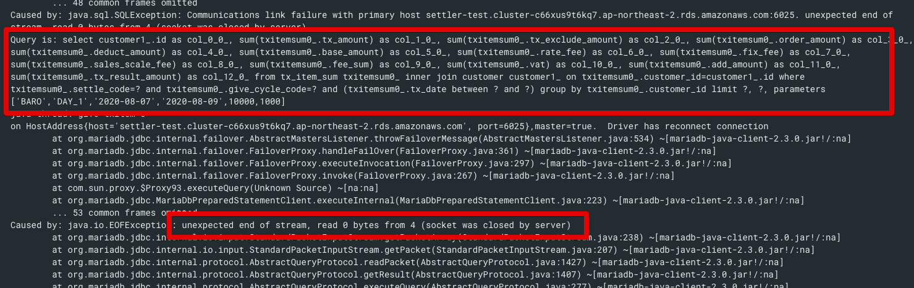

기존에 잘 작동하던 Batch Job에서 왜 이런 문제가 발생하는지, 어떻게 하면 해결할 수 있는지 확인해보겠습니다.

## 1. 테스트 환경

상황 재현에 사용된 환경은 다음과 같습니다.

* Java 8
* Spring Boot Data & Batch 2.3.2
  * Spring Batch 4.2.4
  * HikariCP 3.4.5 (Spring Boot 2.x부터 HikariCP가 기본 라이브러리입니다.)  
* AWS RDS Aurora (MySQL 5.7) r5.large
* MariaDB client 2.6.2

> 버전에 따라 결과가 크게 다르진 않지만, 혹시나 저와 실험 결과가 다른 분들이 계실 수 있을거란 생각에 먼저 명시하였습니다.

## 2. 배경 지식

이번 글에서 중점으로 다룰 키워드는 MySQL의 ```wait_timeout```과 HikariCP의 ```maxLifeTime``` 입니다.  
  
그래서 이 둘에 대해서 간단하게 소개를 하겠습니다.  
  
MySQL은 기본적으로 자신에게 맺어진 Connection 중 **일정 시간 이상 사용하지 않은 Connection을 종료**합니다.  
여기서 **일정 시간**으로 지정되는 값이 바로 ```wait_timeout``` 입니다.  
  
즉, 처음 Connection이 맺어지고 ```wait_timeout``` 동안 추가적인 사용이 없으면 해당 Connection이 자동으로 종료되는 것입니다.  
  
그래서 기존 Connection Pool 라이브러리들은 연결을 맺은 Connection들이 일정 시간이 지났을때 종료되는 것을 방지하기 위해 ```SELECT 1``` 등의 validation query를 주기적으로 날려 이 문제를 회피하였는데요.  
(Spring Boot 1.x 프로젝트를 하신다면 ```test-while-idle``` 옵션이 설정되있을것입니다.)  
  
반면 HikariCP는 ```maxLifetime``` 설정값에 따라 **스스로 미사용된 Connection을 제거하고 새로 생성** 하는 방식을 선택하였습니다.  
  
이런 방식을 선택한 이유는 [HikariCP의 개발자가 남긴 이슈 댓글](https://github.com/brettwooldridge/HikariCP/issues/766)에 상세히 나와있는데요.  
기존 Connection Pool들처럼 유휴 Connection (Idle Connection)들을 갱신하기 위해 지속적으로 쿼리를 수행하는 방법은 1) DB에 지속적인 쿼리를 실행하게 되어 부하를 주고 2) DB에 설정된 유휴 타임아웃들 (```idle timeouts```)을 완전히 무시하기 때문입니다.  

>결과적으로 사용중인 미들웨어 (DB)의 설정을 애플리케이션이 무시하는 포인트가 있다는 게 큰 장애 포인트가 된다고 생각합니다.  
> [pkgonan님의 HikariCP는 test-while-idle과 같은 Connection 갱신 기능이 없을까?](https://pkgonan.github.io/2018/04/HikariCP-test-while-idle) 에서 아주 상세하게 소개하고 있으니 꼭 참고해보시면 좋습니다.

이 두 옵션에 대해 각자 조금씩만 더 알아보겠습니다.

### wait_timeout (MySQL)

* MySQL과 클라이언트가 연결을 맺은 후, **다음 쿼리까지 기다리는 최대 시간**을 의미합니다.
* MySQL에 연결된 클라이언트 (여기서는 WAS등)가 지정된 wait_timeout 시간 동안 쿼리 요청이 없는 경우 MySQL은 해당 Connection(connection) 을 강제로 종료해버립니다.
* 기본값은 28800이며, 단위는 초(s) 라서 실제 **기본 값은 8시간**입니다.

현재 설정된 값은 ```show global variables like 'wait_timeout';``` 로 확인 할 수 있습니다.

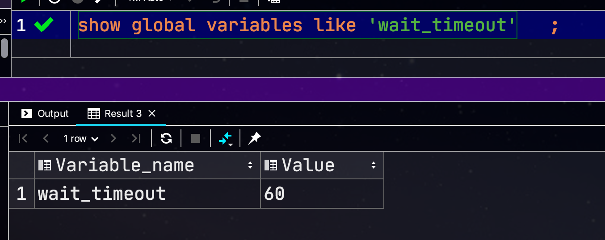

만약 AWS RDS를 사용중이라면 파라미터 그룹에서 바로 확인해볼 수 있습니다.  
(실제 설정도 해당 파라미터그룹에서 해야합니다.)

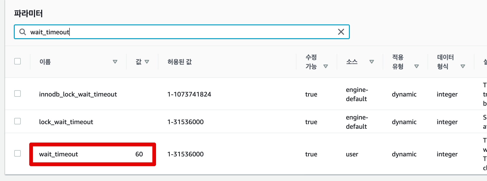

### maxLifetime (HikariCP)

* Connection Pool에서 살아있을 수 있는 Connection의 최대 수명시간입니다. 
* Connection Pool레벨에서 maxLifetime이 지나도록 idle 상태인 connection 객체를 pool에서 제거합니다.
  * 사용하지 않는 의미는 Connection을 이용하여 어떠한 Query도 실행하지 않았음을 의미합니다.
* 사용중인 Connection은 maxLifetime에 상관없이 **제거되지 않습니다**.
  * 사용중이지 않을 때만 제거됩니다.
* Connection Pool 전체가 일괄로 같은 값 (```maxLifetime```)이 적용되지 않고, **2.5%의 버퍼**를 둡니다.
  * 풀에서 동시에 대량의 Connection들이 제거되는 것을 방지하기 위함입니다.
* 기본값은 1800000이며, 단위는 ms라서 실제 **기본 값은 30분**입니다.
  * **0으로 지정하시면 무한대**가 됩니다. (주의)

아래와 같이 설정하면 HikariCP의 로그를 상세하게 볼 수 있습니다.

```yml
logging:
  level:
    com.zaxxer.hikari.HikariConfig: DEBUG
```

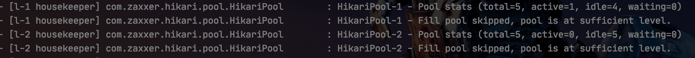

> HouseKeeper란 HikariCP에서 사용하는 **Connection Pool 관리 Thread**입니다.

자 그럼 본격적으로 해당 설정들을 통해 테스트를 진행해보겠습니다.

## 3. 테스트

테스트에 사용할 설정값은 다음과 같습니다

* MySQL ```wait_timeout```: 60초
* HikariCP ```maxLifetime```: 58초
  * 위에서 공유 드린 [pkgonan님의 글](https://pkgonan.github.io/2018/04/HikariCP-test-while-idle) 에서 소개 되었지만 HikariCP는 **max-lifetime를 wait_timeout 설정보다 2~3초 정도 짧게 줄 것**을 권고하고 있어 60초보다 2초 짧은 58초로 설정하였습니다.

### 3-1. Processor가 timeout보다 오래 수행될 때 (추가 쿼리 X)

먼저 의도한대로 에러가 발생하는지 확인하기 위해 아래와 같은 배치 코드를 사용하겠습니다.

> 전체 코드는 [Github](https://github.com/jojoldu/spring-batch-in-action/tree/master/src/main/java/com/jojoldu/batch/example/socketclose)에 있습니다.

```java
@Slf4j
@RequiredArgsConstructor
@Configuration
public class SocketCloseSlowProcessorBatch {
    ...

    @Bean(BEAN_PREFIX+"_step")
    public Step step() throws Exception {
        return stepBuilderFactory.get(BEAN_PREFIX+"_step")
                .<Store, Store>chunk(chunkSize)
                .reader(reader())
                .processor(processor())
                .writer(writer())
                .build();
    }

    @Bean(BEAN_PREFIX+"_reader")
    public JdbcPagingItemReader<Store> reader() throws Exception {
        Map<String, Object> params = new HashMap<>();
        params.put("name", "jojoldu");

        return new JdbcPagingItemReaderBuilder<Store>()
                .pageSize(chunkSize)
                .fetchSize(chunkSize)
                .dataSource(dataSource)
                .rowMapper(new BeanPropertyRowMapper<>(Store.class))
                .queryProvider(queryProvider())
                .parameterValues(params)
                .name(BEAN_PREFIX+"_reader")
                .build();
    }

  ...

    public ItemProcessor<Store, Store> processor() {
        return item -> {
            log.info("processor start");
            Thread.sleep(150_000);// 2.5% 버퍼 대비 넉넉하게 150초로
            log.info("processor end");
            return item;
        };
    }

    @Bean(BEAN_PREFIX+"_writer")
    public JpaItemWriter<Store> writer() {
        return new JpaItemWriterBuilder<Store>()
                .entityManagerFactory(emf)
                .build();
    }
}
```

여기서 주요하게 보셔야 할 코드는 Processor와 Writer인데요.  
  
**Processor**

```java
public ItemProcessor<Store, Store> processor() {
    return item -> {
        log.info("processor start");
        Thread.sleep(150_000);// 2.5% 버퍼 대비 넉넉하게 150초로
        log.info("processor end");
        return item;
    };
}
```

설정된 ```wait_timeout```, ```maxLifetime``` 보다 한참 초과된 시간을 processor에서 사용하도록 설정한 상태입니다.  

> Processor가 한번만 수행되도록 Reader에서는 1개의 row만 조회되도록 설정된 상태입니다.

**Writer**

```java
@Bean(BEAN_PREFIX+"_writer")
public JpaItemWriter<Store> writer() {
    return new JpaItemWriterBuilder<Store>()
            .entityManagerFactory(emf)
            .build();
}
```

그리고 Processor에서 설정된 timeout들 보다 초과된 이후에 DB를 사용가능한지 확인하기 위해 ```JpaItemWriter``` 를 사용하였습니다.  
  
이를 검증하기 위한 테스트 코드는 아래와 같습니다.

```java
@Test
public void processor가_waittimeout_보다_길면_실패한다() throws Exception {
    //given
    storeRepository.save(new Store("jojoldu")); // 1개만 조회되도록

    JobParameters jobParameters = new JobParametersBuilder(jobLauncherTestUtils.getUniqueJobParameters())
            .toJobParameters();

    //when
    JobExecution jobExecution = jobLauncherTestUtils.launchJob(jobParameters);

    //then
    assertThat(jobExecution.getStatus()).isEqualTo(BatchStatus.COMPLETED);
}
```

실제로 테스트를 수행해보면?

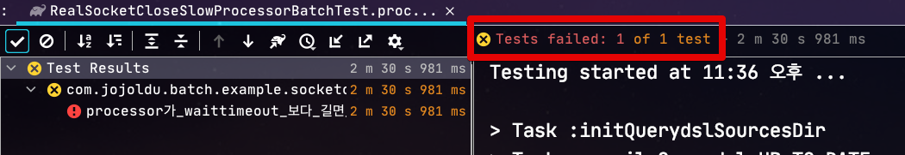

아래와 같은 에러 메세지와 함께 테스트가 실패함을 확인할 수 있습니다.

```java
PreparedStatementCallback; SQL [insert into store(name) values (?)]; (conn=322) (conn=322) unexpected end of stream, read 0 bytes from 4 (socket was closed by server); 
```

자 그럼 위 코드들을 기반으로 하여 자세히 살펴보겠습니다.  
  
Spring Batch는 기본적으로 [Chunk 단위로 트랜잭션](https://jojoldu.tistory.com/331)이 수행됩니다.  
  
그래서 위 코드의 경우 처음 시작시 아래와 같은 상태가 되는데요.

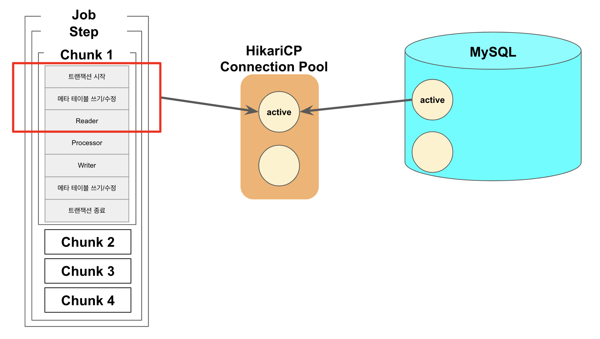

Reader까지는 지속적으로 쿼리가 수행된 이후에 Processor 단계가 되면 Processor 코드에서 wait_timeout을 초과하여 수행됩니다.  
  
이로 인해 HikariCP의 Connection 객체는 active 상태이지만 MySQL과의 Connection은 MySQL 프로세스로 인해 Close가 된 상태가 됩니다.

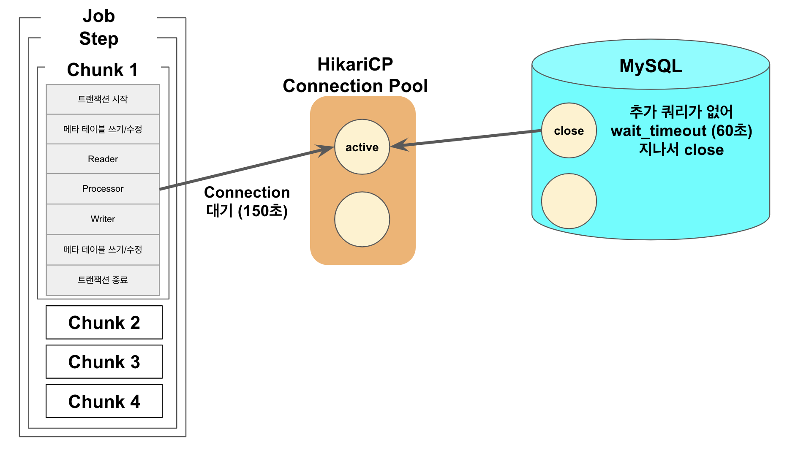

150초가 지나 Processor 가 끝난뒤, Writer가 실행되는 시점에서 HikariCP의 Connection을 이용하여 Save 쿼리를 요청하는데요.  
**이전에 사용한 이력이 있으며, close 되지 않았으며, 현재 다른 쓰레드에서 사용하지 않는 connection**일 경우 해당 Connection을 재사용 하다보니 이미 Close된 상태로 인해 Exception이 발생하게 됩니다.

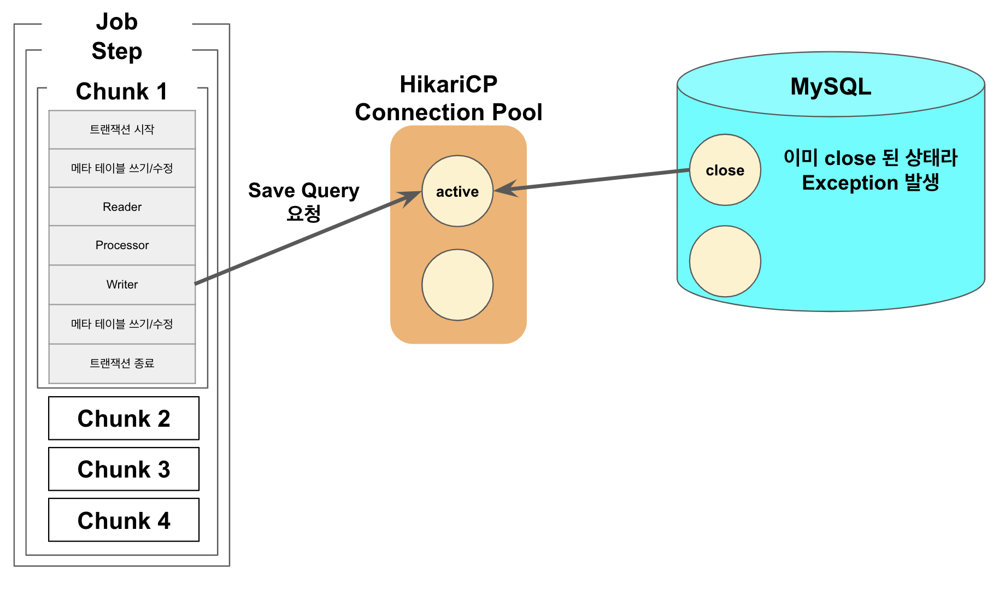

> HikariCP의 자세한 작동 방법은 [우아한형제들 기술 블로그 - HikariCP Dead lock에서 벗어나기 (이론편)](https://woowabros.github.io/experience/2020/02/06/hikaricp-avoid-dead-lock.html)를 참고해보시면 좋습니다.

실제로 이렇게 작동하는지 확인하기 위해 RDS의 모니터링을 보면 **1개의 Connection이 먼저 Close 되고** (Processor 150초 수행되는 동안) 이후 Batch 종료로 인해 전체 Connection이 종료되는 것을 확인할 수 있습니다.


자 그럼 만약에 Writer에서 DB를 사용하지 않으면 어떻게 될까요?

### 3-2. Writer가 DB를 사용하지 않을때

위 배치 코드에서 Writer 부분만 아래와 같이 **DB를 사용하지 않는 코드**로 변경해보겠습니다.

```java
@Bean(BEAN_PREFIX+"_writer")
public ItemWriter<Store> writer() {
    return items -> log.info("items.size={}", items.size());
}
```

그리고 다시 테스트를 수행해보면?

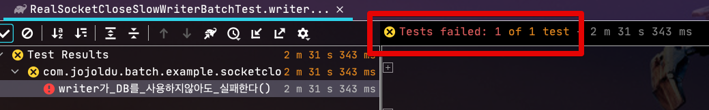

아래와 같이 **Step Execution 등 메타 테이블의 쓰기 작업**으로 인해 실패되는 것을 확인해 볼 수 있습니다.

```java
DataAccessResourceFailureException: PreparedStatementCallback; SQL [UPDATE BATCH_STEP_EXECUTION_CONTEXT SET SHORT_CONTEXT = ?, SERIALIZED_CONTEXT = ? WHERE STEP_EXECUTION_ID = ?]; (conn=87) (conn=87) unexpected end of stream, read 0 bytes from 4 (socket was closed by server);
```

즉, 이미 Processor가 ```wait_timeout```을 초과한 시점에는 이후 DB작업들은 어떤 것들이라도 실패하는 것을 확인할 수 있는데요.  
Writer가 DB를 쓰지 않더라도, Spring Batch 내부에서 작동하는 Chunk 단위의 쓰기 작업 (Step Execution 등)으로 인해 실패할 수 밖에 없습니다.  
  
### 3-3. Processor가 timeout보다 오래 수행될 때 (추가 쿼리 O)

자 여기서 한가지 의문이 드실 분이 계실텐데요.  
"그럼 무조건 Chunk 처리는 wait_timeout 보다 짧은 시간안에 처리되어야겠네?"  
"근데 우리 프로젝트는 Chunk 처리 시간이 wait_timeout보다 길어도 실패하지 않았는데?"  
  
위 실험들만 보면 **Chunk 처리 시간이 wait_timeout보다 짧아야만**할 것으로 보이는데, 실제론 무조건 그렇지는 않습니다.  
어떤 경우가 예외인지 확인해보겠습니다.  
  
Processor 코드를 아래와 같이 **DB에 쿼리를 요청하는 코드**를 50초 (```wait_timeout```: 60초 보다 짧은 시간) 단위로 호출해봅니다.  
즉, Processor에서 전체 소모되는 시간은 기존과 동일하게 150초지만, MySQL의 Connection이 Close 되기 전에 쿼리를 추가적으로 수행하는 경우입니다.

```java
private final StoreRepository storeRepository;

...

public ItemProcessor<Store, Store> processor() {
    return item -> {
        log.info("processor start");
        Thread.sleep(50_000);// 50초

        storeRepository.findById(1L);
        log.info("connection refresh1");
        Thread.sleep(50_000);// 50초

        storeRepository.findById(1L);
        log.info("connection refresh2");
        Thread.sleep(50_000);// 50초

        log.info("processor end");
        return item;
    };
}
```

위 코드를 수행해보면!  
똑같이 Processor에서 150초를 수행하였지만, 테스트가 통과하는 것을 볼 수 있습니다.  

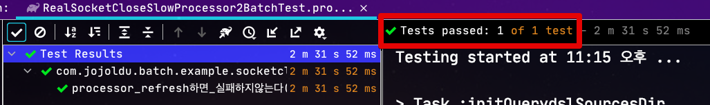

즉, ```test-while-idle``` 옵션처럼 ```wait_timeout```이 되기전 쿼리가 수행되어 Connection 시간이 계속 갱신되어 Exception이 발생하지 않게 되었습니다.  
  
그래서 "우리 Batch는 Chunk 시간이 ```wait_timeout```보다 초과되어도 오류가 없어" 하는 경우는 대부분은 이렇게 **초과되기전 쿼리가 수행된 경우**라고 보시면 됩니다.  
  
실제로 RDS 모니터링을 확인해보면 기존에 Connection이 먼저 -1 되었다가 전체 close되는 형태에서 중간에 먼저 close 되는 Connection이 없이 Batch 종료와 함께 전체 Close 되는 형태인 것을 확인할 수 있습니다.

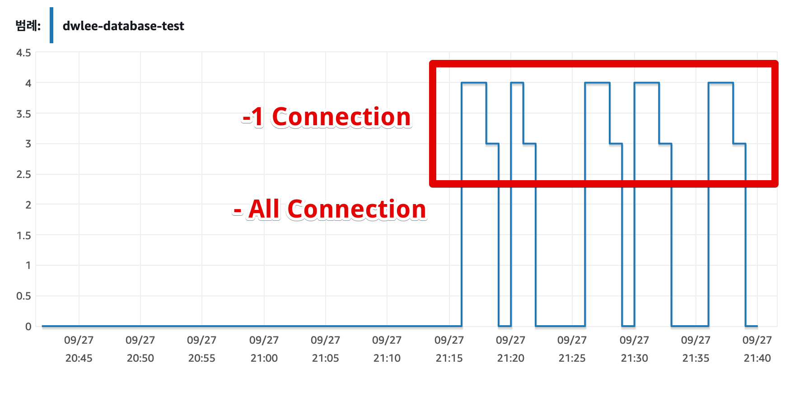


### 3-4. ResourcelessTransactionManager

위 실험 내용을 정리하면 다음과 같습니다.

* 추가적인 쿼리 요청 없이 ```wait_timeout```을 초과하게 되는 경우 해당 Batch는 실패한다.
  * Connection 재사용 단게에서 실패한다.
* 단, ```wait_timeout``` 초과하기전 쿼리가 수행되는 경우 갱신되어 정상 작동한다.

여기서 그럼 오래 걸리는 Batch면 무작정 ```wait_timeout```을 늘리는게 맞는건가 하는 의문이 드실 수도 있습니다.  
이를테면 다음과 같은 경우인데요.

* Reader/Processor/Writer에서 DB를 사용하지 않고
* 트랜잭션 롤백/커밋과 Batch 실패지점 재수행을 고려하지 않는 경우
  * 실패나면 무조건 처음부터 다시 수행하는 경우

이런 경우 DB의 사용이 거의 없음에도 ```wait_timeout```을 무조건 늘려야 한다면 납득하기 어렵습니다.  
  
그래서 Spring Batch에서는 이런 경우에 사용할 수 있도록 별도의 **트랜잭션 매니저**를 제공하는데요.  
해당 클래스의 이름은 ```ResourcelessTransactionManager``` 입니다.  
  
사용법은 다음과 같습니다.

```java
@Bean(BEAN_PREFIX+"_step")
public Step step() throws Exception {
    return stepBuilderFactory.get(BEAN_PREFIX+"_step")
            .<Store, Store>chunk(chunkSize)
            .reader(reader())
            .processor(processor())
            .writer(writer())
            .transactionManager(new ResourcelessTransactionManager()) // No Transaction
            .build();
}
```

* Step의 ```transactionManager``` 항목에 ```ResourcelessTransactionManager``` 인스턴스를 등록하면 됩니다.

실제로 해당 기능이 잘 작동하는지 기존에 DB를 사용하던 Batch 코드를 DB를 사용하지 않는 형태로 변경해서 테스트 해보겠습니다.

```java
@Slf4j
@RequiredArgsConstructor
@Configuration
public class SocketCloseSlowNoTxBatch {
    private static final String BEAN_PREFIX = "SocketCloseSlowNoTxBatch";
    private static final int chunkSize = 1;

    private final JobBuilderFactory jobBuilderFactory;
    private final StepBuilderFactory stepBuilderFactory;

    @Bean(BEAN_PREFIX+"_job")
    public Job job() throws Exception {
        return jobBuilderFactory.get(BEAN_PREFIX+"_job")
                .start(step())
                .build();
    }

    @Bean(BEAN_PREFIX+"_step")
    public Step step() throws Exception {
        return stepBuilderFactory.get(BEAN_PREFIX+"_step")
                .<Store, Store>chunk(chunkSize)
                .reader(reader())
                .processor(processor())
                .writer(writer())
                .transactionManager(new ResourcelessTransactionManager()) // No Transaction
                .build();
    }

    @Bean(BEAN_PREFIX+"_reader")
    public ListItemReader<Store> reader() throws Exception {
        return new ListItemReader<>(Arrays.asList(new Store("jojoldu")));
    }

    public ItemProcessor<Store, Store> processor() {
        return item -> {
            log.info("processor start");
            Thread.sleep(150_000);// 150초
            log.info("processor end");
            return item;
        };
    }

    @Bean(BEAN_PREFIX+"_writer")
    public ItemWriter<Store> writer() {
        return items -> log.info("items.size={}", items.size());
    }
}
```

똑같이 Processor 에서 150초가 수행되었지만!  

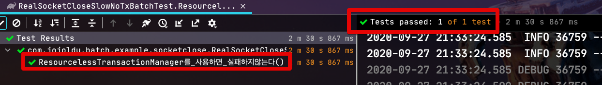

테스트가 정상적으로 성공하였습니다.  
  
여기서 ```ResourcelessTransactionManager```에 대해 좀 더 소개드리자면

* Chunk 앞뒤로 수행되는 트랜잭션 및 메타테이블 쓰기가 없는 것일 뿐 Connection 작동은 동일하게 적용됩니다.
  * 그래서 Reader에서 DB를 읽은 후, **Processor에서 시간 초과**하여 Writer에서 DB 쓰기 작업이 있으면 기존과 동일하게 오류가 발생합니다.
* 단, **Connection을 재사용하지 않는 경우**엔 오류가 발생하지 않습니다.
  * 이는 ```wait_timeout```으로 인한 Exception이 이미 Close된 Connection을 재사용하려고 했기 때문에 발생한 경우라서, **처음 Connection을 맺고 실행되는 쿼리**는 문제 없이 수행됩니다.
    * Reader에서 DB를 사용하고 Writer에선 DB를 사용하지 않는 경우 
    * Reader에선 DB를 사용하지 않고 Writer에서만 DB 작업이 있는 경우 등


**Reader에서 DB를 사용하고 Writer에선 DB를 사용하지 않는 경우**

```java
...
@Bean(BEAN_PREFIX+"_reader")
public JdbcPagingItemReader<Store> reader() throws Exception {
    Map<String, Object> params = new HashMap<>();
    params.put("name", "jojoldu");

    return new JdbcPagingItemReaderBuilder<Store>()
            .pageSize(chunkSize)
            .fetchSize(chunkSize)
            .dataSource(dataSource)
            .rowMapper(new BeanPropertyRowMapper<>(Store.class))
            .queryProvider(queryProvider())
            .parameterValues(params)
            .name(BEAN_PREFIX+"_reader")
            .build();
}

...

@Bean(BEAN_PREFIX+"_writer")
public ItemWriter<Store> writer() {
    return items -> log.info("items.size={}", items.size());
}
```

**Reader에선 DB를 사용하지 않고 Writer에서만 DB 작업이 있는 경우**

```java
@Bean(BEAN_PREFIX+"_reader")
public ListItemReader<Store> reader() throws Exception {
    return new ListItemReader<>(Arrays.asList(new Store("jojoldu")));
}

...
@Bean(BEAN_PREFIX+"_writer")
public JdbcBatchItemWriter<Store> writer() {
    return new JdbcBatchItemWriterBuilder<Store>()
            .dataSource(dataSource)
            .sql("insert into store(name) values (:name)")
            .beanMapped()
            .build();
}
```

위와 같은 경우에도 마찬가지로 ```ResourcelessTransactionManager``` 를 사용하면 Exception이 발생하지 않습니다.

> DB를 사용하지 않는 예제코드는 실제로 외부 API를 호출하는 형태로 치환해도 동일한 결과가 나옵니다.

## 4. 정리

위 실험들을 정리하면 다음과 같습니다.

* 추가적인 쿼리 요청 없이 애플리케이션이 수행시간이 ```wait_timeout```을 초과하는 경우 Exception이 발생한다.
  * 이미 Close된 Connection을 재사용 요청하게 되어 실패한다.
* 단, ```wait_timeout``` 초과하기 전 쿼리가 수행되는 경우 Connection이 갱신되어 정상 작동한다.
* 만약 DB 사용이 최소화된 경우라면 (트랜잭션 롤백/커밋과 Batch 실패지점 재수행이 필요없고, Reader/Processor/Writer에서 DB를 한군데에서만 사용하는 경우)
  * ```ResourcelessTransactionManager```를 통해 ```wait_timeout``` 변경 없이 배치를 수행할 수 있다.

## 5. 참고

* [카카오커머스 기술 블로그 - JDBC Connection Pool들의 리소스 관리 방식 이해하기](https://kakaocommerce.tistory.com/45)
* [pkgonan - HikariCP는 test-while-idle과 같은 Connection 갱신 기능이 없을까?](https://pkgonan.github.io/2018/04/HikariCP-test-while-idle)
* [우아한형제들 기술 블로그 - HikariCP Dead lock에서 벗어나기 (이론편)](https://woowabros.github.io/experience/2020/02/06/hikaricp-avoid-dead-lock.html)