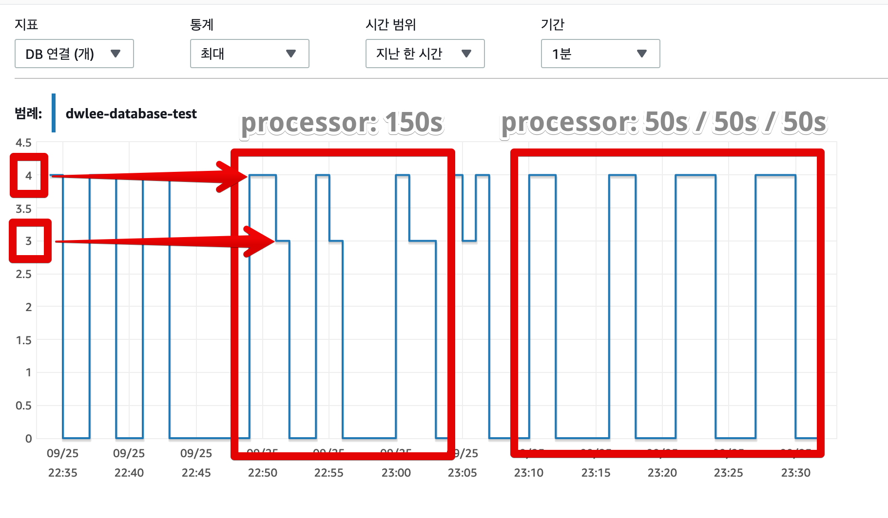
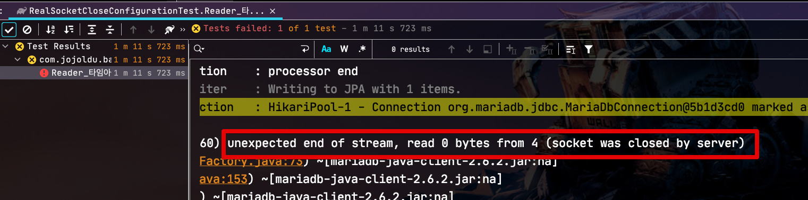

# Spring Batch 사용시 "socket was closed by server" 발생시

시스템 이관을 진행하면서 각종 설정들이 기존 설정들과 달라 운영 테스트에서 여러 이슈를 만나게 되는데요.  
  
최근 Spring Batch 환경 이관에서 기존 Job 들을 테스트 하던 중 다음과 같은 이슈를 만나게 되었습니다.

```java
Caused by: java.io.EOFException: unexpected end of stream, read 0 bytes from 4 (socket was closed by server)
```


기존에 잘 작동하던 Batch Job에서 왜 이런 문제가 발생하는지, 어떻게 하면 해결할 수 있는지 확인해보겠습니다.

## 테스트 환경

상황 재현에 사용된 환경은 다음과 같습니다.

* Java 8
* Spring Boot Data & Batch 2.3.2
  * Spring Batch 4.2.4
  * HikariCP 3.4.5 (Spring Boot 2.x부터 HikariCP가 기본 라이브러리입니다.)
* AWS RDS Aurora (MySQL 5.7) r5.large
* MariaDB client 2.6.2

> 버전에 따라 결과가 크게 다르진 않지만, 혹시나 저와 실험 결과가 다른 분들이 계실 수 있을거란 생각에 먼저 명시하고 갑니다.

## 배경 지식

이번 글에서 중점으로 다룰 키워드는 MySQL의 ```wait_timeout```과 HikariCP의 ```maxLifeTime``` 입니다.  
  
그래서 이 둘에 대해서 간단하게 소개를 하겠습니다.  
  
MySQL은 기본적으로 자신에게 맺어진 커넥션 중 **일정 시간 이상 사용하지 않은 커넥션을 종료**합니다.  
여기서 **일정 시간**으로 지정하는 값이 바로 ```wait_timeout``` 입니다.  
  
즉, 처음 Connection이 맺어지고 ```wait_timeout``` 동안 추가적인 사용이 없으면 해당 Connection이 자동으로 종료되는 것입니다.  
  
그래서 기존 Connection Pool 들은 연결을 맺은 커넥션들이 일정 시간이 지났을때 종료되는 것을 방지하기 위해 ```SELECT 1``` 등의 validation query를 주기적으로 날려 이 문제를 회피하였는데요.  
(Spring Boot 1.x 프로젝트를 하신다면 ```test-while-idle``` 옵션이 설정되있을것입니다.)  
  
반면 HikariCP는 ```maxLifetime``` 설정값에 따라 **스스로 미사용된 커넥션을 제거하고 새로 생성** 하는 방식을 선택하였습니다.  
  
이런 방식을 선택한 이유는 [HikariCP의 개발자가 남긴 이슈 댓글](https://github.com/brettwooldridge/HikariCP/issues/766)에 상세히 나와있는데요.  
기존 Connection Pool들처럼 유휴 커넥션 (Idle Connection)들을 갱신하기 위해 지속적으로 쿼리를 수행하는 방법은 1) DB에 지속적인 쿼리를 실행하게 되어 부하를 주고 2) DB에 설정된 유휴 타임아웃들 (```idle timeouts```)을 완전히 무시하기 때문입니다.  

>결과적으로 사용중인 미들웨어 (DB)의 설정을 애플리케이션이 무시하는 포인트가 있다는 게 큰 장애 포인트가 된다고 생각합니다.  
> [pkgonan님의 HikariCP는 test-while-idle과 같은 커넥션 갱신 기능이 없을까?](https://pkgonan.github.io/2018/04/HikariCP-test-while-idle) 에서 아주 상세하게 소개하고 있으니 꼭 참고해보시면 좋습니다.

이 두 옵션에 대해 각자 조금씩만 더 알아보겠습니다.

### wait_timeout (MySQL)

* MySQL과 클라이언트가 연결을 맺은 후, **다음 쿼리까지 기다리는 최대 시간**을 의미합니다.
* MySQL에 연결된 클라이언트 (여기서는 WAS등)가 지정된 wait_timeout 시간 동안 쿼리 요청이 없는 경우 MySQL은 해당 커넥션(connection) 을 강제로 종료해버립니다.
* 기본값은 28800이며, 단위는 초(s) 라서 실제 **기본 값은 8시간**입니다.

현재 설정된 값은 ```show global variables like 'wait_timeout';``` 로 확인 할 수 있습니다.


만약 AWS RDS를 사용중이라면 파라미터 그룹에서 바로 확인해볼 수 있습니다.  
(실제 설정도 해당 파라미터그룹에서 해야합니다.)


### maxLifetime (HikariCP)

* Connection Pool에서 살아있을 수 있는 커넥션의 최대 수명시간입니다. 
* Connection Pool레벨에서 maxLifetime이 지나도록 idle 상태인 connection 객체를 pool에서 제거합니다.
  * 사용하지 않았다는 의미는 Connection을 이용하여 어떠한 Query도 실행하지 않았음을 의미합니다.
* 사용중인 커넥션은 maxLifetime에 상관없이 **제거되지 않습니다**.
  * 사용중이지 않을 때만 제거됩니다.
* Connection Pool 전체가 일괄로 같은 값 (```maxLifetime```)이 적용되지 않고, 2.5%의 버퍼를 둡니다.
  * 풀에서 동시에 대량의 커넥션들이 제거되는 것을 방지하기 위함입니다.
* 기본값은 1800000이며, 단위는 초(ms)라서 실제 **기본 값은 30분**입니다.
  * **0으로 지정하시면 무한대**가 됩니다 (주의)


아래와 같이 설정하면 HikariCP의 로그를 상세하게 볼 수 있습니다.

```yml
logging:
  level:
    com.zaxxer.hikari.HikariConfig: DEBUG
```


> HouseKeeper란 HikariCP에서 사용하는 **Connection Pool 관리 Thread**입니다.

자 그럼 본격적으로 해당 설정들을 통해 테스트를 진행해보겠습니다.

## 테스트


**이전에 사용한 이력이 있으며, close 되지 않았으며, 현재 다른 쓰레드에서 사용하지 않는 connection**일 경우 해당 connection을 재사용 합니다.

[우아한형제들 기술 블로그 - HikariCP Dead lock에서 벗어나기 (이론편)](https://woowabros.github.io/experience/2020/02/06/hikaricp-avoid-dead-lock.html)


### 중간에 다시 query가 실행되면?

여기서 한가지 의문이 드실 분이 계실텐데요.  
"음? 우리 프로젝트는 chunk 처리 시간이 wait_timeout보다 길어도 실패하지 않았는데?"  
  
  

그럼 무조건 Chunk 처리는 wait_timeout 보다 짧은 시간안에 처리되어야할까요?  
processor 코드를 아래와 같이 **DB에 쿼리를 요청하는 코드**를 50초 단위로 호출해봅니다.

> 50초는 MySQL의 ```wait_timeout``` (60초) 보다 짧은 시간입니다.


```java
private final StoreRepository storeRepository;

...

public ItemProcessor<Store, Store> processor() {
    return item -> {
        log.info("processor start");
        Thread.sleep(50_000);// 50초

        storeRepository.findById(1L);
        log.info("connection refresh1");
        Thread.sleep(50_000);// 50초

        storeRepository.findById(1L);
        log.info("connection refresh2");
        Thread.sleep(50_000);// 50초

        log.info("processor end");
        return item;
    };
}
```

앞선 테스트와 마찬가지로 **Processor에서 총 처리시간은 150초**입니다.  


### MySQL Connection 모니터링




### Writer가 DB를 안쓴다면?

```java
DataAccessResourceFailureException: PreparedStatementCallback; SQL [UPDATE BATCH_STEP_EXECUTION_CONTEXT SET SHORT_CONTEXT = ?, SERIALIZED_CONTEXT = ? WHERE STEP_EXECUTION_ID = ?]; (conn=87) (conn=87) unexpected end of stream, read 0 bytes from 4 (socket was closed by server);
```


### Processor에서 오래걸릴 경우




## Reader / Processor / Writer에서 DB를 사용하지 않을때

외부 API 연동이라던가, 혹은 트랜잭션 롤백이 보장되지 않아도 되는 경우에 위와 같은 예외가 발생할 수 있는데요.  
  
이를 해결할 수 있는 방법은 2가지가 있습니다.

* MySQL의 ```wait_timeout```와 HikariCP의 ```maxLifeTime``` 를 충분히 늘려놓기
  * 저 같은 경우 대량의 데이터를 처리하는 프로젝트의 경우
  * API 서버는 HikariCP의 ```maxLifeTime```를 58초로, Batch 서버는 HikariCP의 ```maxLifeTime```를 30분 (기본값)으로 맞춥니다.
  * 둘 다 같은 DB를 보고 있어 MySQL의 ```wait_timeout```를 32분으로 맞춥니다.
* ```ResourcelessTransactionManager``` 사용하기
  * 트랜잭션 롤백/커밋이 필요 없는 경우 굳이 Spring Batch의 트랜잭션 매니저가 필요로 하진 않습니다.
  * 그럴때를 대비해 
  * [참고 - KSUG 그룹](https://groups.google.com/g/ksug/c/jxcvvn1UXMk/m/EyBs83QhIr4J)
에는 굳이 Spring Batch의 트랜잭션 매니저를 사용하지 않아도 됩니다.


## Socket Close 테스트


* ```socketTimeout=120000``` (120초)
* ```maxLifetime: 58000``` (58초)
* ```wait_timeout: 60``` (60초)


```java
Communications link failure with primary host settler-beta.cluster-cdfmjscyqe71.ap-northeast-2.rds.amazonaws.com:6025. Connection timed out
```

### ResourcelessTransactionManager 주의사항


```java
@Bean(BEAN_PREFIX+"_step")
public Step step() throws Exception {
    return stepBuilderFactory.get(BEAN_PREFIX+"_step")
            .<Store, Store>chunk(chunkSize)
            .reader(reader())
            .processor(processor())
            .writer(writer())
            .transactionManager(new ResourcelessTransactionManager()) // No Transaction
            .build();
}
```

```java
@Bean(BEAN_PREFIX+"_writer")
public ItemWriter<Store> writer() {
    return items -> log.info("items.size={}", items.size());
}
```


```java
@Bean(BEAN_PREFIX+"_writer")
public JdbcBatchItemWriter<Store> writer() {
    return new JdbcBatchItemWriterBuilder<Store>()
            .dataSource(dataSource)
            .sql("insert into store(name) values (:name)")
            .beanMapped()
            .build();
}
```

```java
PreparedStatementCallback; SQL [insert into store(name) values (?)]; (conn=322) (conn=322) unexpected end of stream, read 0 bytes from 4 (socket was closed by server); 
```

JobRepository로 

## 참고

* [카카오커머스 기술 블로그 - JDBC Connection Pool들의 리소스 관리 방식 이해하기](https://kakaocommerce.tistory.com/45)
* [pkgonan - HikariCP는 test-while-idle과 같은 커넥션 갱신 기능이 없을까?](https://pkgonan.github.io/2018/04/HikariCP-test-while-idle)