# Spring Batch에서 MultiThread로 Step 실행하기

일반적으로 Spring Batch는 단일 쓰레드에서 실행됩니다.  
즉, 모든 것이 순차적으로 실행되는 것을 의미하는데요.  
Spring Batch에서는 이를 병렬로 실행할 수 있는 방법을 여러가지 지원합니다.  
이번 시간에는 그 중 하나인 멀티스레드로 Step을 실행하는 방법에 대해서 알아보겠습니다.  

## 1. 소개

Spring Batch의 멀티쓰레드 Step은 Spring의 ```TaskExecutor```를 이용하여 **각 쓰레드가 Chunk 단위로 실행되게** 하는 방식입니다.  
  
> Spring Batch Chunk에 대한 내용은 [이전 포스팅](https://jojoldu.tistory.com/331)에 소개되어있습니다.

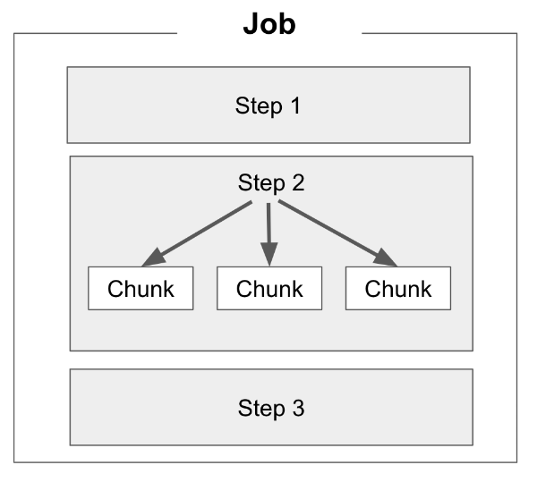

여기서 어떤 ```TaskExecutor``` 를 선택하냐에 따라 모든 Chunk 단위별로 쓰레드가 계속 새로 생성될 수도 있으며 (```SimpleAsyncTaskExecutor```) 혹은 쓰레드풀 내에서 지정된 갯수의 쓰레드만을 재사용하면서 실행 될 수도 있습니다. (```ThreadPoolTaskExecutor```)  
  
Spring Batch에서 멀티쓰레드 환경을 구성하기 위해서 가장 먼저 해야할 일은 사용하고자 하는 **Reader와 Writer가 멀티쓰레드를 지원하는지** 확인하는 것 입니다.  

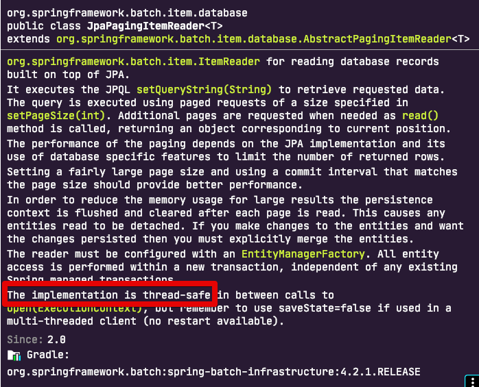

(```JpaPagingItemReader```의 Javadoc)  
  
각 Reader와 Writer의 Javadoc에 항상 저 **thread-safe** 문구가 있는지 확인해보셔야 합니다.  
만약 없는 경우엔 thread-safe가 지원되는 Reader 와 Writer를 선택해주셔야하며, 꼭 그 Reader를 써야한다면 [SynchronizedItemStreamReader](https://docs.spring.io/spring-batch/docs/current/api/org/springframework/batch/item/support/SynchronizedItemStreamReader.html) 등을 이용해 **thread-safe**로 변환해서 사용해볼 수 있습니다.  
  
그리고 또 하나 주의할 것은 멀티 쓰레드로 각 Chunk들이 개별로 진행되다보니 Spring Batch의 큰 장점중 하나인 **실패 지점에서 재시작하는 것은 불가능** 합니다.  
  
이유는 간단합니다.  
단일 쓰레드로 순차적으로 실행할때는 10번째 Chunk가 실패한다면 **9번째까지의 Chunk가 성공했음이 보장**되지만, 멀티쓰레드의 경우 1~10개의 Chunk가 동시에 실행되다보니 10번째 Chunk가 실패했다고 해서 **1~9개까지의 Chunk가 다 성공된 상태임이 보장되지 않습니다**.  
  
그래서 일반적으로는 ItemReader의 ```saveState``` 옵션을 ```false``` 로 설정하고 사용합니다.  

> 이건 예제 코드에서 설정을 보여드리겠습니다.


자 그럼 실제로 하나씩 코드를 작성하면서 실습해보겠습니다.

## 2. PagingItemReader 예제

가장 먼저 알아볼 것은 PagingItemReader를 사용할때 입니다.  
이때는 걱정할 게 없습니다.  
PagingItemReader는 **Thread Safe** 하기 때문입니다.  


> 멀티 쓰레드로 실행할 배치가 필요하시다면 웬만하면 PagingItemReader로 사용하길 추천드립니다.


예제 코드는 JpaPagingItemReader로 작성하였습니다.

```java

@Slf4j
@RequiredArgsConstructor
@Configuration
public class MultiThreadPagingConfiguration {
    public static final String JOB_NAME = "multiThreadPagingBatch";

    private final JobBuilderFactory jobBuilderFactory;
    private final StepBuilderFactory stepBuilderFactory;
    private final EntityManagerFactory entityManagerFactory;

    private int chunkSize;

    @Value("${chunkSize:1000}")
    public void setChunkSize(int chunkSize) {
        this.chunkSize = chunkSize;
    }

    private int poolSize;

    @Value("${poolSize:10}") // (1)
    public void setPoolSize(int poolSize) {
        this.poolSize = poolSize;
    }

    @Bean(name = JOB_NAME+"taskPool")
    public TaskExecutor executor() {
        ThreadPoolTaskExecutor executor = new ThreadPoolTaskExecutor(); // (2)
        executor.setCorePoolSize(poolSize);
        executor.setMaxPoolSize(poolSize);
        executor.setThreadNamePrefix("multi-thread-");
        executor.setWaitForTasksToCompleteOnShutdown(Boolean.TRUE);
        executor.initialize();
        return executor;
    }

    @Bean(name = JOB_NAME)
    public Job job() {
        return jobBuilderFactory.get(JOB_NAME)
                .start(step())
                .preventRestart()
                .build();
    }

    @Bean(name = JOB_NAME +"_step")
    @JobScope
    public Step step() {
        return stepBuilderFactory.get(JOB_NAME +"_step")
                .<Product, ProductBackup>chunk(chunkSize)
                .reader(reader(null))
                .processor(processor())
                .writer(writer())
                .taskExecutor(executor()) // (2)
                .throttleLimit(poolSize) // (3)
                .build();
    }


    @Bean(name = JOB_NAME +"_reader")
    @StepScope
    public JpaPagingItemReader<Product> reader(@Value("#{jobParameters[createDate]}") String createDate) {

        Map<String, Object> params = new HashMap<>();
        params.put("createDate", LocalDate.parse(createDate, DateTimeFormatter.ofPattern("yyyy-MM-dd")));

        return new JpaPagingItemReaderBuilder<Product>()
                .name(JOB_NAME +"_reader")
                .entityManagerFactory(entityManagerFactory)
                .pageSize(chunkSize)
                .queryString("SELECT p FROM Product p WHERE p.createDate =:createDate")
                .parameterValues(params)
                .saveState(false) // (4)
                .build();
    }

    private ItemProcessor<Product, ProductBackup> processor() {
        return ProductBackup::new;
    }

    @Bean(name = JOB_NAME +"_writer")
    @StepScope
    public JpaItemWriter<ProductBackup> writer() {
        return new JpaItemWriterBuilder<ProductBackup>()
                .entityManagerFactory(entityManagerFactory)
                .build();
    }
}
```


(1) ```@Value("${poolSize:10}")```

* 생성할 쓰레드 풀의 쓰레드 수를 환경변수로 받아서 사용합니다.
* ```${poolSize:10}``` 에서 10은 앞에 선언된 변수 ```poolSize```가 없을 경우 10을 사용한다는 기본값으로 보시면 됩니다.
* 배치 실행시 PoolSize를 조정하는 이유는 **실행 환경에 맞게 유동적으로 쓰레드풀을 관리하기 위함**입니다.
  * 개발 환경에서는 1개의 쓰레드로, 운영에선 10개의 쓰레드로 실행할 수도 있습니다.
  * 혹은 같은 시간대에 수행되는 다른 배치들로 인해서 갑자기 쓰레드 개수를 줄여야 할 수도 있습니다.
  * 언제든 유동적으로 배치 실행시점에 몇개의 쓰레드를 생성할지 결정할 수 있으니 웬만하면 외부에 받아서 사용하는 방식을 선호합니다.
* Field가 아닌 Setter로 받는 이유는 Spring Context가 없이 테스트 코드를 작성할때 PoolSize, ChunkSize등을 입력할 방법이 없기 때문입니다.
 
(2) ```ThreadPoolTaskExecutor```

* 쓰레드 풀을 이용한 쓰레드 관리 방식입니다.
* 옵션
  * ```corePoolSize```: Pool의 기본 사이즈
  * ```maxPoolSize```: Pool의 최대 사이즈
* 이외에도 ```SimpleAsyncTaskExecutor``` 가 있는데, 이를 사용할 경우 **매 요청시마다 쓰레드를 생성**하게 됩니다.
  * 이때 계속 생성하다가 concurrency limit 을 초과할 경우 이후 요청을 막게되는 현상까지 있어, 운영 환경에선 잘 사용하진 않습니다.
* 좀 더 자세한 설명은 [링크](https://github.com/HomoEfficio/dev-tips/blob/master/Java-Spring%20Thread%20Programming%20%EA%B0%84%EB%8B%A8%20%EC%A0%95%EB%A6%AC.md#threadpoolexecutor) 참고하시면 더 좋습니다
  
(3) ```throttleLimit(poolSize)```

* 기본값은 **4** 입니다.
* 생성된 쓰레드 중 몇개를 실제 작업에 사용할지를 결정합니다.
* 만약 10개의 쓰레드를 생성하고 ```throttleLimit```을 4로 두었다면, 10개 쓰레드 중 4개만 배치에서 사용하게 됨을 의미합니다.
* 일반적으로 ```corePoolSize```, ```maximumPoolSize```, ```throttleLimit``` 를 모두 같은 값으로 맞춥니다.
 
(4) ```.saveState(false)```

* 앞에서도 설명드린것처럼, 멀티쓰레드 환경에서 사용할 경우 필수적으로 사용해야할 옵션이 ```saveState = false``` 입니다.
* 해당 옵션을 끄게 되면 (```false```) Reader 가 실패한 지점을 저장하지 못하게해, 다음 실행시에도 무조건 처음부터 다시 읽도록 합니다.
* 이 옵션을 켜놓으면 오히려 더 큰 문제가 발생할 수 있습니다.
  * 8번째 Chunk 에서 실패했는데, 사실은 4번째 Chunk도 실패했다면 8번째가 기록되어 다음 재실행시 8번째부터 실행될수 있기 때문입니다.
  * 실패하면 무조건 처음부터 다시 실행될 수 있도록 해당 옵션은 ```false```로 두는 것을 추천합니다.
* 비슷한 기능으로 Job 옵션에 있는 ```.preventRestart()```가 있는데, 해당 옵션은 Job이 같은 파라미터로 재실행되는것을 금지합니다.
  * ```.saveState(false)```는 Reader가 실패난 지점을 기록하지 못하게 하는 옵션이라 엄밀히 말하면 둘은 서로 다른 옵션이긴 합니다.
  * **Step 재실행을 막는다**정도로 봐주시면 됩니다.


자 그럼 이제 이 코드가 실제로 멀티쓰레드로 잘 작동하는지 테스트 코드로 검증해보겠습니다.

### 테스트 코드

> 모든 테스트 코드는 JUnit5를 사용합니다.
> Spring Batch에서 테스트 코드 작성이 처음이신분들은 [앞에 작성된 포스팅](https://jojoldu.tistory.com/455)을 먼저 참고해주세요. 

```java
@ExtendWith(SpringExtension.class)
@SpringBatchTest
@SpringBootTest(classes={MultiThreadPagingConfiguration.class, TestBatchConfig.class})
@TestPropertySource(properties = {"chunkSize=1", "poolSize=2"}) // (1)
public class MultiThreadPagingConfigurationTest {

    @Autowired
    private ProductRepository productRepository;

    @Autowired
    private ProductBackupRepository productBackupRepository;

    @Autowired
    private JobLauncherTestUtils jobLauncherTestUtils;

    @AfterEach
    void after() {
        productRepository.deleteAll();
        productBackupRepository.deleteAll();
    }

    @Test
    public void 페이징_분산처리_된다() throws Exception {
        //given
        LocalDate createDate = LocalDate.of(2020,4,13);
        ProductStatus status = ProductStatus.APPROVE;
        long price = 1000L;
        for (int i = 0; i < 10; i++) {
            productRepository.save(Product.builder()
                    .price(i * price)
                    .createDate(createDate)
                    .status(status)
                    .build());
        }

        JobParameters jobParameters = new JobParametersBuilder()
                .addString("createDate", createDate.toString())
                .addString("status", status.name())
                .toJobParameters();
        //when
        JobExecution jobExecution = jobLauncherTestUtils.launchJob(jobParameters);

        //then
        assertThat(jobExecution.getStatus()).isEqualTo(BatchStatus.COMPLETED);
        List<ProductBackup> backups = productBackupRepository.findAll();
        backups.sort(Comparator.comparingLong(ProductBackup::getPrice));

        assertThat(backups).hasSize(10);
        assertThat(backups.get(0).getPrice()).isEqualTo(0L);
        assertThat(backups.get(9).getPrice()).isEqualTo(9000L);
    }

}
```

(1) ```properties = {"chunkSize=1", "poolSize=2"}```

* 각 옵션은 다음과 같은 의미를 가집니다.
  * ```chunkSize=1```: 하나의 Chunk가 처리할 데이터가 1건을 의미합니다.
  * ```poolSize=2```: 생성될 쓰레드 풀의 쓰레드 개수를 2개로 합니다.
* 이렇게 할 경우 10개의 데이터를 처리할때 **2개의 쓰레드가 각 5회씩** 처리됩니다.
  * 물론 1개의 쓰레드에서 오랜 시간 동안 처리하게 된다면 다른 1개가 더 많은 건수를 처리할 수도 있습니다.  

위 테스트 코드를 한번 실행해보면?  
아래 그림처럼 **2개의 쓰레드가 각자 페이지를 Read하고 Write** 하는것을 확인할 수 있습니다.

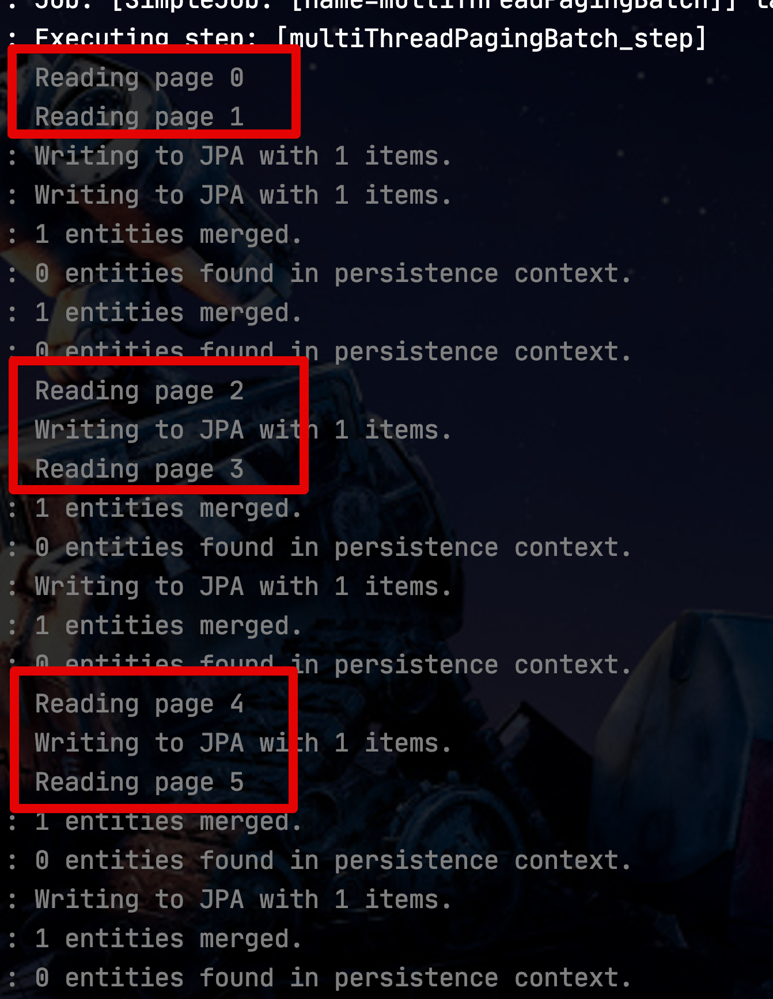

이전과 같이 단일 쓰레드 모델이였다면 어떻게 될까요?  
그럼 아래와 같이 1개페이지에 대해 읽기와 쓰기가 모두 끝난 후에야 다음 페이지를 진행하게 됩니다.

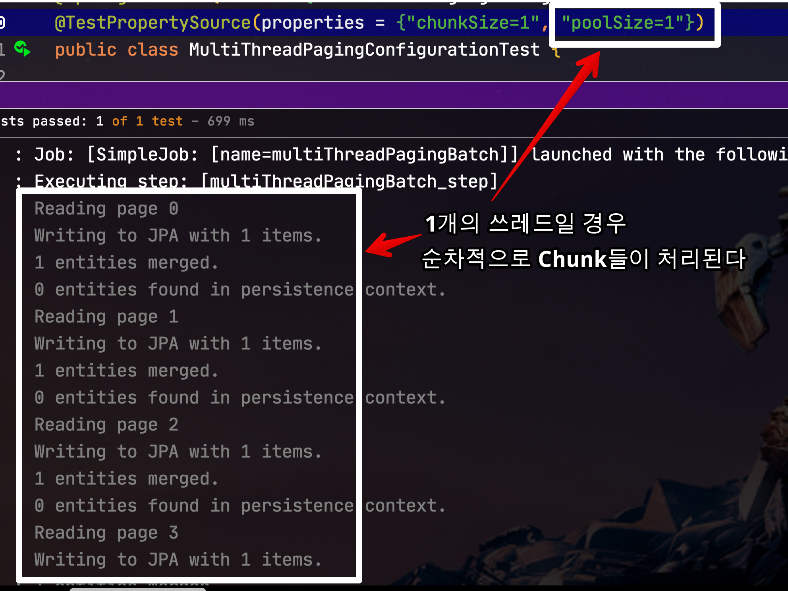

JpaPagingItemReader를 예시로 보여드렸지만, 그외 나머지 PagingItemReader들 역시 동일하게 사용하시면 됩니다

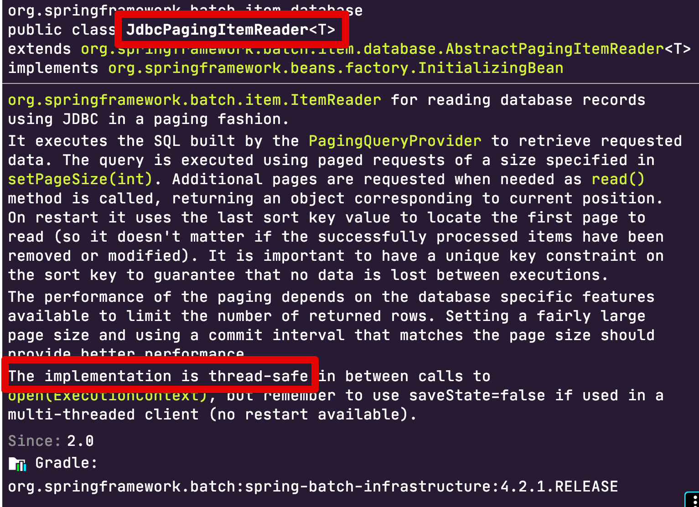

(JdbcPagingItemReader)  
  
비교적 편하게 작동되는 PagingItemReader들은 쓰레드풀만 지정하면 됩니다.  
자 그럼 ThreadSafe 하지 않는 Cursor 기반의 Reader들은 어떻게 할지 알아보겠습니다.

## 3. CursorItemReader

JdbcCursorItemReader를 비롯하여 JDBC ResultSet를 사용하여 데이터를 읽는 CursorItemReader는 Thread Safe하지 않습니다.

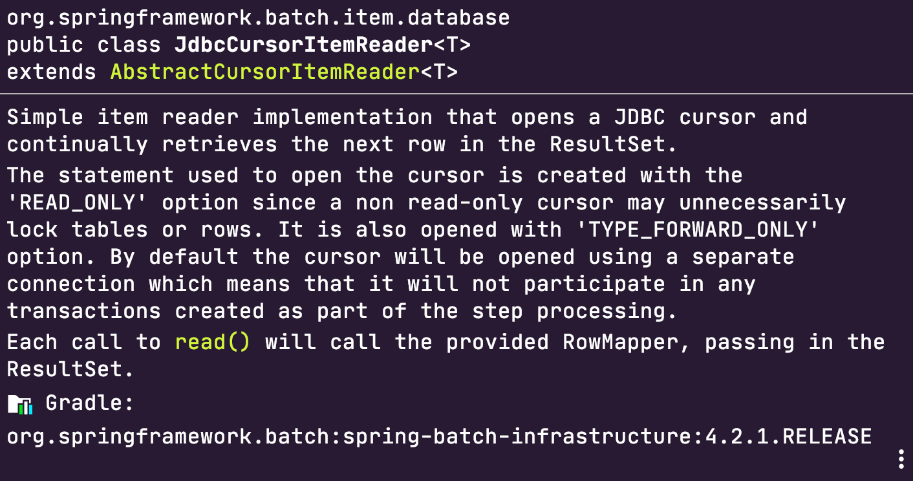

(Javadoc어디에도 Thread Safe 단어를 찾을 수가 없습니다.)  
  
이와 같이 Thread Safe 하지 않는 Reader들을 Thread Safe하게 변경하기 위해서는 데이터를 읽는 ```read()```에 ```synchronized``` 를 걸어야만 합니다.  
  
다만 이렇게 하게 되면 Reader는 멀티 쓰레드로 작동하지 않고, 순차적으로 데이터를 읽게 될텐데요.  
Reader가 동기화 방식이 된다하더라도, **Processor/Writer는 멀티 쓰레드로** 작동이 됩니다.  

> 일반적으로 배치 과정에서는 Write 단계에서 더 많은 자원과 시간을 소모합니다.  
> 그래서 Bulk Insert 등의 방법에 대해서 많이 얘기가 나옵니다.
  
이미 구현체가 있는 JdbcCursorItemReader나 HibernateCursorItemReader에 ```synchronized``` 를 추가하려면 어떻게 해야할까요?  

> JpaCursorItemReader는 [Spring Batch 4.3](https://github.com/spring-projects/spring-batch/issues/901)에 추가될 예정입니다.
   
가장 쉬운 방법은 **Spring Batch 4.0부터 추가된 SynchronizedItemStreamReader로 Wrapping 하는 것**입니다.  
  
자 그럼 예제 코드로 실제로 CursorItemReader가 Thread Safe 하지 않는지 확인후, 이를 고치는 과정으로 살펴보겠습니다.

### 3-1. Not Thread Safety 코드

먼저 멀티쓰레드 환경에서 바로 JdbcCursorItemReader를 사용할 경우 입니다.  

```java
@Slf4j
@RequiredArgsConstructor
@Configuration
public class MultiThreadCursorConfiguration {
    public static final String JOB_NAME = "multiThreadCursorBatch";

    private final JobBuilderFactory jobBuilderFactory;
    private final StepBuilderFactory stepBuilderFactory;
    private final EntityManagerFactory entityManagerFactory;
    private final DataSource dataSource;

    private int chunkSize;

    @Value("${chunkSize:1000}")
    public void setChunkSize(int chunkSize) {
        this.chunkSize = chunkSize;
    }

    private int poolSize;

    @Value("${poolSize:10}")
    public void setPoolSize(int poolSize) {
        this.poolSize = poolSize;
    }

    @Bean(name = JOB_NAME+"taskPool")
    public TaskExecutor executor() {
        ThreadPoolTaskExecutor executor = new ThreadPoolTaskExecutor();
        executor.setCorePoolSize(poolSize);
        executor.setMaxPoolSize(poolSize);
        executor.setThreadNamePrefix("multi-thread-");
        executor.setWaitForTasksToCompleteOnShutdown(Boolean.TRUE);
        executor.initialize();
        return executor;
    }

    @Bean(name = JOB_NAME)
    public Job job() {
        return jobBuilderFactory.get(JOB_NAME)
                .start(step())
                .preventRestart()
                .build();
    }

    @Bean(name = JOB_NAME +"_step")
    @JobScope
    public Step step() {
        return stepBuilderFactory.get(JOB_NAME +"_step")
                .<Product, ProductBackup>chunk(chunkSize)
                .reader(reader(null))
                .listener(new CursorItemReaderListener()) // (1)
                .processor(processor())
                .writer(writer())
                .taskExecutor(executor())
                .throttleLimit(poolSize)
                .build();
    }

    @Bean(name = JOB_NAME +"_reader")
    @StepScope
    public JdbcCursorItemReader<Product> reader(@Value("#{jobParameters[createDate]}") String createDate) {
        String sql = "SELECT id, name, price, create_date, status FROM product WHERE create_date=':createDate'"
                .replace(":createDate", createDate);

        return new JdbcCursorItemReaderBuilder<Product>() // (2)
                .fetchSize(chunkSize)
                .dataSource(dataSource)
                .rowMapper(new BeanPropertyRowMapper<>(Product.class))
                .sql(sql)
                .name(JOB_NAME +"_reader")
                .build();
    }

    private ItemProcessor<Product, ProductBackup> processor() {
        return item -> {
            log.info("Processing Start Item id={}", item.getId());
            Thread.sleep(1000); // (3)
            log.info("Processing End Item id={}", item.getId());
            return new ProductBackup(item);
        };
    }

    @Bean(name = JOB_NAME +"_writer")
    @StepScope
    public JpaItemWriter<ProductBackup> writer() {
        return new JpaItemWriterBuilder<ProductBackup>()
                .entityManagerFactory(entityManagerFactory)
                .build();
    }
}
```

(1) ```.listener(new CursorItemReaderListener())```

* JdbcCursorItemReader는 별도로 데이터 읽기 수행시 별도의 로그를 남기지 않습니다.  
* 멀티쓰레드로 데이터를 읽고 있음을 쉽게 확인하기 위해 리스너를 추가합니다.

(2) ```JdbcCursorItemReaderBuilder```

* JpaPagingItemReader 코드와 딱 Reader 영역만 교체하여 사용합니다.

(3) ```Thread.sleep(1000);```

* 멀티쓰레드가 진행되는지 명확하게 구분하기 위해 각 Thread의 Processor 단계에서 1초간 Sleep이 발생하도록 합니다.
* 너무 고속으로 처리될 경우 멀티쓰레드와 단일쓰레드의 차이가 구분이 거의 힘들기 때문에 의도적으로 지연 현상을 발생시킨 것입니다. 

자 그럼 위 코드를 테스트 코드로 한번 검증해보겠습니다.

```java
@ExtendWith(SpringExtension.class)
@SpringBatchTest
@SpringBootTest(classes={MultiThreadCursorConfiguration.class, TestBatchConfig.class})
@TestPropertySource(properties = {"chunkSize=1", "poolSize=5"})
public class MultiThreadCursorConfigurationTest {

    @Autowired
    private ProductRepository productRepository;

    @Autowired
    private ProductBackupRepository productBackupRepository;

    @Autowired
    private JobLauncherTestUtils jobLauncherTestUtils;

    @AfterEach
    void after() {
        productRepository.deleteAll();
        productBackupRepository.deleteAll();
    }

    @Test
    public void Cursor_분산처리_된다() throws Exception {
        //given
        LocalDate createDate = LocalDate.of(2020,4,13);
        ProductStatus status = ProductStatus.APPROVE;
        long price = 1000L;
        for (int i = 0; i < 10; i++) {
            productRepository.save(Product.builder()
                    .price(i * price)
                    .createDate(createDate)
                    .status(status)
                    .build());
        }

        JobParameters jobParameters = new JobParametersBuilder()
                .addString("createDate", createDate.toString())
                .toJobParameters();
        //when
        JobExecution jobExecution = jobLauncherTestUtils.launchJob(jobParameters);

        //then
        assertThat(jobExecution.getStatus()).isEqualTo(BatchStatus.COMPLETED);
        List<ProductBackup> backups = productBackupRepository.findAll();
        backups.sort(Comparator.comparingLong(ProductBackup::getPrice));

        assertThat(backups).hasSize(10);
        assertThat(backups.get(0).getPrice()).isEqualTo(0L);
        assertThat(backups.get(9).getPrice()).isEqualTo(9000L);
    }

}
```

10개의 데이터가 정상적으로 백업 테이블로 이관되었는지를 검증합니다.  
여기서 Thread Safe하지 않으면 10개가 아닌 다른 개수가 있겠죠?  
  
위 테스트를 한번 실행해보면!

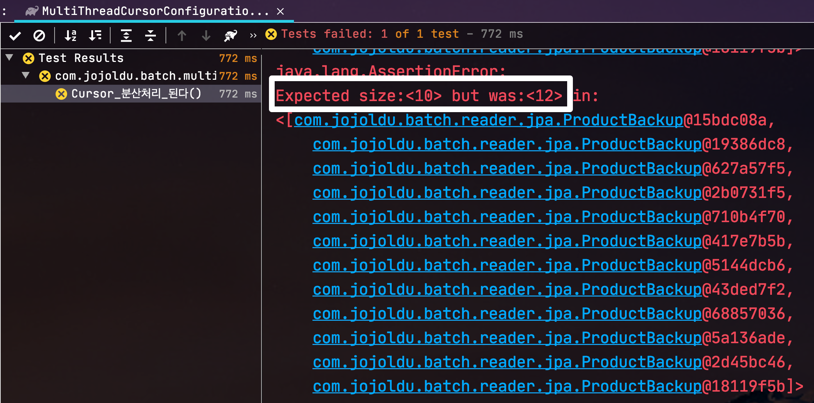

역시 10개가 아닌 다른 건수가 들어가 있습니다.  
  
저장된 12개의 데이터를 확인해보면 이처럼 **똑같은 데이터가 여러개 저장**되어 있음을 알 수 있습니다.

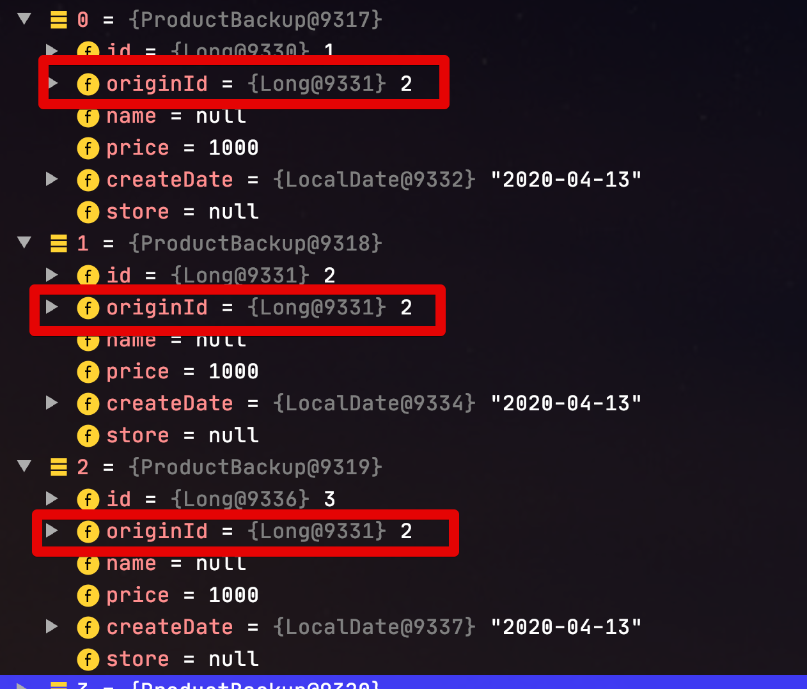

등록한 리스너를 통해 쓰레드들 (지정된 Pool Size는 5) 이 모두 같은 ID를 가진 데이터를 읽기 시작한 것도 확인할 수 있습니다.

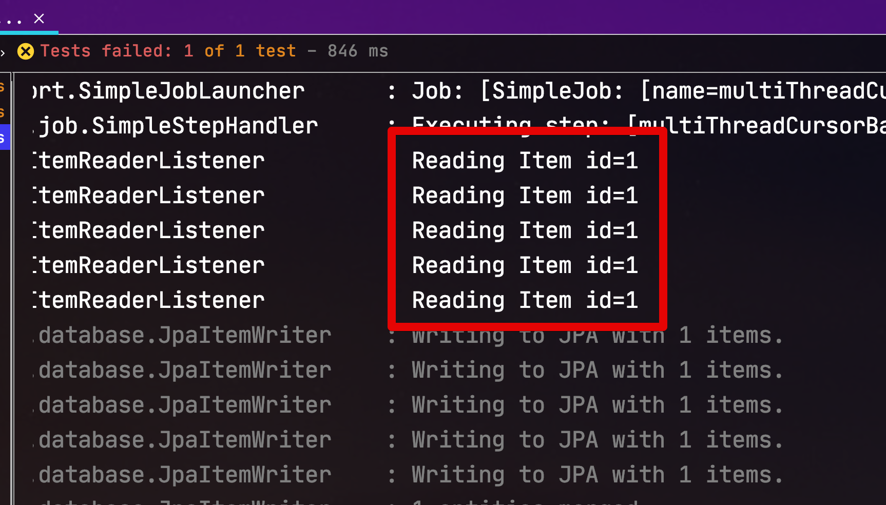

현재 코드에 문제가 있는것이 확인되었으니, 바로 코드를 수정해보겠습니다.

### 3-3. Thread Safety 코드

Thread Safety 코드는 Reader 영역을 ```SynchronizedItemStreamReader```로 감싸기만 하면 됩니다.

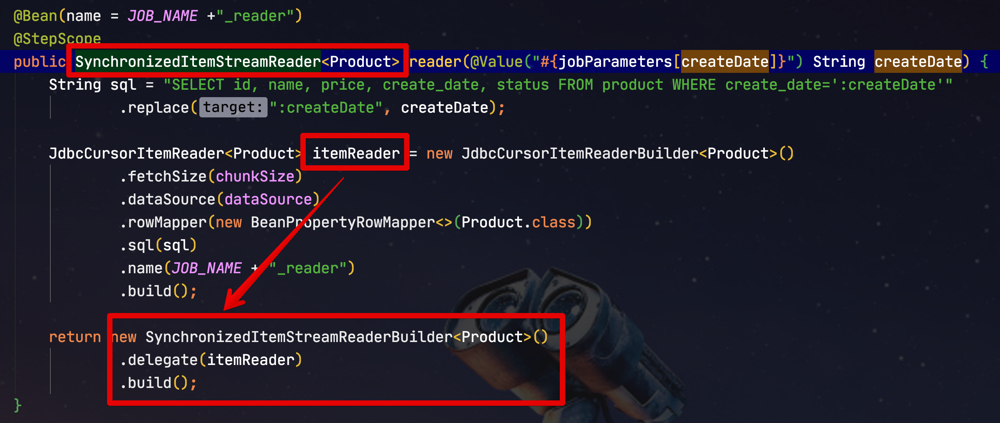

```java
@Bean(name = JOB_NAME +"_reader")
@StepScope
public SynchronizedItemStreamReader<Product> reader(@Value("#{jobParameters[createDate]}") String createDate) {
String sql = "SELECT id, name, price, create_date, status FROM product WHERE create_date=':createDate'"
        .replace(":createDate", createDate);

JdbcCursorItemReader<Product> itemReader = new JdbcCursorItemReaderBuilder<Product>()
        .fetchSize(chunkSize)
        .dataSource(dataSource)
        .rowMapper(new BeanPropertyRowMapper<>(Product.class))
        .sql(sql)
        .name(JOB_NAME + "_reader")
        .build();

return new SynchronizedItemStreamReaderBuilder<Product>() 
        .delegate(itemReader) // (1)
        .build();
}
```

(1) ```.delegate(itemReader)```

* ```delegate``` 에 감싸고 싶은 ItemReader 객체를 등록 합니다.
* 감싸진 객체는 아래 사진에 나온것처럼 ```synchronized``` 메소드에서 감싸져 호출되어 동기화된 읽기가 가능하게 됩니다. 

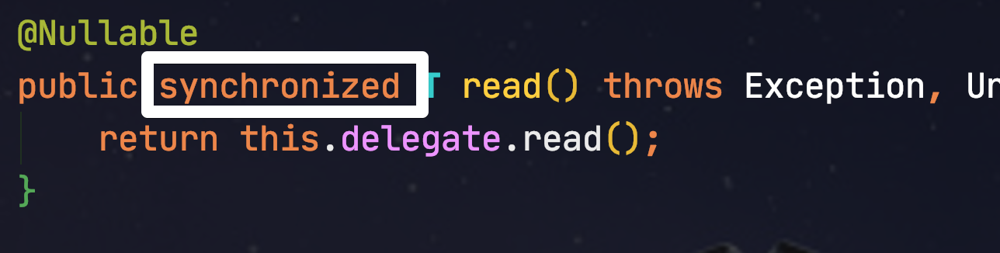

> SynchronizedItemStreamReader는 **Spring Batch 4.0** 부터 지원됩니다.  
> 그 이하 버전을 사용하시는 분들이라면 [SynchronizedItemStreamReader 클래스 코드](https://github.com/spring-projects/spring-batch/blob/230614182667378924ec557913df75b72af0ddc5/spring-batch-infrastructure/src/main/java/org/springframework/batch/item/support/SynchronizedItemStreamReader.java)를 복사하여 프로젝트에 추가하시면 됩니다.

SynchronizedItemStreamReader 로 변경후 다시 테스트를 돌려보면?  
테스트가 성공적으로 통과하는 것을 확인할 수 있습니다.

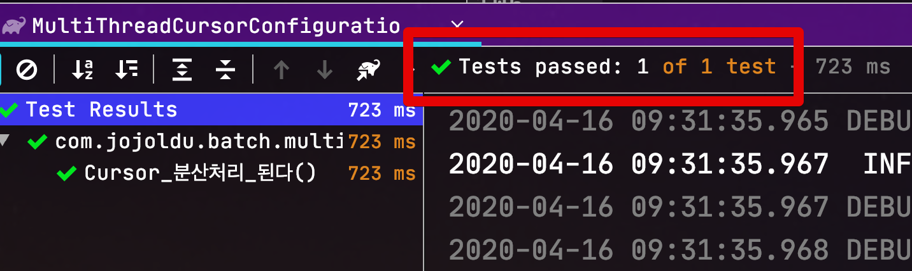

실제로 실행 로그에서도 멀티쓰레드 환경에서 잘 작동되었음을 확인할 수 있습니다.

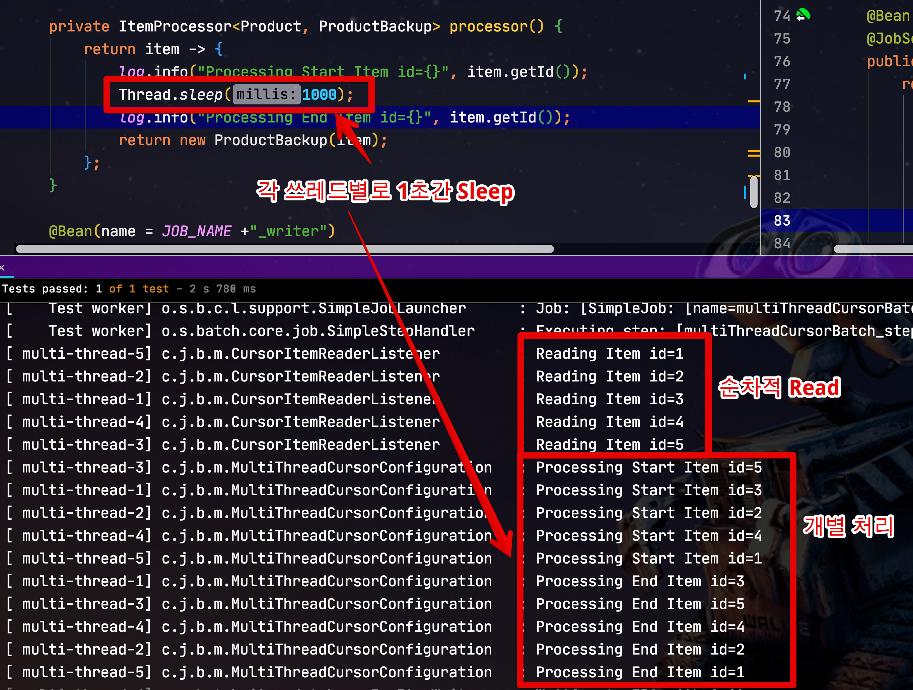

정상적으로 Cursor 기반의 멀티쓰레드 Step을 확인하였습니다.

## 마무리

이제 느린 Batch 작업들은 멀티쓰레드로 해결하면 되는 것일까요!?  
그렇지는 않습니다.  
이미 네트워크/DISK IO/CPU/Memory 등 서버 자원이 이미 **단일 쓰레드에서도 리소스 사용량이 한계치에 달했다면** 멀티쓰레드로 진행한다고 해서 성능 향상을 기대할 순 없습니다.  
  
멀티 쓰레드는 여러가지 고려사항이 많습니다.  
그래서 실제 운영 환경에 적용하실때는 [Spring 공식문서](https://docs.spring.io/spring-batch/docs/current/reference/html/scalability.html#multithreadedStep) 를 숙지하시고, 충분히 테스트를 해보신뒤 실행해보시길 권장합니다.  
  
긴 글 끝까지 읽어주셔서 감사합니다.