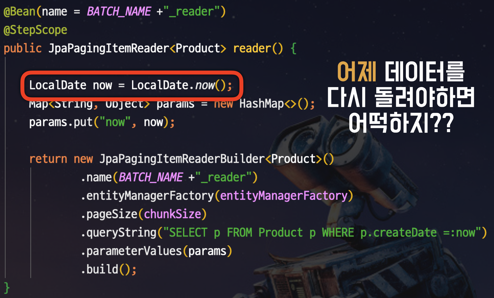
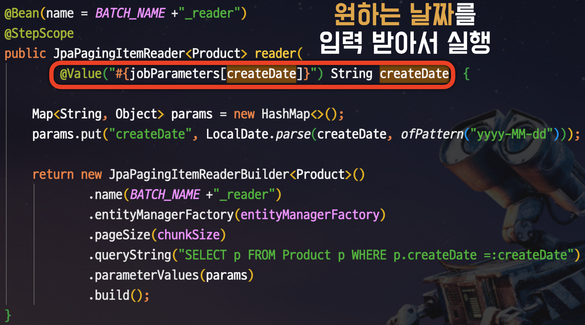
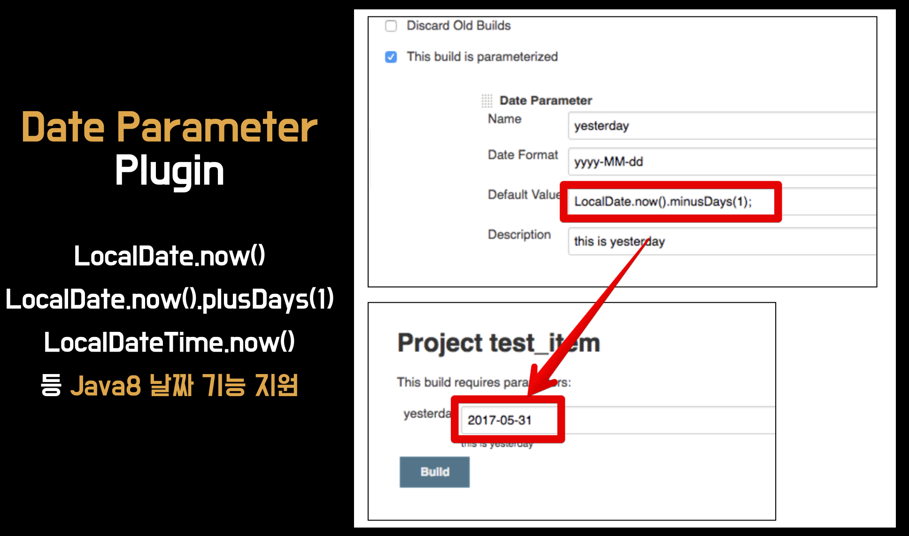

# Spring Batch의 멱등성 유지하기

프로그래밍에서 자주 사용되는 단어 중에 **멱등성** 이 있습니다.  
이 멱등성을 한마디로 정의 하면  
  
**연산을 여러번 적용하더라도 결과가 달라지지 않는 성질**  
  
입니다.  
  
> 참고: [idempotent-rest-apis](https://restfulapi.net/idempotent-rest-apis/)

Spring Batch에서도 역시 이런 멱등성이 필요한 경우가 있습니다.  
  
예를 들어 Spring Batch를 사용하다보면 **동적으로 변하는 날짜**가 필요한 경우가 있습니다.  
대표적으로 다음과 같은 경우들 입니다.

* 매일 한번 **어제** 매출 데이터를 집계해야할 때
* **현재 시간**을 기준으로 유효기간이 만료된 포인트를 정리할 때
* 매일 한번 **오늘**을 기준으로 휴면회원 처리를 할 때

등등 **실행되는 시간을 기준**으로 데이터를 조회하고 처리해야할 경우들입니다.  
이럴때 가장 흔하게 사용되는 방법이 ```LocalDate.now()``` 혹은 ```LocalDateTime.now()```를 코드에서 사용하는 것 입니다.  
  
예시로 아래와 같이 **오늘** 날짜를 기준으로 데이터를 처리하는 배치 코드입니다.

```java
@Bean(name = BATCH_NAME +"_reader")
@StepScope
public JpaPagingItemReader<Product> reader() {

    LocalDate now = LocalDate.now();
    Map<String, Object> params = new HashMap<>();
    params.put("now", now);

    return new JpaPagingItemReaderBuilder<Product>()
            .name(BATCH_NAME +"_reader")
            .entityManagerFactory(entityManagerFactory)
            .pageSize(chunkSize)
            .queryString("SELECT p FROM Product p WHERE p.createDate =:now")
            .parameterValues(params)
            .build();
}
```

평소에는 별 문제가 없지만, 갑자기 이슈가 발생해서 **어제 데이터를 다시 처리**할 필요가 생긴다면 어떡해야할까요?  



이렇게 되면 해결책은 단 하나 뿐입니다.  

1. 코드를 **임시 수정** & **임시 배포**해서
2. 배치를 돌리고
3. **다시 롤백**한다.

운영의 문제 뿐만 아니라 테스트의 문제도 있습니다.  

> 참고: [테스트 코드에선 LocalDate.now()를 쓰지 말자.](https://jojoldu.tistory.com/416)

**공휴일/주말/평일 마다 테스트 결과가 달라지게** 될 수도 있습니다.  
  
자 이런 경우가 바로 **멱등성이 깨진 경우**입니다.  
언제 실행하던지 같은 결과가 나와야하는데, 지금과 같이 **코드 내부**에서 ```LocalDate.now()```를 사용하게 되면 실행되는 날짜에 따라 언제든 결과가 달라 집니다.  

> 9월 16일에 이 코드를 실행할때와 9월 17일에 실행할때가 결과가 달라지기 때문입니다.  
> 파라미터는 똑같이 넣었는데도 말이죠.

그럼 어떻게 해야 이 문제를 해결할 수 있을까요?

## 해결책

위와 같이 멱등성이 깨진 이유는 **제어할 수 없는 코드가 내부에 있기 때문**입니다.  
즉, ```new Scanner(System.in)```, ```LocalDate.now()```, ```new Random()``` 등 **결과를 개발자가 제어할 수 없는 코드는 내부에서 사용 하면 안됩니다**.  
  
이런 값들이 필요하다면 **외부에서 값을 주입**하도록 해야 합니다.  
지금 같은 경우 ```LocalDate.now()``` 를 호출하기 보다는 **Spring Batch Job Parameter**로 **오늘의 날짜**가 넘어오도록 하면 됩니다.



이렇게 하게 되면 언제든 **입력한 값이 동일하면 동일한 결과가 나옵니다**.  

## Date Parameter

그럼 실제 운영 환경에선 어떻게 해결할 수 있을까요?  
저 같은 경우 Spring Batch를 관리할때 항상 Jenkins를 선택합니다.

> 참고: [AWS Code Deploy로 배포 Jenkins에서 배치 Jenkins로 Spring Batch 배포하기](https://jojoldu.tistory.com/313)

Jenkins를 비롯한 **Spring Batch를 실행하는 쪽에서 오늘의 날짜를 JobParameter로 넘겨줘야만** 위에서 얘기한 멱등성 문제가 해결됩니다.  
  
Jenkins에선 이런 문제점 때문에 이미 만들어진 **플러그인**이 있습니다.  
바로 [DateParameter](https://github.com/jenkinsci/date-parameter-plugin) 라는 플러그인인데요.  
  
아래와 같이 기존 Java 8의 ```LocalDate```, ```LocalDateTime```의 문법으로 Jenkins Parameter를 사용할 수 있습니다.  



즉, Jenkins에서 DateParameter 를 통해 **필요한 날짜를 자동 계산하여** Spring Batch의 JobParameter로 넘겨주면 앞에서 언급한 멱등성 문제가 해결됩니다.  
  
참고로 이 플러그인은 작년에 출시되었습니다.  
사내의 개발자분께서 Jenkins를 사용하다가 답답해서 만들게 되었는데, 지금은 여러 팀이 적극적으로 사용하는 플러그인이 되었습니다.


매일 Jenkins로 Spring Batch를 실행할때마다 이 분께 감사의 인사를 올리며 실행하곤 합니다.
