# Spring Batch 관리 도구로서의 Jenkins

Spring Batch는 아직까지 확실한 **표준 관리 도구**가 없습니다.  
각 팀/회사마다 상이한 방법들을 사용하는데요.  
대표적인 방법들은 아래와 같습니다.

* Cron
* 클라우드 서버리스
  * 이를테면 AWS의 Lambda 에 배치 코드를 등록하고, AWS CloudWatch에서 스케줄링 실행을 하도록 구성하는 방식입니다.  
* API 기반의 직접 만든 관리자 페이지
* Spring Batch Admin
  * **Deprecated** 되었습니다.
    * 더이상 개선하지 않겠다고 합니다.
  * **Spring Cloud Data Flow** 로 전환하라고 합니다.
    * [참고](https://github.com/spring-attic/spring-batch-admin)
* Quartz를 이용한 관리자 페이지
  * Scheduler 역할로 Quartz를 사용하고 그에 대한 UI 대시보드를 직접 만드는 경우입니다.
  * [참고](https://kingbbode.tistory.com/38)
* CI 서비스 (Jenkins / Teamcity 등등)

> Spring Cloud Data Flow는 아직 실무에서 써보질 않아서 비교대상에 넣질 못했습니다.  
> 하나씩 테스트 중인데 정리가 어느정도 되면 블로그에 공유하겠습니다.  

인터넷을 돌아다니다보면 아직까지 Spring Batch Admin 에 대해 언급되거나 직접 어드민 페이지를 만들어 스프링 배치를 관리하는 글을 보게 됩니다.  
  
개인적인 경험이지만, **직접 배치 관리 도구를 만드는 것에 부정적**입니다.  
  
파이프라인/여러 SaaS들과의 통합/배포 도중 스케줄링이 겹쳤을때 처리방안 등 직접 구현으로 한계가 명확하다고 생각하기 때문인데요.  
  
그래서 이번 글에서는 스프링 배치 관리도구로 Jenkins를 쓰면 어떤 장/단점이 있는지 소개하겠습니다.  

> ps. Spring Cloud Data Flow가 국내에서 좀 더 활성화가 많이 되는 시기가 온다면 그땐 이 글이 필요 없을 수도 있습니다.  
> 다만 현재는 Spring Cloud Data Flow가 국내에 활성화가 안된 상태라 그 전까지 참고하시면 좋은 자료라고 생각됩니다.
  
## 1. Jenkins?


Jenkins는 Java 진영의 대표적인 CI 툴로 대부분의 경우에 배포 용도로 사용됩니다.  
그러다보니 배치에서도 Jenkins를 써야된다고 하면 거부감이 들기 마련입니다.  
  
보통 그런 거부감은 **배포하는 서비스가 배치를 다룬다**라는 것 때문에 생기는데요.  
  
그래서 저 같은 경우 **Jenkins 2대**를 각각 개별 서버에서 격리되어 관리되도록 구성해서 사용하기도 합니다.  
(ex: 배포 jenkins는 DB에 대한 권한을 제거하고, 배치 jenkins는 배포 권한을 제거하는 등)

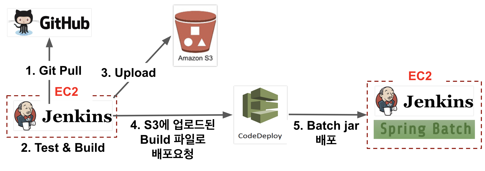

(참고: [배포 Jenkins에서 배치 Jenkins로 Spring Batch 배포하기](https://jojoldu.tistory.com/313))

특히 이렇게 별도로 Batch Jar를 실행하는 CI 도구를 사용하게 될 경우 **배포와 실행**이 개별 과정으로 수행 가능합니다.  
  
즉, **현재 실행중인 스케줄링 작업에 문제가 생기지 않는 배포 구성이 가능**하다는 것을 얘기합니다.

(참고: [Jenkins에 무중단 배치 배포 구성하기](https://jojoldu.tistory.com/315))  
  
자 그럼 본격적으로 Spring Batch의 관리 도구로 Jenkins가 어떤 장/단점이 있는지 확인해보겠습니다.  

## 2. 장점

먼저 Jenkins의 장점을 소개드리겠습니다.  
(여러 장점들이 있지만, 이 중 Spring Batch의 관리 도구로서 체감되는 장점들만 소개드립니다.)

### 2-1. 기본적인 관리 기능

첫번째 장점은 기본적인 관리 기능의 지원입니다.  
  
관리 도구로서 대표 기능이라고 볼 수 있는 대시보드 / 이력관리 / 로그인 / 계정 권한 관리 등등이 **기본으로 지원**됩니다.  
  
**대시보드**

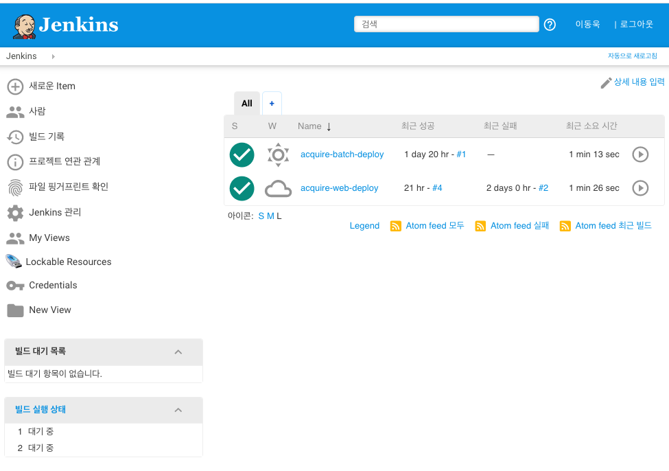

> 위와 같이 머티리얼 테마가 필요하시면 [Simple Theme Plugin plugin](https://jojoldu.tistory.com/343) 을 설치하시면 됩니다.
 
**Job별 이력**

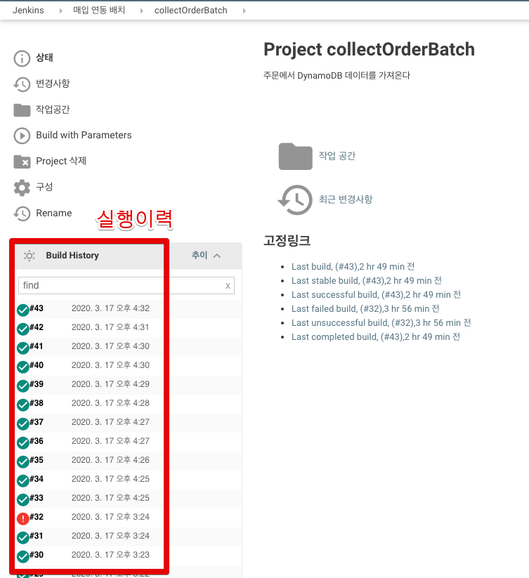


**Job 상세 내역**  
  
특정사용자/파이프라인/다른 Job/스케줄링 중 어떤 방식으로 인해 Job이 시작 되었는지도 볼 수 있습니다.  

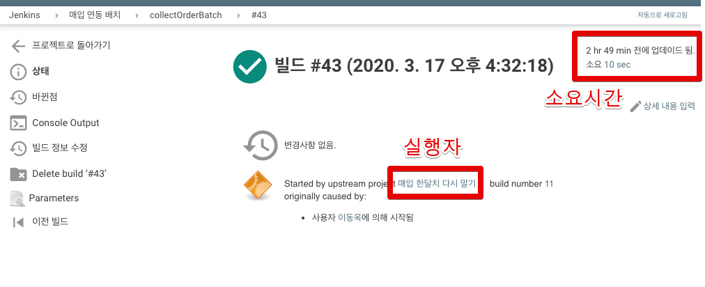

  
**Job 로그**  
  
각 Job 실행별 표준 입출력 역시 대시보드에서 바로 확인할 수가 있습니다.  

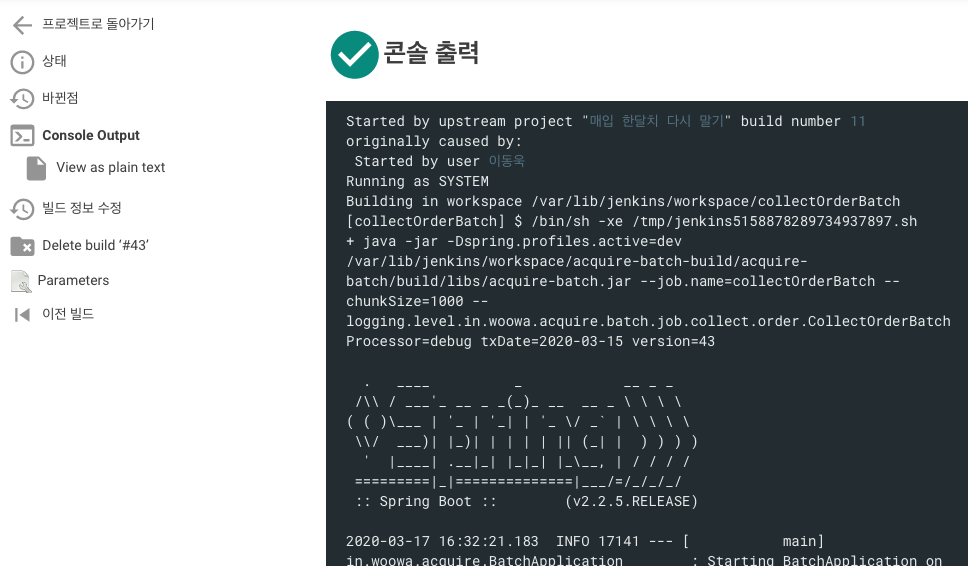

**계정 인증**  
  
계정의 경우 기본적인 ID/Password를 비롯하여 LDAP, Github 등 여러 인증 방식을 지원합니다.

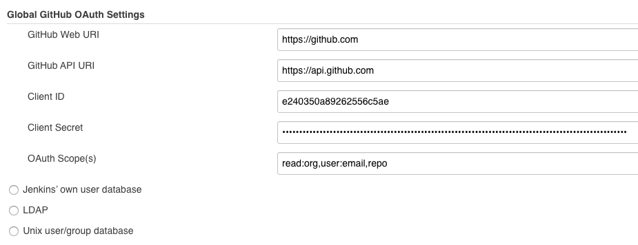

(Github OAuth 인증)  
  
**권한 관리**  
  
Job을 실행할 권한, 보기 권한, 설정 권한 등등도 계정별 혹은 그룹별로 관리가 가능합니다.  
  
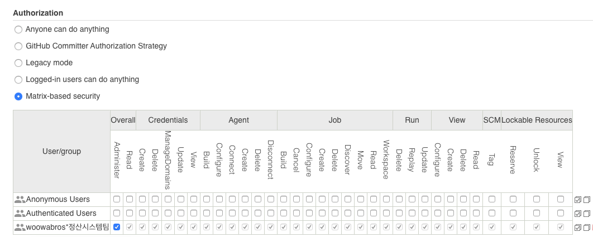

이런 장점들로 인해 얻는 가장 큰 장점은 **추가 개발 공수가 필요하지 않습니다**.  
  
위의 기능이 관리자 페이지의 기본 기능이고 구현상 난이도가 높진 않지만, **어찌됐든 이걸 개발하는데는 공수가 들어갑니다**.  
  
서버에서 ```yum install``` 명령어만 실행하면 사용할 수 있는 서비스를 굳이 **바퀴를 재발명할 필요가 있을까요?**

### 2-2. Integration (통합)

두번째 장점으로 Jenkins의 경우 여러 소프트웨어와의 통합 환경이 잘 구축 되어있습니다.  
  
**Email**

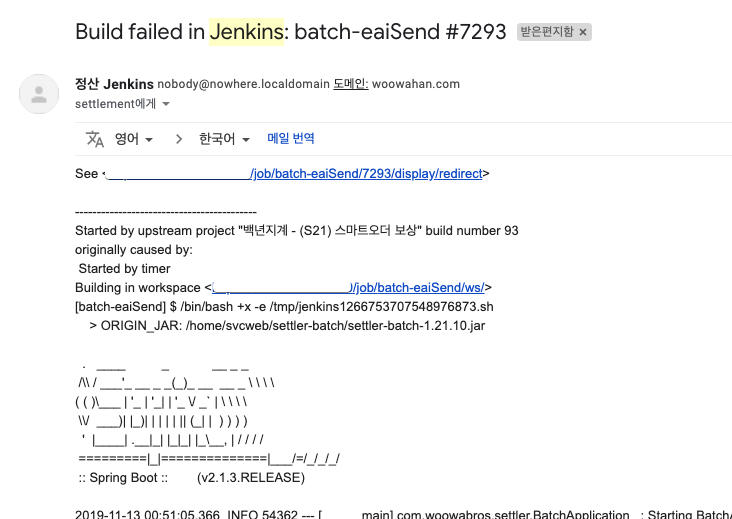

**Slack**

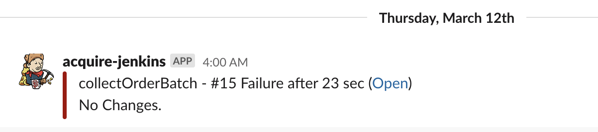

**Github**

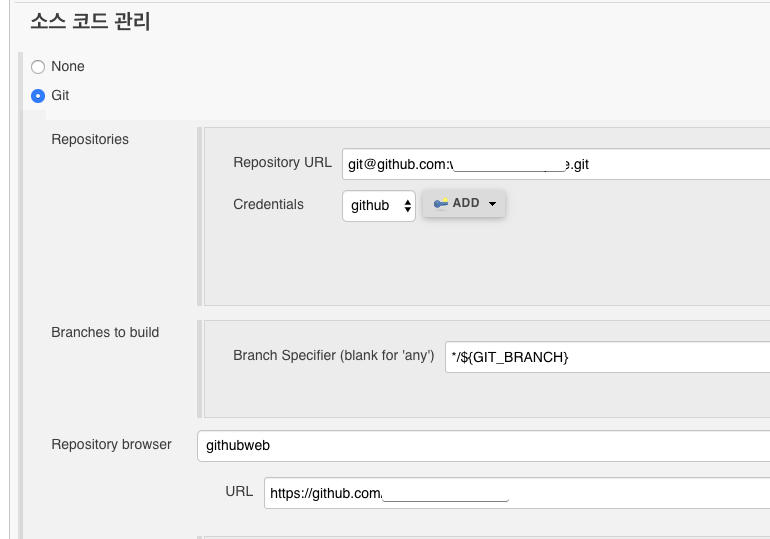

특히 Github의 경우 Repository 연동 뿐만 아니라 **로그인도** OAuth로 연동이 가능합니다.

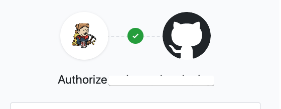

**Logentries**  
  
각 Job 실행별로 나눠진 로그들을 Logentries에 모아줄수도 있습니다.

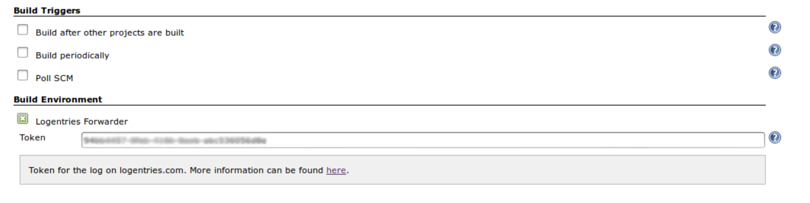

> [Logentries 플러그인](https://github.com/LogentriesCommunity/logentries-jenkins)

**ELK**  

대표적인 로그 수집 모니터링인 ELK 스택에 로그를 보낼수도 있습니다.  

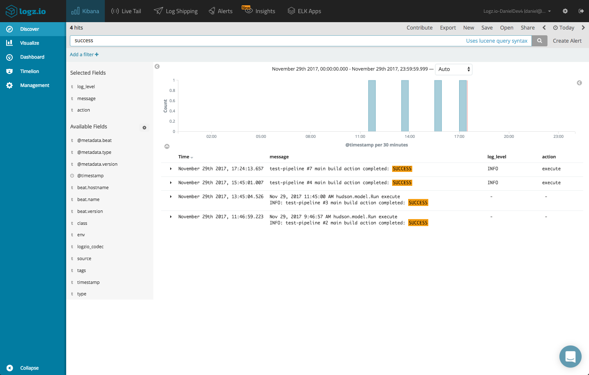

> [Jenkins에 ELK 연동하기](https://logz.io/blog/jenkins-elk-stack/)

이외에도 다양한 소프트웨어와의 통합환경을 지원하고 있습니다.  
(Docker, Kubernetes, AWS ECS, Ansible 등등)  
  
이런 통합환경을 직접 구현한다고 하면 **실제 비지니스를 개발할 시간에 연동 작업만** 하지 않을까요?  

### 2-3. 다양한 Job 실행 환경

보통 Spring Batch 작업을 실행하는 방법을 스케줄링에 대해서만 생각을 많이들 하시는데요.  
  
실제로 수십/수백개의 배치 환경에서 수년간 운영/개선을 하다보면 **스케줄링만으로는 다 대응할 수가 없습니다**.  
  
예를 들어 아래와 같은 상황들이 있습니다.

* 별도의 서비스에서 배치를 실행해야만 할때
  * ex) 챗봇을 통한 실행, 외부 관리자 페이지에서의 실행 등등
* 스케줄링으로 실행되던 배치를 수동으로 한번 실행해야 할때
  * 매번 스케줄링 시간을 현재시간으로 변경하고, 롤백 등을 하다보면 사고가 날 수도 있겠죠?
* A Job이 성공하면 B Job이 이어서 실행되고 싶을때
  * 상황에 따라 A와 B가 별도로 각자 개별로도 실행이 되어야만한다면?
  
Jenkins의 경우 Job을 실행할 수 있는 여러 방법을 지원합니다.  

**스케줄링**

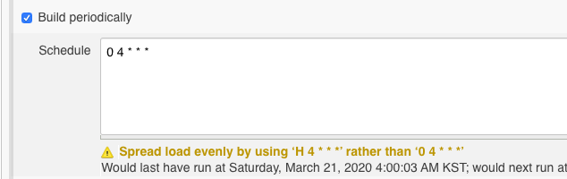

**직접 실행**
  


**HTTP API**

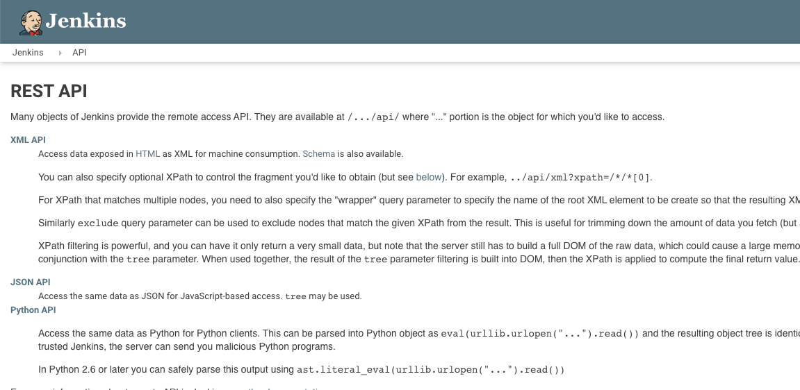

> [기본적인 HTTP API 사용방법](https://tomining.tistory.com/148)

HTTP API의 경우 계정 별로 Token을 관리하기 때문에 해당 Token으로 인증된 요청에 대해서만 허가할 수 있기도 하며, **퇴사한 사용자의 계정은 삭제하여 Token도 막을 수 있습니다**.  
  
**Job Trigger**

현재 Job의 상태에 맞춰 지정된 배치를 후속 실행이 가능하기도 합니다.

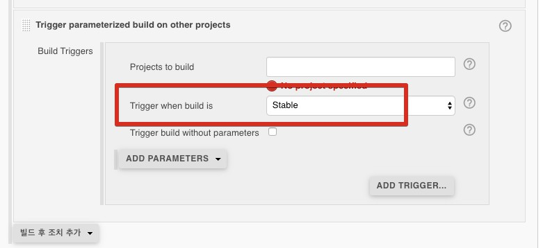

여기서 중요한 점은 **이 중 한개를 선택하는 것이 아니라, 생성된 Job들은 모든 실행 방법을 사용할 수 있다**는 것 입니다.  
  
스케줄링으로 등록된 Job을 HTTP API로 실행이 필요할때 별도로 추가 설정을 할 필요가 없다는 것이죠.  

### 2-4. 풍부한 (국내) 생태계

Java 진영에서 가장 오래되고 유명한 소프트웨어이다보니, 관련된 커뮤니티 / 자료 / 플러그인이 활성화가 되어있습니다.  
  
정말 별별 플러그인들이 다 있으며, 국내 개발자분들이 **직접 플러그인을 만들어** 오픈소스로 공개하기도 합니다.

* [Date Parameter 플러그인](https://plugins.jenkins.io/date-parameter/)
  * Java 8의 ```LocalDate```, ```LocalDateTime``` 문법으로 날짜 파라미터를 사용할 수 있게 해주는 플러그인
* [Monitoring](https://plugins.jenkins.io/monitoring/)
  * Jenkins HTTP API 응답시간, 메모리, CPU 등을 모니터링 해주는 플러그인

국내에는 페이스북 등에서 Jenkins 커뮤니티가 활성화 되어 있습니다.

* [젠킨스 코리아 페이스북 그룹](https://www.facebook.com/groups/jenkinskorea/)

이곳에서 여러가지 팁과 질문들이 오고가고 있으니, 아무래도 좀 더 활성화되기 쉬울 수 밖에 없습니다.  
  
특히나 네이버/다음과 같이 국내에서 Java 생태계에서 대규모로 서비스를 운영한 회사들이 많으며, 해당 회사들이 Jenkins를 사용하면서 얻은 노하우들이 많이 있다보니 다른 서비스에 비해 확실한 강점이 있다고 봅니다.  
  
우리 팀이 만든 관리 도구는 **우리팀만 알겠죠?**.  
직접 만든 도구를 사용한다면 어떤 이슈가 발생했을때, 그 도구를 만든 사람 외에는 물어볼 곳이 없는 것도 단점입니다.  

> 비슷한 사례로 **사내 프레임워크/플랫폼을 사용할때 해당 서비스의 담당자가 1~2명**이라면 해당 담당자 퇴사하면 관리 부재가 발생하는 경우가 빈번합니다.

### 2-5. 파이프라인

Jenkins와 같은 CI도구의 최대 장점이라고 볼 수 있는 **파이프라인은 배치 관리 도구의 가장 큰 장점**이라고 봅니다.

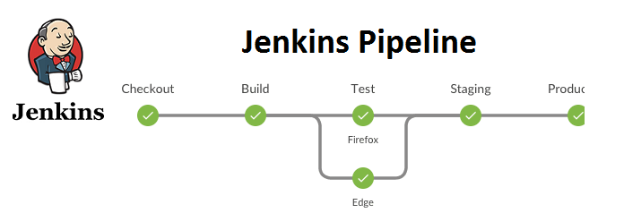

파이프라인 덕분에 **배치의 설계도 큰 개선이 가능**합니다.  
  
예를 들어 기존엔 아래와 같이 1개의 Job에 N개의 Step을 구성하는데요.

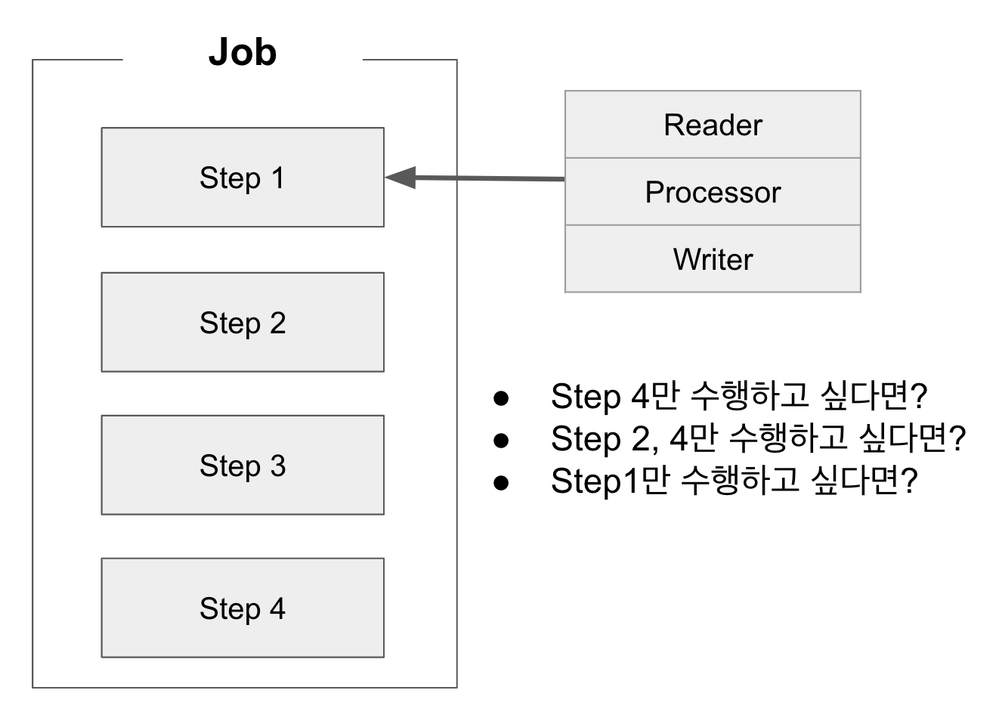

여기서 만약 아래와 같은 요구사항이 생기면 어떻게 될까요?

* Step4만 수행하고 싶다면?
* Step2, 4만 수행하고 싶다면?
* Step1만 수행하고 싶다면?

이런 요구 사항을 다 들어줄려면 ```if```문과 [Spring Batch Job Flow](https://jojoldu.tistory.com/328) 로 도배된 코드가 필요합니다.  
  
더 큰 문제는 **설계 초기에 이런 조건별 실행이 고려되지 않았을 때**입니다.  
  
이럴 경우 해당 Job 코드를 완전히 뜯어 고쳐야하기도 하고, **모든 예외 상황을 검증**해봐야 합니다.  
  
하지만 파이프라인이 지원 된다면 이 문제를 해결할 수 있습니다.

#### Job을 최소 단위로 사용하기

파이프라인으로 Job을 묶어주는 것이 가능하기 때문에 **Step이 아닌 Job을 최소 단위로 사용**할 수 있습니다.

* Job과 Step의 1:1 관계로
* Step만큼 나눠진 Job들은 파이프라인이 Job을 묶어주는 구조로 변경

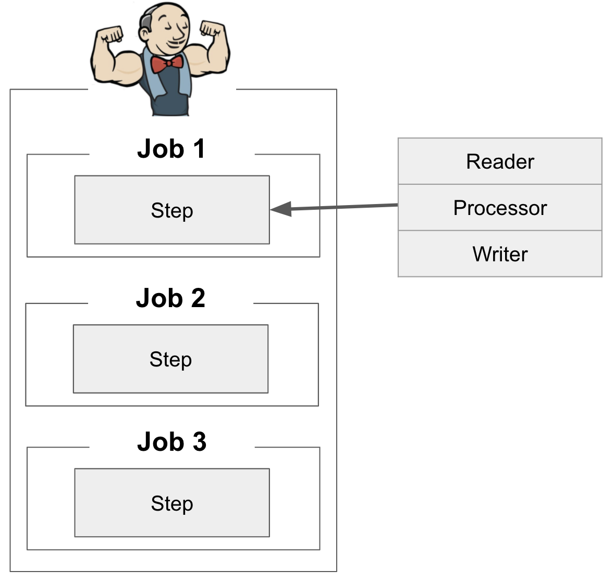

* Job1 -> Job2 -> Job3 순차적으로 실행하거나
* Job1 | Job2 | Job3 이 각자 동시에 수행되게 하거나
* Job1과 Job2는 병렬로 수행하고 이 2개가 끝나면 Job3이 수행한다거나

위와 같이 여러가지 경우에 대해서 **각각의 Job들을 어떻게 실행할지** 파이프라인이 결정할 수 있습니다.  
  
어떤 순서로 어떻게 실행할지를 파이프라인이 담당해주니, 배치 Job 코드에서는 **딱 본인의 Job 역할에만 충실**하면 됩니다.  
  
특히나 **기존에 잘 작동되는 배치 코드를 수정하지 않아도** 모든 요구사항에 대해 대응이 가능합니다.

#### Loop 실행

위 케이스외에 이런 케이스도 있습니다.  
  
기본적으로는 지정된 날짜의 데이터를 가공하는 배치였는데, 마이그레이션을 위해 **한달치를 실행**해야한다면 어떻게 해야할까요?

* 쿼리를 수정해서 Group by코드로 변경하고
* 지정된 날짜 하나만 받던 Job Parameter를 시작일/종료일 받는 구조로 변경하고
* 배치에서 수행하는 쿼리문의 ```where``` 는 단일 비교(```eq```)에서 ```between```으로 변경 
  * ```eq```에서 범위 검색으로 변경되었으니 **인덱스도 검토**를 해봐야겠죠?
* 변경된 배치 코드로 인해 깨진 테스트를 수정하고, 변경된 조건도 잘 되는지 테스트 코드도 추가해야합니다.

하지만 파이프라인이 지원된다면 아래와 같이 **반복문으로 날짜를 변경하면서 Job 실행**이 가능합니다.

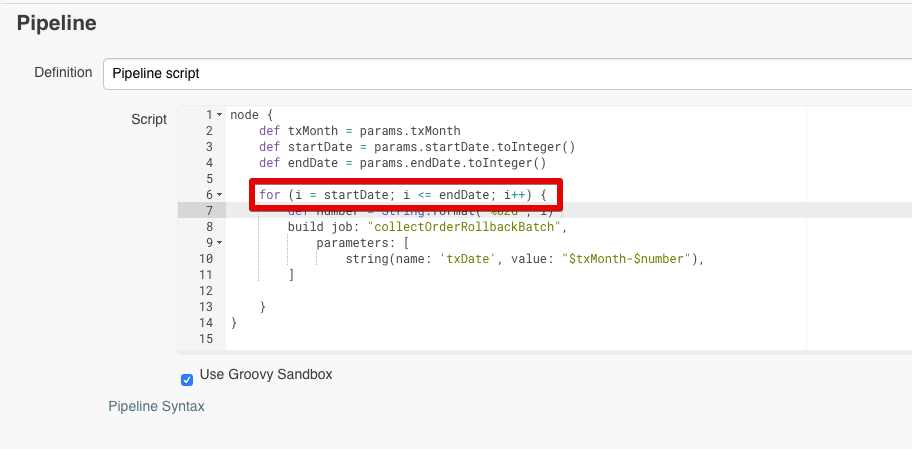

기존 코드를 아예 손대지 않고도 가능합니다.  
  
완성된 배치 코드를 어떻게 조립하고 사용할지 파이프라인에게 위임하니 **개발자들은 단일 책임 원칙을 Batch Job에도 적용**할 수 있게 됩니다.  
  
물론 이런 파이프라인을 관리할 수 있는 방법들도 다양하게 지원합니다.  

* Web GUI
* Web Script
* 지정된 위치의 Groovy File

개인적인 생각으론 배치 관리 도구로서 파이프라인은 빠질 수 없는 장점이라고 생각합니다.  

> 혹시나 안쓰고 계셨던 분들이 계신다면 꼭 한번 배치 구조를 파이프라인 관리 하에 변경해보시길 추천드립니다.  

## 2-6. Slave Node 환경

Jenkins는 Slave Node 환경 운영/구축이 쉽다는 장점도 있습니다.  
  
예를 들어 한대의 Jenkins 서버로 운영중일때 작업시간이 오래 걸리고 하드웨어 자원 (CPU, Memory)를 많이 사용하는 Batch를 수행중이라면 어떨까요?  
  
이때 다른 Batch들을 수행하기는 어렵습니다.  
해당 큰 Batch 작업으로 인해 사용할 자원이 없기 때문이죠.  
  
이럴 경우 별도의 Jenkins 서버가 또 있어 거기서 다른 Batch를 수행할 수 있다면 무관하게 실행할 수 있겠죠?  
  
Jenkins에서는 이런 경우를 해결할 수 있는 Master-Slave Node 환경을 지원합니다.  
  
(사실은 분산 빌드를 위한거지만)
  
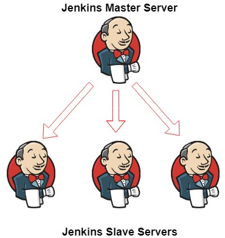

> 공식 문서에서는 [분산 빌드](https://wiki.jenkins.io/display/JENKINS/Distributed+builds) 로 소개하고 있습니다.

서버 연결만 SSH로 열려있다면 **별도의 Jenkins 설치 없이** Salve로 활용할 수 있습니다.  
(별도의 실행 환경 구성은 Master 젠킨스가 처리합니다.)  
  
여분의 서버만 있다면 언제든 Batch Job들을 격리해서 실행할 수 있게 됩니다.  
  
또한 단일 작업을 쪼개서 실행하는 것도 가능합니다.  
  
예를 들어 Slave Node 서버가 4개가 있다면, 특정일자를 4등분하여 처리할 수도 있습니다.
  
해당 일자와 Slave Node 서버의 라벨을 이용하여

* 1번 라벨에서는 0 ~ 6시
* 2번 라벨에서는 6 ~ 12시
* 3번 라벨에서는 12 ~ 18시
* 4번 라벨에서는 18 ~ 24시

등으로 나눠서 처리하는 것이죠.  
  
파이프라인과 마찬가지로 Batch가 분산처리에 대해 전혀 신경쓰지 않게 해주는 고마운 기능중 하나입니다.

> 물론 좀 더 파워풀하게 사용하기 위해서는 [Node and Label parameter](https://plugins.jenkins.io/nodelabelparameter/)가 필수입니다.

## 3. 단점

Spring Batch 관리 도구로 Jenkins의 여러 장점들을 소개드렸는데요.  
이런 장점에 비해 **단점도 명확하게 많이 존재**합니다.  
  
기본적으로 아래와 같은 단점들이 있습니다.

* 소수의 배치를 관리하기 위해 사용하기엔 과함
  * 2~3개의 배치만 필요한 상황에서는 부담스러운 면이 있습니다.
  * 기존에 사용하던 어드민에서 그냥 배치 코드만 추가하는게 당장엔 공수가 덜 들어가긴 합니다 (추천하진 않습니다.)

* 빈약한 Web Editor 지원
  * 대부분의 CI 도구들에서는 Web Editor (Shell명령어나 파이프라인 스크립트 작성 에디터)에서 **자동 완성, 문법 지원**등이 강력하게 지원됩니다.
    * 예로, Teamcity의 경우 WebEditor에서 현재 사용할 수 있는 환경변수/Teamcity에 등록한 전역변수 등을 자동 완성으로 계속 추천해줍니다.
  * Jenkins의 경우 **문법 체크/템플릿 외에는 지원하지 않습니다**.

* 빈약한 실행 이력 관리
  * Job 실행 이력에서 **어떤 파라미터를 실행했는지는 이력에선 볼 수 없습니다**.
  * 각 실행 화면에 직접 들어가야만 볼 수 있습니다.
  * 검색 기능/페이징 기능도 빈약하여 실행 이력에서 내가 원하는 실행 기록을 찾는게 쉬운일이 아닙니다.

* 신뢰할 수 없는 플러그인
  * 예를 들어 Docker 관련 플러그인을 검색해보시면 **20개가 넘는 결과**가 조회 됩니다. (이 중 어떤걸 써야할까요?)
  * 뿐만 아니라 대부분의 플러그인에 대해 Jenkins가 확실하게 보장하지 않습니다. (다른 CI도구들은 플러그인에 대해 검수가 철저하죠)
  * 특히나 Jenkins 버전업시 사용 못하는 경우가 빈번합니다.

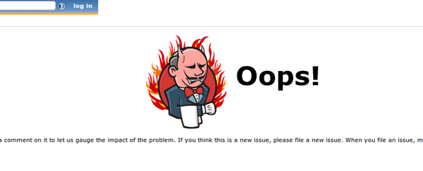

(플러그인 설치했더니, Jenkins 화면에 저런 에러 메세지 보는 경우는 흔한 일입니다.)

* 플러그인 만들기가 쉬운편이 아닙니다.
  * Jenkins 플러그인 한번 만들어 보신 분들은 공감하실텐데, 진짜 복잡하고 과정이 많습니다.
  * 예전에 jcenter 나오기전에 mavencentral에 라이브러리 등록하는 과정을 떠올려 보시면 됩니다.
  * 다른 CI 도구들이 플러그인 등록 과정을 정말 쉽게 구현한 것과 비교하면 차이가 많이 납니다.

> 그래도 플러그인 등록하는 분들이 계신걸 보면 존경스럽다는 생각을 합니다.

사실 위 단점들은 이해할 수 있으나, 아래 단점들은 경우에 따라서 치명적일 수 있습니다.

### 3-1. 파일 기반의 설정 정보

* Jenkins는 Jenkins의 설정 정보를 비롯한, Job 실행 이력, Job 설정 정보등이 전부 **파일로 관리**됩니다.
* 그러다보니 설정 정보/실행 이력/현재 Job 정보등이 궁금하면 **Jenkins 가 제공하는 API 혹은 서버내에 존재하는 XML파일로만** 확인할 수 있습니다.

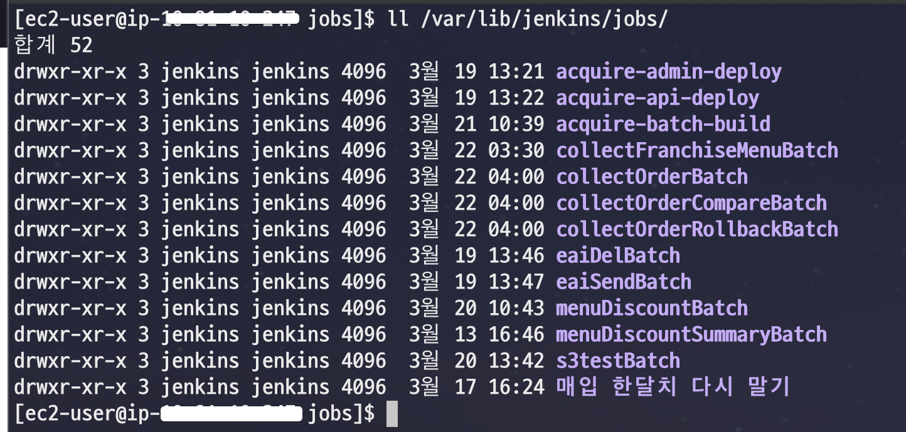

여러분이 웹 서비스를 만들었는데, DB로 데이터를 관리하지 않고, JSON 파일로 데이터를 관리한다고 생각하시면 어떠신가요?  
  
정말 활용할 방법이 제한되지 않을까요.  
불가능하진 않겠지만, 제대로 확장성있게 사용하기엔 너무 불편하겠죠?  

### 3-2. 빈약한 검색 기능

* 위 단점인 "파일 기반의 설정 정보" 로 인해 발생하는 추가적인 단점1 입니다.
* 설정들이 다 파일로 되어있으니 **검색 기능이 파일 검색** 기반입니다.
* 많이들 사용하시는 소프트웨어인 Jira / Confluence / Logentries 등과 같은 검색 수준을 기대할 수가 없습니다.
  * 위 서비스들 외에 다른 CI도구들에 비해서도 검색 기능이 가장 약합니다.

### 3-3. 백업 & 이중화의 어려움

* 위 단점인 "파일 기반의 설정 정보" 로 인해 발생하는 추가적인 단점2 입니다.
* 파일 기반으로 구성되다보니 ```rsync``` 등으로 백업 서버로 게속 동기화 하지 않는 이상은 **주기적으로 외부파일서버/S3/Github등으로 디렉토리 통째로 업로드** 하는 방법으로만 백업 해야만 합니다.
* 실시간 동기화가 아니기도하고, 업로드 실패나면 알람 받고 오류 확인해서 수정하는 등 **별도의 공수가 계속 필요합니다**

이게 대부분의 CI 도구들이 이렇다면 어쩔수 없겠지만, Jenkins를 제외한 다른 도구들은 보편적으로 이런 정보들을 **DB**로 관리합니다.  
  
즉, HA가 지원되는 DB가 이미 구성되어있다면 별도로 백업 환경 구성 없이 장애 날 경우에 해당 CI를 설치만 하고 **DB 주소 연결만 하면 즉시 복구**됩니다.
  
> 보통 서비스 운영에 사용되는 DB들은 HA 구성은 기본으로 깔고 시작하니 이건 할게 없는것이나 마찬가지죠.

## 4. 대안?

Jenkins가 나쁜 도구는 아니지만, 개인 혹은 팀에 따라 위의 단점들이 치명적일 수 있습니다.  
  
그렇다고 Jenkins의 전체 구조 개편을 기다리기만 할수는 없겠죠.  
  
그래서 저 같은 경우엔 2가지를 대체제로 보고 시험해보고 있습니다.  

### 4-1. Teamcity

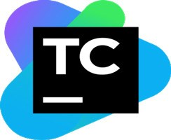

* JetBrains의 CI 도구입니다.
* 파이프라인 / 스케줄링 등 Jenkins가 지원하는 대부분의 기능을 동일하게 지원합니다.
* Jetbrains 제품군 (IntelliJ, DataGrip, Upsource 등) 과 통합이 정말 잘 지원됩니다.
  * Job 알람에 대해 IntelliJ에서 알람이 보여지는 등
* 제일 큰 장점은 **설정 정보들이 DB로 관리**되고 있습니다.
  * 백업/이중화는 DB만 이루어지면 됩니다.
  * Teamcity는 어디든 설치만해서 바로 DB 연결만 하면 똑같은 Teamcity 환경이 구성됩니다.
  * 여러대의 서버를 운영한다고 해도 스케줄링/설정 등에 대한 관리 요소가 전혀 없습니다.
  * DB에서 다 관리중이니, 각 TeamCity 서버에 대한 동기화 걱정이 없습니다.
  * 당연히 별도의 기능이 필요한 경우 API를 사용해도 되고, 직접 Teamcity 설정 정보를 담고 있는 DB에 Query를 날려서 사용해도 됩니다.

#### 단점

* Jenkins UI와 사용성에 익숙하신 분들에겐 굉장히 어색합니다.
  * Teamcity와 Jenkins 둘다 처음 접하는 분들은 Teamcity의 UI/UX가 훨씬 더 편하고 친숙하다는 의견도 있습니다만, Jenkins에서 넘어가시는 분들에겐 굉장히 어색합니다.
* 일정 규모이상에서는 **유료** 플랜이 필요합니다.
* 결국은 CI/CD 도구이다보니 배치쪽으로 발전 방향이 향하고 있진 않습니다.
* 플러그인 생태계가 Jenkins에 비해 약합니다.
  * 전체 플러그인 수가 10배 이상 차이납니다.
  * 그럼에도 Github 로그인 / 슬랙 연동 등 대부분의 플러그인들은 존재합니다.
  * 현재는 플러그인 생태계를 활성화 하고자 여러 이벤트를 개최하기도 합니다.
  
### 4-2. Spring Cloud Data Flow

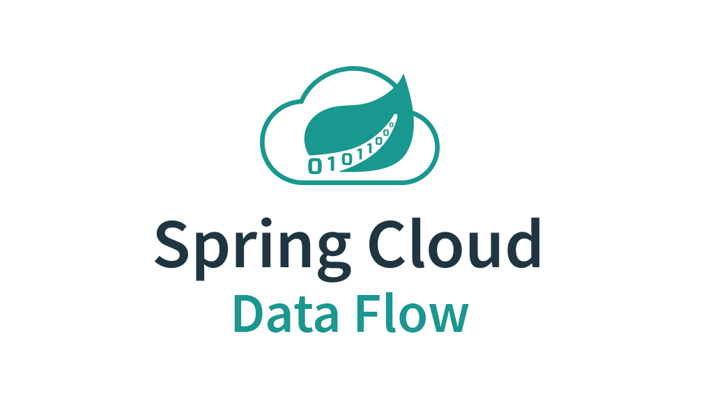

* Spring에서 공식적으로 밀고 있는 Batch/Data Stream 매니저입니다.
* Spring에서 대놓고 Batch/Data Stream 매니저로 나온 도구라서 발전 방향이 그쪽으로 명확합니다.
* Teamcity와 마찬가지로 DB에 여러 설정 정보들을 관리합니다.
  * 별도로 지정하지 않으면 인메모리 DB (H2)를 사용합니다.
* 오픈소스이다보니 유료 플랜 걱정이 없습니다.

#### 단점
  
**CloudFoundry 혹은 Kubernates 환경**이 아니면 제대로 활용하기가 어렵습니다.

* 일단 저 둘의 환경에서만 스케줄링 기능을 사용 할 수 있습니다.
* 즉, **단일 서버에서는 스케줄링 기능을 못 쓴다**는 것입니다.
* 컨셉 자체가 **배치가 실행될때만 컨테이너를 별도로 생성해서 실행하고 종료**하기 위함이라 컨테이너 오케스트레이션 없이 사용하려면 굉장히 제한적입니다.

당연히 위 단점으로 인해 **허들이 다른 어떤 도구들 보다 높습니다**

* Cloud Native Batch Application 을 위해 나온 서비스라 클라우드를 굉장히 단순하게만 사용하는 그룹에서 사용하기엔 초기 허들이 높습니다.
* Spring Batch에 대한 공부보다 Kubernates 와 Docker 공부가 우선 되어야할 수도 있습니다.

클라우드가 아닌 IDC 환경에서 **단일 서버**로만 배치 환경을 구성해서 쓰실 분들은 선택지에서 제외하는게 낫습니다.

* 단일 서버에 Kubernates 설치하고 그 서버안에서 Docker 생성&삭제를 하도록 하는건 거의 무의미합니다.

국내 자료나 사례가 너무 적습니다.

* (정상혁님의 제보로) 네이버 계열사 중 사용하는 곳이 있다고 제보 받았는데요.
* 아직까진 이외에 운영 환경에서 사용하고 있는 사례를 제보 받은게 없습니다.
* 그만큼 국내에서 활성화된 도구가 아니며, 관련해서 Hello World 외에는 거의 없습니다.
* 다른 Batch 관리 도구에 비해 맨땅에 헤딩하시는 일이 굉장히 많을 수 밖에 없습니다.

## 5. 마무리

직접 배치 관리 도구를 만드시는 분들은 **위 장점들을 직접 다 구현할 수 있을지** 한번은 고민해보시면 좋습니다.  
  
특히나 **파이프라인** 기능은 소수의 몇명이 구현하기에는 사이즈가 너무 큽니다.  
모든 비용 중에 가장 큰 비용은 **인건비**입니다.  

> 같은 의견으로 사내 프레임워크 만든다고 하면 저는 거의 실패한다고 생각하고 반대의견을 가집니다.  
> 사내 프레임워크 만들 공수와 인력으로 오픈소스 혹은 전문적으로 매니징 되고 있는 도구를 사용하는게 훨씬 낫다고 봅니다.

어디까지나 저의 개인적인 경험으로 정리한 글이다보니 취향이 많이 반영되었습니다.  
이미 팀내에서 잘 사용하고 있는 도구가 있다면, 해당 도구를 적극 사용하시면 될것 같습니다.  
하지만 만약 이제 도입 시기이거나 현재 도구에 불만족 하고 계신다면 이 글을 계기로 고민해보시면 좋을것 같습니다.  

> 제가 혹시나 탈 Jenkins를 하게 된다면 그때 또 추가 글을 작성하겠습니다.