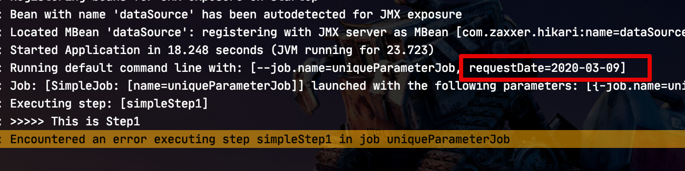
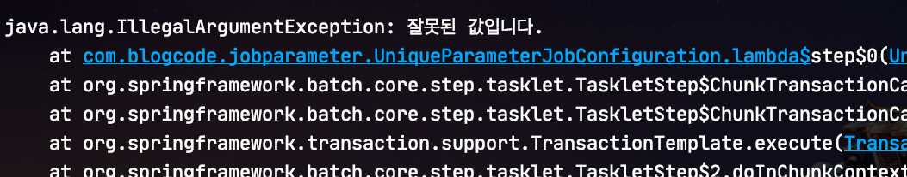
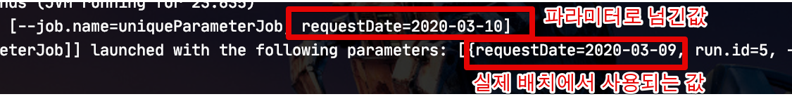
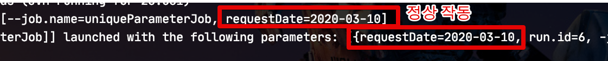
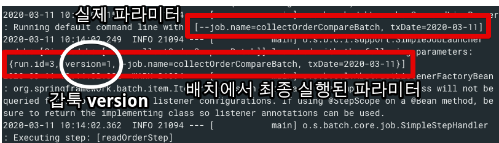
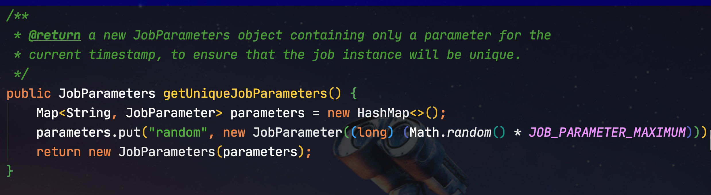
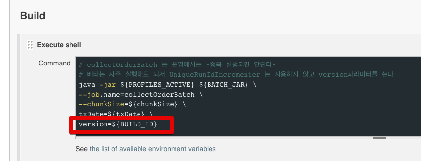

# Spring Batch의 유니크 Job Parameter 활용하기

Spring Batch의 경우 일반적으로 **동일 Job Parameter로 실행시** 어떻게 처리할 것인지에 대해 여러가지 옵션을 제공합니다.

* 해당 파라미터로 최근 실패한 이력이 있다면 이어서 실행할 것인지
* 해당 파라미터로 최근 실패 혹은 성공한 이력이 있다면 실행하지 않을 것인지
* 해당 파라미터로 최근 실행한 이력이 있어도 무시하고 다시 실행할 것인지

등등이 있습니다.  
  
대부분의 경우 동일 Job Parameter 실행을 막곤 하는데요.  
(중복 데이터가 쌓일 수가 있기 때문에)  
  
일부 배치에서는 **동일 Job Parameter로 계속 실행이 될 수 있길** 원하기도 합니다.  
예를 들어 특정 데이터에 대한 검증 로직 혹은 데이터 갱신 배치 등이 이에 해당 됩니다.  
  
이번 글에서는 바로 이렇게 **동일 Job Parameter로 계속 실행이 되는 방법**에 대한 방법과 이를 활용하는 패턴들을 알아보겠습니다.  

## 1. RunIdIncrementer

Spring Batch에서는 **동일 파라미터인데 다시 실행하고 싶을때** 사용하라는 의미로 ```RunIdIncrementer```를 제공합니다.  
  
실제로 사용 방법은 아래처럼 Job 의 ```incrementer``` 옵션에 추가하여 사용합니다.

```java
public Job job() {
    return jobBuilderFactory.get(JOB_NAME)
            .start(step(null))
            .incrementer(new RunIdIncrementer())
            .build();
}
```

이렇게 사용할 경우 Spring Batch에서 전달받은 Job Parameter 외에 ```run.id``` 라는 **임의의 파라미터를 추가**로 사용해 매번 ```run.id``` 값을 변경해줍니다.  
매 실행마다 ```run.id```가 변경되니 재실행 할 수 있게 되는 것인데요.  
  
Spring Boot 1.5.x (Spring Batch 3.x) 까지는 해당 기능에 문제가 없었습니다만, Spring Boot 2 (Spring Batch 4) 로 버전업이 되면서 큰 버그가 하나 생겼습니다.  


### 1-1. Spring Boot 2.0.x에서 발생하는 버그

바로 **배치 Job이 실패할 경우 이후에 파라미터를 변경해도 계속 실패한 파라미터가 사용되는**것 입니다.  
  
> 해당 버그에 관해서 [Spring Batch Jira](https://jira.spring.io/si/jira.issueviews:issue-html/BATCH-2711/BATCH-2711.html)에서 논의가 되었으니 필요하신분들은 읽어보셔도 좋을것 같습니다.  
> 스레드에서 어떻게 토론이 진행되는지 구경하는 재미가 솔솔합니다.

실제로 보여드리기 위해 프로젝트의 Spring Boot 버전을 2.0.6으로 내려서 Job을 수행해보겠습니다.

> 참고로 해당 버그는 CLI로 실행시에만 발생합니다.  
> 실행자 (Executor)가 CLI가 아닌 경우 (ex: 테스트 코드 런처) 에선 재현이 안됩니다.  

테스트로 사용할 Job의 구현 (step)은 아래와 같습니다.  

```java
@Bean(name = JOB_NAME+"_step")
@JobScope
public Step step(@Value("#{jobParameters[requestDate]}") String requestDate) {
    return stepBuilderFactory.get("simpleStep1")
            .tasklet((contribution, chunkContext) -> {
                log.info(">>>>> This is Step1");

                if("2020-03-09".equals(requestDate)) {
                    throw new IllegalArgumentException("잘못된 값입니다.");
                }

                log.info(">>>>> requestDate = {}", requestDate);
                return RepeatStatus.FINISHED;
            })
            .build();
}
```

Job Parameter로 ```requestDate=2020-03-09```가 넘어오면 Exception이 발생합니다.  
  
실제로 실행해보면 아래와 같이 ```2020-03-09``` 로 파라미터가 넘어오면



Exception이 발생해 배치가 실패한 것을 확인할 수 있습니다.



자 이렇게 **한번 실패한 이력을 쌓은 뒤에**


  
이번엔 **정상값**인 ```2020-03-10```으로 다시 실행을 해보겠습니다.  
  
그러면?  
  
아래처럼 실제로 넘긴 파라미터와 달리 **실패한 파라미터인 2020-03-09가 재사용** 된 것을 확인할 수 있습니다.



그래서 이 배치 실행은 또다시 실패하게 됩니다.  
(계속 실패한 파라미터를 재사용하기 때문이죠.)  
  
자 그럼 이 문제는 어떻게 해결하면 될까요?

#### 해결 방법

제일 쉬운 해결 방법은 **넘어온 파라미터와 run.id**만 사용하도록 **별도의 RunIdIncrementer 클래스**를 만들어서 사용하는 것입니다.  
  
```java
import org.springframework.batch.core.JobParameters;
import org.springframework.batch.core.JobParametersBuilder;
import org.springframework.batch.core.launch.support.RunIdIncrementer;

public class UniqueRunIdIncrementer extends RunIdIncrementer {
    private static final String RUN_ID = "run.id";

    @Override
    public JobParameters getNext(JobParameters parameters) {
        JobParameters params = (parameters == null) ? new JobParameters() : parameters;
        return new JobParametersBuilder()
                .addLong(RUN_ID, params.getLong(RUN_ID, 0L) + 1)
                .toJobParameters();
    }
}
```

* ```run.id```가 실행시마다 계속 변경되어야하니, 이전 ```run.id``` 값에 +1을 시켜 계속 다른 값을 사용하도록 합니다.
  
그리고 이렇게 만든 ```UniqueRunIdIncrementer```를 기존의 ```RunIdIncrementer``` 자리에 대신 사용합니다.

```java
public Job job() {
    return jobBuilderFactory.get(JOB_NAME)
            .start(step(null))
            .incrementer(new UniqueRunIdIncrementer())
            .build();
}
```

이렇게 변경 후 다시 실행해보시면?



정상적으로 작동되는 것을 확인할 수 있습니다.

### 1-2. Spring Boot 2.1.0 이상부터는?

위의 버그는 **Spring Boot 2.1.0 (Spring Batch 4.1.0)** 에서 해결되었습니다.  
  
**관련 PR**

* [Spring Boot PR](https://github.com/spring-projects/spring-boot/pull/14933)
* [Spring Batch PR](https://github.com/spring-projects/spring-batch/pull/660)

그래서 최신의 Spring Boot를 사용하시는 분들은 기존처럼 ```RunIdIncrementer```를 사용하시면 된다고 말씀드리고 싶지만!  
  
여전히 ```RunIdIncrementer``` 에 버그가 하나 더 있는데,  
**이전의 Job이 실행시 사용한 파라미터 중 하나가 다음 실행시 누락되면 누락된 파라미터를 재사용**합니다.  



* ```version``` 파라미터는 이전에 실행할때 사용한 임시 파라미터입니다.
* 2번째 실행시에는 ```version``` 파라미터가 없는채로 실행했음에도 JOB에서 사용된 파라미터 내역에는 ```version``` 파라미터가 존재합니다.

그래서 2.1.0 이상의 버전을 사용하시는 분들도 속편하게 ```UniqueRunIdIncrementer```와 같은 Custom RunIdIncrementer를 사용하시길 추천합니다.

## 2. 테스트 코드

위 1번과 달리 ```incrementer``` 옵션이 없는 Batch Job을 **같은 파라미터로** 여러 테스트 코드에서 사용하고 싶다면 어떻게 할까요?  
  
많이들 사용하시는게 실제 Job에선 사용되지 않는 **임의의 파라미터**를 사용하는 것입니다.  

```java
JobParameters jobParameters = new JobParametersBuilder()
                .addString("txDate", "2020-01-02")
                .addLong("random", (Math.random() * JOB_PARAMETER_MAXIMUM)) // 매번 달라지게 난수 생성
                .toJobParameters()
```

이렇게 사용하셔도 무방하나, 매번 같은 코드를 반복 작성하기는 귀찮은 일입니다.  
그래서 Spring Batch에서는 이미 이와 같은 방식을 지원하는 테스트 유틸 메소드가 있습니다.
해당 유틸 메소드는 **Spring Batch의 테스트 유틸을 모아놓은** ```JobLauncherTestUtils``` 에 있습니다.  



아쉽게도 ```getUniqueJobParameters``` 는 반환값이 ```JobParametersBuilder``` 가 아니다 보니 체이닝으로 파라미터를 추가할 수가 없습니다.  
  
그래서 ```getUniqueJobParameters``` 를 Wrapping 하여 ```JobParametersBuilder``` 를 반환하는 별도의 유틸 메소드를 만들어 재사용하게 합니다.  
  
**TestJobConfiguration**

```java
public abstract class TestJobConfiguration {
    ...

    protected JobParametersBuilder getUniqueJobParametersBuilder() {
        return new JobParametersBuilder(new JobLauncherTestUtils().getUniqueJobParameters());
    }
}
```

위의 ```TestJobConfiguration``` 를 각각의 배치 테스트 코드들이 상속하게 하여 유니크 파라미터가 필요한 테스트들에서 사용하면 됩니다.

```java
JobParameters jobParameters = getUniqueJobParametersBuilder()
                .addString("startDateTime", startDateTime)
                .addString("endDateTime", endDateTime)
                .toJobParameters();
```

> 굳이 상속이 아닌 방식으로 하셔도 무방합니다.  

## 3. 개발 & 운영 환경의 중복 파라미터 조건이 다를때

예를 들어 실제 운영환경에서는 **같은 파라미터로 중복 실행을 막아야**하지만 개발 환경에서는 언제든 잦은 QA와 테스트를 위해 언제든 재실행이 되어야 한다면 어떻게 해야할까요?  
  
이렇게 될 경우 ```UniqueRunIdIncrementer``` 를 배치 코드에 넣기엔 무리가 있습니다.  
  
결국 운영 환경에서 같은 파라미터 중복 실행을 막지 못하기 때문인데요.  
이런 경우 **코드는 운영 환경 제약조건에 맞추는게** 맞습니다.  
  
개발 환경 혹은 테스트 환경 같이 예외케이스는 배치를 실행하는 **실행자 대응하도록** 구현하는 것이 맞습니다.  
  
그래서 실제 배치 코드는 아래와 같이 **같은 파라미터 재시작을 막도록** ```prevenetRestart()```옵션을 넣고 ```increment()```는 제거합니다.

```java
@Bean(JOB_NAME)
public Job job() {
    return jobBuilderFactory.get(JOB_NAME)
            .preventRestart()
            .start(saveStep())
            .build();
}
```

그리고 개발 환경에서는 Batch 관리 시스템에서 매번 새로운 파라미터가 들어가도록 구성합니다.  
  
보통 Jenkins나 Teamcity 같은 CI 환경에서는 매번 Job 실행시마다 변경되는 **Build Number**와 같은 메타 데이터가 있으니 이를 **개발 환경에서 사용** 합니다.



만약 CI 서비스로 배치를 관리하지 않고, Crontab을 이용하신다면 **현재 시간** (```date```) 등과 같은 명령어를 랜덤값 파라미터로 추가해 사용하시면 됩니다.  
  
결국 이럴 경우 실행 주체에서 **유니크 파라미터를 만들어준다**라는 것만 기억하시면 됩니다.