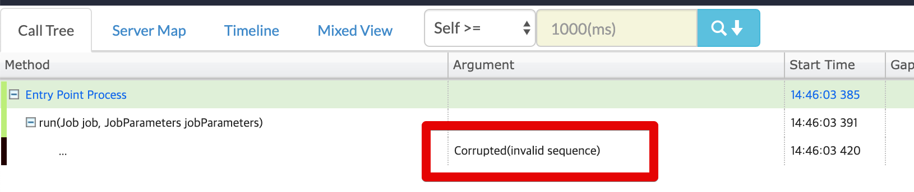

# Spring Batch 핀포인트로 모니터링하기

최신 버전 (1.8.4 - 2019.08.31기준) 의 agent로 진행합니다.
하위버전에서는 하이버네이트 등의 ORM 실행시 SQL이 정상적으로 로그가 출력되지 않을 수 있습니다.

```bash
PINPOINT_OPTS="-javaagent:pinpoint-bootstrap.jar위치 -Dpinpoint.agentId=에이전트ID -Dpinpoint.applicationName=표기될AppName"
```

## 1.  

```bash
profiler.entrypoint=org.springframework.batch.core.step.item.SimpleChunkProvider.doRead,org.springframework.batch.core.step.item.SimpleChunkProcessor.doProcess,org.springframework.batch.core.step.item.SimpleChunkProcessor.doWrite
```

```bash
profiler.entrypoint=org.springframework.batch.core.step.item.ChunkOrientedTasklet.execute
```


너무 많은 추적이 발생하여 **Corrupted(waiting for packet)** 문제가 발생
(트레이스가 노출되지 않는다.)




```bash
[root@settler-dev ~]# ulimit -a
core file size          (blocks, -c) 0
data seg size           (kbytes, -d) unlimited
scheduling priority             (-e) 0
file size               (blocks, -f) unlimited
pending signals                 (-i) 14746
max locked memory       (kbytes, -l) 64
max memory size         (kbytes, -m) unlimited
open files                      (-n) 1024
pipe size            (512 bytes, -p) 8
POSIX message queues     (bytes, -q) 819200
real-time priority              (-r) 0
stack size              (kbytes, -s) 8192
cpu time               (seconds, -t) unlimited
max user processes              (-u) 14746
virtual memory          (kbytes, -v) unlimited
file locks                      (-x) unlimited
```